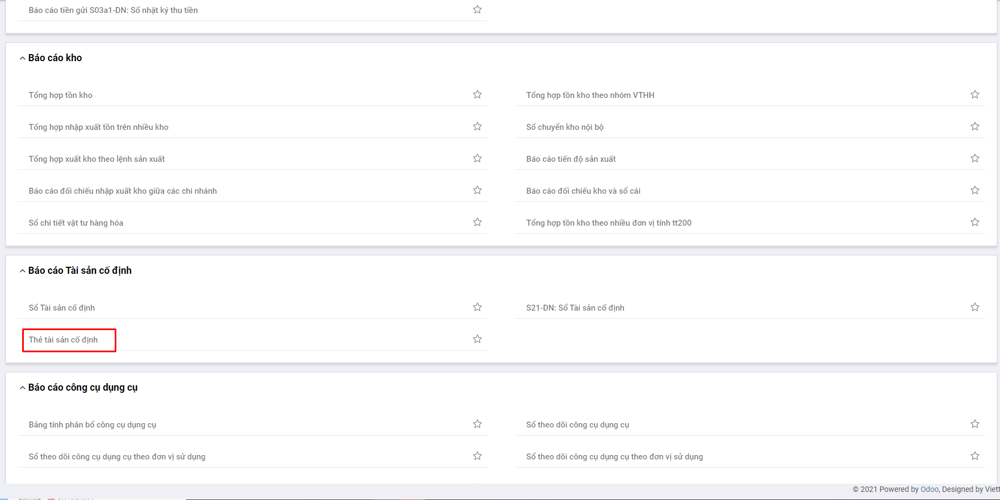
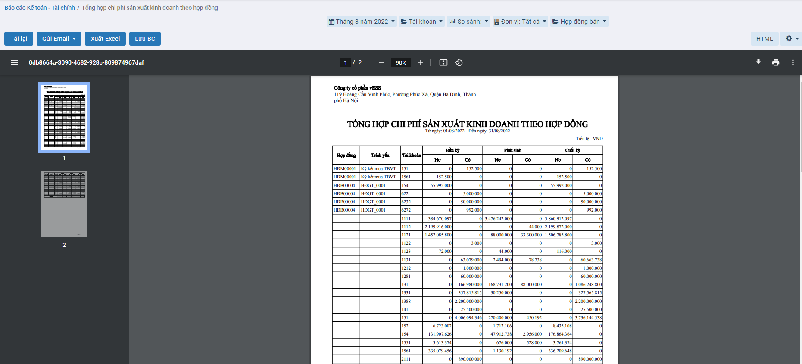
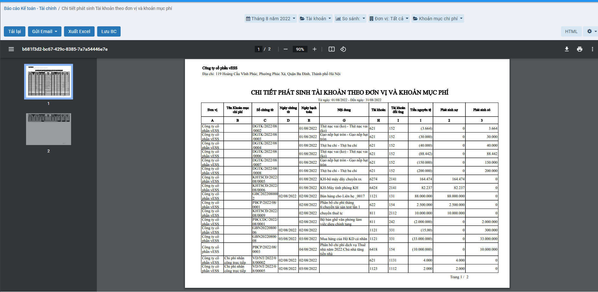

# *Quy trình nghiệp vụ*

Sau khi nhập chứng từ phát sinh, người dùng có thể xem được các báo cáo phân tích, thống kê dữ liệu và tùy chỉnh mẫu báo cáo theo nhu cầu

Danh sách báo cáo gồm có:

Báo cáo tiền mặt:

- Bảng kê số dư tiền mặt theo ngày
- S03a1-DN: Sổ nhật ký thu tiền
- S03a2-DN: Sổ nhật ký chi tiền
- S07-DN: Sổ quỹ tiền mặt
- S07a-DN: Sổ kế toán chi tiết quỹ tiền mặt

Báo cáo tiền gửi ngân hàng:

- Bảng kê số dư tiền gửi theo ngày 
- S03a1-DN: Sổ nhật ký thu tiền
- S03a2-DN: Sổ nhật ký chi tiền
- S08-DN: Sổ tiền gửi ngân hàng
- Bảng kê số dư ngân hàng

Báo cáo tài sản cố định:

- S21-DN: Sổ Tài sản cố định
- Thẻ tài sản cố định

Báo cáo công cụ dụng cụ:

- Sổ theo dõi công cụ dụng cụ
- Sổ theo dõi công cụ dụng cụ theo đơn vị sử dụng
- Bảng tính phân bổ công cụ dụng cụ
- Báo cáo chi tiết giảm công cụ dụng cụ

Báo cáo kho:

- Tổng hợp tồn kho
- Tổng hợp tồn kho theo nhóm VTHH
- Tổng hợp nhập xuất tồn trên nhiều kho
- Tổng hợp xuất kho theo lệnh sản xuất
- Sổ chuyển kho nội bộ
- Báo cáo tiến độ sản xuất
- Báo cáo đối chiếu nhập xuất kho giữa các chi nhánh
- Báo cáo đối chiếu kho và sổ cái

Báo cáo mua hàng:

- [ ] Báo cáo mua hàng theo công nợ nhà cung cấp:

- Tổng hợp công nợ phải trả nhà cung cấp
- S31-DN: Sổ chi tiết thanh toán với người bán
- S32-DN: Sổ chi tiết thanh toán với người bán bằng ngoại tệ
- Chi tiết công nợ phải trả theo hóa đơn

- [ ] Báo cáo mua hàng theo nhà cung cấp, mặt hàng:

- S03a-DN: Sổ nhật ký mua hàng
- Tổng hợp mua hàng theo mặt hàng
- Sổ chi tiết mua hàng

Báo cáo bán hàng:

- [ ] Báo cáo bán hàng theo công nợ khách hàng:

- Tổng hợp công nợ phải thu khách hàng
- S31-DN: Sổ chi tiết thanh toán với người mua
- S32-DN: Sổ chi tiết thanh toán với người mua bằng ngoại tệ

- [ ] Báo cáo bán hàng theo khách hàng, mặt hàng:

- Sổ nhật ký bán hàng
- Tổng hợp bán hàng theo mặt hàng
- Sổ chi tiết bán hàng

- [ ] Báo cáo hợp đồng bán:

- Chi tiết công nợ phải thu theo hợp đồng bán

- [ ] Báo cáo bán hàng theo công trình:

- Tổng hợp công nợ phải thu theo công trình
- Chi tiết công nợ phải thu theo công trình

Báo cáo thuế:

- Bảng kê hóa đơn, chứng từ hàng hóa, dịch vụ mua vào 
- Bảng kê hóa đơn, chứng từ hàng hóa, dịch vụ mua vào (Mẫu quản trị)

- Bảng kê hóa đơn, chứng từ hàng hóa, dịch vụ bán ra 
- Bảng kê hóa đơn, chứng từ hàng hóa, dịch vụ bán ra (Mẫu quản trị)

Báo cáo giá thành:

- [ ] Giá thành đối tượng tập hợp chi phí:

- S36-DN: Sổ chi phí sản xuất kinh doanh
- Tổng hợp chi phí sản xuất kinh doanh theo đối tượng tập hợp chi phí
- Sổ chi tiết tài khoản theo đối tượng tập hợp chi phí
- Sổ chi tiết tài khoản theo đối tượng tập hợp chi phí và khoản mục chi phí
- Bảng tính giá thành
- Tổng hợp nhập xuất kho theo đối tượng tập hợp chi phí
- Bảng kê phiếu nhập, Phiếu xuất kho theo đối tượng tập hợp chi phí
- Thẻ tính giá thành đối tượng tập hợp chi phí – theo khoản mục chi phí

- [ ] Giá thành công trình:

- S36-DN: Sổ chi phí sản xuất, Kinh doanh theo công trình
- Tổng hợp chi phí sản xuất kinh doanh theo công trình
- Bảng tổng hợp chi phí theo công trình
- Sổ chi tiết tài khoản theo công trình
- Sổ chi tiết tài khoản theo công trình và khoản mục chi phí
- Tổng hợp nhập xuất kho theo công trình
- Bảng kê phiếu nhập , phiếu xuất theo công trình
- Tổng hợp công nợ nhân viên theo công trình
- Chi tiết công nợ nhân viên theo công trình

- [ ] Giá thành đơn hàng:

- Tổng hợp chi phí sản xuất kinh doanh theo đơn hàng
- Bảng tổng hợp chi phí theo đơn hàng
- Sổ chi tiết tài khoản theo đơn hàng và khoản mục chi phí
- Tổng hợp nhập xuất kho theo đơn hàng
- Bảng kê phiếu nhập, phiếu xuất theo đơn hàng

- [ ] Giá thành hợp đồng

- S36-DN: Sổ chi phí sản xuất, kinh doanh theo hợp đồng
- Tổng hợp chi phí sản xuất kinh doanh theo hợp đồng
- Bảng tổng hợp chi phí theo hợp đồng
- Sổ chi tiết tài khoản theo hợp đồng
- Tổng hợp nhập xuất kho theo hợp đồng
- Bảng kê phiếu nhập, phiếu xuất theo hợp đồng

Báo cáo tổng hợp:

- S06-DN: Bảng cân đối số phát sinh
- 03a-DN: Sổ nhật ký chung
- S38-DN: Sổ chi tiết theo tài khoản
- Sổ chi tiết phát sinh tài khoản (Chỉ lấy phát sinh)
- Sổ cái tài khoản
- Sổ cái (Hình thức nhật ký chung)
- S33-DN: Sổ theo dõi thanh toán bằng ngoại tệ
- Bảng Tổng hợp phát sinh theo Tài khoản
- Sổ chi tiết tài khoản theo đối tượng
- Tổng hợp chi phí theo khoản mục chi phí
- Chi tiết phát sinh tài khoản theo khoản mục phí
- Tổng hợp chi phí theo đơn vị
- Tổng hợp chi phí theo đơn vị và khoản mục phí
- Chi tiết phát sinh Tài khoản theo đơn vị và khoản mục phí
- Tình hình phân bổ chi phí trả trước
- Bảng tính phân bổ chi phí trả trước
- Tổng hợp công nợ nhân viên
- Tổng hợp công nợ nhân viên theo hợp đồng
- Chi tiết công nợ nhân viên theo hợp đồng

Báo cáo phân tích:

- Bảng cân đối tài khoản theo nhiều chi nhánh
- Báo cáo phân tích chi tiết doanh thu theo nhiều kỳ
- Báo cáo phân tích chi tiết chi phí theo nhiều kỳ
- Báo cáo tổng hợp lãi lỗ theo công trình
- Báo cáo chi tiết lãi lỗ theo công trình

Báo cáo tài chính:

- B01-DN: Bảng cân đối kế toán
- B02-DN: Báo cáo kết quả hoạt động kinh doanh
- B03-DN: Báo cáo lưu chuyển tiền tệ (PP trực tiếp)
- B03-DN: Báo cáo lưu chuyển tiền tệ (PP gián tiếp)
- B09-DN: Thuyết minh báo cáo tài chính

## *Hướng dẫn xem báo cáo chung*

**Xem video hướng dẫn tại đây**

<iframe
    width="920"
    height="450"
    frameborder="0"
    allow="autoplay; encrypted-media; clipboard-write; gyroscope; picture-in-picture "
    allowfullscreen
    title="Báo cáo" 
    src="https://www.youtube.com/embed/2g9EPV_ZOv0?list=PLcdARb5pnnj8jeyvyhaptnwL3sxxT_QaK"
></iframe>

**Các bước thực hiện**

**Bước 1:** Vào phân hệ **Báo cáo**

Hoặc chọn biểu tượng  rồi chọn **Báo cáo**

**Bước 2**: Chọn một báo cáo muốn xem

**Bước 3**: Nhập thông tin tham số đầu vào tại góc phải để xem báo cáo: Thời gian xuất báo cáo, đơn vị, ....

Sau khi chọn tham số, hệ thống tự động xuất ra báo cáo theo thông số đã chọn

**Bước 4**: Trên cửa sổ báo cáo, người dùng có thể thực hiện thêm một số chức năng khác:

**Tải lại**: Xuất lại báo cáo theo tham số đang có

**Gửi email**: Cho phép gửi báo cáo này vào email

**Xuất excel**: Xuất báo cáo dưới dạng file excel (xls,xlsx)

**PDF**: Xuất báo cáo dưới dạng file PDF(.pdf)

Tùy chọn **cấu hình chữ ký**: Bổ sung/xóa bỏ chân ký trên báo cáo. Người dùng nhấn nút chọn cấu hình chữ ký --> Hiển thị thông tin các chân ký đang có thuộc báo cáo đang chọn

Người dùng có thể thay đổi chức danh, tiêu đề người ký, tên người ký cho phù hợp với biểu mẫu mong muốn.

## *Báo cáo tiền mặt*

### Bảng kê số dư tiền mặt theo ngày

#### Mô tả nghiệp vụ

**Nghiệp vụ**

Bảng kê số dư tiền mặt theo ngày là mẫu sổ được lập ra để phản ánh số dư tiền mặt theo từng ngày của doanh nghiệp.

**Xem video hướng dẫn**

*Xem video hướng dẫn cách xem báo cáo chung*

#### Hướng dẫn trên phần mềm

*Các bước thực hiện*

**Bước 1:** Vào phân hệ **Báo cáo**

Hoặc chọn biểu tượng  rồi chọn **Báo cáo**

**Bước 2**: Chọn **Báo cáo tiền mặt Bảng kê số dư tiền theo ngày**

**Bước 3**: Nhập thông tin tham số đầu vào tại góc phải để xem báo cáo: Thời gian xuất báo cáo, đơn vị, ....

Sau khi chọn tham số, hệ thống tự động xuất ra báo cáo theo thông số đã chọn

**Bước 4**: Trên cửa sổ báo cáo, người dùng có thể thực hiện thêm một số chức năng khác:

**Tải lại**: Xuất lại báo cáo theo tham số đang có

**Gửi email**: Cho phép gửi báo cáo này vào email

**Xuất excel**: Xuất báo cáo dưới dạng file excel (xls,xlsx)

**PDF**: Xuất báo cáo dưới dạng file PDF(.pdf)

### S03a1-DN: Sổ nhật ký thu tiền

#### Mô tả nghiệp vụ

**Nghiệp vụ**

Sổ nhật ký thu tiền là mẫu sổ được lập ra để ghi chép các nghiệp vụ thu tiền của doanh nghiệp. Mẫu sổ này được mở riêng cho thu tiền mặt, cho từng loại tiền (đồng Việt Nam, ngoại tệ).

**Xem video hướng dẫn**

*Xem video hướng dẫn cách xem báo cáo chung*. Chi tiết cụ thể **[tại đây](#huong-dan-xem-bao-cao-chung)**

#### Hướng dẫn trên phần mềm

*Các bước thực hiện*

**Bước 1:** Vào phân hệ **Báo cáo**

Hoặc chọn biểu tượng  rồi chọn **Báo cáo**

**Bước 2**: Chọn **Báo cáo tiền mặt S03a1-DN: Sổ nhật ký thu tiền**

**Bước 3**: Nhập thông tin tham số đầu vào tại góc phải để xem báo cáo: Thời gian xuất báo cáo, đơn vị, ....

Sau khi chọn tham số, hệ thống tự động xuất ra báo cáo theo thông số đã chọn

**Bước 4**: Trên cửa sổ báo cáo, người dùng có thể thực hiện thêm một số chức năng khác:

**Tải lại**: Xuất lại báo cáo theo tham số đang có

**Gửi email**: Cho phép gửi báo cáo này vào email

**Xuất excel**: Xuất báo cáo dưới dạng file excel (xls,xlsx)

**PDF**: Xuất báo cáo dưới dạng file PDF(.pdf)

### S03a2-DN: Sổ nhật ký chi tiền

#### Mô tả nghiệp vụ

**Nghiệp vụ**

Sổ nhật ký chi tiền là mẫu sổ được lập ra để ghi chép các nghiệp vụ chi tiền của doanh nghiệp. Mẫu sổ này được mở riêng cho chi tiền mặt, cho từng loại tiền (đồng Việt Nam, ngoại tệ).

**Xem video hướng dẫn**

*Xem video hướng dẫn cách xem báo cáo chung*. Chi tiết cụ thể **[tại đây](#huong-dan-xem-bao-cao-chung)**

#### Hướng dẫn trên phần mềm

*Các bước thực hiện*

**Bước 1:** Vào phân hệ **Báo cáo**

Hoặc chọn biểu tượng  rồi chọn **Báo cáo**

**Bước 2**: Chọn **Báo cáo tiền mặt S03a1-DN: Sổ nhật ký chi tiền**

**Bước 3**: Nhập thông tin tham số đầu vào tại góc phải để xem báo cáo: Thời gian xuất báo cáo, đơn vị, ....

Sau khi chọn tham số, hệ thống tự động xuất ra báo cáo theo thông số đã chọn

**Bước 4**: Trên cửa sổ báo cáo, người dùng có thể thực hiện thêm một số chức năng khác:

**Tải lại**: Xuất lại báo cáo theo tham số đang có

**Gửi email**: Cho phép gửi báo cáo này vào email

**Xuất excel**: Xuất báo cáo dưới dạng file excel (xls,xlsx)

**PDF**: Xuất báo cáo dưới dạng file PDF(.pdf)

### S07a-DN: Sổ kế toán chi tiết quỹ tiền mặt

#### Mô tả nghiệp vụ

**Nghiệp vụ**

Sổ quỹ tiền mặt là mẫu sổ được lập ra dùng cho thủ quỹ (hoặc dùng cho kế toán tiền mặt) để phản ánh tình hình thu, chi tồn quỹ tiền mặt bằng tiền Việt Nam của đơn vị.

**Xem video hướng dẫn**

*Xem video hướng dẫn cách xem báo cáo chung*. Chi tiết cụ thể **[tại đây](#huong-dan-xem-bao-cao-chung)**

#### Hướng dẫn trên phần mềm

*Các bước thực hiện*

**Bước 1:** Vào phân hệ **Báo cáo**

Hoặc chọn biểu tượng  rồi chọn **Báo cáo**

**Bước 2**: Chọn **Báo cáo S07a-DN: Sổ kế toán chi tiết quỹ tiền mặt**

**Bước 3**: Nhập thông tin tham số đầu vào tại góc phải để xem báo cáo: Thời gian xuất báo cáo, đơn vị, ....

Sau khi chọn tham số, hệ thống tự động xuất ra báo cáo theo thông số đã chọn

**Bước 4**: Trên cửa sổ báo cáo, người dùng có thể thực hiện thêm một số chức năng khác:

**Tải lại**: Xuất lại báo cáo theo tham số đang có

**Gửi email**: Cho phép gửi báo cáo này vào email

**Xuất excel**: Xuất báo cáo dưới dạng file excel (xls,xlsx)

**PDF**: Xuất báo cáo dưới dạng file PDF(.pdf)

### S07-DN: Sổ quỹ tiền mặt

#### Mô tả nghiệp vụ

**Nghiệp vụ**

Sổ kế toán chi tiết quỹ tiền mặt là mẫu sổ được lập ra dùng cho thủ quỹ (hoặc dùng cho kế toán tiền mặt) để phản ánh tình hình thu, chi tồn chi tiết quỹ tiền mặt bằng tiền Việt Nam của đơn vị.

**Xem video hướng dẫn**

*Xem video hướng dẫn cách xem báo cáo chung*. Chi tiết cụ thể **[tại đây](#huong-dan-xem-bao-cao-chung)**

#### Hướng dẫn trên phần mềm

*Các bước thực hiện*

**Bước 1:** Vào phân hệ **Báo cáo**

Hoặc chọn biểu tượng  rồi chọn **Báo cáo**

**Bước 2**: Chọn **Báo cáo S07-DN: Sổ quỹ tiền mặt**

**Bước 3**: Nhập thông tin tham số đầu vào tại góc phải để xem báo cáo: Thời gian xuất báo cáo, đơn vị, ....

Sau khi chọn tham số, hệ thống tự động xuất ra báo cáo theo thông số đã chọn

**Bước 4**: Trên cửa sổ báo cáo, người dùng có thể thực hiện thêm một số chức năng khác:

**Tải lại**: Xuất lại báo cáo theo tham số đang có

**Gửi email**: Cho phép gửi báo cáo này vào email

**Xuất excel**: Xuất báo cáo dưới dạng file excel (xls,xlsx)

**PDF**: Xuất báo cáo dưới dạng file PDF(.pdf)

## *Báo cáo tiền gửi ngân hàng*

### Bảng kê số dư ngân hàng

#### Mô tả nghiệp vụ

**Nghiệp vụ**

Bảng kê số dư tiền gửi theo ngày là mẫu sổ được lập ra để phản ánh số dư tiền gửi ngân hàng theo từng ngày của doanh nghiệp.

**Xem video hướng dẫn**

*Xem video hướng dẫn cách xem báo cáo chung*. Chi tiết cụ thể **[tại đây](#huong-dan-xem-bao-cao-chung)**

#### Hướng dẫn trên phần mềm

**Các bước thực hiện**

**Bước 1:** Vào phân hệ **Báo cáo**

Hoặc chọn biểu tượng  rồi chọn **Báo cáo**

**Bước 2**: Chọn **Báo cáo Bảng kê số dư ngân hàng**

**Bước 3**: Nhập thông tin tham số đầu vào tại góc phải để xem báo cáo: Thời gian xuất báo cáo, đơn vị, ....

Sau khi chọn tham số, hệ thống tự động xuất ra báo cáo theo thông số đã chọn

**Bước 4**: Trên cửa sổ báo cáo, người dùng có thể thực hiện thêm một số chức năng khác:

**Tải lại**: Xuất lại báo cáo theo tham số đang có

**Gửi email**: Cho phép gửi báo cáo này vào email

**Xuất excel**: Xuất báo cáo dưới dạng file excel (xls,xlsx)

**PDF**: Xuất báo cáo dưới dạng file PDF(.pdf)

### S03a1-DN: Sổ nhật ký thu tiền

#### Mô tả nghiệp vụ

**Nghiệp vụ**

Sổ nhật ký thu tiền là mẫu sổ được lập ra để ghi chép các nghiệp vụ thu tiền của doanh nghiệp. Mẫu sổ này được mở riêng cho  thu qua ngân hàng, cho từng loại tiền (đồng Việt Nam, ngoại tệ) hoặc cho từng nơi thu tiền (Ngân hàng A, Ngân hàng B...).

**Xem video hướng dẫn**

*Xem video hướng dẫn cách xem báo cáo chung*. Chi tiết cụ thể **[tại đây](#huong-dan-xem-bao-cao-chung)**

#### Hướng dẫn trên phần mềm

**Các bước thực hiện**

**Bước 1:** Vào phân hệ **Báo cáo**

Hoặc chọn biểu tượng  rồi chọn **Báo cáo**

**Bước 2**: Chọn **Báo cáo tiền gửi S03a1-DN: Sổ nhật ký thu tiền**

**Bước 3**: Nhập thông tin tham số đầu vào tại góc phải để xem báo cáo: Thời gian xuất báo cáo, đơn vị, ....

Sau khi chọn tham số, hệ thống tự động xuất ra báo cáo theo thông số đã chọn

**Bước 4**: Trên cửa sổ báo cáo, người dùng có thể thực hiện thêm một số chức năng khác:

**Tải lại**: Xuất lại báo cáo theo tham số đang có

**Gửi email**: Cho phép gửi báo cáo này vào email

**Xuất excel**: Xuất báo cáo dưới dạng file excel (xls,xlsx)

**PDF**: Xuất báo cáo dưới dạng file PDF(.pdf)

### S03a2-DN: Sổ nhật ký chi tiền

#### Mô tả nghiệp vụ

**Nghiệp vụ**

Sổ nhật ký chi tiền là mẫu sổ được lập ra để ghi chép các nghiệp vụ chi tiền của doanh nghiệp. Mẫu sổ này được mở riêng cho  chi qua ngân hàng, cho từng loại tiền (đồng Việt Nam, ngoại tệ) hoặc cho từng nơi chi tiền (Ngân hàng A, Ngân hàng B...).

**Xem video hướng dẫn**

*Xem video hướng dẫn cách xem báo cáo chung*. Chi tiết cụ thể **[tại đây](#huong-dan-xem-bao-cao-chung)**

#### Hướng dẫn trên phần mềm

**Các bước thực hiện**

**Bước 1:** Vào phân hệ **Báo cáo**

Hoặc chọn biểu tượng  rồi chọn **Báo cáo**

**Bước 2**: Chọn **Báo cáo tiền gửi S03a2-DN: Sổ nhật ký chi tiền**

**Bước 3**: Nhập thông tin tham số đầu vào tại góc phải để xem báo cáo: Thời gian xuất báo cáo, đơn vị, ....

Sau khi chọn tham số, hệ thống tự động xuất ra báo cáo theo thông số đã chọn

**Bước 4**: Trên cửa sổ báo cáo, người dùng có thể thực hiện thêm một số chức năng khác:

**Tải lại**: Xuất lại báo cáo theo tham số đang có

**Gửi email**: Cho phép gửi báo cáo này vào email

**Xuất excel**: Xuất báo cáo dưới dạng file excel (xls,xlsx)

**PDF**: Xuất báo cáo dưới dạng file PDF(.pdf)

### S08-DN: Sổ tiền gửi ngân hàng

#### Mô tả nghiệp vụ

**Nghiệp vụ**

Sổ quỹ tiền gửi ngân hàng là mẫu sổ được lập ra dùng cho kế toán theo dõi chi tiết tiền Việt Nam của doanh nghiệp gửi tại Ngân hàng. Mỗi ngân hàng có mở tài khoản tiền gửi thì được theo dõi riêng trên một quyển sổ, phải ghi rõ nơi mở tài khoản và số hiệu tài khoản giao dịch.

**Xem video hướng dẫn**

*Xem video hướng dẫn cách xem báo cáo chung*. Chi tiết cụ thể **[tại đây](#huong-dan-xem-bao-cao-chung)**

#### Hướng dẫn trên phần mềm

**Các bước thực hiện**

**Bước 1:** Vào phân hệ **Báo cáo**

Hoặc chọn biểu tượng  rồi chọn **Báo cáo**

**Bước 2**: Chọn **Báo cáo S08-DN: Sổ tiền gửi ngân hàng**

**Bước 3**: Nhập thông tin tham số đầu vào tại góc phải để xem báo cáo: Thời gian xuất báo cáo, đơn vị, ....

Sau khi chọn tham số, hệ thống tự động xuất ra báo cáo theo thông số đã chọn

**Bước 4**: Trên cửa sổ báo cáo, người dùng có thể thực hiện thêm một số chức năng khác:

**Tải lại**: Xuất lại báo cáo theo tham số đang có

**Gửi email**: Cho phép gửi báo cáo này vào email

**Xuất excel**: Xuất báo cáo dưới dạng file excel (xls,xlsx)

**PDF**: Xuất báo cáo dưới dạng file PDF(.pdf)

### Bảng kê số dư tiền gửi theo ngày 

#### Mô tả nghiệp vụ

**Nghiệp vụ**

Bảng kê số dư ngân hàng là mẫu sổ được lập ra dùng cho kế toán theo dõi chi tiết tiền của  doanh nghiệp tại từng tài khoản ngân hàng.

**Xem video hướng dẫn**

*Xem video hướng dẫn cách xem báo cáo chung*. Chi tiết cụ thể **[tại đây](#huong-dan-xem-bao-cao-chung)**

#### Hướng dẫn trên phần mềm

**Các bước thực hiện**

**Bước 1:** Vào phân hệ **Báo cáo**

Hoặc chọn biểu tượng  rồi chọn **Báo cáo**

**Bước 2**: Chọn **Báo cáo tiền gửi Bảng kê số dư tiền theo ngày**

**Bước 3**: Nhập thông tin tham số đầu vào tại góc phải để xem báo cáo: Thời gian xuất báo cáo, đơn vị, ....

Sau khi chọn tham số, hệ thống tự động xuất ra báo cáo theo thông số đã chọn

**Bước 4**: Trên cửa sổ báo cáo, người dùng có thể thực hiện thêm một số chức năng khác:

**Tải lại**: Xuất lại báo cáo theo tham số đang có

**Gửi email**: Cho phép gửi báo cáo này vào email

**Xuất excel**: Xuất báo cáo dưới dạng file excel (xls,xlsx)

**PDF**: Xuất báo cáo dưới dạng file PDF(.pdf)

## *Báo cáo tài sản cố định*

### S21-DN: Sổ Tài sản cố định

#### Mô tả nghiệp vụ

**Nghiệp vụ**

Sổ tài sản cố định là mẫu sổ được lập ra dùng để đăng ký, theo dõi và quản lý chặt chẽ tài sản trong đơn vị từ khi mua sắm, đưa vào sử dụng đến khi ghi giảm tài sản cố định.

**Xem video hướng dẫn**

*Xem video hướng dẫn cách xem báo cáo chung*. Chi tiết cụ thể **[tại đây](#huong-dan-xem-bao-cao-chung)**

#### Hướng dẫn trên phần mềm

**Các bước thực hiện**

**Bước 1:** Vào phân hệ **Báo cáo**

Hoặc chọn biểu tượng  rồi chọn **Báo cáo**

**Bước 2**: Chọn **Báo cáo S21-DN: Sổ Tài sản cố định**

**Bước 3**: Nhập thông tin tham số đầu vào tại góc phải để xem báo cáo: Thời gian xuất báo cáo, đơn vị, ....

Sau khi chọn tham số, hệ thống tự động xuất ra báo cáo theo thông số đã chọn

**Bước 4**: Trên cửa sổ báo cáo, người dùng có thể thực hiện thêm một số chức năng khác:

**Tải lại**: Xuất lại báo cáo theo tham số đang có

**Gửi email**: Cho phép gửi báo cáo này vào email

**Xuất excel**: Xuất báo cáo dưới dạng file excel (xls,xlsx)

**PDF**: Xuất báo cáo dưới dạng file PDF(.pdf)

### Thẻ tài sản cố định

#### Mô tả nghiệp vụ

**Nghiệp vụ**

Thẻ tài sản cố định là mẫu sổ được lập ra dùng để theo dõi chi tiết từng TSCĐ của doanh nghiệp, tình hình thay đổi nguyên giá và giá trị hao mòn đã trích hàng năm của từng TSCĐ.

**Xem video hướng dẫn**

*Xem video hướng dẫn cách xem báo cáo chung*. Chi tiết cụ thể **[tại đây](#huong-dan-xem-bao-cao-chung)**

#### Hướng dẫn trên phần mềm

**Các bước thực hiện**

**Bước 1:** Vào phân hệ **Báo cáo**

Hoặc chọn biểu tượng  rồi chọn **Báo cáo**

**Bước 2**: Chọn **Thẻ tài sản cố định**

**Bước 3**: Nhập thông tin tham số đầu vào tại góc phải để xem báo cáo: Thời gian xuất báo cáo, đơn vị, ....

Sau khi chọn tham số, hệ thống tự động xuất ra báo cáo theo thông số đã chọn

**Bước 4**: Trên cửa sổ báo cáo, người dùng có thể thực hiện thêm một số chức năng khác:

**Tải lại**: Xuất lại báo cáo theo tham số đang có

**Gửi email**: Cho phép gửi báo cáo này vào email

**Xuất excel**: Xuất báo cáo dưới dạng file excel (xls,xlsx)

**PDF**: Xuất báo cáo dưới dạng file PDF(.pdf)

## *Báo cáo công cụ dụng cụ*

### Sổ theo dõi công cụ dụng cụ

#### Mô tả Nghiệp vụ

Sổ theo dõi công cụ dụng cụ là mẫu sổ được lập ra dùng để theo dõi chi tiết từng công cụ dụng cụ của doanh nghiệp, tình hình thay đổi nguyên giá và giá trị hao mòn đã trích hàng năm của từng công cụ dụng cụ.

**Xem video hướng dẫn**

*Xem video hướng dẫn cách xem báo cáo chung*. Chi tiết cụ thể **[tại đây](#huong-dan-xem-bao-cao-chung)**

#### Hướng dẫn trên phần mềm

**Các bước thực hiện**

**Bước 1:** Vào phân hệ **Báo cáo**

Hoặc chọn biểu tượng  rồi chọn **Báo cáo**

**Bước 2**: Chọn **Báo cáo Sổ theo dõi công cụ dụng cụ**

**Bước 3**: Nhập thông tin tham số đầu vào tại góc phải để xem báo cáo: Thời gian xuất báo cáo, đơn vị, ....

Sau khi chọn tham số, hệ thống tự động xuất ra báo cáo theo thông số đã chọn.

**Bước 4**: Trên cửa sổ báo cáo, người dùng có thể thực hiện thêm một số chức năng khác:

**Tải lại**: Xuất lại báo cáo theo tham số đang có

**Gửi email**: Cho phép gửi báo cáo này vào email

**Xuất excel**: Xuất báo cáo dưới dạng file excel (xls,xlsx)

**PDF**: Xuất báo cáo dưới dạng file PDF(.pdf)

### Sổ theo dõi công cụ dụng cụ theo đơn vị sử dụng

#### Mô tả nghiệp vụ

**Nghiệp vụ**

Sổ theo dõi công cụ dụng cụ theo đơn vị sử dụng là mẫu sổ được lập ra dùng để ghi chép tình hình tăng, giảm công cụ, dụng cụ tại từng nơi sử dụng nhằm quản lý dụng cụ đã được cấp cho các phòng, ban làm căn cứ để đối chiếu khi tiến hành kiểm kê định kỳ.

**Xem video hướng dẫn**

*Xem video hướng dẫn cách xem báo cáo chung*. Chi tiết cụ thể **[tại đây](#huong-dan-xem-bao-cao-chung)**

#### Hướng dẫn trên phần mềm

**Các bước thực hiện**

**Bước 1:** Vào phân hệ **Báo cáo**

Hoặc chọn biểu tượng  rồi chọn **Báo cáo**

**Bước 2**: Chọn **Báo cáo tiền gửi S03a1-DN: Sổ nhật ký thu tiền**

**Bước 3**: Nhập thông tin tham số đầu vào tại góc phải để xem báo cáo: Thời gian xuất báo cáo, đơn vị, ....

Sau khi chọn tham số, hệ thống tự động xuất ra báo cáo theo thông số đã chọn.

**Bước 4**: Trên cửa sổ báo cáo, người dùng có thể thực hiện thêm một số chức năng khác:

**Tải lại**: Xuất lại báo cáo theo tham số đang có

**Gửi email**: Cho phép gửi báo cáo này vào email

**Xuất excel**: Xuất báo cáo dưới dạng file excel (xls,xlsx)

**PDF**: Xuất báo cáo dưới dạng file PDF(.pdf)

### Bảng tính phân bổ công cụ dụng cụ

#### Mô tả nghiệp vụ

**Nghiệp vụ**

Bảng tính phân bổ công cụ dụng cụ là mẫu sổ được lập ra dùng để ghi chép tình hình tăng, giảm công cụ, dụng cụ tại từng nơi sử dụng nhằm quản lý dụng cụ đã được cấp cho các phòng, ban làm căn cứ để đối chiếu khi tiến hành kiểm kê định kỳ.

**Xem video hướng dẫn**

*Xem video hướng dẫn cách xem báo cáo chung*. Chi tiết cụ thể **[tại đây](#huong-dan-xem-bao-cao-chung)**

#### Hướng dẫn trên phần mềm

**Các bước thực hiện**

**Bước 1:** Vào phân hệ **Báo cáo**

Hoặc chọn biểu tượng  rồi chọn **Báo cáo**

**Bước 2**: Chọn **Báo cáo Bảng tính phân bổ công cụ dụng cụ**

**Bước 3**: Nhập thông tin tham số đầu vào tại góc phải để xem báo cáo: Thời gian xuất báo cáo, đơn vị, ....

Sau khi chọn tham số, hệ thống tự động xuất ra báo cáo theo thông số đã chọn

**Bước 4**: Trên cửa sổ báo cáo, người dùng có thể thực hiện thêm một số chức năng khác:

**Tải lại**: Xuất lại báo cáo theo tham số đang có

**Gửi email**: Cho phép gửi báo cáo này vào email

**Xuất excel**: Xuất báo cáo dưới dạng file excel (xls,xlsx)

**PDF**: Xuất báo cáo dưới dạng file PDF(.pdf)

### Báo cáo chi tiết giảm công cụ dụng cụ

#### Mô tả nghiệp vụ

**Nghiệp vụ**

Báo cáo chi tiết giảm công cụ dụng cụ là mẫu báo cáo được lập ra dùng để ghi chép tình hình tăng, giảm công cụ, dụng cụ tại từng nơi sử dụng nhằm quản lý dụng cụ đã được cấp cho các phòng, ban làm căn cứ để đối chiếu khi tiến hành kiểm kê định kỳ.

**Xem video hướng dẫn**

*Xem video hướng dẫn cách xem báo cáo chung*. Chi tiết cụ thể **[tại đây](#huong-dan-xem-bao-cao-chung)**

#### Hướng dẫn trên phần mềm

**Các bước thực hiện**

**Bước 1:** Vào phân hệ **Báo cáo**

Hoặc chọn biểu tượng  rồi chọn **Báo cáo**

**Bước 2**: Chọn **Báo cáo chi tiết giảm công cụ dụng cụ**

**Bước 3**: Nhập thông tin tham số đầu vào tại góc phải để xem báo cáo: Thời gian xuất báo cáo, đơn vị, ....

Sau khi chọn tham số, hệ thống tự động xuất ra báo cáo theo thông số đã chọn

**Bước 4**: Trên cửa sổ báo cáo, người dùng có thể thực hiện thêm một số chức năng khác:

**Tải lại**: Xuất lại báo cáo theo tham số đang có

**Gửi email**: Cho phép gửi báo cáo này vào email

**Xuất excel**: Xuất báo cáo dưới dạng file excel (xls,xlsx)

**PDF**: Xuất báo cáo dưới dạng file PDF(.pdf)

## *Báo cáo kho*

### Tổng hợp tồn kho

#### Mô tả nghiệp vụ

**Nghiệp vụ**

Tổng hợp tồn kho là mẫu báo cáo lập ra để theo dõi tổng hợp tình hình nhập, xuất, tồn của từng vật tư hàng hóa ở từng kho tính đến một thời điểm để báo cáo, phục vụ ra quyết định mua hàng, bán hàng, chuyển kho,…

**Xem video hướng dẫn**

*Xem video hướng dẫn cách xem báo cáo chung*. Chi tiết cụ thể **[tại đây](#huong-dan-xem-bao-cao-chung)**

#### Hướng dẫn trên phần mềm

**Các bước thực hiện**

**Bước 1:** Vào phân hệ **Báo cáo**

Hoặc chọn biểu tượng  rồi chọn **Báo cáo**

**Bước 2**: Chọn **Tổng hợp tồn kho**

**Bước 3**: Nhập thông tin tham số đầu vào tại góc phải để xem báo cáo: Thời gian xuất báo cáo, đơn vị, ....

Sau khi chọn tham số, hệ thống tự động xuất ra báo cáo theo thông số đã chọn

**Bước 4**: Trên cửa sổ báo cáo, người dùng có thể thực hiện thêm một số chức năng khác:

**Tải lại**: Xuất lại báo cáo theo tham số đang có

**Gửi email**: Cho phép gửi báo cáo này vào email

**Xuất excel**: Xuất báo cáo dưới dạng file excel (xls,xlsx)

**PDF**: Xuất báo cáo dưới dạng file PDF(.pdf)

### Tổng hợp tồn kho theo nhóm VTHH

#### Mô tả nghiệp vụ

**Nghiệp vụ**

Tổng hợp tồn kho theo nhóm VTHH là mẫu báo cáo lập ra để theo dõi tổng hợp tình hình nhập, xuất, tồn của từng nhóm vật tư hàng hóa ở từng kho tính đến một thời điểm để báo cáo, phục vụ ra quyết định mua hàng, bán hàng, chuyển kho,…

**Xem video hướng dẫn**

*Xem video hướng dẫn cách xem báo cáo chung*. Chi tiết cụ thể **[tại đây](#huong-dan-xem-bao-cao-chung)**

#### Hướng dẫn trên phần mềm

**Các bước thực hiện**

**Bước 1:** Vào phân hệ **Báo cáo**

Hoặc chọn biểu tượng  rồi chọn **Báo cáo**

**Bước 2**: Chọn **Tổng hợp tồn kho theo nhóm VTHH**

**Bước 3**: Nhập thông tin tham số đầu vào tại góc phải để xem báo cáo: Thời gian xuất báo cáo, đơn vị, ....

Sau khi chọn tham số, hệ thống tự động xuất ra báo cáo theo thông số đã chọn

**Bước 4**: Trên cửa sổ báo cáo, người dùng có thể thực hiện thêm một số chức năng khác:

**Tải lại**: Xuất lại báo cáo theo tham số đang có

**Gửi email**: Cho phép gửi báo cáo này vào email

**Xuất excel**: Xuất báo cáo dưới dạng file excel (xls,xlsx)

**PDF**: Xuất báo cáo dưới dạng file PDF(.pdf)

### Tổng hợp nhập xuất tồn trên nhiều kho

#### Mô tả nghiệp vụ

**Nghiệp vụ**

Tổng hợp nhập xuất tồn trên nhiều kho là mẫu báo cáo được lập ra để theo dõi chi tiết tình hình nhập, xuất và tồn kho cả về số lượng và giá trị của hàng hóa vật tư ở nhiều kho.

**Xem video hướng dẫn**

*Xem video hướng dẫn cách xem báo cáo chung*. Chi tiết cụ thể **[tại đây](#huong-dan-xem-bao-cao-chung)**

#### Hướng dẫn trên phần mềm

**Các bước thực hiện**

**Bước 1:** Vào phân hệ **Báo cáo**

Hoặc chọn biểu tượng  rồi chọn **Báo cáo**

**Bước 2**: Chọn **Tổng hợp nhập xuất tồn trên nhiều kho**

**Bước 3**: Nhập thông tin tham số đầu vào tại góc phải để xem báo cáo: Thời gian xuất báo cáo, đơn vị, ....

Sau khi chọn tham số, hệ thống tự động xuất ra báo cáo theo thông số đã chọn

**Bước 4**: Trên cửa sổ báo cáo, người dùng có thể thực hiện thêm một số chức năng khác:

**Tải lại**: Xuất lại báo cáo theo tham số đang có

**Gửi email**: Cho phép gửi báo cáo này vào email

**Xuất excel**: Xuất báo cáo dưới dạng file excel (xls,xlsx)

**PDF**: Xuất báo cáo dưới dạng file PDF(.pdf)

### Tổng hợp xuất kho theo lệnh sản xuất

#### Mô tả nghiệp vụ

**Nghiệp vụ**

Tổng hợp xuất kho theo lệnh sản xuất là báo cáo để theo dõi được số lượng nguyên vật liệu thực tế xuất kho sản xuất sản phẩm so với định mức, từ đó đánh giá được hiệu quả sử dụng nguyên vật liệu và điều chỉnh định mức phù hợp.

**Xem video hướng dẫn**

*Xem video hướng dẫn cách xem báo cáo chung*. Chi tiết cụ thể **[tại đây](#huong-dan-xem-bao-cao-chung)**

#### Hướng dẫn trên phần mềm

**Các bước thực hiện**

**Bước 1:** Vào phân hệ **Báo cáo**

Hoặc chọn biểu tượng  rồi chọn **Báo cáo**

**Bước 2**: Chọn **Tổng hợp xuất kho theo lệnh sản xuất**

**Bước 3**: Nhập thông tin tham số đầu vào tại góc phải để xem báo cáo: Thời gian xuất báo cáo, đơn vị, ....

Sau khi chọn tham số, hệ thống tự động xuất ra báo cáo theo thông số đã chọn

**Bước 4**: Trên cửa sổ báo cáo, người dùng có thể thực hiện thêm một số chức năng khác:

**Tải lại**: Xuất lại báo cáo theo tham số đang có

**Gửi email**: Cho phép gửi báo cáo này vào email

**Xuất excel**: Xuất báo cáo dưới dạng file excel (xls,xlsx)

**PDF**: Xuất báo cáo dưới dạng file PDF(.pdf)

### Sổ chuyển kho nội bộ

#### Mô tả nghiệp vụ

**Nghiệp vụ**

Sổ chuyển kho nội bộ là mẫu báo cáo để theo dõi tình hình chuyển vật tư, hàng hóa giữa các kho trong nội bộ doanh nghiệp.

**Xem video hướng dẫn**

*Xem video hướng dẫn cách xem báo cáo chung*. Chi tiết cụ thể **[tại đây](#huong-dan-xem-bao-cao-chung)**

#### Hướng dẫn trên phần mềm

**Các bước thực hiện**

**Bước 1:** Vào phân hệ **Báo cáo**

Hoặc chọn biểu tượng  rồi chọn **Báo cáo**

**Bước 2**: Chọn **Sổ chuyển kho nội bộ**

**Bước 3**: Nhập thông tin tham số đầu vào tại góc phải để xem báo cáo: Thời gian xuất báo cáo, đơn vị, ....

Sau khi chọn tham số, hệ thống tự động xuất ra báo cáo theo thông số đã chọn

**Bước 4**: Trên cửa sổ báo cáo, người dùng có thể thực hiện thêm một số chức năng khác:

**Tải lại**: Xuất lại báo cáo theo tham số đang có

**Gửi email**: Cho phép gửi báo cáo này vào email

**Xuất excel**: Xuất báo cáo dưới dạng file excel (xls,xlsx)

**PDF**: Xuất báo cáo dưới dạng file PDF(.pdf)

### Báo cáo tiến độ sản xuất

#### Mô tả nghiệp vụ

**Nghiệp vụ**

Báo cáo tiến độ sản xuất là báo cáo để phản ánh tiến độ sản xuất của từng thành phẩm theo từng lệnh sản xuất trong kỳ.

**Xem video hướng dẫn**

*Xem video hướng dẫn cách xem báo cáo chung*. Chi tiết cụ thể **[tại đây](#huong-dan-xem-bao-cao-chung)**

#### Hướng dẫn trên phần mềm

**Các bước thực hiện**

**Bước 1:** Vào phân hệ **Báo cáo**

Hoặc chọn biểu tượng  rồi chọn **Báo cáo**

**Bước 2**: Chọn **Báo cáo tiến độ sản xuất**

**Bước 3**: Nhập thông tin tham số đầu vào tại góc phải để xem báo cáo: Thời gian xuất báo cáo, đơn vị, ....

Sau khi chọn tham số, hệ thống tự động xuất ra báo cáo theo thông số đã chọn

**Bước 4**: Trên cửa sổ báo cáo, người dùng có thể thực hiện thêm một số chức năng khác:

**Tải lại**: Xuất lại báo cáo theo tham số đang có

**Gửi email**: Cho phép gửi báo cáo này vào email

**Xuất excel**: Xuất báo cáo dưới dạng file excel (xls,xlsx)

**PDF**: Xuất báo cáo dưới dạng file PDF(.pdf)

### Báo cáo đối chiếu nhập xuất kho giữa các chi nhánh

#### Mô tả nghiệp vụ

**Nghiệp vụ**

Báo cáo đối chiếu nhập xuất kho giữa các chi nhánh là báo cáo giúp đối chiếu tình hình nhập, xuất giữa các chi nhánh để có thể kiểm soát được hàng ra vào.

**Xem video hướng dẫn**

*Xem video hướng dẫn cách xem báo cáo chung*. Chi tiết cụ thể **[tại đây](#huong-dan-xem-bao-cao-chung)**

#### Hướng dẫn trên phần mềm

**Các bước thực hiện**

**Bước 1:** Vào phân hệ **Báo cáo**

Hoặc chọn biểu tượng  rồi chọn **Báo cáo**

**Bước 2**: Chọn **Báo cáo đối chiếu nhập xuất kho giữa các chi nhánh**

**Bước 3**: Nhập thông tin tham số đầu vào tại góc phải để xem báo cáo: Thời gian xuất báo cáo, đơn vị, ....

Sau khi chọn tham số, hệ thống tự động xuất ra báo cáo theo thông số đã chọn

**Bước 4**: Trên cửa sổ báo cáo, người dùng có thể thực hiện thêm một số chức năng khác:

**Tải lại**: Xuất lại báo cáo theo tham số đang có

**Gửi email**: Cho phép gửi báo cáo này vào email

**Xuất excel**: Xuất báo cáo dưới dạng file excel (xls,xlsx)

**PDF**: Xuất báo cáo dưới dạng file PDF(.pdf)

### Báo cáo đối chiếu kho và sổ cái

#### Mô tả nghiệp vụ

**Nghiệp vụ**

Báo cáo đối chiếu kho và sổ cái là báo cáo giúp đối chiếu tình hình nhập, xuất, tồn vật tư hàng hóa giữa kho và tài khoản kho để tìm ra nguyên nhân chênh lệch.

**Xem video hướng dẫn**

*Xem video hướng dẫn cách xem báo cáo chung*. Chi tiết cụ thể **[tại đây](#huong-dan-xem-bao-cao-chung)**

#### Hướng dẫn trên phần mềm

**Các bước thực hiện**

**Bước 1:** Vào phân hệ **Báo cáo**

Hoặc chọn biểu tượng  rồi chọn **Báo cáo**

**Bước 2**: Chọn **Báo cáo đối chiếu kho và sổ cái**

**Bước 3**: Nhập thông tin tham số đầu vào tại góc phải để xem báo cáo: Thời gian xuất báo cáo, đơn vị, ....

Sau khi chọn tham số, hệ thống tự động xuất ra báo cáo theo thông số đã chọn

**Bước 4**: Trên cửa sổ báo cáo, người dùng có thể thực hiện thêm một số chức năng khác:

**Tải lại**: Xuất lại báo cáo theo tham số đang có

**Gửi email**: Cho phép gửi báo cáo này vào email

**Xuất excel**: Xuất báo cáo dưới dạng file excel (xls,xlsx)

**PDF**: Xuất báo cáo dưới dạng file PDF(.pdf)

## *Báo cáo mua hàng*

### *Báo cáo mua hàng theo công nợ nhà cung cấp*

### Tổng hợp công nợ phải trả nhà cung cấp

#### Mô tả nghiệp vụ

**Nghiệp vụ**

Tổng hợp công nợ phải trả nhà cung cấp là mẫu sổ được lập ra dùng để theo dõi công nợ phải trả cho nhà cung cấp, hay nói cách khác là sổ theo dõi các đối tượng chi tiết của tài khoản 331 (Phải trả người bán).

**Xem video hướng dẫn**

*Xem video hướng dẫn cách xem báo cáo chung*. Chi tiết cụ thể **[tại đây](#huong-dan-xem-bao-cao-chung)**

#### Hướng dẫn trên phần mềm

**Các bước thực hiện**

**Bước 1:** Vào phân hệ **Báo cáo**

Hoặc chọn biểu tượng  rồi chọn **Báo cáo**

**Bước 2**: Chọn **Báo cáo Tổng hợp công nợ phải trả nhà cung cấp**

**Bước 3**: Nhập thông tin tham số đầu vào tại góc phải để xem báo cáo: Thời gian xuất báo cáo, đơn vị, ....

Sau khi chọn tham số, hệ thống tự động xuất ra báo cáo theo thông số đã chọn

**Bước 4**: Trên cửa sổ báo cáo, người dùng có thể thực hiện thêm một số chức năng khác:

**Tải lại**: Xuất lại báo cáo theo tham số đang có

**Gửi email**: Cho phép gửi báo cáo này vào email

**Xuất excel**: Xuất báo cáo dưới dạng file excel (xls,xlsx)

**PDF**: Xuất báo cáo dưới dạng file PDF(.pdf)

### S31-DN: Sổ chi tiết thanh toán với người bán

#### Mô tả nghiệp vụ

**Nghiệp vụ**

Sổ chi tiết thanh toán với người bán là mẫu sổ được lập ra dùng để theo dõi việc thanh toán với người bán theo từng đối tượng, từng thời hạn thanh toán.

**Xem video hướng dẫn**

*Xem video hướng dẫn cách xem báo cáo chung*. Chi tiết cụ thể **[tại đây](#huong-dan-xem-bao-cao-chung)**

#### Hướng dẫn trên phần mềm

**Các bước thực hiện**

**Bước 1:** Vào phân hệ **Báo cáo**

Hoặc chọn biểu tượng  rồi chọn **Báo cáo**

**Bước 2**: Chọn **Báo cáo S31-DN: Sổ chi tiết thanh toán với người bán**

**Bước 3**: Nhập thông tin tham số đầu vào tại góc phải để xem báo cáo: Thời gian xuất báo cáo, đơn vị, ....

Sau khi chọn tham số, hệ thống tự động xuất ra báo cáo theo thông số đã chọn

**Bước 4**: Trên cửa sổ báo cáo, người dùng có thể thực hiện thêm một số chức năng khác:

**Tải lại**: Xuất lại báo cáo theo tham số đang có

**Gửi email**: Cho phép gửi báo cáo này vào email

**Xuất excel**: Xuất báo cáo dưới dạng file excel (xls,xlsx)

**PDF**: Xuất báo cáo dưới dạng file PDF(.pdf)

### S32-DN: Sổ chi tiết thanh toán với người bán bằng ngoại tệ

#### Mô tả nghiệp vụ

**Nghiệp vụ**

Sổ chi tiết thanh toán với người bán bằng ngoại tệ là mẫu sổ được lập ra dùng để theo dõi việc thanh toán với người bán theo từng đối tượng, từng thời hạn thanh toán và theo từng loại ngoại tệ.

**Xem video hướng dẫn**

*Xem video hướng dẫn cách xem báo cáo chung*. Chi tiết cụ thể **[tại đây](#huong-dan-xem-bao-cao-chung)**

#### Hướng dẫn trên phần mềm

**Các bước thực hiện**

**Bước 1:** Vào phân hệ **Báo cáo**

Hoặc chọn biểu tượng  rồi chọn **Báo cáo**

**Bước 2**: Chọn **Báo cáo S31-DN: Sổ chi tiết thanh toán với người bán bằng ngoại tệ**

**Bước 3**: Nhập thông tin tham số đầu vào tại góc phải để xem báo cáo: Thời gian xuất báo cáo, đơn vị, ....

Sau khi chọn tham số, hệ thống tự động xuất ra báo cáo theo thông số đã chọn

**Bước 4**: Trên cửa sổ báo cáo, người dùng có thể thực hiện thêm một số chức năng khác:

**Tải lại**: Xuất lại báo cáo theo tham số đang có

**Gửi email**: Cho phép gửi báo cáo này vào email

**Xuất excel**: Xuất báo cáo dưới dạng file excel (xls,xlsx)

**PDF**: Xuất báo cáo dưới dạng file PDF(.pdf)

### Chi tiết công nợ phải trả theo hóa đơn

#### Mô tả nghiệp vụ

**Nghiệp vụ**

Chi tiết công nợ phải trả theo hóa đơn là mẫu sổ được lập ra dùng để theo dõi việc thanh toán với người bán theo từng đối tượng, từng thời hạn thanh toán và theo từng hóa đơn.

**Xem video hướng dẫn**

*Xem video hướng dẫn cách xem báo cáo chung*. Chi tiết cụ thể **[tại đây](#huong-dan-xem-bao-cao-chung)**

#### Hướng dẫn trên phần mềm

**Các bước thực hiện**

**Bước 1:** Vào phân hệ **Báo cáo**

Hoặc chọn biểu tượng  rồi chọn **Báo cáo**

**Bước 2**: Chọn **Báo cáo Chi tiết công nợ phải trả theo hóa đơn**

**Bước 3**: Nhập thông tin tham số đầu vào tại góc phải để xem báo cáo: Thời gian xuất báo cáo, đơn vị, ....

Sau khi chọn tham số, hệ thống tự động xuất ra báo cáo theo thông số đã chọn

======> Báo cáo chưa đúng số liệu

**Bước 4**: Trên cửa sổ báo cáo, người dùng có thể thực hiện thêm một số chức năng khác:

**Tải lại**: Xuất lại báo cáo theo tham số đang có

**Gửi email**: Cho phép gửi báo cáo này vào email

**Xuất excel**: Xuất báo cáo dưới dạng file excel (xls,xlsx)

**PDF**: Xuất báo cáo dưới dạng file PDF(.pdf)

### *Báo cáo mua hàng theo nhà cung cấp, mặt hàng*

### S03a-DN: Sổ nhật ký mua hàng

#### Mô tả nghiệp vụ

**Nghiệp vụ**

Sổ nhật ký mua hàng là mẫu sổ được lập ra dùng để  ghi chép các nghiệp vụ mua hàng theo từng loại hàng tồn kho của đơn vị, như: Nguyên liệu, vật liệu; công cụ, dụng cụ; hàng hoá;...Sổ Nhật ký mua hàng dùng để ghi chép các nghiệp vụ mua hàng theo hình thức trả tiền sau (mua chịu). Trường hợp trả tiền trước cho người bán thì khi phát sinh nghiệp vụ mua hàng cũng ghi vào sổ này.

**Xem video hướng dẫn**

*Xem video hướng dẫn cách xem báo cáo chung*. Chi tiết cụ thể **[tại đây](#huong-dan-xem-bao-cao-chung)**

#### Hướng dẫn trên phần mềm

**Các bước thực hiện**

**Bước 1:** Vào phân hệ **Báo cáo**

Hoặc chọn biểu tượng  rồi chọn **Báo cáo**

**Bước 2**: Chọn **Báo cáo tiền gửi S03a-DN: Sổ nhật ký mua hàng**

**Bước 3**: Nhập thông tin tham số đầu vào tại góc phải để xem báo cáo: Thời gian xuất báo cáo, đơn vị, ....

Sau khi chọn tham số, hệ thống tự động xuất ra báo cáo theo thông số đã chọn

**Bước 4**: Trên cửa sổ báo cáo, người dùng có thể thực hiện thêm một số chức năng khác:

**Tải lại**: Xuất lại báo cáo theo tham số đang có

**Gửi email**: Cho phép gửi báo cáo này vào email

**Xuất excel**: Xuất báo cáo dưới dạng file excel (xls,xlsx)

**PDF**: Xuất báo cáo dưới dạng file PDF(.pdf)

### Tổng hợp mua hàng theo mặt hàng

#### Mô tả nghiệp vụ

**Nghiệp vụ**

Tổng hợp mua hàng theo mặt hàng là mẫu sổ được lập ra giúp người quản lý biết được số lượng mặt hàng đã mua được trong khoảng thời gian tìm kiếm.

**Xem video hướng dẫn**

*Xem video hướng dẫn cách xem báo cáo chung*. Chi tiết cụ thể **[tại đây](#huong-dan-xem-bao-cao-chung)**

#### Hướng dẫn trên phần mềm

**Các bước thực hiện**

**Bước 1:** Vào phân hệ **Báo cáo**

Hoặc chọn biểu tượng  rồi chọn **Báo cáo**

**Bước 2**: Chọn **Báo cáo Tổng hợp mua hàng theo mặt hàng**

**Bước 3**: Nhập thông tin tham số đầu vào tại góc phải để xem báo cáo: Thời gian xuất báo cáo, đơn vị, ....

Sau khi chọn tham số, hệ thống tự động xuất ra báo cáo theo thông số đã chọn

**Bước 4**: Trên cửa sổ báo cáo, người dùng có thể thực hiện thêm một số chức năng khác:

**Tải lại**: Xuất lại báo cáo theo tham số đang có

**Gửi email**: Cho phép gửi báo cáo này vào email

**Xuất excel**: Xuất báo cáo dưới dạng file excel (xls,xlsx)

**PDF**: Xuất báo cáo dưới dạng file PDF(.pdf)

### Sổ chi tiết mua hàng

#### Mô tả nghiệp vụ

**Nghiệp vụ**

Sổ chi tiết mua hàng là mẫu sổ được lập ra giúp người quản lý biết được chi tiết mặt hàng đã mua được trong khoảng thời gian tìm kiếm.

**Xem video hướng dẫn**

*Xem video hướng dẫn cách xem báo cáo chung*. Chi tiết cụ thể **[tại đây](#huong-dan-xem-bao-cao-chung)**

#### Hướng dẫn trên phần mềm

**Các bước thực hiện**

**Bước 1:** Vào phân hệ **Báo cáo**

Hoặc chọn biểu tượng  rồi chọn **Báo cáo**

**Bước 2**: Chọn **Báo cáo Sổ chi tiết mua hàng**

**Bước 3**: Nhập thông tin tham số đầu vào tại góc phải để xem báo cáo: Thời gian xuất báo cáo, đơn vị, ....

Sau khi chọn tham số, hệ thống tự động xuất ra báo cáo theo thông số đã chọn

**Bước 4**: Trên cửa sổ báo cáo, người dùng có thể thực hiện thêm một số chức năng khác:

**Tải lại**: Xuất lại báo cáo theo tham số đang có

**Gửi email**: Cho phép gửi báo cáo này vào email

**Xuất excel**: Xuất báo cáo dưới dạng file excel (xls,xlsx)

**PDF**: Xuất báo cáo dưới dạng file PDF(.pdf)

## *Báo cáo bán hàng*

### *Báo cáo bán hàng theo công nợ khách hàng*

### Tổng hợp công nợ phải thu khách hàng

#### Mô tả nghiệp vụ

**Nghiệp vụ**

Tổng hợp công nợ phải thu khách hàng là mẫu sổ được lập ra để theo dõi công nợ phải thu của khách hàng, hay nói cách khác là theo dõi các đối tượng chi tiết của tài khoản 131 - Phải thu của khách hàng

**Xem video hướng dẫn**

*Xem video hướng dẫn cách xem báo cáo chung*. Chi tiết cụ thể **[tại đây](#huong-dan-xem-bao-cao-chung)**

#### Hướng dẫn trên phần mềm

**Các bước thực hiện**

**Bước 1:** Vào phân hệ **Báo cáo**

Hoặc chọn biểu tượng  rồi chọn **Báo cáo**

**Bước 2**: Chọn **Tổng hợp công nợ phải thu khách hàng**

**Bước 3**: Nhập thông tin tham số đầu vào tại góc phải để xem báo cáo: Thời gian xuất báo cáo, đơn vị, ....

Sau khi chọn tham số, hệ thống tự động xuất ra báo cáo theo thông số đã chọn

**Bước 4**: Trên cửa sổ báo cáo, người dùng có thể thực hiện thêm một số chức năng khác:

**Tải lại**: Xuất lại báo cáo theo tham số đang có

**Gửi email**: Cho phép gửi báo cáo này vào email

**Xuất excel**: Xuất báo cáo dưới dạng file excel (xls,xlsx)

**PDF**: Xuất báo cáo dưới dạng file PDF(.pdf)

### S31-DN: Sổ chi tiết thanh toán với người mua

#### Mô tả nghiệp vụ

**Nghiệp vụ**

Sổ chi tiết thanh toán với người mua là mẫu sổ được lập ra dùng để theo dõi việc thanh toán với người mua theo từng đối tượng, từng thời hạn thanh toán.

**Xem video hướng dẫn**

*Xem video hướng dẫn cách xem báo cáo chung*. Chi tiết cụ thể **[tại đây](#huong-dan-xem-bao-cao-chung)**

#### Hướng dẫn trên phần mềm

**Các bước thực hiện**

**Bước 1:** Vào phân hệ **Báo cáo**

Hoặc chọn biểu tượng  rồi chọn **Báo cáo**

**Bước 2**: Chọn **Báo cáo S31-DN: Sổ chi tiết thanh toán với người mua**

**Bước 3**: Nhập thông tin tham số đầu vào tại góc phải để xem báo cáo: Thời gian xuất báo cáo, đơn vị, ....

Sau khi chọn tham số, hệ thống tự động xuất ra báo cáo theo thông số đã chọn

**Bước 4**: Trên cửa sổ báo cáo, người dùng có thể thực hiện thêm một số chức năng khác:

**Tải lại**: Xuất lại báo cáo theo tham số đang có

**Gửi email**: Cho phép gửi báo cáo này vào email

**Xuất excel**: Xuất báo cáo dưới dạng file excel (xls,xlsx)

**PDF**: Xuất báo cáo dưới dạng file PDF(.pdf)

### S32-DN: Sổ chi tiết thanh toán với người mua bằng ngoại tệ

#### Mô tả nghiệp vụ

**Nghiệp vụ**

Sổ chi tiết thanh toán với người mua bằng ngoại tệ là mẫu sổ được lập ra dùng để theo dõi việc thanh toán với người mua theo từng đối tượng, từng thời hạn thanh toán và theo từng loại ngoại tệ.

**Xem video hướng dẫn**

*Xem video hướng dẫn cách xem báo cáo chung*. Chi tiết cụ thể **[tại đây](#huong-dan-xem-bao-cao-chung)**

#### Hướng dẫn trên phần mềm

**Các bước thực hiện**

**Bước 1:** Vào phân hệ **Báo cáo**

Hoặc chọn biểu tượng  rồi chọn **Báo cáo**

**Bước 2**: Chọn **Báo cáo S32: Sổ chi tiết thanh toán với người mua bằng ngoại tệ**

**Bước 3**: Nhập thông tin tham số đầu vào tại góc phải để xem báo cáo: Thời gian xuất báo cáo, đơn vị, ....

Sau khi chọn tham số, hệ thống tự động xuất ra báo cáo theo thông số đã chọn

**Bước 4**: Trên cửa sổ báo cáo, người dùng có thể thực hiện thêm một số chức năng khác:

**Tải lại**: Xuất lại báo cáo theo tham số đang có

**Gửi email**: Cho phép gửi báo cáo này vào email

**Xuất excel**: Xuất báo cáo dưới dạng file excel (xls,xlsx)

**PDF**: Xuất báo cáo dưới dạng file PDF(.pdf)

### *Báo cáo bán hàng theo khách hàng, mặt hàng*

### Sổ nhật ký bán hàng

#### Mô tả nghiệp vụ

**Nghiệp vụ**

Sổ nhật ký bán hàng là mẫu sổ được lập ra để ghi chép các nghiệp vụ bán hàng của doanh nghiệp như: Bán hàng hoá, bán thành phẩm, bán dịch vụ. Sổ Nhật ký bán hàng dùng để ghi chép các nghiệp vụ bán hàng theo hình thức thu tiền sau (bán chịu). Trường hợp người mua trả tiền trước thì khi phát sinh nghiệp vụ bán hàng cũng ghi vào sổ này.

**Xem video hướng dẫn**

*Xem video hướng dẫn cách xem báo cáo chung*. Chi tiết cụ thể **[tại đây](#huong-dan-xem-bao-cao-chung)**

#### Hướng dẫn trên phần mềm

**Các bước thực hiện**

**Bước 1:** Vào phân hệ **Báo cáo**

Hoặc chọn biểu tượng  rồi chọn **Báo cáo**

**Bước 2**: Chọn **Báo cáo Sổ nhật ký bán hàng**

**Bước 3**: Nhập thông tin tham số đầu vào tại góc phải để xem báo cáo: Thời gian xuất báo cáo, đơn vị, ....

Sau khi chọn tham số, hệ thống tự động xuất ra báo cáo theo thông số đã chọn

**Bước 4**: Trên cửa sổ báo cáo, người dùng có thể thực hiện thêm một số chức năng khác:

**Tải lại**: Xuất lại báo cáo theo tham số đang có

**Gửi email**: Cho phép gửi báo cáo này vào email

**Xuất excel**: Xuất báo cáo dưới dạng file excel (xls,xlsx)

**PDF**: Xuất báo cáo dưới dạng file PDF(.pdf)

### Tổng hợp bán hàng theo mặt hàng

#### Mô tả nghiệp vụ

**Nghiệp vụ**

Tổng hợp bán hàng theo mặt hàng là mẫu sổ được lập ra giúp người quản lý biết được số lượng mặt hàng đã bán được trong khoảng thời gian tìm kiếm.

**Xem video hướng dẫn**

*Xem video hướng dẫn cách xem báo cáo chung*. Chi tiết cụ thể **[tại đây](#huong-dan-xem-bao-cao-chung)**

#### Hướng dẫn trên phần mềm

**Các bước thực hiện**

**Bước 1:** Vào phân hệ **Báo cáo**

Hoặc chọn biểu tượng  rồi chọn **Báo cáo**

**Bước 2**: Chọn **Báo cáo Tổng hợp bán hàng theo mặt hàng**

**Bước 3**: Nhập thông tin tham số đầu vào tại góc phải để xem báo cáo: Thời gian xuất báo cáo, đơn vị, ....

Sau khi chọn tham số, hệ thống tự động xuất ra báo cáo theo thông số đã chọn

**Bước 4**: Trên cửa sổ báo cáo, người dùng có thể thực hiện thêm một số chức năng khác:

**Tải lại**: Xuất lại báo cáo theo tham số đang có

**Gửi email**: Cho phép gửi báo cáo này vào email

**Xuất excel**: Xuất báo cáo dưới dạng file excel (xls,xlsx)

**PDF**: Xuất báo cáo dưới dạng file PDF(.pdf)

### Sổ chi tiết bán hàng

#### Mô tả nghiệp vụ

**Nghiệp vụ**

Sổ chi tiết bán hàng là mẫu sổ được lập ra giúp người quản lý biết được chi tiết mặt hàng đã bán được trong khoảng thời gian tìm kiếm.

**Xem video hướng dẫn**

*Xem video hướng dẫn cách xem báo cáo chung*. Chi tiết cụ thể **[tại đây](#huong-dan-xem-bao-cao-chung)**

#### Hướng dẫn trên phần mềm

**Các bước thực hiện**

**Bước 1:** Vào phân hệ **Báo cáo**

Hoặc chọn biểu tượng  rồi chọn **Báo cáo**

**Bước 2**: Chọn **Báo cáo Sổ chi tiết bán hàng**

**Bước 3**: Nhập thông tin tham số đầu vào tại góc phải để xem báo cáo: Thời gian xuất báo cáo, đơn vị, ....

Sau khi chọn tham số, hệ thống tự động xuất ra báo cáo theo thông số đã chọn

**Bước 4**: Trên cửa sổ báo cáo, người dùng có thể thực hiện thêm một số chức năng khác:

**Tải lại**: Xuất lại báo cáo theo tham số đang có

**Gửi email**: Cho phép gửi báo cáo này vào email

**Xuất excel**: Xuất báo cáo dưới dạng file excel (xls,xlsx)

**PDF**: Xuất báo cáo dưới dạng file PDF(.pdf)

### *Báo cáo hợp đồng bán*

### Chi tiết công nợ phải thu theo hợp đồng bán

#### Mô tả nghiệp vụ

**Nghiệp vụ**

Chi tiết công nợ phải thu theo hợp đồng bán là mẫu báo cáo được lập ra để theo dõi, ghi nhận diễn biến phát sinh tăng, phát sinh giảm công nợ phải thu theo ngày, tháng, quý, năm theo hợp đồng bán

**Xem video hướng dẫn**

*Xem video hướng dẫn cách xem báo cáo chung*. Chi tiết cụ thể **[tại đây](#huong-dan-xem-bao-cao-chung)**

#### Hướng dẫn trên phần mềm

**Các bước thực hiện**

**Bước 1:** Vào phân hệ **Báo cáo**

Hoặc chọn biểu tượng  rồi chọn **Báo cáo**

**Bước 2**: Chọn  Báo cáo  **Chi tiết công nợ phải thu theo hợp đồng bán**

**Bước 3**: Nhập thông tin tham số đầu vào tại góc phải để xem báo cáo: Thời gian xuất báo cáo, đơn vị, ....

Sau khi chọn tham số, hệ thống tự động xuất ra báo cáo theo thông số đã chọn

**Bước 4**: Trên cửa sổ báo cáo, người dùng có thể thực hiện thêm một số chức năng khác:

**Tải lại**: Xuất lại báo cáo theo tham số đang có

**Gửi email**: Cho phép gửi báo cáo này vào email

**Xuất excel**: Xuất báo cáo dưới dạng file excel (xls,xlsx)

**PDF**: Xuất báo cáo dưới dạng file PDF(.pdf)

### *Báo cáo bán hàng theo công trình*

### Tổng hợp công nợ phải thu theo công trình

#### Mô tả nghiệp vụ

**Nghiệp vụ**

Tổng hợp công nợ phải thu theo công trình là mẫu báo cáo được lập ra để liệt kê tổng hợp công nợ phải thu để xác định quyền lợi của doanh nghiệp về một khoản tiền tổng hợp tất cả hàng hóa, dịch vụ,… mà doanh nghiệp sẽ thu về trong tương lai.

**Xem video hướng dẫn**

*Xem video hướng dẫn cách xem báo cáo chung*. Chi tiết cụ thể **[tại đây](#huong-dan-xem-bao-cao-chung)**

#### Hướng dẫn trên phần mềm

**Các bước thực hiện**

**Bước 1:** Vào phân hệ **Báo cáo**

Hoặc chọn biểu tượng  rồi chọn **Báo cáo**

**Bước 2**: Chọn  Báo cáo  **Tổng hợp công nợ phải thu theo công trình**

**Bước 3**: Nhập thông tin tham số đầu vào tại góc phải để xem báo cáo: Thời gian xuất báo cáo, đơn vị, ....

Sau khi chọn tham số, hệ thống tự động xuất ra báo cáo theo thông số đã chọn

**Bước 4**: Trên cửa sổ báo cáo, người dùng có thể thực hiện thêm một số chức năng khác:

**Tải lại**: Xuất lại báo cáo theo tham số đang có

**Gửi email**: Cho phép gửi báo cáo này vào email

**Xuất excel**: Xuất báo cáo dưới dạng file excel (xls,xlsx)

**PDF**: Xuất báo cáo dưới dạng file PDF(.pdf)

### Chi tiết công nợ phải thu theo công trình

#### Mô tả nghiệp vụ

**Nghiệp vụ**

Chi tiết công nợ phải thu theo công trình là mẫu báo cáo được lập ra để liệt kê n ợ phải thu để xác định quyền lợi của doanh nghiệp về một khoản tiền, hàng hóa, dịch vụ,… mà doanh nghiệp sẽ thu về trong tương lai.

**Xem video hướng dẫn**

*Xem video hướng dẫn cách xem báo cáo chung*. Chi tiết cụ thể **[tại đây](#huong-dan-xem-bao-cao-chung)**

#### Hướng dẫn trên phần mềm

**Các bước thực hiện**

**Bước 1:** Vào phân hệ **Báo cáo**

Hoặc chọn biểu tượng  rồi chọn **Báo cáo**

**Bước 2**: Chọn  Báo cáo  **Chi tiết công nợ phải thu theo hợp đồng bán**

**Bước 3**: Nhập thông tin tham số đầu vào tại góc phải để xem báo cáo: Thời gian xuất báo cáo, đơn vị, ....

Sau khi chọn tham số, hệ thống tự động xuất ra báo cáo theo thông số đã chọn

======> Chưa có GP

**Bước 4**: Trên cửa sổ báo cáo, người dùng có thể thực hiện thêm một số chức năng khác:

**Tải lại**: Xuất lại báo cáo theo tham số đang có

**Gửi email**: Cho phép gửi báo cáo này vào email

**Xuất excel**: Xuất báo cáo dưới dạng file excel (xls,xlsx)

**PDF**: Xuất báo cáo dưới dạng file PDF(.pdf)

## *Báo cáo thuế*

### Bảng kê hóa đơn, chứng từ hàng hóa, dịch vụ mua vào 

#### Mô tả nghiệp vụ

**Nghiệp vụ**

Bảng kê hóa đơn, chứng từ hàng hóa, dịch vụ mua vào là mẫu sổ được lập ra để liệt kê các chứng từ thực hiện kê khai dịch vụ hàng hóa mua vào.

**Xem video hướng dẫn**

*Xem video hướng dẫn cách xem báo cáo chung*. Chi tiết cụ thể **[tại đây](#huong-dan-xem-bao-cao-chung)**

#### Hướng dẫn trên phần mềm

**Các bước thực hiện**

**Bước 1:** Vào phân hệ **Báo cáo**

Hoặc chọn biểu tượng  rồi chọn **Báo cáo**

**Bước 2**: Chọn **Báo cáo Bảng kê hóa đơn, chứng từ hàng hóa dịch vụ mua vào**

**Bước 3**: Nhập thông tin tham số đầu vào tại góc phải để xem báo cáo: Thời gian xuất báo cáo, đơn vị, ....

Sau khi chọn tham số, hệ thống tự động xuất ra báo cáo theo thông số đã chọn

**Bước 4**: Trên cửa sổ báo cáo, người dùng có thể thực hiện thêm một số chức năng khác:

**Tải lại**: Xuất lại báo cáo theo tham số đang có

**Gửi email**: Cho phép gửi báo cáo này vào email

**Xuất excel**: Xuất báo cáo dưới dạng file excel (xls,xlsx)

**PDF**: Xuất báo cáo dưới dạng file PDF(.pdf)

### Bảng kê hóa đơn, chứng từ hàng hóa, dịch vụ mua vào (Mẫu quản trị)

#### Mô tả nghiệp vụ

**Nghiệp vụ**

Bảng kê hóa đơn, chứng từ hàng hóa, dịch vụ mua vào (Mẫu quản trị) là mẫu sổ được lập ra giúp kế toán xem được bảng kê hóa đơn hàng hóa dịch vụ mua vào hiển thị đầy đủ các hóa đơn theo tất cả các nhóm, chi tiết theo mặt hàng, để kiểm soát được chi phí.

**Xem video hướng dẫn**

*Xem video hướng dẫn cách xem báo cáo chung*. Chi tiết cụ thể **[tại đây](#huong-dan-xem-bao-cao-chung)**

#### Hướng dẫn trên phần mềm

**Các bước thực hiện**

**Bước 1:** Vào phân hệ **Báo cáo**

Hoặc chọn biểu tượng  rồi chọn **Báo cáo**

**Bước 2**: Chọn **Báo cáo Bảng kê hóa đơn, chứng từ hàng hóa, dịch vụ mua vào (Mẫu quản trị)**

**Bước 3**: Nhập thông tin tham số đầu vào tại góc phải để xem báo cáo: Thời gian xuất báo cáo, đơn vị, ....

Sau khi chọn tham số, hệ thống tự động xuất ra báo cáo theo thông số đã chọn

**Bước 4**: Trên cửa sổ báo cáo, người dùng có thể thực hiện thêm một số chức năng khác:

**Tải lại**: Xuất lại báo cáo theo tham số đang có

**Gửi email**: Cho phép gửi báo cáo này vào email

**Xuất excel**: Xuất báo cáo dưới dạng file excel (xls,xlsx)

**PDF**: Xuất báo cáo dưới dạng file PDF(.pdf)

### Bảng kê hóa đơn, chứng từ hàng hóa, dịch vụ bán ra 

#### Mô tả nghiệp vụ

**Nghiệp vụ**

Bảng kê hóa đơn, chứng từ hàng hóa, dịch vụ bán ra là mẫu sổ được lập ra để liệt kê các chứng từ thực hiện kê khai dịch vụ hàng hóa bán ra.

**Xem video hướng dẫn**

*Xem video hướng dẫn cách xem báo cáo chung*. Chi tiết cụ thể **[tại đây](#huong-dan-xem-bao-cao-chung)**

#### Hướng dẫn trên phần mềm

**Các bước thực hiện**

**Bước 1:** Vào phân hệ **Báo cáo**

Hoặc chọn biểu tượng  rồi chọn **Báo cáo**

**Bước 2**: Chọn **Báo cáo Bảng kê hóa đơn, chứng từ hàng hóa, dịch vụ bán ra **

**Bước 3**: Nhập thông tin tham số đầu vào tại góc phải để xem báo cáo: Thời gian xuất báo cáo, đơn vị, ....

Sau khi chọn tham số, hệ thống tự động xuất ra báo cáo theo thông số đã chọn

**Bước 4**: Trên cửa sổ báo cáo, người dùng có thể thực hiện thêm một số chức năng khác:

**Tải lại**: Xuất lại báo cáo theo tham số đang có

**Gửi email**: Cho phép gửi báo cáo này vào email

**Xuất excel**: Xuất báo cáo dưới dạng file excel (xls,xlsx)

**PDF**: Xuất báo cáo dưới dạng file PDF(.pdf)

### Bảng kê hóa đơn, chứng từ hàng hóa, dịch vụ bán ra (Mẫu quản trị)

#### Mô tả nghiệp vụ

**Nghiệp vụ**

Bảng kê hóa đơn, chứng từ hàng hóa, dịch vụ bán ra (Mẫu quản trị) là mẫu sổ được lập ra giúp kế toán xem được bảng kê hóa đơn hàng hóa dịch vụ bán ra hiển thị đầy đủ các hóa đơn theo tất cả các nhóm, chi tiết theo mặt hàng, để kiểm soát được chi phí.

**Xem video hướng dẫn**

*Xem video hướng dẫn cách xem báo cáo chung*. Chi tiết cụ thể **[tại đây](#huong-dan-xem-bao-cao-chung)**

#### Hướng dẫn trên phần mềm

**Các bước thực hiện**

**Bước 1:** Vào phân hệ **Báo cáo**

Hoặc chọn biểu tượng  rồi chọn **Báo cáo**

**Bước 2**: Chọn **Báo cáo Bảng kê hóa đơn, chứng từ hàng hóa, dịch vụ bán ra (Mẫu quản trị)**

**Bước 3**: Nhập thông tin tham số đầu vào tại góc phải để xem báo cáo: Thời gian xuất báo cáo, đơn vị, ....

Sau khi chọn tham số, hệ thống tự động xuất ra báo cáo theo thông số đã chọn

**Bước 4**: Trên cửa sổ báo cáo, người dùng có thể thực hiện thêm một số chức năng khác:

**Tải lại**: Xuất lại báo cáo theo tham số đang có

**Gửi email**: Cho phép gửi báo cáo này vào email

**Xuất excel**: Xuất báo cáo dưới dạng file excel (xls,xlsx)

**PDF**: Xuất báo cáo dưới dạng file PDF(.pdf)

## *Báo cáo giá thành*

### **Giá thành đối tượng tập hợp chi phí**

### S36-DN: Sổ chi phí sản xuất kinh doanh

#### Mô tả nghiệp vụ

**Nghiệp vụ**

Báo cáo sổ chi phí sản xuất kinh doanh là mẫu sổ dùng để theo dõi chi tiết các chi phí phát sinh theo từng tài khoản của từng đối tượng tập hợp chi phí.

**Xem video hướng dẫn**

*Xem video hướng dẫn cách xem báo cáo chung*. Chi tiết cụ thể **[tại đây](#huong-dan-xem-bao-cao-chung)**

#### Hướng dẫn trên phần mềm

**Các bước thực hiện**

**Bước 1:** Vào phân hệ **Báo cáo**

Hoặc chọn biểu tượng  rồi chọn **Báo cáo**

**Bước 2**: Chọn  Báo cáo  **S36-DN: Sổ chi phí sản xuất kinh doanh**

**Bước 3**: Nhập thông tin tham số đầu vào tại góc phải để xem báo cáo: Thời gian xuất báo cáo, đơn vị, ....

Sau khi chọn tham số, hệ thống tự động xuất ra báo cáo theo thông số đã chọn

**Bước 4**: Trên cửa sổ báo cáo, người dùng có thể thực hiện thêm một số chức năng khác:

**Tải lại**: Xuất lại báo cáo theo tham số đang có

**Gửi email**: Cho phép gửi báo cáo này vào email

**Xuất excel**: Xuất báo cáo dưới dạng file excel (xls,xlsx)

**PDF**: Xuất báo cáo dưới dạng file PDF(.pdf)

### Tổng hợp chi phí sản xuất kinh doanh theo đối tượng tập hợp chi phí

#### Mô tả nghiệp vụ

**Nghiệp vụ**

Báo cáo tổng hợp chi phí sản xuất kinh doanh theo đối tượng tập hợp chi phí là mẫu báo cáo theo dõi số dư đầu kỳ, số phát sinh trong kỳ và số dư cuối kỳ của từng đối tượng tập hợp chi phí theo từng tài khoản.

**Xem video hướng dẫn**

*Xem video hướng dẫn cách xem báo cáo chung*. Chi tiết cụ thể **[tại đây](#huong-dan-xem-bao-cao-chung)**

#### Hướng dẫn trên phần mềm

**Các bước thực hiện**

**Bước 1:** Vào phân hệ **Báo cáo**

Hoặc chọn biểu tượng  rồi chọn **Báo cáo**

**Bước 2**: Chọn  Báo cáo  **Tổng hợp chi phí sản xuất kinh doanh theo đối tượng tập hợp chi phí**

**Bước 3**: Nhập thông tin tham số đầu vào tại góc phải để xem báo cáo: Thời gian xuất báo cáo, đơn vị, ....

Sau khi chọn tham số, hệ thống tự động xuất ra báo cáo theo thông số đã chọn

**Bước 4**: Trên cửa sổ báo cáo, người dùng có thể thực hiện thêm một số chức năng khác:

**Tải lại**: Xuất lại báo cáo theo tham số đang có

**Gửi email**: Cho phép gửi báo cáo này vào email

**Xuất excel**: Xuất báo cáo dưới dạng file excel (xls,xlsx)

**PDF**: Xuất báo cáo dưới dạng file PDF(.pdf)

### Sổ chi tiết tài khoản theo đối tượng tập hợp chi phí

#### Mô tả nghiệp vụ

**Nghiệp vụ**

Báo cáo sổ chi tiết tài khoản theo đối tượng tập hợp chi phí là mẫu sổ được lập ra để theo dõi chi tiết phát sinh chi phí của từng tài khoản cho từng đối tượng tập hợp chi phí.

**Xem video hướng dẫn**

*Xem video hướng dẫn cách xem báo cáo chung*. Chi tiết cụ thể **[tại đây](#huong-dan-xem-bao-cao-chung)**

#### Hướng dẫn trên phần mềm

**Các bước thực hiện**

**Bước 1:** Vào phân hệ **Báo cáo**

Hoặc chọn biểu tượng  rồi chọn **Báo cáo**

**Bước 2**: Chọn  Báo cáo  **Sổ chi tiết tài khoản theo đối tượng tập hợp chi phí**

**Bước 3**: Nhập thông tin tham số đầu vào tại góc phải để xem báo cáo: Thời gian xuất báo cáo, đơn vị, ....

Sau khi chọn tham số, hệ thống tự động xuất ra báo cáo theo thông số đã chọn

**Bước 4**: Trên cửa sổ báo cáo, người dùng có thể thực hiện thêm một số chức năng khác:

**Tải lại**: Xuất lại báo cáo theo tham số đang có

**Gửi email**: Cho phép gửi báo cáo này vào email

**Xuất excel**: Xuất báo cáo dưới dạng file excel (xls,xlsx)

**PDF**: Xuất báo cáo dưới dạng file PDF(.pdf)

### Sổ chi tiết tài khoản theo đối tượng tập hợp chi phí và khoản mục chi phí

#### Mô tả nghiệp vụ

**Nghiệp vụ**

Báo cáo Sổ chi tiết tài khoản theo đối tượng tập hợp chi phí và khoản mục chi phí là mẫu báo cáo được lập ra để theo dõi chi tiết phát sinh chi phí của từng tài khoản cho từng đối tượng tập hợp chi phí và khoản mục phí.

**Xem video hướng dẫn**

*Xem video hướng dẫn cách xem báo cáo chung*. Chi tiết cụ thể **[tại đây](#huong-dan-xem-bao-cao-chung)**

#### Hướng dẫn trên phần mềm

**Các bước thực hiện**

**Bước 1:** Vào phân hệ **Báo cáo**

Hoặc chọn biểu tượng  rồi chọn **Báo cáo**

**Bước 2**: Chọn  Báo cáo  **Sổ chi tiết tài khoản theo đối tượng tập hợp chi phí và khoản mục chi phí**

**Bước 3**: Nhập thông tin tham số đầu vào tại góc phải để xem báo cáo: Thời gian xuất báo cáo, đơn vị, ....

Sau khi chọn tham số, hệ thống tự động xuất ra báo cáo theo thông số đã chọn

**Bước 4**: Trên cửa sổ báo cáo, người dùng có thể thực hiện thêm một số chức năng khác:

**Tải lại**: Xuất lại báo cáo theo tham số đang có

**Gửi email**: Cho phép gửi báo cáo này vào email

**Xuất excel**: Xuất báo cáo dưới dạng file excel (xls,xlsx)

**PDF**: Xuất báo cáo dưới dạng file PDF(.pdf)

### Bảng tính giá thành

#### Mô tả nghiệp vụ

**Nghiệp vụ**

Báo cáo bảng tính giá thành là mẫu báo cáo được lập ra để theo dõi và tính giá thành sản xuất từng loại sản phẩm, dịch vụ trong từng kỳ hạch toán.

**Xem video hướng dẫn**

*Xem video hướng dẫn cách xem báo cáo chung*. Chi tiết cụ thể **[tại đây](#huong-dan-xem-bao-cao-chung)**

#### Hướng dẫn trên phần mềm

**Các bước thực hiện**

**Bước 1:** Vào phân hệ **Báo cáo**

Hoặc chọn biểu tượng  rồi chọn **Báo cáo**

**Bước 2**: Chọn  Báo cáo  **Bảng tính giá thành**

**Bước 3**: Nhập thông tin tham số đầu vào tại góc phải để xem báo cáo: Thời gian xuất báo cáo, đơn vị, ....

Sau khi chọn tham số, hệ thống tự động xuất ra báo cáo theo thông số đã chọn

=======>chụp lại ảnh

**Bước 4**: Trên cửa sổ báo cáo, người dùng có thể thực hiện thêm một số chức năng khác:

**Tải lại**: Xuất lại báo cáo theo tham số đang có

**Gửi email**: Cho phép gửi báo cáo này vào email

**Xuất excel**: Xuất báo cáo dưới dạng file excel (xls,xlsx)

**PDF**: Xuất báo cáo dưới dạng file PDF(.pdf)

### Tổng hợp nhập xuất kho theo đối tượng tập hợp chi phí

#### Mô tả nghiệp vụ

**Nghiệp vụ**

Báo cáo Tổng hợp nhập xuất kho theo đối tượng tập hợp chi phí là mẫu báo cáo được lập ra để theo dõi tình hình nhập xuất kho vật tư, hàng hóa, thành phẩm theo từng đối tượng tập hợp chi phí.

**Xem video hướng dẫn**

*Xem video hướng dẫn cách xem báo cáo chung*. Chi tiết cụ thể **[tại đây](#huong-dan-xem-bao-cao-chung)**

#### Hướng dẫn trên phần mềm

**Các bước thực hiện**

**Bước 1:** Vào phân hệ **Báo cáo**

Hoặc chọn biểu tượng  rồi chọn **Báo cáo**

**Bước 2**: Chọn  Báo cáo  **Tổng hợp nhập xuất kho theo đối tượng tập hợp chi phí**

**Bước 3**: Nhập thông tin tham số đầu vào tại góc phải để xem báo cáo: Thời gian xuất báo cáo, đơn vị, ....

Sau khi chọn tham số, hệ thống tự động xuất ra báo cáo theo thông số đã chọn

**Bước 4**: Trên cửa sổ báo cáo, người dùng có thể thực hiện thêm một số chức năng khác:

**Tải lại**: Xuất lại báo cáo theo tham số đang có

**Gửi email**: Cho phép gửi báo cáo này vào email

**Xuất excel**: Xuất báo cáo dưới dạng file excel (xls,xlsx)

**PDF**: Xuất báo cáo dưới dạng file PDF(.pdf)

### Bảng kê phiếu nhập, phiếu xuất kho theo đối tượng tập hợp chi phí

#### Mô tả nghiệp vụ

**Nghiệp vụ**

Bảng kê phiếu nhập, phiếu xuất kho theo đối tượng tập hợp chi phí là mẫu báo cáo lập ra để thống kê các phiếu nhập, phiếu xuất vật tư, thành phẩm theo từng đối tượng tập hợp chi phí để đối chiếu chi phí nguyên vật liệu và đối chiếu thành phẩm nhập kho.

**Xem video hướng dẫn**

*Xem video hướng dẫn cách xem báo cáo chung*. Chi tiết cụ thể **[tại đây](#huong-dan-xem-bao-cao-chung)**

#### Hướng dẫn trên phần mềm

**Các bước thực hiện**

**Bước 1:** Vào phân hệ **Báo cáo**

Hoặc chọn biểu tượng  rồi chọn **Báo cáo**

**Bước 2**: Chọn  Báo cáo  **Bảng kê phiếu nhập, Phiếu xuất kho theo đối tượng tập hợp chi phí **

**Bước 3**: Nhập thông tin tham số đầu vào tại góc phải để xem báo cáo: Thời gian xuất báo cáo, đơn vị, ....

Sau khi chọn tham số, hệ thống tự động xuất ra báo cáo theo thông số đã chọn

**Bước 4**: Trên cửa sổ báo cáo, người dùng có thể thực hiện thêm một số chức năng khác:

**Tải lại**: Xuất lại báo cáo theo tham số đang có

**Gửi email**: Cho phép gửi báo cáo này vào email

**Xuất excel**: Xuất báo cáo dưới dạng file excel (xls,xlsx)

**PDF**: Xuất báo cáo dưới dạng file PDF(.pdf)

### Thẻ tính giá thành đối tượng tập hợp chi phí – theo khoản mục chi phí

#### Mô tả nghiệp vụ

**Nghiệp vụ**

Báo cáo thẻ tính giá thành đối tượng tập hợp chi phí - theo khoản mục chi phí là mẫu thẻ được lập ra  để theo dõi và tính giá thành sản xuất từng loại sản phẩm, dịch vụ trong từng kỳ hạch toán theo từng đối tượng tập hợp chi phí, khoản mục chi phí.

**Xem video hướng dẫn**

*Xem video hướng dẫn cách xem báo cáo chung*. Chi tiết cụ thể **[tại đây](#huong-dan-xem-bao-cao-chung)**

#### Hướng dẫn trên phần mềm

**Các bước thực hiện**

**Bước 1:** Vào phân hệ **Báo cáo**

Hoặc chọn biểu tượng  rồi chọn **Báo cáo**

**Bước 2**: Chọn  Báo cáo  **Thẻ tính giá thành đối tượng tập hợp chi phí - khoản mục chi phí**

**Bước 3**: Nhập thông tin tham số đầu vào tại góc phải để xem báo cáo: Thời gian xuất báo cáo, đơn vị, ....

Sau khi chọn tham số, hệ thống tự động xuất ra báo cáo theo thông số đã chọn

**Bước 4**: Trên cửa sổ báo cáo, người dùng có thể thực hiện thêm một số chức năng khác:

**Tải lại**: Xuất lại báo cáo theo tham số đang có

**Gửi email**: Cho phép gửi báo cáo này vào email

**Xuất excel**: Xuất báo cáo dưới dạng file excel (xls,xlsx)

**PDF**: Xuất báo cáo dưới dạng file PDF(.pdf)

### Giá thành công trình

### S36-DN: Sổ chi phí sản xuất, Kinh doanh theo công trình

#### Mô tả nghiệp vụ

**Nghiệp vụ**

Báo cáo Sổ chi phí sản xuất , kinh doanh theo công trình là mẫu sổ được lập ra để theo dõi chi tiết các chi phí phát sinh theo từng tài khoản của từng công trình.

**Xem video hướng dẫn**

*Xem video hướng dẫn cách xem báo cáo chung*. Chi tiết cụ thể **[tại đây](#huong-dan-xem-bao-cao-chung)**

#### Hướng dẫn trên phần mềm

**Các bước thực hiện**

**Bước 1:** Vào phân hệ **Báo cáo**

Hoặc chọn biểu tượng  rồi chọn **Báo cáo**

**Bước 2**: Chọn  Báo cáo  **S36-DN: Sổ chi phí sản xuất, Kinh doanh theo công trình**

**Bước 3**: Nhập thông tin tham số đầu vào tại góc phải để xem báo cáo: Thời gian xuất báo cáo, đơn vị, ....

Sau khi chọn tham số, hệ thống tự động xuất ra báo cáo theo thông số đã chọn

**Bước 4**: Trên cửa sổ báo cáo, người dùng có thể thực hiện thêm một số chức năng khác:

**Tải lại**: Xuất lại báo cáo theo tham số đang có

**Gửi email**: Cho phép gửi báo cáo này vào email

**Xuất excel**: Xuất báo cáo dưới dạng file excel (xls,xlsx)

**PDF**: Xuất báo cáo dưới dạng file PDF(.pdf)

### Tổng hợp chi phí sản xuất kinh doanh theo công trình

#### Mô tả nghiệp vụ

**Nghiệp vụ**

Báo cáo tổng hợp chi phí sản xuất kinh doanh theo công trình là mẫu báo cáo được lập ra để theo dõi số dư đầu kỳ, số phát sinh trong kỳ và số dư cuối kỳ của từng công trình theo từng tài khoản.

**Xem video hướng dẫn**

*Xem video hướng dẫn cách xem báo cáo chung*. Chi tiết cụ thể **[tại đây](#huong-dan-xem-bao-cao-chung)**

#### Hướng dẫn trên phần mềm

**Các bước thực hiện**

**Bước 1:** Vào phân hệ **Báo cáo**

Hoặc chọn biểu tượng  rồi chọn **Báo cáo**

**Bước 2**: Chọn  Báo cáo  **Tổng hợp chi phí sản xuất kinh doanh theo công trình**

**Bước 3**: Nhập thông tin tham số đầu vào tại góc phải để xem báo cáo: Thời gian xuất báo cáo, đơn vị, ....

Sau khi chọn tham số, hệ thống tự động xuất ra báo cáo theo thông số đã chọn

**Bước 4**: Trên cửa sổ báo cáo, người dùng có thể thực hiện thêm một số chức năng khác:

**Tải lại**: Xuất lại báo cáo theo tham số đang có

**Gửi email**: Cho phép gửi báo cáo này vào email

**Xuất excel**: Xuất báo cáo dưới dạng file excel (xls,xlsx)

**PDF**: Xuất báo cáo dưới dạng file PDF(.pdf)

### Bảng tổng hợp chi phí theo công trình

#### Mô tả nghiệp vụ

**Nghiệp vụ**

Báo cáo Bảng tổng hợp chi phí theo công trình là mẫu bảng được lập ra để tổng hợp chi phí dở dang đầu kỳ, số phát sinh trong kỳ và tổng cộng chi phí dở dang cuối kỳ theo các khoản mục chi phí (CP NVLTT, CP NCTT, CP MTC, CPSXC) của các công trình theo thời gian.

**Xem video hướng dẫn**

*Xem video hướng dẫn cách xem báo cáo chung*. Chi tiết cụ thể **[tại đây](#huong-dan-xem-bao-cao-chung)**

#### Hướng dẫn trên phần mềm

**Các bước thực hiện**

**Bước 1:** Vào phân hệ **Báo cáo**

Hoặc chọn biểu tượng  rồi chọn **Báo cáo**

**Bước 2**: Chọn  Báo cáo  **Bảng tổng hợp chi phí theo công trình**

**Bước 3**: Nhập thông tin tham số đầu vào tại góc phải để xem báo cáo: Thời gian xuất báo cáo, đơn vị, ....

Sau khi chọn tham số, hệ thống tự động xuất ra báo cáo theo thông số đã chọn

**Bước 4**: Trên cửa sổ báo cáo, người dùng có thể thực hiện thêm một số chức năng khác:

**Tải lại**: Xuất lại báo cáo theo tham số đang có

**Gửi email**: Cho phép gửi báo cáo này vào email

**Xuất excel**: Xuất báo cáo dưới dạng file excel (xls,xlsx)

**PDF**: Xuất báo cáo dưới dạng file PDF(.pdf)

### Sổ chi tiết tài khoản theo công trình

#### Mô tả nghiệp vụ

**Nghiệp vụ**

Báo cáo Sổ chi tiết tài khoản theo công trình là mẫu sổ được lập ra để theo dõi chi tiết phát sinh chi phí của từng tài khoản cho từng công trình.

**Xem video hướng dẫn**

*Xem video hướng dẫn cách xem báo cáo chung*. Chi tiết cụ thể **[tại đây](#huong-dan-xem-bao-cao-chung)**

#### Hướng dẫn trên phần mềm

**Các bước thực hiện**

**Bước 1:** Vào phân hệ **Báo cáo**

Hoặc chọn biểu tượng  rồi chọn **Báo cáo**

**Bước 2**: Chọn  Báo cáo  **Sổ chi tiết tài khoản theo công trình**

**Bước 3**: Nhập thông tin tham số đầu vào tại góc phải để xem báo cáo: Thời gian xuất báo cáo, đơn vị, ....

Sau khi chọn tham số, hệ thống tự động xuất ra báo cáo theo thông số đã chọn

======>chụp lại ảnh

**Bước 4**: Trên cửa sổ báo cáo, người dùng có thể thực hiện thêm một số chức năng khác:

**Tải lại**: Xuất lại báo cáo theo tham số đang có

**Gửi email**: Cho phép gửi báo cáo này vào email

**Xuất excel**: Xuất báo cáo dưới dạng file excel (xls,xlsx)

**PDF**: Xuất báo cáo dưới dạng file PDF(.pdf)

### Sổ chi tiết tài khoản theo công trình và khoản mục chi phí

#### Mô tả nghiệp vụ

**Nghiệp vụ**

Báo cáo Sổ chi tiết tài khoản theo công trình và khoản mục chi phí là mẫu sổ được lập ra để theo dõi chi tiết phát sinh chi phí của từng tài khoản cho từng công trình và từng khoản mục phí.

**Xem video hướng dẫn**

*Xem video hướng dẫn cách xem báo cáo chung*. Chi tiết cụ thể **[tại đây](#huong-dan-xem-bao-cao-chung)**

#### Hướng dẫn trên phần mềm

**Các bước thực hiện**

**Bước 1:** Vào phân hệ **Báo cáo**

Hoặc chọn biểu tượng  rồi chọn **Báo cáo**

**Bước 2**: Chọn  Báo cáo  **Sổ chi tiết tài khoản theo công trình và khoản mục chi phí**

**Bước 3**: Nhập thông tin tham số đầu vào tại góc phải để xem báo cáo: Thời gian xuất báo cáo, đơn vị, ....

Sau khi chọn tham số, hệ thống tự động xuất ra báo cáo theo thông số đã chọn.

====> Chụp lại ảnh

**Bước 4**: Trên cửa sổ báo cáo, người dùng có thể thực hiện thêm một số chức năng khác:

**Tải lại**: Xuất lại báo cáo theo tham số đang có

**Gửi email**: Cho phép gửi báo cáo này vào email

**Xuất excel**: Xuất báo cáo dưới dạng file excel (xls,xlsx)

**PDF**: Xuất báo cáo dưới dạng file PDF(.pdf)

### Tổng hợp nhập xuất kho theo công trình

#### Mô tả nghiệp vụ

**Nghiệp vụ**

Báo cáo Tổng hợp nhập xuất kho theo công trình là mẫu báo cáo được lập ra để theo dõi tình hình nhập xuất kho vật tư, hàng hóa, thành phẩm theo từng công trình.

**Xem video hướng dẫn**

*Xem video hướng dẫn cách xem báo cáo chung*. Chi tiết cụ thể **[tại đây](#huong-dan-xem-bao-cao-chung)**

#### Hướng dẫn trên phần mềm

**Các bước thực hiện**

**Bước 1:** Vào phân hệ **Báo cáo**

Hoặc chọn biểu tượng  rồi chọn **Báo cáo**

**Bước 2**: Chọn  Báo cáo  **Tổng hợp nhập xuất kho theo công trình**

**Bước 3**: Nhập thông tin tham số đầu vào tại góc phải để xem báo cáo: Thời gian xuất báo cáo, đơn vị, ....

Sau khi chọn tham số, hệ thống tự động xuất ra báo cáo theo thông số đã chọn

**Bước 4**: Trên cửa sổ báo cáo, người dùng có thể thực hiện thêm một số chức năng khác:

**Tải lại**: Xuất lại báo cáo theo tham số đang có

**Gửi email**: Cho phép gửi báo cáo này vào email

**Xuất excel**: Xuất báo cáo dưới dạng file excel (xls,xlsx)

**PDF**: Xuất báo cáo dưới dạng file PDF(.pdf)

### Bảng kê phiếu nhập , phiếu xuất theo công trình

#### Mô tả nghiệp vụ

**Nghiệp vụ**

Báo cáo Bảng kê thu nhập , phiếu xuất theo công trình là mẫu báo cáo lập ra để thống kê các phiếu nhập, phiếu xuất vật tư, thành phẩm theo từng công trình để đối chiếu chi phí nguyên vật liệu và đối chiếu thành phẩm nhập kho.

**Xem video hướng dẫn**

*Xem video hướng dẫn cách xem báo cáo chung*. Chi tiết cụ thể **[tại đây](#huong-dan-xem-bao-cao-chung)**

#### Hướng dẫn trên phần mềm

**Các bước thực hiện**

**Bước 1:** Vào phân hệ **Báo cáo**

Hoặc chọn biểu tượng  rồi chọn **Báo cáo**

**Bước 2**: Chọn  Báo cáo  **Bảng kê thu nhập , phiếu xuất theo công trình**

**Bước 3**: Nhập thông tin tham số đầu vào tại góc phải để xem báo cáo: Thời gian xuất báo cáo, đơn vị, ....

Sau khi chọn tham số, hệ thống tự động xuất ra báo cáo theo thông số đã chọn

**Bước 4**: Trên cửa sổ báo cáo, người dùng có thể thực hiện thêm một số chức năng khác:

**Tải lại**: Xuất lại báo cáo theo tham số đang có

**Gửi email**: Cho phép gửi báo cáo này vào email

**Xuất excel**: Xuất báo cáo dưới dạng file excel (xls,xlsx)

**PDF**: Xuất báo cáo dưới dạng file PDF(.pdf)

### Tổng hợp công nợ nhân viên theo công trình

#### Mô tả nghiệp vụ

**Nghiệp vụ**

Báo cáo Tổng hợp công nợ nhân viên theo công trình là mẫu báo cáo được lập ra để liệt kê tổng hợp các công nợ của từng nhân viên theo từng công trình.

**Xem video hướng dẫn**

*Xem video hướng dẫn cách xem báo cáo chung*. Chi tiết cụ thể **[tại đây](#huong-dan-xem-bao-cao-chung)**

#### Hướng dẫn trên phần mềm

**Các bước thực hiện**

**Bước 1:** Vào phân hệ **Báo cáo**

Hoặc chọn biểu tượng  rồi chọn **Báo cáo**

**Bước 2**: Chọn  Báo cáo  **Tổng hợp công nợ nhân viên theo công trình**

**Bước 3**: Nhập thông tin tham số đầu vào tại góc phải để xem báo cáo: Thời gian xuất báo cáo, đơn vị, ....

Sau khi chọn tham số, hệ thống tự động xuất ra báo cáo theo thông số đã chọn

**Bước 4**: Trên cửa sổ báo cáo, người dùng có thể thực hiện thêm một số chức năng khác:

**Tải lại**: Xuất lại báo cáo theo tham số đang có

**Gửi email**: Cho phép gửi báo cáo này vào email

**Xuất excel**: Xuất báo cáo dưới dạng file excel (xls,xlsx)

**PDF**: Xuất báo cáo dưới dạng file PDF(.pdf)

### Chi tiết công nợ nhân viên theo công trình

#### Mô tả nghiệp vụ

**Nghiệp vụ**

Báo cáo Chi tiết công nợ nhân viên theo công trình là mẫu báo cáo được lập ra để liệt kê chi tiết công nợ của từng nhân viên theo từng công trình.

**Xem video hướng dẫn**

*Xem video hướng dẫn cách xem báo cáo chung*. Chi tiết cụ thể **[tại đây](#huong-dan-xem-bao-cao-chung)**

#### Hướng dẫn trên phần mềm

**Các bước thực hiện**

**Bước 1:** Vào phân hệ **Báo cáo**

Hoặc chọn biểu tượng  rồi chọn **Báo cáo**

**Bước 2**: Chọn  Báo cáo  **Chi tiết công nợ nhân viên theo công trình**

**Bước 3**: Nhập thông tin tham số đầu vào tại góc phải để xem báo cáo: Thời gian xuất báo cáo, đơn vị, ....

Sau khi chọn tham số, hệ thống tự động xuất ra báo cáo theo thông số đã chọn

**Bước 4**: Trên cửa sổ báo cáo, người dùng có thể thực hiện thêm một số chức năng khác:

**Tải lại**: Xuất lại báo cáo theo tham số đang có

**Gửi email**: Cho phép gửi báo cáo này vào email

**Xuất excel**: Xuất báo cáo dưới dạng file excel (xls,xlsx)

**PDF**: Xuất báo cáo dưới dạng file PDF(.pdf)

### Báo cáo tổng hợp lãi lỗ theo công trình

#### Mô tả nghiệp vụ

**Nghiệp vụ**

Báo cáo tổng hợp lãi lỗ theo công trình là mẫu báo cáo được lập ra để phản ánh tổng quát tình hình doanh thu chi phí, lãi lỗ theo nhiều tiêu chí: hợp đồng /dự án, công trình/vụ việc, công trình, mã thống kê,.…

**Xem video hướng dẫn**

*Xem video hướng dẫn cách xem báo cáo chung*. Chi tiết cụ thể **[tại đây](#huong-dan-xem-bao-cao-chung)**

#### Hướng dẫn trên phần mềm

**Các bước thực hiện**

**Bước 1:** Vào phân hệ **Báo cáo**

Hoặc chọn biểu tượng  rồi chọn **Báo cáo**

**Bước 2**: Chọn  Báo cáo  **Báo cáo tổng hợp lãi lỗ theo công trình**

**Bước 3**: Nhập thông tin tham số đầu vào tại góc phải để xem báo cáo: Thời gian xuất báo cáo, đơn vị, ....

Sau khi chọn tham số, hệ thống tự động xuất ra báo cáo theo thông số đã chọn

**Bước 4**: Trên cửa sổ báo cáo, người dùng có thể thực hiện thêm một số chức năng khác:

**Tải lại**: Xuất lại báo cáo theo tham số đang có

**Gửi email**: Cho phép gửi báo cáo này vào email

**Xuất excel**: Xuất báo cáo dưới dạng file excel (xls,xlsx)

**PDF**: Xuất báo cáo dưới dạng file PDF(.pdf)

### Báo cáo chi tiết lãi lỗ theo công trình

#### Mô tả nghiệp vụ

**Nghiệp vụ**

Báo cáo tổng hợp lãi lỗ theo công trình là mẫu báo cáo được lập ra để theo dõi được tình hình lãi lỗ của từng công trình chi tiết theo từng chứng từ phát sinh.

**Xem video hướng dẫn**

*Xem video hướng dẫn cách xem báo cáo chung*. Chi tiết cụ thể **[tại đây](#huong-dan-xem-bao-cao-chung)**

#### Hướng dẫn trên phần mềm

**Các bước thực hiện**

**Bước 1:** Vào phân hệ **Báo cáo**

Hoặc chọn biểu tượng  rồi chọn **Báo cáo**

**Bước 2**: Chọn  Báo cáo  **Báo cáo chi tiết lãi lỗ theo công trình**

**Bước 3**: Nhập thông tin tham số đầu vào tại góc phải để xem báo cáo: Thời gian xuất báo cáo, đơn vị, ....

Sau khi chọn tham số, hệ thống tự động xuất ra báo cáo theo thông số đã chọn

**Bước 4**: Trên cửa sổ báo cáo, người dùng có thể thực hiện thêm một số chức năng khác:

**Tải lại**: Xuất lại báo cáo theo tham số đang có

**Gửi email**: Cho phép gửi báo cáo này vào email

**Xuất excel**: Xuất báo cáo dưới dạng file excel (xls,xlsx)

**PDF**: Xuất báo cáo dưới dạng file PDF(.pdf)

### Giá thành đơn hàng

### Tổng hợp chi phí sản xuất kinh doanh theo đơn hàng

#### Mô tả nghiệp vụ

**Nghiệp vụ**

Tổng hợp chi phí sản xuất kinh doanh theo đơn hàng là mẫu báo cáo được lập ra để theo dõi số dư đầu kỳ, số phát sinh trong kỳ và số dư cuối kỳ của từng đơn hàng theo từng tài khoản.

**Xem video hướng dẫn**

*Xem video hướng dẫn cách xem báo cáo chung*. Chi tiết cụ thể **[tại đây](#huong-dan-xem-bao-cao-chung)**

#### Hướng dẫn trên phần mềm

**Các bước thực hiện**

**Bước 1:** Vào phân hệ **Báo cáo**

Hoặc chọn biểu tượng  rồi chọn **Báo cáo**

**Bước 2**: Chọn  Báo cáo  **Tổng hợp chi phí sản xuất kinh doanh theo đơn hàng**

**Bước 3**: Nhập thông tin tham số đầu vào tại góc phải để xem báo cáo: Thời gian xuất báo cáo, đơn vị, ....

Sau khi chọn tham số, hệ thống tự động xuất ra báo cáo theo thông số đã chọn

**Bước 4**: Trên cửa sổ báo cáo, người dùng có thể thực hiện thêm một số chức năng khác:

**Tải lại**: Xuất lại báo cáo theo tham số đang có

**Gửi email**: Cho phép gửi báo cáo này vào email

**Xuất excel**: Xuất báo cáo dưới dạng file excel (xls,xlsx)

**PDF**: Xuất báo cáo dưới dạng file PDF(.pdf)

### Bảng tổng hợp chi phí theo đơn hàng

#### Mô tả nghiệp vụ

**Nghiệp vụ**

Báo cáo Bảng tổng hợp chi phí theo đơn hàng là mẫu báo cáo được lập ra để tổng hợp chi phí dở dang đầu kỳ, số phát sinh trong kỳ và tổng cộng chi phí dở dang cuối kỳ theo các khoản mục chi phí (CP NVLTT, CP NCTT, CP MTC, CPSXC) của các đơn hàng theo thời gian.

**Xem video hướng dẫn**

*Xem video hướng dẫn cách xem báo cáo chung*. Chi tiết cụ thể **[tại đây](#huong-dan-xem-bao-cao-chung)**

#### Hướng dẫn trên phần mềm

**Các bước thực hiện**

**Bước 1:** Vào phân hệ **Báo cáo**

Hoặc chọn biểu tượng  rồi chọn **Báo cáo**

**Bước 2**: Chọn  Báo cáo  **Bảng tổng hợp chi phí theo đơn hàng**

**Bước 3**: Nhập thông tin tham số đầu vào tại góc phải để xem báo cáo: Thời gian xuất báo cáo, đơn vị, ....

Sau khi chọn tham số, hệ thống tự động xuất ra báo cáo theo thông số đã chọn

**Bước 4**: Trên cửa sổ báo cáo, người dùng có thể thực hiện thêm một số chức năng khác:

**Tải lại**: Xuất lại báo cáo theo tham số đang có

**Gửi email**: Cho phép gửi báo cáo này vào email

**Xuất excel**: Xuất báo cáo dưới dạng file excel (xls,xlsx)

**PDF**: Xuất báo cáo dưới dạng file PDF(.pdf)

### Sổ chi tiết tài khoản theo đơn hàng và khoản mục chi phí

#### Mô tả nghiệp vụ

**Nghiệp vụ**

Báo cáo Sổ chi tiết tài khoản theo đơn hàng và khoản mục chi phí là mẫu sổ được lập ra để theo dõi chi tiết phát sinh chi phí của từng tài khoản cho từng đơn hàng và từng khoản mục phí.

**Xem video hướng dẫn**

*Xem video hướng dẫn cách xem báo cáo chung*. Chi tiết cụ thể **[tại đây](#huong-dan-xem-bao-cao-chung)**

#### Hướng dẫn trên phần mềm

**Các bước thực hiện**

**Bước 1:** Vào phân hệ **Báo cáo**

Hoặc chọn biểu tượng  rồi chọn **Báo cáo**

**Bước 2**: Chọn  Báo cáo  **Sổ chi tiết tài khoản theo đơn hàng và khoản mục chi phí**

**Bước 3**: Nhập thông tin tham số đầu vào tại góc phải để xem báo cáo: Thời gian xuất báo cáo, đơn vị, ....

Sau khi chọn tham số, hệ thống tự động xuất ra báo cáo theo thông số đã chọn

**Bước 4**: Trên cửa sổ báo cáo, người dùng có thể thực hiện thêm một số chức năng khác:

**Tải lại**: Xuất lại báo cáo theo tham số đang có

**Gửi email**: Cho phép gửi báo cáo này vào email

**Xuất excel**: Xuất báo cáo dưới dạng file excel (xls,xlsx)

**PDF**: Xuất báo cáo dưới dạng file PDF(.pdf)

### Tổng hợp nhập xuất kho theo đơn hàng

#### Mô tả nghiệp vụ

**Nghiệp vụ**

Tổng hợp nhập xuất kho theo đơn hàng là mẫu báo cáo được lập ra để theo dõi tình hình nhập xuất kho vật tư, hàng hóa, thành phẩm theo từng đơn hàng.

**Xem video hướng dẫn**

*Xem video hướng dẫn cách xem báo cáo chung*. Chi tiết cụ thể **[tại đây](#huong-dan-xem-bao-cao-chung)**

#### Hướng dẫn trên phần mềm

**Các bước thực hiện**

**Bước 1:** Vào phân hệ **Báo cáo**

Hoặc chọn biểu tượng  rồi chọn **Báo cáo**

**Bước 2**: Chọn  Báo cáo  **Tổng hợp nhập xuất kho theo đơn hàng**

**Bước 3**: Nhập thông tin tham số đầu vào tại góc phải để xem báo cáo: Thời gian xuất báo cáo, đơn vị, ....

Sau khi chọn tham số, hệ thống tự động xuất ra báo cáo theo thông số đã chọn

**Bước 4**: Trên cửa sổ báo cáo, người dùng có thể thực hiện thêm một số chức năng khác:

**Tải lại**: Xuất lại báo cáo theo tham số đang có

**Gửi email**: Cho phép gửi báo cáo này vào email

**Xuất excel**: Xuất báo cáo dưới dạng file excel (xls,xlsx)

**PDF**: Xuất báo cáo dưới dạng file PDF(.pdf)

### Bảng kê phiếu nhập, phiếu xuất theo đơn hàng

#### Mô tả nghiệp vụ

**Nghiệp vụ**

Báo cáo bảng kê phiếu nhập xuất theo đơn hàng là mẫu báo cáo lập ra để thống kê các phiếu nhập, phiếu xuất vật tư, thành phẩm theo từng đơn hàng để đối chiếu chi phí nguyên vật liệu và đối chiếu thành phẩm nhập kho.

**Xem video hướng dẫn**

*Xem video hướng dẫn cách xem báo cáo chung*. Chi tiết cụ thể **[tại đây](#huong-dan-xem-bao-cao-chung)**

#### Hướng dẫn trên phần mềm

**Các bước thực hiện**

**Bước 1:** Vào phân hệ **Báo cáo**

Hoặc chọn biểu tượng  rồi chọn **Báo cáo**

**Bước 2**: Chọn  Báo cáo  **Bảng kê phiếu nhập, phiếu xuất theo đơn hàng**

**Bước 3**: Nhập thông tin tham số đầu vào tại góc phải để xem báo cáo: Thời gian xuất báo cáo, đơn vị, ....

Sau khi chọn tham số, hệ thống tự động xuất ra báo cáo theo thông số đã chọn

**Bước 4**: Trên cửa sổ báo cáo, người dùng có thể thực hiện thêm một số chức năng khác:

**Tải lại**: Xuất lại báo cáo theo tham số đang có

**Gửi email**: Cho phép gửi báo cáo này vào email

**Xuất excel**: Xuất báo cáo dưới dạng file excel (xls,xlsx)

**PDF**: Xuất báo cáo dưới dạng file PDF(.pdf)

### Giá thành hợp đồng

### S36-DN: Sổ chi phí sản xuất, kinh doanh theo hợp đồng

#### Mô tả nghiệp vụ

**Nghiệp vụ**

Báo cáo Sổ chi phí sản xuất, kinh doanh theo hợp đồng là mẫu sổ được lập ra để theo dõi chi tiết các chi phí phát sinh theo từng tài khoản của từng hợp đồng.

**Xem video hướng dẫn**

*Xem video hướng dẫn cách xem báo cáo chung*. Chi tiết cụ thể **[tại đây](#huong-dan-xem-bao-cao-chung)**

#### Hướng dẫn trên phần mềm

**Các bước thực hiện**

**Bước 1:** Vào phân hệ **Báo cáo**

Hoặc chọn biểu tượng  rồi chọn **Báo cáo**

**Bước 2**: Chọn  Báo cáo  **S36-DN: Sổ chi phí sản xuất, kinh doanh theo hợp đồng**

**Bước 3**: Nhập thông tin tham số đầu vào tại góc phải để xem báo cáo: Thời gian xuất báo cáo, đơn vị, ....

Sau khi chọn tham số, hệ thống tự động xuất ra báo cáo theo thông số đã chọn

**Bước 4**: Trên cửa sổ báo cáo, người dùng có thể thực hiện thêm một số chức năng khác:

**Tải lại**: Xuất lại báo cáo theo tham số đang có

**Gửi email**: Cho phép gửi báo cáo này vào email

**Xuất excel**: Xuất báo cáo dưới dạng file excel (xls,xlsx)

**PDF**: Xuất báo cáo dưới dạng file PDF(.pdf)

### Tổng hợp chi phí sản xuất kinh doanh theo hợp đồng

#### Mô tả nghiệp vụ

**Nghiệp vụ**

Báo cáo Tổng hợp chi phí sản xuất kinh doanh theo hợp đồng là mẫu báo cáo được lập ra để theo dõi số dư đầu kỳ, số phát sinh trong kỳ và số dư cuối kỳ của từng hợp đồng theo từng tài khoản.

**Xem video hướng dẫn**

*Xem video hướng dẫn cách xem báo cáo chung*. Chi tiết cụ thể **[tại đây](#huong-dan-xem-bao-cao-chung)**

#### Hướng dẫn trên phần mềm

**Các bước thực hiện**

**Bước 1:** Vào phân hệ **Báo cáo**

Hoặc chọn biểu tượng  rồi chọn **Báo cáo**

**Bước 2**: Chọn  Báo cáo  **Tổng hợp chi phí sản xuất kinh doanh theo hợp đồng**

**Bước 3**: Nhập thông tin tham số đầu vào tại góc phải để xem báo cáo: Thời gian xuất báo cáo, đơn vị, ....

Sau khi chọn tham số, hệ thống tự động xuất ra báo cáo theo thông số đã chọn

**Bước 4**: Trên cửa sổ báo cáo, người dùng có thể thực hiện thêm một số chức năng khác:

**Tải lại**: Xuất lại báo cáo theo tham số đang có

**Gửi email**: Cho phép gửi báo cáo này vào email

**Xuất excel**: Xuất báo cáo dưới dạng file excel (xls,xlsx)

**PDF**: Xuất báo cáo dưới dạng file PDF(.pdf)

### Bảng tổng hợp chi phí theo hợp đồng

#### Mô tả nghiệp vụ

**Nghiệp vụ**

Báo cáo Bảng tổng hợp chi phí theo hợp đồng là mẫu báo cáo được lập ra để tổng hợp chi phí dở dang đầu kỳ, số phát sinh trong kỳ và tổng cộng chi phí dở dang cuối kỳ theo các khoản mục chi phí (CP NVLTT, CP NCTT, CP MTC, CPSXC) của các hợp đồng theo thời gian.

**Xem video hướng dẫn**

*Xem video hướng dẫn cách xem báo cáo chung*. Chi tiết cụ thể **[tại đây](#huong-dan-xem-bao-cao-chung)**

#### Hướng dẫn trên phần mềm

**Các bước thực hiện**

**Bước 1:** Vào phân hệ **Báo cáo**

Hoặc chọn biểu tượng  rồi chọn **Báo cáo**

**Bước 2**: Chọn  Báo cáo  **Bảng tổng hợp chi phí theo hợp đồng**

**Bước 3**: Nhập thông tin tham số đầu vào tại góc phải để xem báo cáo: Thời gian xuất báo cáo, đơn vị, ....

Sau khi chọn tham số, hệ thống tự động xuất ra báo cáo theo thông số đã chọn

**Bước 4**: Trên cửa sổ báo cáo, người dùng có thể thực hiện thêm một số chức năng khác:

**Tải lại**: Xuất lại báo cáo theo tham số đang có

**Gửi email**: Cho phép gửi báo cáo này vào email

**Xuất excel**: Xuất báo cáo dưới dạng file excel (xls,xlsx)

**PDF**: Xuất báo cáo dưới dạng file PDF(.pdf)

### Sổ chi tiết tài khoản theo hợp đồng

#### Mô tả nghiệp vụ

**Nghiệp vụ**

Báo cáo Sổ chi tiết tài khoản theo hợp đồng là mẫu báo cáo được lập ra để theo dõi chi tiết phát sinh chi phí của từng tài khoản cho từng hợp đồng.

**Xem video hướng dẫn**

*Xem video hướng dẫn cách xem báo cáo chung*. Chi tiết cụ thể **[tại đây](#huong-dan-xem-bao-cao-chung)**

#### Hướng dẫn trên phần mềm

**Các bước thực hiện**

**Bước 1:** Vào phân hệ **Báo cáo**

Hoặc chọn biểu tượng  rồi chọn **Báo cáo**

**Bước 2**: Chọn  Báo cáo  **Sổ chi tiết tài khoản theo hợp đồng**

**Bước 3**: Nhập thông tin tham số đầu vào tại góc phải để xem báo cáo: Thời gian xuất báo cáo, đơn vị, ....

Sau khi chọn tham số, hệ thống tự động xuất ra báo cáo theo thông số đã chọn

**Bước 4**: Trên cửa sổ báo cáo, người dùng có thể thực hiện thêm một số chức năng khác:

**Tải lại**: Xuất lại báo cáo theo tham số đang có

**Gửi email**: Cho phép gửi báo cáo này vào email

**Xuất excel**: Xuất báo cáo dưới dạng file excel (xls,xlsx)

**PDF**: Xuất báo cáo dưới dạng file PDF(.pdf)

### Tổng hợp nhập xuất kho theo hợp đồng

#### Mô tả nghiệp vụ

**Nghiệp vụ**

Báo cáo Tổng hợp nhập xuất kho theo hợp đồng là mẫu báo cáo được lập ra để theo dõi tình hình nhập xuất kho vật tư, hàng hóa, thành phẩm theo từng hợp đồng.

**Xem video hướng dẫn**

*Xem video hướng dẫn cách xem báo cáo chung*. Chi tiết cụ thể **[tại đây](#huong-dan-xem-bao-cao-chung)**

#### Hướng dẫn trên phần mềm

**Các bước thực hiện**

**Bước 1:** Vào phân hệ **Báo cáo**

Hoặc chọn biểu tượng  rồi chọn **Báo cáo**

**Bước 2**: Chọn  Báo cáo  **Tổng hợp nhập xuất kho theo hợp đồng**

**Bước 3**: Nhập thông tin tham số đầu vào tại góc phải để xem báo cáo: Thời gian xuất báo cáo, đơn vị, ....

Sau khi chọn tham số, hệ thống tự động xuất ra báo cáo theo thông số đã chọn

**Bước 4**: Trên cửa sổ báo cáo, người dùng có thể thực hiện thêm một số chức năng khác:

**Tải lại**: Xuất lại báo cáo theo tham số đang có

**Gửi email**: Cho phép gửi báo cáo này vào email

**Xuất excel**: Xuất báo cáo dưới dạng file excel (xls,xlsx)

**PDF**: Xuất báo cáo dưới dạng file PDF(.pdf)

### Bảng kê phiếu nhập, phiếu xuất theo hợp đồng

#### Mô tả nghiệp vụ

**Nghiệp vụ**

Báo cáo bảng kê phiếu nhập xuất theo hợp đồng là mẫu báo cáo lập ra để thống kê các phiếu nhập, phiếu xuất vật tư, thành phẩm theo từng hợp đồng để đối chiếu chi phí nguyên vật liệu và đối chiếu thành phẩm nhập kho.

**Xem video hướng dẫn**

*Xem video hướng dẫn cách xem báo cáo chung*. Chi tiết cụ thể **[tại đây](#huong-dan-xem-bao-cao-chung)**

#### Hướng dẫn trên phần mềm

**Các bước thực hiện**

**Bước 1:** Vào phân hệ **Báo cáo**

Hoặc chọn biểu tượng  rồi chọn **Báo cáo**

**Bước 2**: Chọn  Báo cáo  **Bảng kê phiếu nhập, phiếu xuất theo hợp đồng**

**Bước 3**: Nhập thông tin tham số đầu vào tại góc phải để xem báo cáo: Thời gian xuất báo cáo, đơn vị, ....

Sau khi chọn tham số, hệ thống tự động xuất ra báo cáo theo thông số đã chọn

**Bước 4**: Trên cửa sổ báo cáo, người dùng có thể thực hiện thêm một số chức năng khác:

**Tải lại**: Xuất lại báo cáo theo tham số đang có

**Gửi email**: Cho phép gửi báo cáo này vào email

**Xuất excel**: Xuất báo cáo dưới dạng file excel (xls,xlsx)

**PDF**: Xuất báo cáo dưới dạng file PDF(.pdf)

## *Báo cáo tổng hợp*

### S06-DN: Bảng cân đối số phát sinh

#### Mô tả nghiệp vụ

**Nghiệp vụ**

Bảng cân đối số phát sinh là mẫu sổ được lập ra để phản ánh tổng quát tình hình tăng giảm và hiện có về tài sản và nguồn vốn của đơn vị trong kỳ báo cáo và từ đầu năm đến cuối kỳ báo cáo. Số liệu trên Bảng cân đối số phát sinh là căn cứ để kiểm tra việc ghi chép trên sổ kế toán tổng hợp, đồng thời đối chiếu và kiểm soát số liệu ghi trên Báo cáo tài chính.

**Xem video hướng dẫn**

*Xem video hướng dẫn cách xem báo cáo chung*. Chi tiết cụ thể **[tại đây](#huong-dan-xem-bao-cao-chung)**

#### Hướng dẫn trên phần mềm

**Các bước thực hiện**

**Bước 1:** Vào phân hệ **Báo cáo**

Hoặc chọn biểu tượng  rồi chọn **Báo cáo**

**Bước 2**: Chọn  Báo cáo  **S06-DN: Bảng cân đối số phát sinh**

**Bước 3**: Nhập thông tin tham số đầu vào tại góc phải để xem báo cáo: Thời gian xuất báo cáo, đơn vị, ....

Sau khi chọn tham số, hệ thống tự động xuất ra báo cáo theo thông số đã chọn

**Bước 4**: Trên cửa sổ báo cáo, người dùng có thể thực hiện thêm một số chức năng khác:

**Tải lại**: Xuất lại báo cáo theo tham số đang có

**Gửi email**: Cho phép gửi báo cáo này vào email

**Xuất excel**: Xuất báo cáo dưới dạng file excel (xls,xlsx)

**PDF**: Xuất báo cáo dưới dạng file PDF(.pdf)

### 03a-DN: Sổ nhật ký chung

#### Mô tả nghiệp vụ

**Nghiệp vụ**

Sổ nhật ký chung là mẫu sổ được lập ra để ghi chép các nghiệp vụ kinh tế, tài chính phát sinh theo trình tự thời gian đồng thời phản ánh theo quan hệ đối ứng tài khoản (Định khoản kế toán) để phục vụ việc ghi Sổ Cái. Số liệu ghi trên sổ Nhật ký chung được dùng làm căn cứ để ghi vào Sổ Cái.

**Xem video hướng dẫn**

*Xem video hướng dẫn cách xem báo cáo chung*. Chi tiết cụ thể **[tại đây](#huong-dan-xem-bao-cao-chung)**

#### Hướng dẫn trên phần mềm

**Các bước thực hiện**

**Bước 1:** Vào phân hệ **Báo cáo**

Hoặc chọn biểu tượng  rồi chọn **Báo cáo**

**Bước 2**: Chọn  Báo cáo  **03a-DN: Sổ nhật ký chung**

**Bước 3**: Nhập thông tin tham số đầu vào tại góc phải để xem báo cáo: Thời gian xuất báo cáo, đơn vị, ....

Sau khi chọn tham số, hệ thống tự động xuất ra báo cáo theo thông số đã chọn

**Bước 4**: Trên cửa sổ báo cáo, người dùng có thể thực hiện thêm một số chức năng khác:

**Tải lại**: Xuất lại báo cáo theo tham số đang có

**Gửi email**: Cho phép gửi báo cáo này vào email

**Xuất excel**: Xuất báo cáo dưới dạng file excel (xls,xlsx)

**PDF**: Xuất báo cáo dưới dạng file PDF(.pdf)

### S38-DN: Sổ chi tiết theo tài khoản

#### Mô tả nghiệp vụ

**Nghiệp vụ**

Sổ chi tiết theo tài khoản là mẫu sổ được lập ra dùng cho một số tài khoản thuộc loại thanh toán nguồn vốn mà chưa có mẫu sổ riêng.

**Xem video hướng dẫn**

*Xem video hướng dẫn cách xem báo cáo chung*. Chi tiết cụ thể **[tại đây](#huong-dan-xem-bao-cao-chung)**

#### Hướng dẫn trên phần mềm

**Các bước thực hiện**

**Bước 1:** Vào phân hệ **Báo cáo**

Hoặc chọn biểu tượng  rồi chọn **Báo cáo**

**Bước 2**: Chọn  Báo cáo  **S38-DN: Sổ chi tiết theo tài khoản**

**Bước 3**: Nhập thông tin tham số đầu vào tại góc phải để xem báo cáo: Thời gian xuất báo cáo, đơn vị, ....

Sau khi chọn tham số, hệ thống tự động xuất ra báo cáo theo thông số đã chọn

**Bước 4**: Trên cửa sổ báo cáo, người dùng có thể thực hiện thêm một số chức năng khác:

**Tải lại**: Xuất lại báo cáo theo tham số đang có

**Gửi email**: Cho phép gửi báo cáo này vào email

**Xuất excel**: Xuất báo cáo dưới dạng file excel (xls,xlsx)

**PDF**: Xuất báo cáo dưới dạng file PDF(.pdf)

### Sổ chi tiết phát sinh tài khoản (Chỉ lấy phát sinh)

#### Mô tả nghiệp vụ

**Nghiệp vụ**

Sổ chi tiết theo tài khoản là mẫu sổ được lập ra dùng cho một số tài khoản chỉ lấy phát sinh nợ , có.

**Xem video hướng dẫn**

*Xem video hướng dẫn cách xem báo cáo chung*. Chi tiết cụ thể **[tại đây](#huong-dan-xem-bao-cao-chung)**

#### Hướng dẫn trên phần mềm

**Các bước thực hiện**

**Bước 1:** Vào phân hệ **Báo cáo**

Hoặc chọn biểu tượng  rồi chọn **Báo cáo**

**Bước 2**: Chọn  Báo cáo  **Sổ chi tiết phát sinh tài khoản (Chỉ lấy phát sinh)**

**Bước 3**: Nhập thông tin tham số đầu vào tại góc phải để xem báo cáo: Thời gian xuất báo cáo, đơn vị, ....

Sau khi chọn tham số, hệ thống tự động xuất ra báo cáo theo thông số đã chọn

**Bước 4**: Trên cửa sổ báo cáo, người dùng có thể thực hiện thêm một số chức năng khác:

**Tải lại**: Xuất lại báo cáo theo tham số đang có

**Gửi email**: Cho phép gửi báo cáo này vào email

**Xuất excel**: Xuất báo cáo dưới dạng file excel (xls,xlsx)

**PDF**: Xuất báo cáo dưới dạng file PDF(.pdf)

### Sổ cái tài khoản

#### Mô tả nghiệp vụ

**Nghiệp vụ**

Sổ cái tài khoản là mẫu sổ được lập ra dùng để ghi chép các nghiệp vụ kinh tế, tài chính phát sinh trong niên độ kế toán theo tài khoản kế toán.

**Xem video hướng dẫn**

*Xem video hướng dẫn cách xem báo cáo chung*. Chi tiết cụ thể **[tại đây](#huong-dan-xem-bao-cao-chung)**

#### Hướng dẫn trên phần mềm

**Các bước thực hiện**

**Bước 1:** Vào phân hệ **Báo cáo**

Hoặc chọn biểu tượng  rồi chọn **Báo cáo**

**Bước 2**: Chọn  Báo cáo  **Sổ cái tài khoản**

**Bước 3**: Nhập thông tin tham số đầu vào tại góc phải để xem báo cáo: Thời gian xuất báo cáo, đơn vị, ....

Sau khi chọn tham số, hệ thống tự động xuất ra báo cáo theo thông số đã chọn

**Bước 4**: Trên cửa sổ báo cáo, người dùng có thể thực hiện thêm một số chức năng khác:

**Tải lại**: Xuất lại báo cáo theo tham số đang có

**Gửi email**: Cho phép gửi báo cáo này vào email

**Xuất excel**: Xuất báo cáo dưới dạng file excel (xls,xlsx)

**PDF**: Xuất báo cáo dưới dạng file PDF(.pdf)

### Sổ cái (Hình thức nhật ký chung)

#### Mô tả nghiệp vụ

**Nghiệp vụ**

Sổ cái là một cuốn sổ hoặc tập hợp các tài khoản trong đó các giao dịch tài khoản được ghi lại. Mỗi tài khoản có số dư đầu kỳ hoặc chuyển tiếp và sẽ ghi lại từng giao dịch dưới dạng ghi nợ hoặc ghi có trong các cột riêng biệt và số dư cuối kỳ hoặc số dư cuối kỳ

**Xem video hướng dẫn**

*Xem video hướng dẫn cách xem báo cáo chung*. Chi tiết cụ thể **[tại đây](#huong-dan-xem-bao-cao-chung)**

#### Hướng dẫn trên phần mềm

**Các bước thực hiện**

**Bước 1:** Vào phân hệ **Báo cáo**

Hoặc chọn biểu tượng  rồi chọn **Báo cáo**

**Bước 2**: Chọn  Báo cáo  **Sổ cái (Hình thức nhật ký chung)**

**Bước 3**: Nhập thông tin tham số đầu vào tại góc phải để xem báo cáo: Thời gian xuất báo cáo, đơn vị, ....

Sau khi chọn tham số, hệ thống tự động xuất ra báo cáo theo thông số đã chọn

**Bước 4**: Trên cửa sổ báo cáo, người dùng có thể thực hiện thêm một số chức năng khác:

**Tải lại**: Xuất lại báo cáo theo tham số đang có

**Gửi email**: Cho phép gửi báo cáo này vào email

**Xuất excel**: Xuất báo cáo dưới dạng file excel (xls,xlsx)

**PDF**: Xuất báo cáo dưới dạng file PDF(.pdf)

### S33-DN: Sổ theo dõi thanh toán bằng ngoại tệ

#### Mô tả nghiệp vụ

**Nghiệp vụ**

Sổ chi tiết thanh toán với người mua bằng ngoại tệ là mẫu sổ được lập ra dùng để theo dõi việc thanh toán với người mua theo từng đối tượng, từng thời hạn thanh toán và theo từng loại ngoại tệ.

**Xem video hướng dẫn**

*Xem video hướng dẫn cách xem báo cáo chung*. Chi tiết cụ thể **[tại đây](#huong-dan-xem-bao-cao-chung)**

#### Hướng dẫn trên phần mềm

**Các bước thực hiện**

**Bước 1:** Vào phân hệ **Báo cáo**

Hoặc chọn biểu tượng  rồi chọn **Báo cáo**

**Bước 2**: Chọn **Báo cáo S33-DN: Sổ theo dõi thanh toán bằng ngoại tệ**

**Bước 3**: Nhập thông tin tham số đầu vào tại góc phải để xem báo cáo: Thời gian xuất báo cáo, đơn vị, ....

Sau khi chọn tham số, hệ thống tự động xuất ra báo cáo theo thông số đã chọn

**Bước 4**: Trên cửa sổ báo cáo, người dùng có thể thực hiện thêm một số chức năng khác:

**Tải lại**: Xuất lại báo cáo theo tham số đang có

**Gửi email**: Cho phép gửi báo cáo này vào email

**Xuất excel**: Xuất báo cáo dưới dạng file excel (xls,xlsx)

**PDF**: Xuất báo cáo dưới dạng file PDF(.pdf)

### Bảng Tổng hợp phát sinh theo Tài khoản

#### Mô tả nghiệp vụ

**Nghiệp vụ**

Bảng Tổng hợp phát sinh theo tài khoản là mẫu sổ được lập ra để theo dõi tổng hợp phát sinh của một tài khoản đối ứng với các tài khoản khác.

**Xem video hướng dẫn**

*Xem video hướng dẫn cách xem báo cáo chung*. Chi tiết cụ thể **[tại đây](#huong-dan-xem-bao-cao-chung)**

#### Hướng dẫn trên phần mềm

**Các bước thực hiện**

**Bước 1:** Vào phân hệ **Báo cáo**

Hoặc chọn biểu tượng  rồi chọn **Báo cáo**

**Bước 2**: Chọn  Báo cáo  **Bảng Tổng hợp phát sinh theo Tài khoản**

**Bước 3**: Nhập thông tin tham số đầu vào tại góc phải để xem báo cáo: Thời gian xuất báo cáo, đơn vị, ....

Sau khi chọn tham số, hệ thống tự động xuất ra báo cáo theo thông số đã chọn

**Bước 4**: Trên cửa sổ báo cáo, người dùng có thể thực hiện thêm một số chức năng khác:

**Tải lại**: Xuất lại báo cáo theo tham số đang có

**Gửi email**: Cho phép gửi báo cáo này vào email

**Xuất excel**: Xuất báo cáo dưới dạng file excel (xls,xlsx)

**PDF**: Xuất báo cáo dưới dạng file PDF(.pdf)

### Sổ chi tiết tài khoản theo đối tượng

#### Mô tả nghiệp vụ

**Nghiệp vụ**

Sổ chi tiết tài khoản theo đối tượng là sổ kế toán tổng hợp dùng để ghi chép các nghiệp vụ kinh tế tài chính phát sinh trong niên độ kế toán theo tài khoản kế toán được quy định trong hệ thống tài khoản kế toán áp dụng cho doanh nghiệp theo từng đối tượng.

**Xem video hướng dẫn**

*Xem video hướng dẫn cách xem báo cáo chung*. Chi tiết cụ thể **[tại đây](#huong-dan-xem-bao-cao-chung)**

#### Hướng dẫn trên phần mềm

**Các bước thực hiện**

**Bước 1:** Vào phân hệ **Báo cáo**

Hoặc chọn biểu tượng  rồi chọn **Báo cáo**

**Bước 2**: Chọn  Báo cáo  **Sổ chi tiết tài khoản theo đối tượng**

**Bước 3**: Nhập thông tin tham số đầu vào tại góc phải để xem báo cáo: Thời gian xuất báo cáo, đơn vị, ....

Sau khi chọn tham số, hệ thống tự động xuất ra báo cáo theo thông số đã chọn

**Bước 4**: Trên cửa sổ báo cáo, người dùng có thể thực hiện thêm một số chức năng khác:

**Tải lại**: Xuất lại báo cáo theo tham số đang có

**Gửi email**: Cho phép gửi báo cáo này vào email

**Xuất excel**: Xuất báo cáo dưới dạng file excel (xls,xlsx)

**PDF**: Xuất báo cáo dưới dạng file PDF(.pdf)

### Tổng hợp chi phí theo khoản mục chi phí

#### Mô tả nghiệp vụ

**Nghiệp vụ**

Tổng hợp chi phí theo khoản mục chi phí là mẫu sổ được lập ra giúp cho biết từng đơn vị, phòng ban phát sinh chi phí kỳ này bao nhiêu, kỳ trước bao nhiêu, lũy kế phát sinh chi phí bao nhiêu, chi tiết theo những khoản mục chi phí nào.

**Xem video hướng dẫn**

*Xem video hướng dẫn cách xem báo cáo chung*. Chi tiết cụ thể **[tại đây](#huong-dan-xem-bao-cao-chung)**

#### Hướng dẫn trên phần mềm

**Các bước thực hiện**

**Bước 1:** Vào phân hệ **Báo cáo**

Hoặc chọn biểu tượng  rồi chọn **Báo cáo**

**Bước 2**: Chọn  Báo cáo  **Tổng hợp chi phí theo khoản mục chi phí**

**Bước 3**: Nhập thông tin tham số đầu vào tại góc phải để xem báo cáo: Thời gian xuất báo cáo, đơn vị, ....

Sau khi chọn tham số, hệ thống tự động xuất ra báo cáo theo thông số đã chọn

**Bước 4**: Trên cửa sổ báo cáo, người dùng có thể thực hiện thêm một số chức năng khác:

**Tải lại**: Xuất lại báo cáo theo tham số đang có

**Gửi email**: Cho phép gửi báo cáo này vào email

**Xuất excel**: Xuất báo cáo dưới dạng file excel (xls,xlsx)

**PDF**: Xuất báo cáo dưới dạng file PDF(.pdf)

### Chi tiết phát sinh tài khoản theo khoản mục phí

#### Mô tả nghiệp vụ

**Nghiệp vụ**

Chi tiết phát sinh tài khoản theo khoản mục phí là mẫu sổ được lập ra giúp cho biết chi tiết từng đơn vị, phòng ban phát sinh chi phí kỳ này bao nhiêu, kỳ trước bao nhiêu, lũy kế phát sinh chi phí bao nhiêu, chi tiết theo những khoản mục chi phí nào.

**Xem video hướng dẫn**

*Xem video hướng dẫn cách xem báo cáo chung*. Chi tiết cụ thể **[tại đây](#huong-dan-xem-bao-cao-chung)**

#### Hướng dẫn trên phần mềm

**Các bước thực hiện**

**Bước 1:** Vào phân hệ **Báo cáo**

Hoặc chọn biểu tượng  rồi chọn **Báo cáo**

**Bước 2**: Chọn  Báo cáo  **Chi tiết phát sinh tài khoản theo khoản mục phí**

**Bước 3**: Nhập thông tin tham số đầu vào tại góc phải để xem báo cáo: Thời gian xuất báo cáo, đơn vị, ....

Sau khi chọn tham số, hệ thống tự động xuất ra báo cáo theo thông số đã chọn

**Bước 4**: Trên cửa sổ báo cáo, người dùng có thể thực hiện thêm một số chức năng khác:

**Tải lại**: Xuất lại báo cáo theo tham số đang có

**Gửi email**: Cho phép gửi báo cáo này vào email

**Xuất excel**: Xuất báo cáo dưới dạng file excel (xls,xlsx)

**PDF**: Xuất báo cáo dưới dạng file PDF(.pdf)

### Tổng hợp chi phí theo đơn vị

#### Mô tả nghiệp vụ

**Nghiệp vụ**

Tổng hợp chi phí theo đơn vị là mẫu sổ được lập ra giúp cho biết từng đơn vị, phòng ban phát sinh chi phí kỳ này bao nhiêu, kỳ trước bao nhiêu, lũy kế phát sinh chi phí bao nhiêu, chi tiết theo những khoản mục chi phí nào.

**Xem video hướng dẫn**

*Xem video hướng dẫn cách xem báo cáo chung*. Chi tiết cụ thể **[tại đây](#huong-dan-xem-bao-cao-chung)**

#### Hướng dẫn trên phần mềm

**Các bước thực hiện**

**Bước 1:** Vào phân hệ **Báo cáo**

Hoặc chọn biểu tượng  rồi chọn **Báo cáo**

**Bước 2**: Chọn  Báo cáo  **Tổng hợp chi phí theo đơn vị**

**Bước 3**: Nhập thông tin tham số đầu vào tại góc phải để xem báo cáo: Thời gian xuất báo cáo, đơn vị, ....

Sau khi chọn tham số, hệ thống tự động xuất ra báo cáo theo thông số đã chọn

**Bước 4**: Trên cửa sổ báo cáo, người dùng có thể thực hiện thêm một số chức năng khác:

**Tải lại**: Xuất lại báo cáo theo tham số đang có

**Gửi email**: Cho phép gửi báo cáo này vào email

**Xuất excel**: Xuất báo cáo dưới dạng file excel (xls,xlsx)

**PDF**: Xuất báo cáo dưới dạng file PDF(.pdf)

### Tổng hợp chi phí theo đơn vị và khoản mục phí

#### Mô tả nghiệp vụ

**Nghiệp vụ**

Tổng hợp chi phí theo đơn vị và khoản mục phí là mẫu sổ được lập ra giúp cho biết với một hoặc nhiều tài khoản chi phí thì từng bộ phận, phòng ban đã phát sinh những khoản mục chi phí nào, số tiền bao nhiêu.

**Xem video hướng dẫn**

*Xem video hướng dẫn cách xem báo cáo chung*. Chi tiết cụ thể **[tại đây](#huong-dan-xem-bao-cao-chung)**

#### Hướng dẫn trên phần mềm

**Các bước thực hiện**

**Bước 1:** Vào phân hệ **Báo cáo**

Hoặc chọn biểu tượng  rồi chọn **Báo cáo**

**Bước 2**: Chọn  Báo cáo  **Tổng hợp chi phí theo đơn vị và khoản mục phí**

**Bước 3**: Nhập thông tin tham số đầu vào tại góc phải để xem báo cáo: Thời gian xuất báo cáo, đơn vị, ....

Sau khi chọn tham số, hệ thống tự động xuất ra báo cáo theo thông số đã chọn

**Bước 4**: Trên cửa sổ báo cáo, người dùng có thể thực hiện thêm một số chức năng khác:

**Tải lại**: Xuất lại báo cáo theo tham số đang có

**Gửi email**: Cho phép gửi báo cáo này vào email

**Xuất excel**: Xuất báo cáo dưới dạng file excel (xls,xlsx)

**PDF**: Xuất báo cáo dưới dạng file PDF(.pdf)

### Chi tiết phát sinh Tài khoản theo đơn vị và khoản mục phí

#### Mô tả nghiệp vụ

**Nghiệp vụ**

Chi tiết phát sinh Tài khoản theo đơn vị và khoản mục phí là mẫu sổ được lập ra giúp cho biết chi tiết với một hoặc nhiều tài khoản chi phí thì từng bộ phận, phòng ban đã phát sinh những khoản mục chi phí nào, số tiền bao nhiêu.

**Xem video hướng dẫn**

*Xem video hướng dẫn cách xem báo cáo chung*. Chi tiết cụ thể **[tại đây](#huong-dan-xem-bao-cao-chung)**

#### Hướng dẫn trên phần mềm

**Các bước thực hiện**

**Bước 1:** Vào phân hệ **Báo cáo**

Hoặc chọn biểu tượng  rồi chọn **Báo cáo**

**Bước 2**: Chọn  Báo cáo  **Chi tiết phát sinh Tài khoản theo đơn vị và khoản mục phí**

**Bước 3**: Nhập thông tin tham số đầu vào tại góc phải để xem báo cáo: Thời gian xuất báo cáo, đơn vị, ....

Sau khi chọn tham số, hệ thống tự động xuất ra báo cáo theo thông số đã chọn

**Bước 4**: Trên cửa sổ báo cáo, người dùng có thể thực hiện thêm một số chức năng khác:

**Tải lại**: Xuất lại báo cáo theo tham số đang có

**Gửi email**: Cho phép gửi báo cáo này vào email

**Xuất excel**: Xuất báo cáo dưới dạng file excel (xls,xlsx)

**PDF**: Xuất báo cáo dưới dạng file PDF(.pdf)

### Tình hình phân bổ chi phí trả trước

#### Mô tả nghiệp vụ

**Nghiệp vụ**

Tình hình phân bổ chi phí trả trước là mẫu sổ được lập ra để phản ánh tình hình ghi nhận và phân bổ chi phí trả trước: số tiền cần phân bổ, số đã phân bổ, số còn lại

**Xem video hướng dẫn**

*Xem video hướng dẫn cách xem báo cáo chung*. Chi tiết cụ thể **[tại đây](#huong-dan-xem-bao-cao-chung)**

#### Hướng dẫn trên phần mềm

**Các bước thực hiện**

**Bước 1:** Vào phân hệ **Báo cáo**

Hoặc chọn biểu tượng  rồi chọn **Báo cáo**

**Bước 2**: Chọn  Báo cáo  **Tình hình phân bổ chi phí trả trước**

**Bước 3**: Nhập thông tin tham số đầu vào tại góc phải để xem báo cáo: Thời gian xuất báo cáo, đơn vị, ....

Sau khi chọn tham số, hệ thống tự động xuất ra báo cáo theo thông số đã chọn

**Bước 4**: Trên cửa sổ báo cáo, người dùng có thể thực hiện thêm một số chức năng khác:

**Tải lại**: Xuất lại báo cáo theo tham số đang có

**Gửi email**: Cho phép gửi báo cáo này vào email

**Xuất excel**: Xuất báo cáo dưới dạng file excel (xls,xlsx)

**PDF**: Xuất báo cáo dưới dạng file PDF(.pdf)

### Bảng tính phân bổ chi phí trả trước

#### Mô tả nghiệp vụ

**Nghiệp vụ**

Báo cáo Bảng tính phân bổ chi phí trả trước là mẫu báo cáo được lập ra để dùng để theo dõi và phân bổ các khoản chi phí thực tế đã phát sinh nhưng có liên quan đến kết quả hoạt động SXKD của nhiều kỳ kế toán 

**Xem video hướng dẫn**

*Xem video hướng dẫn cách xem báo cáo chung*. Chi tiết cụ thể **[tại đây](#huong-dan-xem-bao-cao-chung)**

#### Hướng dẫn trên phần mềm

**Các bước thực hiện**

**Bước 1:** Vào phân hệ **Báo cáo**

Hoặc chọn biểu tượng  rồi chọn **Báo cáo**

**Bước 2**: Chọn  Báo cáo  **Bảng tính phân bổ chi phí trả trước**

**Bước 3**: Nhập thông tin tham số đầu vào tại góc phải để xem báo cáo: Thời gian xuất báo cáo, đơn vị, ....

Sau khi chọn tham số, hệ thống tự động xuất ra báo cáo theo thông số đã chọn

**Bước 4**: Trên cửa sổ báo cáo, người dùng có thể thực hiện thêm một số chức năng khác:

**Tải lại**: Xuất lại báo cáo theo tham số đang có

**Gửi email**: Cho phép gửi báo cáo này vào email

**Xuất excel**: Xuất báo cáo dưới dạng file excel (xls,xlsx)

**PDF**: Xuất báo cáo dưới dạng file PDF(.pdf)

### Tổng hợp công nợ nhân viên

#### Mô tả nghiệp vụ

**Nghiệp vụ**

Tổng hợp công nợ nhân viên là mẫu sổ được lập ra giúp theo dõi tổng hợp công nợ theo từng nhân viên.

**Xem video hướng dẫn**

*Xem video hướng dẫn cách xem báo cáo chung*. Chi tiết cụ thể **[tại đây](#huong-dan-xem-bao-cao-chung)**

#### Hướng dẫn trên phần mềm

**Các bước thực hiện**

**Bước 1:** Vào phân hệ **Báo cáo**

Hoặc chọn biểu tượng  rồi chọn **Báo cáo**

**Bước 2**: Chọn  Báo cáo  **Tổng hợp công nợ nhân viên**

**Bước 3**: Nhập thông tin tham số đầu vào tại góc phải để xem báo cáo: Thời gian xuất báo cáo, đơn vị, ....

Sau khi chọn tham số, hệ thống tự động xuất ra báo cáo theo thông số đã chọn

**Bước 4**: Trên cửa sổ báo cáo, người dùng có thể thực hiện thêm một số chức năng khác:

**Tải lại**: Xuất lại báo cáo theo tham số đang có

**Gửi email**: Cho phép gửi báo cáo này vào email

**Xuất excel**: Xuất báo cáo dưới dạng file excel (xls,xlsx)

**PDF**: Xuất báo cáo dưới dạng file PDF(.pdf)

### Tổng hợp công nợ nhân viên theo hợp đồng

#### Mô tả nghiệp vụ

**Nghiệp vụ**

Tổng hợp công nợ nhân viên theo hợp đồng là mẫu sổ được lập ra giúp theo dõi tổng hợp công nợ theo từng nhân viên theo hợp đồng.

**Xem video hướng dẫn**

*Xem video hướng dẫn cách xem báo cáo chung*. Chi tiết cụ thể **[tại đây](#huong-dan-xem-bao-cao-chung)**

#### Hướng dẫn trên phần mềm

**Các bước thực hiện**

**Bước 1:** Vào phân hệ **Báo cáo**

Hoặc chọn biểu tượng  rồi chọn **Báo cáo**

**Bước 2**: Chọn  Báo cáo  **Tổng hợp công nợ nhân viên theo hợp đồng**

**Bước 3**: Nhập thông tin tham số đầu vào tại góc phải để xem báo cáo: Thời gian xuất báo cáo, đơn vị, ....

Sau khi chọn tham số, hệ thống tự động xuất ra báo cáo theo thông số đã chọn

**Bước 4**: Trên cửa sổ báo cáo, người dùng có thể thực hiện thêm một số chức năng khác:

**Tải lại**: Xuất lại báo cáo theo tham số đang có

**Gửi email**: Cho phép gửi báo cáo này vào email

**Xuất excel**: Xuất báo cáo dưới dạng file excel (xls,xlsx)

**PDF**: Xuất báo cáo dưới dạng file PDF(.pdf)

### Chi tiết công nợ nhân viên theo hợp đồng

#### Mô tả nghiệp vụ

**Nghiệp vụ**

Chi tiết công nợ nhân viên theo hợp đồng là mẫu sổ được lập ra giúp theo dõi chi tiết công nợ theo từng nhân viên theo hợp đồng.

**Xem video hướng dẫn**

*Xem video hướng dẫn cách xem báo cáo chung*. Chi tiết cụ thể **[tại đây](#huong-dan-xem-bao-cao-chung)**

#### Hướng dẫn trên phần mềm

**Các bước thực hiện**

**Bước 1:** Vào phân hệ **Báo cáo**

Hoặc chọn biểu tượng  rồi chọn **Báo cáo**

**Bước 2**: Chọn  Báo cáo  **Chi tiết công nợ nhân viên theo hợp đồng**

**Bước 3**: Nhập thông tin tham số đầu vào tại góc phải để xem báo cáo: Thời gian xuất báo cáo, đơn vị, ....

Sau khi chọn tham số, hệ thống tự động xuất ra báo cáo theo thông số đã chọn

**Bước 4**: Trên cửa sổ báo cáo, người dùng có thể thực hiện thêm một số chức năng khác:

**Tải lại**: Xuất lại báo cáo theo tham số đang có

**Gửi email**: Cho phép gửi báo cáo này vào email

**Xuất excel**: Xuất báo cáo dưới dạng file excel (xls,xlsx)

**PDF**: Xuất báo cáo dưới dạng file PDF(.pdf)

## *Báo cáo phân tích*

### Bảng cân đối tài khoản theo nhiều chi nhánh

#### Mô tả nghiệp vụ

**Nghiệp vụ**

Bảng cân đối tài khoản theo nhiều chi nhánh là mẫu báo cáo được lập ra với mục đích kiểm tra và đối chiếu lại những dữ liệu được ghi trong sổ sách và chứng từ theo nhiều chi nhánh.

**Xem video hướng dẫn**

*Xem video hướng dẫn cách xem báo cáo chung*. Chi tiết cụ thể **[tại đây](#huong-dan-xem-bao-cao-chung)**

#### Hướng dẫn trên phần mềm

**Các bước thực hiện**

**Bước 1:** Vào phân hệ **Báo cáo**

Hoặc chọn biểu tượng  rồi chọn **Báo cáo**

**Bước 2**: Chọn  Báo cáo  **Bảng cân đối tài khoản theo nhiều chi nhánh**

**Bước 3**: Nhập thông tin tham số đầu vào tại góc phải để xem báo cáo: Thời gian xuất báo cáo, đơn vị, ....

Sau khi chọn tham số, hệ thống tự động xuất ra báo cáo theo thông số đã chọn

**Bước 4**: Trên cửa sổ báo cáo, người dùng có thể thực hiện thêm một số chức năng khác:

**Tải lại**: Xuất lại báo cáo theo tham số đang có

**Gửi email**: Cho phép gửi báo cáo này vào email

**Xuất excel**: Xuất báo cáo dưới dạng file excel (xls,xlsx)

**PDF**: Xuất báo cáo dưới dạng file PDF(.pdf)

### Báo cáo phân tích chi tiết doanh thu theo nhiều kỳ

#### Mô tả nghiệp vụ

**Nghiệp vụ**

Báo cáo phân tích chi tiết doanh thu theo nhiều kỳ là mẫu báo cáo được lập ra để phân tích chi tiết doanh thu phát sinh của từng doanh nghiệp, cá nhân theo nhiều kỳ.

**Xem video hướng dẫn**

*Xem video hướng dẫn cách xem báo cáo chung*. Chi tiết cụ thể **[tại đây](#huong-dan-xem-bao-cao-chung)**

#### Hướng dẫn trên phần mềm

**Các bước thực hiện**

**Bước 1:** Vào phân hệ **Báo cáo**

Hoặc chọn biểu tượng  rồi chọn **Báo cáo**

**Bước 2**: Chọn  Báo cáo  **Báo cáo phân tích chi tiết doanh thu theo nhiều kỳ**

**Bước 3**: Nhập thông tin tham số đầu vào tại góc phải để xem báo cáo: Thời gian xuất báo cáo, đơn vị, ....

Sau khi chọn tham số, hệ thống tự động xuất ra báo cáo theo thông số đã chọn

**Bước 4**: Trên cửa sổ báo cáo, người dùng có thể thực hiện thêm một số chức năng khác:

**Tải lại**: Xuất lại báo cáo theo tham số đang có

**Gửi email**: Cho phép gửi báo cáo này vào email

**Xuất excel**: Xuất báo cáo dưới dạng file excel (xls,xlsx)

**PDF**: Xuất báo cáo dưới dạng file PDF(.pdf)

### Báo cáo phân tích chi tiết chi phí theo nhiều kỳ

#### Mô tả nghiệp vụ

**Nghiệp vụ**

Báo cáo phân tích chi tiết chi phí theo nhiều kỳ là mẫu báo cáo được lập ra để phân tích chi tiết chi phí phát sinh của từng doanh nghiệp, cá nhân theo nhiều kỳ.

**Xem video hướng dẫn**

*Xem video hướng dẫn cách xem báo cáo chung*. Chi tiết cụ thể **[tại đây](#huong-dan-xem-bao-cao-chung)**

#### Hướng dẫn trên phần mềm

**Các bước thực hiện**

**Bước 1:** Vào phân hệ **Báo cáo**

Hoặc chọn biểu tượng  rồi chọn **Báo cáo**

**Bước 2**: Chọn  Báo cáo  **Báo cáo phân tích chi tiết chi phí theo nhiều kỳ**

**Bước 3**: Nhập thông tin tham số đầu vào tại góc phải để xem báo cáo: Thời gian xuất báo cáo, đơn vị, ....

Sau khi chọn tham số, hệ thống tự động xuất ra báo cáo theo thông số đã chọn

**Bước 4**: Trên cửa sổ báo cáo, người dùng có thể thực hiện thêm một số chức năng khác:

**Tải lại**: Xuất lại báo cáo theo tham số đang có

**Gửi email**: Cho phép gửi báo cáo này vào email

**Xuất excel**: Xuất báo cáo dưới dạng file excel (xls,xlsx)

**PDF**: Xuất báo cáo dưới dạng file PDF(.pdf)

## *Báo cáo tài chính*

### B01-DN: Bảng cân đối kế toán

#### Mô tả nghiệp vụ

**Nghiệp vụ**

Bảng cân đối kế toán là thông tin tài chính tổng hợp , phản ánh bao hàm toàn bộ giá trị tài sản hiện có và nguồn hình thành tài sản đó của doanh nghiệp tại một thời khắc nhất định. Số liệu trên Bảng cân đối kế toán cho biết toàn bộ giá trị tài sản hiện có của doanh nghiệp theo cơ cấu của tài sản và cơ cấu nguồn vốn hình thành các tài sản đó. Căn cứ vào Bảng cân đối kế toán có khả năng nhận xét, đánh giá khái quát tình hình tài chính của doanh nghiệp.

**Xem video hướng dẫn**

<iframe
    width="920"
    height="450"
    frameborder="0"
    allow="autoplay; encrypted-media; clipboard-write; gyroscope; picture-in-picture "
    allowfullscreen
    title="Báo cáo tài chính" 
    src="https://www.youtube.com/embed/cvLv5dc_hpw?list=PLcdARb5pnnj9pfGcrvZ16mj-aXdfnNQJe"
></iframe>

*[Xem video hướng dẫn cách xem báo cáo tài chính chung]*

#### Hướng dẫn trên phần mềm

**Các bước thực hiện**

**Bước 1:** Vào phân hệ **Báo cáo**

Hoặc chọn biểu tượng  rồi chọn **Báo cáo**

**Bước 2**: Chọn  Báo cáo  **B01-DN: Bảng cân đối kế toán**

**Bước 3**: Nhập thông tin tham số đầu vào tại góc phải để xem báo cáo: Thời gian xuất báo cáo, đơn vị, ....

Sau khi chọn tham số, hệ thống tự động xuất ra báo cáo theo thông số đã chọn

**Bước 4**: Trên cửa sổ báo cáo, người dùng có thể thực hiện thêm một số chức năng khác:

**Tải lại**: Xuất lại báo cáo theo tham số đang có

**Gửi email**: Cho phép gửi báo cáo này vào email

**Xuất excel**: Xuất báo cáo dưới dạng file excel (xls,xlsx)

**PDF**: Xuất báo cáo dưới dạng file PDF(.pdf)

### B02-DN: Báo cáo kết quả hoạt động kinh doanh

#### Mô tả nghiệp vụ

**Nghiệp vụ**

Báo cáo kết quả hoạt động kinh doanh phản ánh tình hình và kết quả hoạt động kinh doanh của doanh nghiệp, bao gồm kết quả từ hoạt động kinh doanh chính và kết quả từ các hoạt động tài chính và hoạt động khác của doanh nghiệp.

**Xem video hướng dẫn**

Xem video hướng dẫn cách xem báo cáo tài chính chung **[tại đây](#bao-cao-tai-chinh)**

#### Hướng dẫn trên phần mềm

**Các bước thực hiện**

**Bước 1:** Vào phân hệ **Báo cáo**

Hoặc chọn biểu tượng  rồi chọn **Báo cáo**

**Bước 2**: Chọn **Báo cáo kết quả hoạt động kinh doanh**

**Bước 3**: Nhập thông tin tham số đầu vào tại góc phải để xem báo cáo: Thời gian xuất báo cáo, đơn vị, ....

Sau khi chọn tham số, hệ thống tự động xuất ra báo cáo theo thông số đã chọn

**Bước 4**: Trên cửa sổ báo cáo, người dùng có thể thực hiện thêm một số chức năng khác:

**Tải lại**: Xuất lại báo cáo theo tham số đang có

**Gửi email**: Cho phép gửi báo cáo này vào email

**Xuất excel**: Xuất báo cáo dưới dạng file excel (xls,xlsx)

**PDF**: Xuất báo cáo dưới dạng file PDF(.pdf)

### B03-DN: Báo cáo lưu chuyển tiền tệ (PP trực tiếp)

#### Mô tả nghiệp vụ

**Nghiệp vụ**

Báo cáo lưu chuyển tiền tệ là báo cáo trình bày các dòng tiền ra và dòng tiền vào của doanh nghiệp trong một khoảng thời gian nhất định được phân loại theo 3 hoạt động: Hoạt động kinh doanh, hoạt động đầu tư và hoạt động tài chính.

**Xem video hướng dẫn**

Xem video hướng dẫn cách xem báo cáo tài chính chung **[tại đây](#bao-cao-tai-chinh)**

#### Hướng dẫn trên phần mềm

**Các bước thực hiện**

**Bước 1:** Vào phân hệ **Báo cáo**

Hoặc chọn biểu tượng  rồi chọn **Báo cáo**

**Bước 2**: Chọn **Báo cáo lưu chuyển tiền tệ (PP trực tiếp)**

**Bước 3**: Nhập thông tin tham số đầu vào tại góc phải để xem báo cáo: Thời gian xuất báo cáo, đơn vị, ....

Sau khi chọn tham số, hệ thống tự động xuất ra báo cáo theo thông số đã chọn

**Bước 4**: Trên cửa sổ báo cáo, người dùng có thể thực hiện thêm một số chức năng khác:

**Tải lại**: Xuất lại báo cáo theo tham số đang có

**Gửi email**: Cho phép gửi báo cáo này vào email

**Xuất excel**: Xuất báo cáo dưới dạng file excel (xls,xlsx)

**PDF**: Xuất báo cáo dưới dạng file PDF(.pdf)

### B03-DN: Báo cáo lưu chuyển tiền tệ (PP gián tiếp)

#### Mô tả nghiệp vụ

**Nghiệp vụ**

Báo cáo lưu chuyển tiền tệ là báo cáo trình bày các dòng tiền ra và dòng tiền vào của doanh nghiệp trong một khoảng thời gian nhất định được phân loại theo 3 hoạt động: Hoạt động kinh doanh, hoạt động đầu tư và hoạt động tài chính.

**Xem video hướng dẫn**

Xem video hướng dẫn cách xem báo cáo tài chính chung **[tại đây](#bao-cao-tai-chinh)**

#### Hướng dẫn trên phần mềm

**Các bước thực hiện**

**Bước 1:** Vào phân hệ **Báo cáo**

Hoặc chọn biểu tượng  rồi chọn **Báo cáo**

**Bước 2**: Chọn **Báo cáo lưu chuyển tiền tệ (PP gián tiếp)**

**Bước 3**: Nhập thông tin tham số đầu vào tại góc phải để xem báo cáo: Thời gian xuất báo cáo, đơn vị, ....

Sau khi chọn tham số, hệ thống tự động xuất ra báo cáo theo thông số đã chọn

**Bước 4**: Trên cửa sổ báo cáo, người dùng có thể thực hiện thêm một số chức năng khác:

**Tải lại**: Xuất lại báo cáo theo tham số đang có

**Gửi email**: Cho phép gửi báo cáo này vào email

**Xuất excel**: Xuất báo cáo dưới dạng file excel (xls,xlsx)

**PDF**: Xuất báo cáo dưới dạng file PDF(.pdf)

### B09-DN: Thuyết minh báo cáo tài chính

#### Mô tả nghiệp vụ

**Nghiệp vụ**

Thuyết minh báo cáo tài chính là một bộ phận hợp thành không thể tách rời của báo cáo tài chính doanh nghiệp dùng để mô tả mang tính tường thuật hoặc phân tích chi tiết các thông tin số liệu đã được trình bày trong bảng cân đối kế toán, báo cáo kết quả hoạt động kinh doanh, báo cáo lưu chuyển tiền tệ cũng như các thông tin cần thiết khác theo yêu cầu của các chuẩn mực kế toán cụ thể. Thuyết minh báo cáo tài chính cũng có thể trình bày những thông tin khác nếu doanh nghiệp xét thấy cần thiết cho việc trình bày trung thực, hợp lý báo cáo tài chính.

**Xem video hướng dẫn**

Xem video hướng dẫn cách xem báo cáo tài chính chung **[tại đây](#bao-cao-tai-chinh)**

#### Hướng dẫn trên phần mềm

**Các bước thực hiện**

**Bước 1:** Vào phân hệ **Báo cáo**

Hoặc chọn biểu tượng  rồi chọn **Báo cáo**

**Bước 2**: Chọn **Báo cáo 09-DN Thuyết minh báo cáo tài chính**

**Bước 3**: Nhập thông tin tham số đầu vào tại góc phải để xem báo cáo: Thời gian xuất báo cáo, đơn vị, ....

Sau khi chọn tham số, hệ thống tự động xuất ra báo cáo theo thông số đã chọn

**Bước 4**: Trên cửa sổ báo cáo, người dùng có thể thực hiện thêm một số chức năng khác:

**Tải lại**: Xuất lại báo cáo theo tham số đang có

**Gửi email**: Cho phép gửi báo cáo này vào email

**Xuất excel**: Xuất báo cáo dưới dạng file excel (xls,xlsx)

**PDF**: Xuất báo cáo dưới dạng file PDF(.pdf)