# Quy trình nghiệp vụ

Quản lý toàn bộ thông tin Công cụ dụng cụ của Doanh nghiệp, đến từng bộ phận quản lý sử dụng. Tình hình biến động của Công cụ dụng cụ: Tăng; Giảm; Điều chuyển và Thanh lý Công cụ dụng cụ.

Hệ thống tự động tính Khấu hao ước tính theo Phương pháp đường thẳng; Kế toán theo dõi được toàn bộ thông tin về Số tiền Khấu hao tháng; Số tiền Khấu hao lũy kế và Số tiền khấu hao còn lại của từng Công cụ dụng cụ

**Quy trình**

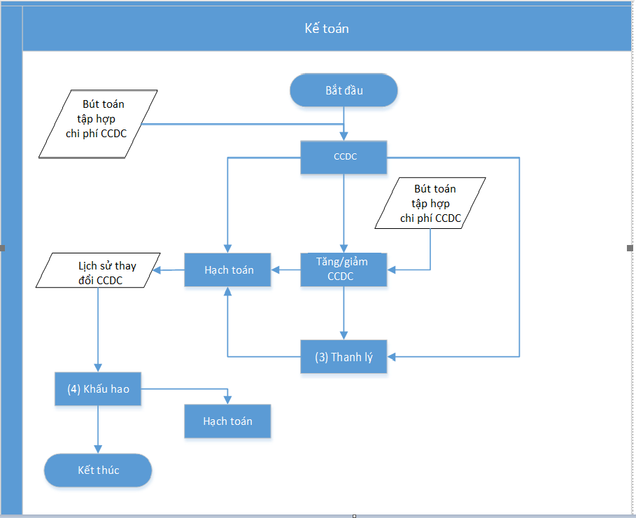

**Các luồng quy trình**

·     Quản lý thông tin Loại CCDC. Chi tiết nghiệp vụ **[tại đây](#loai-cong-cu-dung-cu)**

·     Phân bổ CCDC, Điều chỉnh tăng/giảm, Tạm dừng phân bổ và Tiếp tục phân bổ CCDC. Chi tiết nghiệp vụ **[tại đây](#cong-cu-dung-cu)**

·     Điều chuyển CCDC. Chi tiết nghiệp vụ **[tại đây](#ieu-chuyen-cong-cu-dung-cu-giua-cac-phong-ban)**

·     Thanh lý CCDC. Chi tiết nghiệp vụ **[tại đây](#thanh-ly-cong-cu-dung-cu)**

·     Kiểm kê CCDC. Chi tiết nghiệp vụ **[tại đây](#kiem-ke-cong-cu-dung-cu)**

## **Loại Công cụ dụng cụ**

**Mục đích**

Quản lý thông tin các Loại Công cụ dụng cụ theo thực tế tại Doanh nghiệp...

### Xem video hướng dẫn

<iframe
    width="920"
    height="450"
    frameborder="0"
    allow="autoplay; encrypted-media; clipboard-write; gyroscope; picture-in-picture "
    allowfullscreen
    title="Module Tài sản -  Loại Công cụ dụng cụ" 
    src="https://www.youtube.com/embed/slgm7MIZgnk"
></iframe>

**Các bước thực hiện**

**Bước 1:** Vào phân hệ **Kế toán Công cụ dụng cụ** -> Chọn chức năng **Danh mục** -> Chọn **Loại Công cụ dụng cụ**

 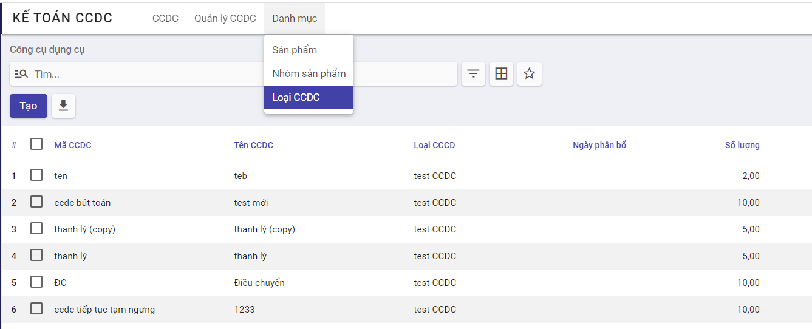

**Bước 2:** Nhấn vào nút *Tạo* để thêm mới loại CCDC

**Bước 3:** Người dùng nhập các thông tin 

+ Tên loại CCDC
+ Thông tin phân bổ: 
  - Thời gian khấu hao: Nhập thời gian khấu hao mong muốn theo tháng hoặc năm
  - Theo ngày mua: Hệ thống thực hiện tính phân bổ theo ngày mua hay không tại bản ghi khấu khao CCDC

+ Thông tin kế toán: Chọn Đơn vị quản lý loại CCDC, các đầu mục Tài khoản phục vụ cho việc ghi nhận phân bổ, sổ nhật ký,...

**Bước 4:** Thực hiện nhấn nút **Lưu** để lưu bản ghi

## **Công cụ dụng cụ**

### **Mô tả nghiệp vụ**

Quản lý thông tin CCDC trên hệ thống bao gồm: Giá trị CCDC và các thông tin liên quan đến phân bổ CCDC, Điều chỉnh tăng/giảm, Tạm dừng hoặc Tiếp tục phân bổ

**Luồng chức năng chính**

·     Tăng Công cụ dụng cụ. Chi tiết nghiệp vụ **[tại đây](#tang-cong-cu-dung-cu)**

·     Quản lý thông tin Khấu hao. Chi tiết nghiệp vụ **[tại đây](#quan-ly-thong-tin-khau-hao)**

·     Điều chỉnh Tăng Giá trị/Thời gian khấu hao của Công cụ dụng cụ. Chi tiết nghiệp vụ **[tại đây](#ieu-chinh-tang-gia-trithoi-gian-khau-hao-cua-cong-cu-dung-cu)**

·     Điều chỉnh Giảm Giá trị/Thời gian khấu hao của Công cụ dụng cụ. Chi tiết nghiệp vụ **[tại đây](#ieu-chinh-giam-gia-trithoi-gian-khau-hao-cua-cong-cu-dung-cu)**

·     Tạm dừng khấu hao Công cụ dụng cụ. Chi tiết nghiệp vụ **[tại đây](#tam-dung-khau-hao-cong-cu-dung-cu)**

·     Tiếp tục khấu hao Công cụ dụng cụ. Chi tiết nghiệp vụ **[tại đây](#tiep-tuc-khau-hao-cong-cu-dung-cu)**

### Xem video hướng dẫn

<iframe
    width="920"
    height="450"
    frameborder="0"
    allow="autoplay; encrypted-media; clipboard-write; gyroscope; picture-in-picture "
    allowfullscreen
    title="Module Tài sản -  Công cụ dụng cụ" 
    src="https://www.youtube.com/embed/OPr-YStl5Tc"
></iframe>

### **Tăng Công cụ dụng cụ**

**Mô tả:**

- Khi Doanh nghiệp ghi nhận phát sinh Công cụ dụng cụ do: mua sắm mới; do đầu tư xây dựng cơ bản hoàn thành; do thuê ..., kế toán thực hiện ghi nhận thông tin Công cụ dụng cụ lên hệ thống để quản lý.
- Công cụ dụng cụ được đánh mã và thực hiện khai báo, quản lý về ngguyên giá Công cụ dụng cụ, giá trị thanh lý có thể thu hồi, thời gian khấu hao, giá trị còn lại của Công cụ dụng cụ, hao mòn lũy kế

**Đối tượng thực hiện :** Nhân viên kế toán

**Các bước thực hiện:**

**Bước 1:** Vào phân hệ **Kế toán Công cụ dụng cụ** -> chọn chức năng **CCDC** -> Chọn **Công cụ dụng cụ**

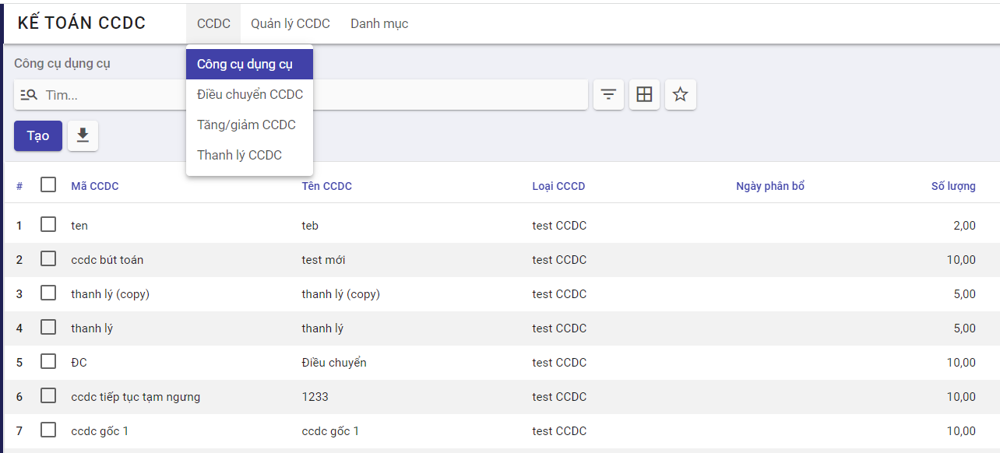

**Bước 2:** Nhấn nút *Tạo* để khai báo CCDC và các thông tin liên quan đến Phân bổ CCDC

**Bước 3:** Người dùng thực hiện nhập thông tin bao gồm:

+ Thông tin CCDC: Mã CCDC, Tên CCDC và Loại CCDC. Khi chọn Loại CCDC, hệ thống tự động điền các thông tin đã khai báo khi tạo mới Loại CCDC vào các mục *Thông tin phân bổ* và *Thông tin kế toán*

+ Thông tin về giá trị phân bổ: Ngày hạch toán, số lượng, giá/1 đơn vị 

+ Đối với CCDC đã sử dụng ngoài phần mềm, Người dùng cần khai báo thêm thông tin tại mục *Thông tin phân bổ đầu kỳ* ( bao gồm các thông tin về Số tiền đã phân bổ, thời gian đã phân bổ)

  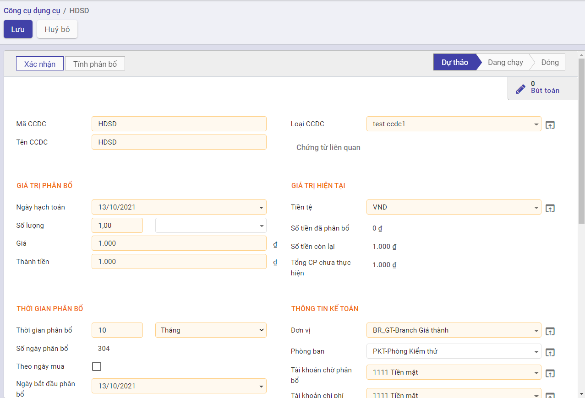

+ Nhập thông tin đơn vị sử dụng và số lượng CCDC tại tab *Đơn vị sử dụng* ( Số lượng không để trống và không vượt quá Tổng số lượng CCDC khai báo trên tab Thông tin chung )

  

+ Sau khi nhập thông tin tab Đơn vị sử dụng -> hệ thống tự động fill Thông tin đối tượng và tỷ lệ % vào tab Thiết lập phân bổ. Người dùng chọn Tài khoản chi phí để ghi nhận bút toán phân bổ cho từng đối tượng khi thực hiện phân bổ CCDC

+ Trường hợp người dùng chọn các chứng từ liên quan đến CCDC sẽ được hiển thị chi tiết tại tab *Nguồn gốc hình thành* 

**Lưu ý:** Đối với CCDC đã sử dụng ngoài phần mềm, Người dùng cần khai báo thêm thông tin tại mục **Thông tin phân bổ đầu kỳ** ( bao gồm các thông tin về Số tiền đã phân bổ, thời gian đã phân bổ)

**Bước 4:** Nhấn nút Tính phân bổ để tính phân bổ cho CCDC -> Giá trị phân bổ của CCDC sẽ được ghi nhận tại tab *Bảng phân bổ ước tính*

### **Quản lý thông tin Khấu hao**

**Thông tin khấu hao**

Kết quả khấu hao sẽ được trả về tại tab **Bảng phân bổ ước tính**. Kết quả phụ thuộc vào các yếu tố dưới đây:

- [x] Người dùng có chọn *Tính khấu hao theo ngày thực tế hay không*
- [x] *CCDC mới* hay *CCDC đã được sử dụng*
- [x] Có tick *Theo ngày mua hay không*

+ Nếu không tính theo ngày thực tế -> Hệ thống thực hiện tính phân bổ 1 tháng = 30 ngày, ngược lại sẽ tính theo ngày thực tế của tháng
+ Bản ghi phân bổ CCDC có tick *Theo ngày mua* -> Giá trị phân bổ sẽ được tính từ ngày theo ngày mua
+ Bản ghi phân bổ CCDC không tick *Theo ngày mua* -> Giá trị phân bổ  sẽ được tính từ *Ngày hạch toán*
+ Trường hợp là *CCDC đã được sử dụng* trước khi khai báo trên phần mềm-> Hệ thống thực hiện trừ Giá trị tiền đã phân bổ và Số ngày đã phân bổ ngoài phần mềm để tính ra giá trị phân bổ cho từng kỳ

**Khấu hao CCDC được tính toán dựa theo Phương pháp khấu hao Đường thẳng:**

+ Căn cứ vào Tổng số ngày khấu hao, Giá trị khấu hao và Tính khấu hao theo ngày thực tế hay không -> Hệ thống thực hiện tính ra giá trị khấu hao cho 1 ngày

+ Từ giá trị khấu hao 1 ngày -> Tính ra giá trị khấu hao cho 1 tháng hoặc 1 năm

+  Khi người dùng nhấn nút **Xác nhận**, hệ thống sẽ ghi nhận bút toán và cập nhật lại số liệu liên quan đến Giá trị tiền tại tab thông tin chung:

  - Bút toán ghi nhận theo từng kỳ khấu hao
    - Ghi có Tài khoản chi phí 
    - Ghi nợ Tài khoản chờ phân bổ

  + Giá trị tiền tại Tab Thông tin chung

    - Số tiền đã phân bổ tính dựa trên bút toán đã hạch toán và số tiền đã phân bổ ngoài phần mềm

    - Giá trị còn lại =Thành tiền - Số tiền đã phân bổ

### **Điều chỉnh Tăng giá trị/thời gian khấu hao của Công cụ dụng cụ**

**Mô tả:**

- Khi có nhu cầu đánh giá lại Công cụ dụng cụ, Doanh nghiệp thực hiện đánh giá theo trình tự của đơn vị và có Điều chỉnh khi có sự thay đổi về Giá trị của Công cụ dụng cụ và Thời gian Khấu hao
- Kế toán căn cứ vào Biên bản đánh giá sẽ thực hiện Cập nhật thông tin của Công cụ dụng cụ

**Đối tượng thực hiện :** Nhân viên kế toán

**Các bước thực hiện:**

**Bước 1:** Vào chức năng **Kế toán CCDC** -> Chọn **CCDC** -> Chọn bản ghi CCDC muốn điều chỉnh -> Chọn **Điều chỉnh CCDC**

**Bước 2:** Người dùng thực hiện nhập liệu liên quan đến

+ Số chứng từ
+ Ngày chứng từ
+ Lý do điều chỉnh
+ Giá trị điều chỉnh
  - Nếu muốn tăng giá trị phân bổ -> Người dùng thực hiện nhập *Số tiền còn lại* tại mục *Giá trị điều chỉnh* > *Số tiền còn lại* tại mục *Giá trị hiện tại*
  - Nếu muốn tăng thời gian phân bổ -> Người dùng thực hiện nhập *Thời gian phân bổ* tại mục *Giá trị điều chỉnh* > *Thời gian phân bổ* tại mục *Giá trị hiện tại*

+ Ngày điều chỉnh -> Hệ thống thực hiện ghi nhận thay đổi từ ngày này
+ Thông tin các đầu Tài khoản ghi nhận thay đổi tại mục *Kế toán điều chỉnh*

**Bước 3**: Nhấn nút *Điều chỉnh*

- Hệ thống kiểm tra nếu **ngày điều chỉnh** nằm trong kỳ khấu hao đã được hạch toán -> Hiển thị popup thông báo ' Không điều chỉnh vào kỳ đã hạch toán', và thoát khỏi màn hình Điều chỉnh CCDC

- Đối với bản ghi điều chỉnh thỏa mãn điều kiện sẽ ghi nhận giá trị Tăng CCDC vào trường **Tổng giá trị tăng** tại tab Thông tin chung và tác động đến *Bảng phân bổ ước tính* và *Sinh bút toán ghi nhận Tăng* *giá trị phân bổ tương ứng* như sau:

  - Tab Bảng phân bổ ước tính

    - Giá trị phân bổ được tính lại từ ngày điều chỉnh trên popup Điều chỉnh CCDC
    - Các bút toán phân bổ trước đó vẫn được giữ nguyên theo giá trị chưa ghi nhận Tăng

  - Bút toán ghi nhận Tăng giá trị CCDC

    - Ghi nợ Tài khoản đối ứng chi phí
    - Ghi có Tài khoản tăng tổng chi phí

### **Điều chỉnh Giảm giá trị/thời gian khấu hao của Công cụ dụng cụ**

**Mô tả:**

- Khi có nhu cầu đánh giá lại Công cụ dụng cụ, Doanh nghiệp thực hiện đánh giá theo trình tự của đơn vị và có Điều chỉnh khi có sự thay đổi về Giá trị của Công cụ dụng cụ và Thời gian Khấu hao
- Kế toán căn cứ vào Biên bản đánh giá sẽ thực hiện Cập nhật thông tin của Công cụ dụng cụ

**Đối tượng thực hiện :** Nhân viên kế toán

**Các bước thực hiện:**

**Bước 1:** Vào chức năng **Kế toán CCDC** -> Chọn **CCDC** -> Chọn bản ghi CCDC muốn điều chỉnh -> Chọn **Điều chỉnh CCDC**

**Bước 2:** Người dùng thực hiện nhập liệu các thông tin liên quan đến

+ Số chứng từ
+ Ngày chứng từ
+ Lý do điều chỉnh
+ Giá trị điều chỉnh
  - Nếu muốn giảm giá trị phân bổ -> Người dùng thực hiện nhập *Số tiền còn lại* tại mục *Giá trị điều chỉnh* < *Số tiền còn lại* tại mục *Giá trị hiện tại*
  - Nếu muốn giảm thời gian phân bổ -> Người dùng thực hiện nhập *Thời gian phân bổ* tại mục *Giá trị điều chỉnh* < *Thời gian phân bổ* tại mục *Giá trị hiện tại*

+ Ngày điều chỉnh -> Hệ thống thực hiện ghi nhận thay đổi từ ngày này
+ Thông tin các đầu Tài khoản ghi nhận thay đổi tại mục *Kế toán điều chỉnh*

**Bước 3**: Nhấn nút *Điều chỉnh*

- Hệ thống kiểm tra nếu **ngày điều chỉnh** nằm trong kỳ khấu hao đã được hạch toán -> Hiển thị popup thông báo ' Không điều chỉnh vào kỳ đã hạch toán', và thoát khỏi màn hình Điều chỉnh CCDC

- Đối với bản ghi điều chỉnh thỏa mãn điều kiện sẽ làm thay đổi giá trị Thành tiền ( Thành tiền của CCDC gốc - giá trị giảm) và tác động đến tab*Bảng phân bổ ước tính* và *Sinh bút toán ghi nhận *Giảm giá trị CCDC* như sau:

  - Tab Bảng phân bổ ước tính

    Giá trị khấu hao được **tính từ ngày điều chỉnh** trên popup Điều chỉnh CCDC. Bút toán đã ghi nhận giá trị tại các kỳ trước đó không bị ảnh hưởng

  - Bút toán ghi nhận Giảm giá trị tài sản

    - Ghi có Tài khoản đối ứng chi phí
    - Ghi nợ Tài khoản tăng tổng chi phí

### **Tạm dừng khấu hao Công cụ dụng cụ**

**Mô tả:**s

- Khi CCDC không còn nhu cầu theo dõi quản lý, Kế toán thực hiện Tạm dừng khấu hao CCDC đó trên phần mềm
- Hệ thống sẽ thực hiện ghi nhận và xử lý các dữ liệu liên quan trước và sau thời điểm Tạm dừng khấu hao

**Đối tượng thực hiện :** Nhân viên kế toán

**Các bước thực hiện:**

**Bước 1:** Vào chức năng **Kế toán CCDC** -> Chọn **CCDC** -> Chọn bản ghi CCDC muốn *Tạm dừng phân bổ* -> Nhấn nút **Tạm dừng phân bổ**

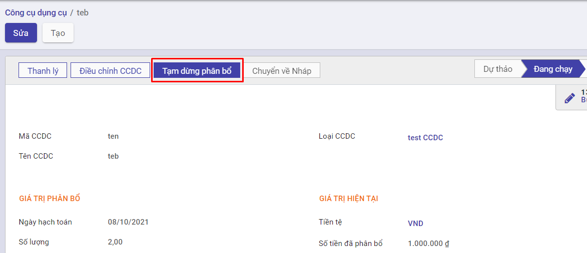

**Bước 2:** Nhập ngày tạm dừng phân bổ

**Bước 3:** Nhấn nút *Tạm dừng*. Sau khi thực hiện Tạm dừng khấu hao, hệ thống giữ nguyên các bút toán đã được ghi nhận trước thời điểm tạm dừng. Các bút toán ghi nhận sau thời gian này sẽ bị xóa khỏi Tab Bảng phân bổ ước tính

### **Tiếp tục khấu hao Công cụ dụng cụ**

**Mô tả:**

- Trường hợp doanh nghiệp muốn tiếp tục Khấu hao tài sản đã được tạm ngừng. Hệ thống sẽ thực hiện ghi nhận các thay đổi và cập nhật thay đổi đó tới các Tab thông tin liên quan

**Đối tượng thực hiện :** Nhân viên kế toán

**Các bước thực hiện:**

**Bước 1:** Vào chức năng **Kế toán CCDC** -> Chọn **CCDC** -> Chọn bản ghi CCDC muốn *Tiếp tục phân bổ* -> Chọn **Tiếp tục phân bổ**

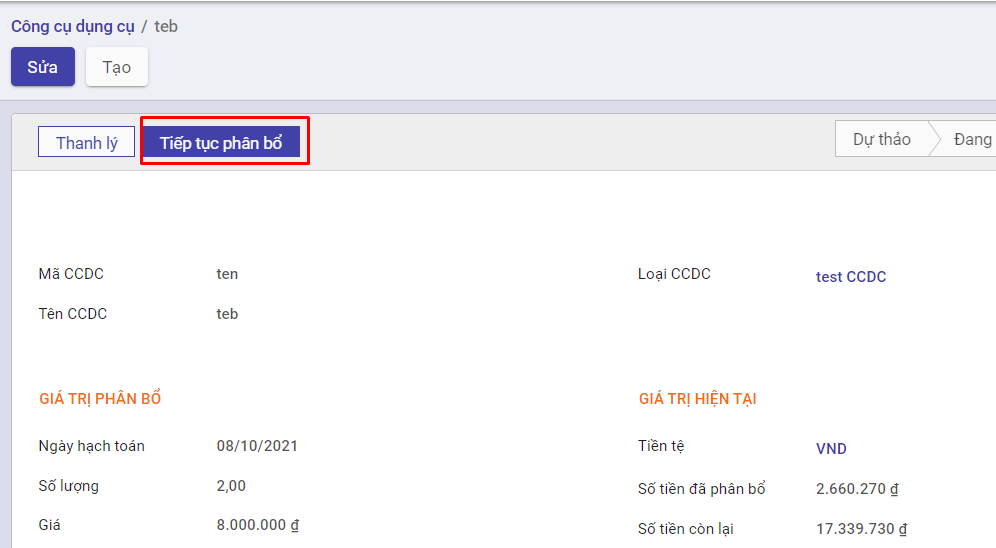

**Bước 2**: Nhập thông tin liên quan đến giá trị, thời gian tại mục Giá trị điều chỉnh và các đầu tài khoản để ghi nhận sự thay đổi tại Kế toán điều chỉnh

+ 

  **Bước 3:** Nhấn nút  *Điều chỉnh* . Sau đó, CCDC sẽ được tiếp tục tính khấu hao kể từ Ngày điều chỉnh với giá trị khấu hao và thời gian khấu hao tại mục Giá trị điều chỉnh

## **Điều chuyển Công cụ dụng cụ giữa các phòng ban**

- Khi phát sinh nhu cầu điều chuyển CCDC giữa các phòng ban, bộ phận trong doanh nghiệp, Kế toán hoặc hoặc bộ phận có CCDC bị điều chuyển sẽ lập biên bản giao nhận CCDC.
- Căn cứ vào lệnh điều chuyển và biên bản giao nhận CCDC, kế toán thực hiện ghi sổ 

**Luồng chức năng chính**

·     Điều chuyển Công cụ dụng cụ giữa các phòng ban. Chi tiết nghiệp vụ **[tại đây](###Điều chuyển Công cụ dụng cụ giữa các phòng ban)**

·     Quản lý các chứng từ điều chuyển. Chi tiết nghiệp vụ **[tại đây](###Quản lý các chứng từ điều chuyển)**

### Xem video hướng dẫn

<iframe
    width="920"
    height="450"
    frameborder="0"
    allow="autoplay; encrypted-media; clipboard-write; gyroscope; picture-in-picture "
    allowfullscreen
    title="Module Tài sản -  Điều chuyển Công cụ dụng cụ" 
    src="https://www.youtube.com/embed/EyyeCEzg7ug"
></iframe>

### **Điều chuyển Công cụ dụng cụ giữa các phòng ban**

**Mô tả:**

- Khi phát sinh nhu cầu điều chuyển CCDC giữa các phòng ban, bộ phận trong doanh nghiệp, Kế toán hoặc hoặc bộ phận có CCDC bị điều chuyển sẽ lập biên bản giao nhận CCDC.
- Căn cứ vào lệnh điều chuyển và biên bản giao nhận CCDC, kế toán ghi vào sổ CCDC

**Đối tượng thực hiện :** Nhân viên kế toán

**Các bước thực hiện:**

**Bước 1:** Vào chức năng **Kế toán CCDC** -> Chọn **CCDC** -> Chọn **Điều chuyển CCDC** -> Chọn **Tạo**

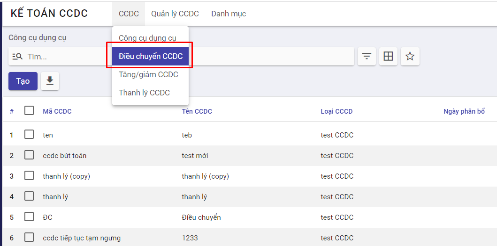

**Bước 2**: Người dùng nhập thông tin Người bàn giao, Người tiếp nhận và Ngày bàn giao,...

+ Tại tab CCDC điều chuyển, chọn CCDC muốn điều chuyển,thông tin liên quan đến đơn vị điều chuyển, đơn vị tiếp nhận và số lượng điều chuyển

  

**Bước 3:** Chọn nút *Điều chuyển*

+ Sau khi thực hiện điều chuyển, CCDC sẽ thuộc quyền sở hữu của đơn vị tiếp nhận điều chuyển
+ Số lượng CCDC giữa Đơn vị điều chuyển và Đơn vị được điều chuyển tới sẽ có sự thay đổi

### **Quản lý các chứng từ điều chuyển**

**Mô tả:**

- Khi phát sinh nhu cầu điều chuyển CCDC giữa các phòng ban, bộ phận trong doanh nghiệp, Kế toán hoặc hoặc bộ phận có CCDC bị điều chuyển sẽ lập biên bản giao nhận CCDC.
- Căn cứ vào lệnh điều chuyển và biên bản giao nhận CCDC, kế toán ghi vào sổ CCDC
- Thông tin các chứng từ điều chuyển được quản lý tập trung

**Đối tượng thực hiện :** Nhân viên kế toán

**Các bước thực hiện:**

**Bước 1:** Vào chức năng **Kế toán CCDC** -> Chọn **CCDC** -> Chọn **Điều chuyển CCDC** 

**Bước 2**: Người dùng có thể chọn xem bản ghi điều chuyển bất kỳ trên màn hình danh sách các TCCDC đã điều chuyển hoặc tìm kiếm bản ghi theo Ngày bàn biên bản, Người bàn giao,...

**Bước 3:** Sau khi chọn bản ghi điều chuyển, người dùng có thể xem chi tiết thông tin liên quan như Người bàn giao, người tiếp nhận, biên bản giao nhận tại tab thông tin chung và chi tiết CCDC cũng như đơn vị điều chuyển, đơn vị tiếp nhận, tổng số lượng CCDC sử dụng và số lượng CCDC điều chuyển đi tại tab CCDC điều chuyển

## **Thanh lý Công cụ dụng cụ**

### **Mô tả nghiệp vụ**

- Khi doanh nghiệp có nhu cầu bán CCDC do hết khấu hao hoặc không có nhu cầu sử dụng, kế toán thực hiện thanh lý CCDC. 
- Căn cứ vào chứng từ liên quan kế toán ghi nhận vào sổ CCDC

**Luồng chức năng chính**

·     Thanh lý Công cụ dụng cụ. Chi tiết nghiệp vụ **[tại đây](#thanh-ly-cong-cu-dung-cu_1)**

·     Quản lý các chứng từ Thanh lý. Chi tiết nghiệp vụ **[tại đây](#quan-ly-cac-chung-tu-thanh-ly)**

### Xem video hướng dẫn

<iframe
    width="920"
    height="450"
    frameborder="0"
    allow="autoplay; encrypted-media; clipboard-write; gyroscope; picture-in-picture "
    allowfullscreen
    title="Module Tài sản - Thanh lý Công cụ dụng cụ" 
    src="https://www.youtube.com/embed/l0YFxZAUXIA"
></iframe>

### **Thanh lý Công cụ dụng cụ**

**Mô tả:**

- Khi doanh nghiệp có nhu cầu bán Công cụ dụng cụ do hết khấu hao hoặc không có nhu cầu sử dụng, kế toán thực hiện thanh lý Công cụ dụng cụ. 

**Đối tượng thực hiện :** Nhân viên kế toán

**Các bước thực hiện:**

**Bước 1:** Có 2 cách để truy cập vào Thanh lý CCDC

+ Cách 1: Vào chức năng **Kế toán CCDC** -> Chọn **CCDC** -> Chọn **Công cụ dụng cụ** -> Chọn CCDC muốn thanh lý -> Nhấn nút **Thanh lý**

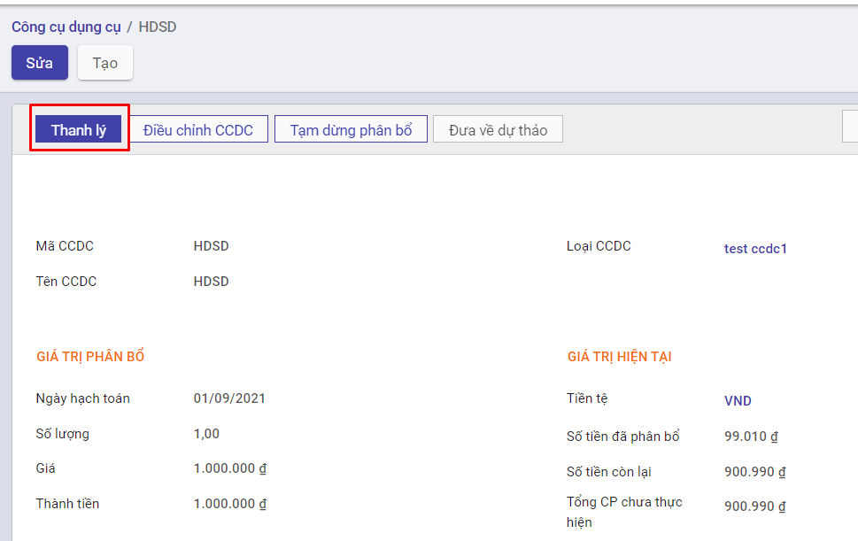

+ Cách 2: Vào chức năng **Kế toán CCDC** -> Chọn **CCDC** -> Chọn **Thanh lý CCDC** -> Nhấn nút **Tạo**

  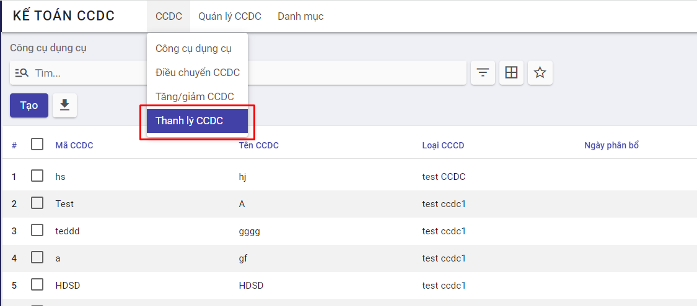

**Bước 2**: Tại màn hình thanh lý, người dùng thực hiện các thao tác:

+ Chọn CCDC muốn thanh lý

+ Chọn ngày chứng từ và hạch toán ghi nhận hành động thanh lý 

+ Chọn phòng ban và số lượng CCDC thanh lý 

+ Chọn tài khoản xử lý giá trị còn lại

  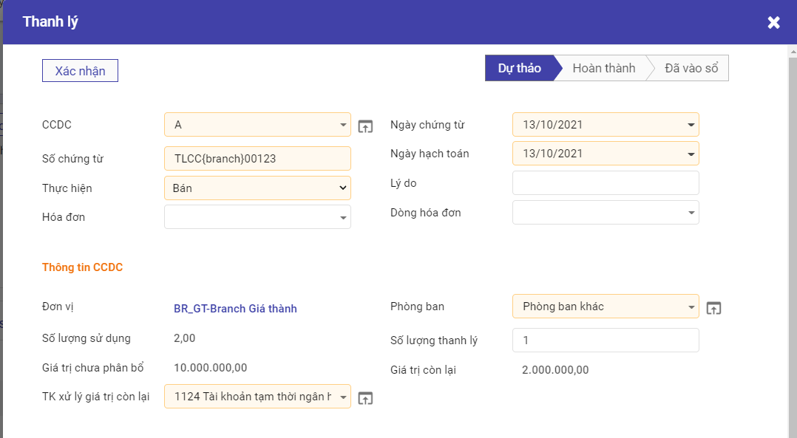

**Bước 3:** Nhấn nút *Xác nhận*

+ Hệ thống thực hiện hạch toán số tiền thanh lý ccdc theo số lượng và ngày chứng từ

+ Thực hiện cập nhật giá trị phân bổ vào tab Phân bổ ước tính ở CCDC gốc.

+ Thông tin ccdc thanh lý được lưu trên danh sách thanh lý ccdc

### **Quản lý các chứng từ Thanh lý**

**Mô tả:**

- Hệ thống tập hợp các CCDC đã được Thanh lý, giúp doanh nghiệp dễ dàng theo dõi và quản lý hiện trạng CCDC cho đến thời điểm hiện tại

**Đối tượng thực hiện :** Nhân viên kế toán

**Các bước thực hiện:**

**Bước 1:** Vào chức năng **Kế toán CCDC** -> Chọn **CCDC** -> Chọn **Thanh lý CCDC**

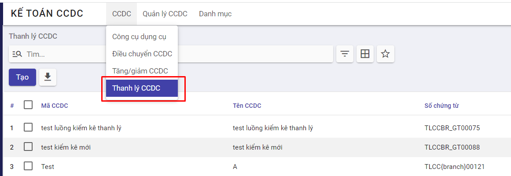

**Bước 2:** Người dùng có thể chọn xem CCDC thanh lý bất kỳ trên màn hình danh sách các CCDC đã được thanh lý hoặc tìm kiếm CCDC thanh lý theo Mã CCDC, Tên CCDC, ...

**Bước 3:** Sau khi chọn bản ghi, thông tin CCDC sẽ được hiển thị tại tab Thông tin chung và các bút toán ghi nhận tại tab Chi tiết hạch toán

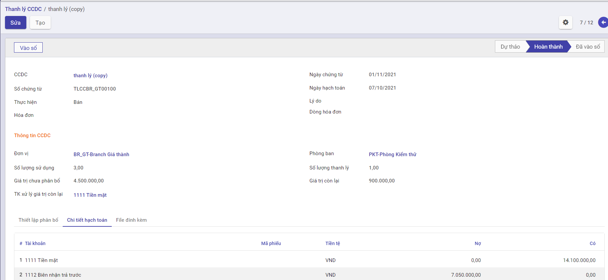

## **Kiểm kê Công cụ dụng cụ**

### **Mô tả nghiệp vụ**

- Hàng kỳ Doanh nghiệp thực hiện kiểm kê Công cụ dụng cụ theo số ghi nhận trên hệ thống và số thực tế kiểm kê
- Kết thúc kiểm kê thu lại biên bản kiểm kê và tổng hợp kết quả. So sánh số liệu kiểm kê trên bảng tổng hợp kết quả kiểm kê với số liệu trên sổ sách kế toán
- Dựa trên báo cáo kết quả kiểm kê, giám đốc phê duyệt các điều chỉnh do có sự khác biệt giữa số liệu sổ sách và kết quả kiểm kê.
- Căn cứ vào quyết định xử lý, kế toán TSCĐ thực hiện ghi sổ TSCĐ.

### Xem video hướng dẫn

<iframe
    width="920"
    height="450"
    frameborder="0"
    allow="autoplay; encrypted-media; clipboard-write; gyroscope; picture-in-picture "
    allowfullscreen
    title="Module Tài sản -  Kiểm kê Công cụ dụng cụ" 
    src="https://www.youtube.com/embed/loOkD6LSY50"
></iframe>

### **Kiểm kê Công cụ dụng cụ**

**Đối tượng thực hiện :** Nhân viên kế toán

**Các bước thực hiện:**

**Bước 1:** Vào chức năng **Kế toán CCDC** -> Chọn **Quản lý CCDC** -> Chọn **Kiểm kế CCDC**

 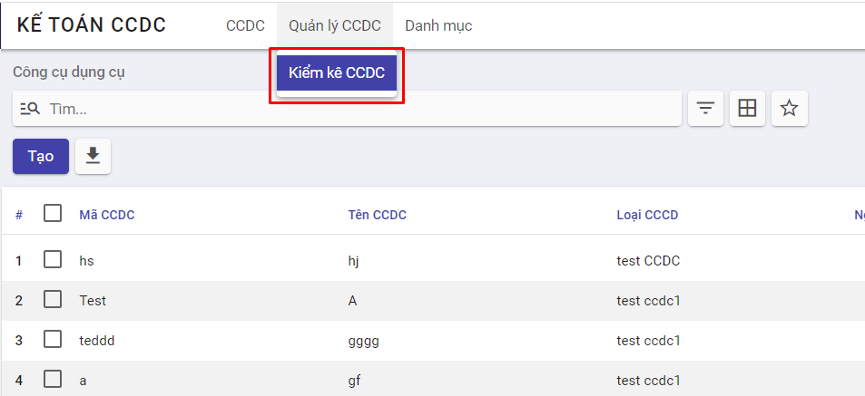

**Bước 2**: Chọn nút *Tạo*

**Bước 3:** Người dùng thực hiện nhập các thông tin:

+ Ngày ghi nhận kiểm kê 

+ Số chứng từ

+ Nhập thông tin người kiểm kê tại mục Thành viên tham gia

  

+ Chọn CCDC kiểm kê -> Hệ thống tự động hiển thị số lượng CCDC theo dõi trên phần mềm. Người dùng thực hiện nhập số lượng kiểm kê theo thực tế và tình trạng CCDC tính đến thời điểm kiểm kê tại mục Chi tiết CCDC

  

**Bước 4:** Chọn *Lưu* để ghi nhận thông tin kiểm kê

