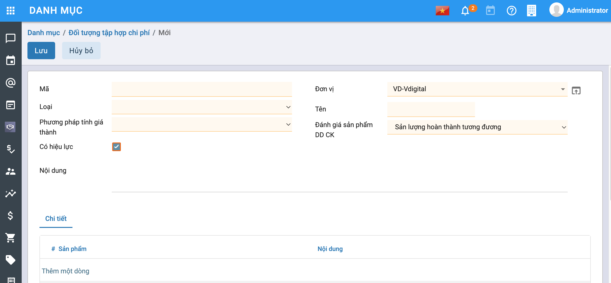
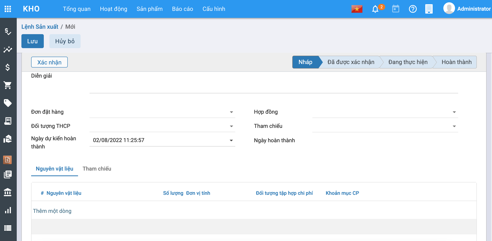
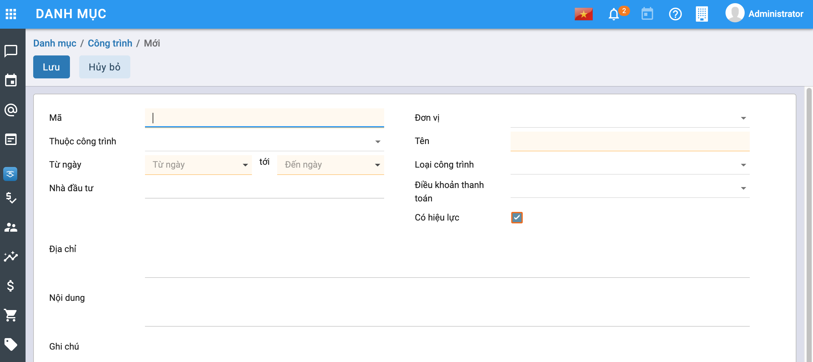

# **Quy trình nghiệp vụ**

Module Giá thành hỗ trợ trong việc quản lý và tự động tập hợp chi phí sản xuất trực tiếp theo từng đối tượng tập hợp chi phí  (sản phẩm/dịch vụ, phân xưởng, đơn hàng, công trình, hợp đồng); Phân bổ chi phí chung, xác định chi phí dở dang cuối kỳ và lên giá thành chi tiết theo từng sản phẩm/dịch vụ, đơn hàng, công trình, hợp đồng.

Phân hệ Giá thành hỗ trợ doanh nghiệp tính giá thành sản phẩm theo các phương pháp sau:

- Giá thành theo phương pháp giản đơn
- Giá thành theo phương pháp hệ số, tỷ lệ
- Giá thành công trình/vụ việc
- Giá thành đơn hàng
- Giá thành hợp đồng

**Các luồng quy trình**

·    Tính giá thành theo TT133. Chi tiết nghiệp vụ [**tại đây**](#thong-tu-133 )

·     Tính giá thành theo TT200. Chi tiết nghiệp vụ  [**tại đây**](#thong-tu-200 )

## Thông tư 200

### Tính giá thành theo PP giản đơn

#### Quy trình nghiệp vụ

**Tính giá thành theo PP giản đơn**: Áp dụng với doanh nghiệp có quy trình công nghệ sản xuất liên tục, khép kín, kết thúc quy trình tạo ra 1 sản phẩm, đối tượng tập hợp chi phí là toàn bộ quy trình sản xuất sản phẩm, đối tượng tính giá thành là sản phẩm hoàn thành của quy trình sản xuất đó. Ví dụ: Doanh nghiệp sản xuất bê tông, cọc bê tông, tấm cách nhiệt, bao bì xốp…

**Quy trình nghiệp vụ**

#### Khai báo định mức Phân bổ theo đối tượng THCP

##### Mô tả nghiệp vụ

Khai báo định mức chi phí của từng đối tượng THCP theo từng yếu tố, phục vụ cho việc phân bổ chi phí chung theo định mức khi tính giá thành theo phương pháp giản đơn.

##### *Xem video hướng dẫn*

<iframe
    width="920"
    height="450"
    frameborder="0"
    allow="autoplay; encrypted-media; clipboard-write; gyroscope; picture-in-picture "
    allowfullscreen
    title="Module Giá thành_Giản đơn_Khai báo định mức phân bổ chi phí" 
    src="https://www.youtube.com/embed/dp_RtcLEG4U"
></iframe>

##### Các bước thực hiện

Bước 1: Vào Menu **Tài chính - Kế toán\Giá thành\Giản đơn\Khai báo định mức phân bổ chi phí** hoặc **Tất cả\Giá thành\Giản đơn\Khai báo định mức phân bổ chi phí**, Chọn **Tạo**. Màn hình hiển thị thông tin sau:

Bước 2: Người dùng điền các thông tin trên màn hình. Lưu ý: Tích vào **Thêm một dòng** để chọn các Tài khoản cần khai báo. Nhấn **Lưu** , Nhấn **Xác nhận** khi đó bản ghi đã được **Hoàn thành**.

#### Khai báo định mức giá thành

##### Mô tả nghiệp vụ

Khai báo định mức chi phí của từng thành phẩm theo từng yếu tố, phục vụ cho việc đánh giá sản phẩm dở dang theo định mức khi tính giá thành theo phương pháp giản đơn.

##### ***Xem video hướng dẫn***

<iframe
    width="920"
    height="450"
    frameborder="0"
    allow="autoplay; encrypted-media; clipboard-write; gyroscope; picture-in-picture "
    allowfullscreen
    title="Module Giá thành_Giản đơn_Khai báo định mức giá thành" 
    src="https://www.youtube.com/embed/KlXPCEgQN5U"
></iframe>

##### Các bước thực hiện

Bước 1: Vào Menu **Tài chính - Kế toán\Giá thành\Giản đơn\Khai báo định mức giá thành** hoặc **Tất cả\Giá thành\Giản đơn\Khai báo định mức giá thành**, Chọn **Tạo**. Màn hình hiển thị thông tin sau:

Bước 2: Người dùng điền các thông tin trên màn hình. Lưu ý: Tích vào **Thêm một dòng** để chọn các Thành phẩm cần khai báo. Có 2 trường hợp:

- Nếu người dùng muốn nhập chi tiết các chi phí khác như Chi phí Nguyên vật liệu gián tiếp, Nhân công gián tiếp, Chi phí mua ngoài...(Chi phí chi tiết của của Chi phí sản xuất chung)--> Tích chọn vào **Nhập chi tiết theo yếu tố chi phí**. Màn hình hiển thị thông tin như sau:

  

- Nếu người dùng không tích chọn **Nhập chi tiết theo yếu tố chi phí** thì màn hình sẽ ẩn đi các cột chi phí chi tiết của chi phí sản xuất chung (như hình trên).

Bước 3: Nhấn **Lưu** , Nhấn **Xác nhận** khi đó bản ghi đã được **Hoàn thành**.

#### Khai báo chi phí dở dang đầu kỳ

##### Mô tả nghiệp vụ

Với trường hợp lần đầu sử dụng phần mềm để tính giá thành, hệ thống hỗ trợ nhập được chi phí dở dang đầu kỳ chi tiết theo nhiều đối tượng tập hợp chi phí để làm căn cứ tính giá thành cho các kỳ tiếp theo.

##### *Xem video hướng dẫn*

<iframe
    width="920"
    height="450"
    frameborder="0"
    allow="autoplay; encrypted-media; clipboard-write; gyroscope; picture-in-picture "
    allowfullscreen
    title="Module Giá thành_Giản đơn_Khai báo chi phí dở dang đầu kỳ" 
    src="https://www.youtube.com/embed/5a8wgLLgT7o"
></iframe>

##### Các bước thực hiện

Bước 1: Vào Menu **Tài chính - Kế toán\Giá thành\Giản đơn\Thiết lập chi phí dở dang đầu kỳ** hoặc **Tất cả\Giá thành\Giản đơn\Thiết lập chi phí dở dang đầu kỳ**, chọn **Tạo**. Màn hình hiển thị thông tin sau:

Bước 2: Người dùng điền các thông tin trên màn hình. Lưu ý: Tích vào **Thêm một dòng** để chọn các Thành phẩm cần khai báo. Có 2 trường hợp:

- Nếu người dùng không tích chọn **Nhập chi tiết theo yếu tố chi phí** thì màn hình sẽ ẩn đi các cột chi phí chi tiết của chi phí sản xuất chung (như hình trên).
- Nếu người dùng muốn nhập chi tiết các chi phí khác như Chi phí Nguyên vật liệu gián tiếp, Nhân công gián tiếp, Chi phí mua ngoài...(Chi phí chi tiết của của Chi phí sản xuất chung)--> Tích chọn vào **Nhập chi tiết theo yếu tố chi phí**. Màn hình hiển thị thông tin như sau:

Bước 3: Nhấn **Lưu** , Nhấn **Xác nhận** khi đó bản ghi đã được **Hoàn thành**.

#### Tính giá thành

##### **Bước 1: Khai báo nguyên vật liệu sản xuất và thành phẩm**

- Vào Menu **Tài chính - Kế toán\Kho\Sản phẩm** hoặc **Tất cả\Kho\Sản phẩm**, nhấn **Tạo**. Màn hình hiển thị như hình dưới:

  

- Người dùng nhập các thông tin trên màn hình (tab **Thông tin chung**). Lưu ý: Chọn **Loại sản phẩm** : Thành phẩm

##### Bước 2: Khai báo đối tượng tập hợp chi phí

- Vào Menu **Tài chính - Kế toán\Danh mục\Đối tượng tập hợp chi phí**, nhấn **Tạo**. Màn hình hiển thị như hình dưới:

  

- Người dùng điền các thông tin có trên màn hình. Trong đó:
  - Phương pháp tính giá thành: Chọn **Giản đơn**
  - Đánh giá sản phẩm DDCK: Chọn phương pháp đánh giá sản phẩm DDCK (Sản lượng hoàn thành tương đương, nguyên vật liệu trực tiếp, định mức)

- Nhấn **Lưu**, hoàn thành khai báo Đối tượng THCP.

##### Bước 3: Xuất kho nguyên vật liệu sản xuất

- Xuất kho NVL sản xuất và nhập kho thành phẩm : 2 giai đoạn này được thể hiện trong quá trình sản xuất. Cụ thể trong hệ thống : Vào Menu **Tài chính - Kế toán\Kho\Hoạt động\Phiếu xuất kho** hoặc **Tất cả\Kho\Hoạt động\Phiếu xuất kho** , tích chọn **Tạo**. Màn hình hiển thị như hình dưới:

  

- Các thao tác tạo **Lệnh sản xuất** được mô tả cụ thể trong **HDSD Phân hệ Kho**.
- Người dùng lưu ý chọn **Đối tượng THCP** ở tab chung.
- Sau khi hoàn thành lệnh sản xuất, hệ thống sẽ tự động sinh 1 phiếu xuất NVL sản xuất và 1 phiếu nhập Thành phẩm sản xuất. (Trong đó có gắn Đối tượng THCP).

##### Bước 4: Hạch toán các chi phí phát sinh

- Các chi phí phát sinh liên quan đến việc tính giá thành (chi phí nguyên vật liệu trực tiếp, nhân công trực tiếp, chi phí sản xuất chung,..) được hạch toán ở các phân hệ: **Kế toán tổng hợp, Kế toán Quỹ, Kế toán ngân hàng**.

##### Bước 5: Nhập kho thành phẩm sản xuất

- Xuất kho NVL sản xuất và nhập kho thành phẩm : 2 giai đoạn này được thể hiện trong quá trình sản xuất. Cụ thể trong hệ thống : Vào Menu **Tài chính - Kế toán\Kho\Hoạt động\Lệnh sản xuất** hoặc **Tất cả\Kho\Hoạt động\Lệnh sản xuất** **, nhấn  **Tạo** . Màn hình hiển thị như hình dưới:

  

- Các thao tác tạo **Lệnh sản xuất** được mô tả cụ thể trong **HDSD Phân hệ Kho**.
- Người dùng lưu ý chọn **Đối tượng THCP** ở tab chung.
- Sau khi hoàn thành lệnh sản xuất, hệ thống sẽ tự động sinh 1 phiếu xuất NVL sản xuất và 1 phiếu nhập Thành phẩm sản xuất. (Trong đó có gắn Đối tượng THCP).

##### Bước 6: Xác định kỳ tính giá thành

###### *Xem video Hướng dẫn*

<iframe
    width="920"
    height="450"
    frameborder="0"
    allow="autoplay; encrypted-media; clipboard-write; gyroscope; picture-in-picture "
    allowfullscreen
    title="Module Giá thành_Giản đơn_Kỳ tính giá thành" 
    src="https://www.youtube.com/embed/Me3MA-ROwcU"
></iframe>

- Vào Menu **Tài chính - Kế toán\Giá thành\Giản đơn\Kỳ tính giá thành** hoặc **Tất cả\Giá thành\Giản đơn\Kỳ tính giá thành**, nhấn **Tạo**. Màn hình hiển thị như hình dưới:

  

- Người dùng nhập các thông tin ở màn hình tab chung: Đơn vị, Phòng ban, Kỳ phân bổ, Từ ngày đến ngày.
- Các trường còn lại (Dở dang đầu kỳ, Phát sinh trong kỳ,..) là những trường kết quả (Lấy số liệu từ các tab, bảng khác) người dùng không nhập.
- Tab **Đối tượng tập hợp chi phí** tích **Thêm một dòng** để chọn đối tượng tập hợp chi phí tập hợp trong kỳ.
- Nhấn **Lưu,** nhấn **Xác nhận** , bản ghi chuyển trạng thái **Đang thực hiện**. Khi đó bước Khai báo kỳ giá thành đã hoàn thành.

##### Bước 7: Phân bổ chi phí chung

###### *Xem video hướng dẫn*

<iframe
    width="920"
    height="450"
    frameborder="0"
    allow="autoplay; encrypted-media; clipboard-write; gyroscope; picture-in-picture "
    allowfullscreen
    title="Module Giá thành_Giản đơn_Phân bổ chi phí" 
    src="https://www.youtube.com/embed/Y7N21XwZd7w"
></iframe>

Vào Menu **Tài chính - Kế toán\Giá thành\Giản đơn\Phân bổ chi phí chung** hoặc **Tất cả\Giá thành\Giản đơn\Phân bổ chi phí chung**, nhấn **Tạo**. Màn hình hiển thị như hình dưới:

- Người dùng nhập các thông tin trên màn hình tab chung, nhấn **Lấy dữ liệu** hệ thống sẽ tự động đẩy các thông tin xuống tab chi phí (Khoản mục phí, tổng chi phí, Số chưa phân bổ).
- Người dùng chọn **Tiêu thức phân bổ** (Nguyên vật liệu trực tiếp, Nhân công trực tiếp, Chi phí trực tiếp, Định mức), chọn **Tỷ lệ phân bổ** hệ thống sẽ tự động tính số tiền phân bổ hoặc ngược lại.
- Nhấn **Tính toán phân bổ** hệ thống sẽ tự động tính toán và đẩy các dữ liệu, kết quả tính toán sang **Tab phân bổ**:

- Nhấn **Lưu,** nhấn **Xác nhận,** bản ghi **Đã hoàn thành**.

*Lưu ý:*

- Hệ thống sẽ tự động cập nhập lên tab **Phân bổ chi phí chung** ở **Kỳ tính giá thành**.
- Nhấn vào nút Giá thành, hệ thống sẽ tự động chuyển đến màn hình **Kỳ tính giá thành**.

##### Bước 8: Tính giá thành

Trường hợp kết thúc kỳ tính giá thành vẫn còn có các thành phẩm chưa sản xuất xong, kế toán cần xác định giá trị dở dang cuối kỳ cho từng đối tượng THCP (Tiêu thức đánh giá dở dang đã được lựa chọn khi khai báo Đối tượng THCP).

###### *Xem video hướng dẫn*

<iframe
    width="920"
    height="450"
    frameborder="0"
    allow="autoplay; encrypted-media; clipboard-write; gyroscope; picture-in-picture "
    allowfullscreen
    title="Module Giá thành_Giản đơn_Tính giá thành" 
    src="https://www.youtube.com/embed/OEpQ5O7NJuo"
></iframe>

**Tính chi phí dở dang**

- Vào Menu **Tài chính - Kế toán\Giá thành\Giản đơn\Xác định Chi phí dở dang cuối kỳ tính và Tính giá thành** hoặc **Tất cả\Giá thành\Giản đơn\Xác định Chi phí dở dang cuối kỳ tính và Tính giá thành** , nhấn **Tạo**. Màn hình hiển thị như hình dưới:

- Người dùng nhập thông tin ở tab chung, nhấn **Lấy dữ liệu**, hệ thống tự động đẩy dữ liệu xuống tab **Thành phẩm**. Tiếp theo nhập thêm Tỷ lệ % hoàn thành, và Số lượng dở dang cuối kỳ.
- Nhấn **Tính chi phí dở dang**, hệ thống tự động tính chi phí dở dang cuối kỳ ở tab Chi phí dở dang cuối kỳ:

***Tính giá thành***

- Nhấn **Tính giá thành**, hệ thống thực hiện tính giá thành theo từng thành phẩm:

- Nhấn **Lưu,** nhấn **Xác nhận**, bản ghi Xác định chi phí dở dang cuối kỳ và tính giá thành **Đã hoàn thành.**
- Hệ thống thực hiện cập nhập giá nhập kho vào Phiếu nhập kho thành phẩm.
- Các thành phẩm vừa thực hiện tính giá xong, và có phát sinh xuất kho trong kỳ tính giá thành, thực hiện tính giá xuất kho theo **Tài chính - Kế toán\Kho\Tính giá xuất kho** hoặc **Tất cả\Kho\Tính giá xuất kho** : (chọn tính giá không theo kho)

Lưu ý:

- Sau khi tính giá thành, hệ thống tự động cập nhật dữ liệu vào (các tab thông tin tương ứng) của bảng **Kỳ tính giá thành**.
- Nhấn **Giá thành**, bản ghi chuyển đến **Kỳ tính giá thành.**

##### Bước 9: Kết chuyển chi phí

###### *Xem video hướng dẫn*

<iframe
    width="920"
    height="450"
    frameborder="0"
    allow="autoplay; encrypted-media; clipboard-write; gyroscope; picture-in-picture "
    allowfullscreen
    title="Module Giá thành_Giản đơn_Kết chuyển chi phí" 
    src="https://www.youtube.com/embed/Z8WLNDyayug"
></iframe>

- Vào Menu **Tài chính - Kế toán\Giá thành\Giản đơn\Kết chuyển chi phí** hoặc **Tất cả\Giá thành\Giản đơn\Kết chuyển chi phí**. Màn hình hiển thị như sau:

- Người dùng điền các thông tin trên màn hình, nhấn **Tính kết chuyển** hệ thống tự động thực hiện kết chuyển chi phí ở tab **Chi tiết**.
- Nhấn **Lưu,** nhấn **Xác nhận**, khi đó bản ghi kết chuyển chi phí **Đã hạch toán.**

### Tính giá thành theo PP Hệ số - Tỷ lệ

#### *Quy trình nghiệp vụ*

**Giá thành theo phương pháp hệ số, tỷ lệ**: Áp dụng cho các doanh nghiệp có quy trình sản xuất sử dụng cùng loại nguyên vật liệu chính và tạo ra nhiều sản phẩm/nhóm sản phẩm khác nhau. Trong đó, đối tượng tập hợp chi phí là toàn bộ quy trình công nghệ và đối tượng tính giá thành là từng sản phẩm/nhóm sản phẩm hoàn thành. Ví dụ: doanh nghiệp sản xuất các mặt hàng như sản xuất đá các loại, gạch các loại,…

**Quy trình nghiệp vụ**

#### Khai báo định mức phân bổ chi phí

##### Mô tả nghiệp vụ

Khai báo định mức chi phí của từng đối tượng THCP theo từng yếu tố, phục vụ cho việc phân bổ chi phí chung theo định mức khi tính giá thành theo phương pháp giản đơn.

##### *Xem video hướng dẫn*

<iframe
    width="920"
    height="450"
    frameborder="0"
    allow="autoplay; encrypted-media; clipboard-write; gyroscope; picture-in-picture "
    allowfullscreen
    title="Module Giá thành_Hệ số-Tỷ lệ_Khai báo định mức phân bổ chi phí" 
    src="https://www.youtube.com/embed/l7XiXG-BbB8"
></iframe>

##### Các bước thực hiện

Bước 1: Vào Menu **Tài chính - Kế toán\Giá thành\Hệ số - Tỷ lệ\Khai báo định mức phân bổ chi phí** hoặc **Tất cả\Giá thành\Hệ số - Tỷ lệ\Khai báo định mức phân bổ chi phí**, Chọn **Tạo**. Màn hình hiển thị thông tin sau:

Bước 2: Người dùng điền các thông tin trên màn hình. Lưu ý: Tích vào **Thêm một dòng** để chọn các Tài khoản cần khai báo. Nhấn **Lưu** , Nhấn **Xác nhận** khi đó bản ghi đã được **Hoàn thành**.

#### Khai báo định mức giá thành

##### Mô tả nghiệp vụ

Khai báo định mức chi phí của từng thành phẩm theo từng yếu tố, phục vụ cho việc đánh giá sản phẩm dở dang theo định mức khi tính giá thành theo phương pháp giản đơn.

##### *Xem video hướng dẫn*

<iframe
    width="920"
    height="450"
    frameborder="0"
    allow="autoplay; encrypted-media; clipboard-write; gyroscope; picture-in-picture "
    allowfullscreen
    title="Module Giá thành_Hệ số-Tỷ lệ_Khai báo định mức giá thành" 
    src="https://www.youtube.com/embed/ySktsQZLopk"
></iframe>

##### Các bước thực hiện

Bước 1: Vào Menu **Tài chính - Kế toán\Giá thành\Hệ số - Tỷ lệ\Khai báo định mức giá thành** hoặc **Tất cả\Giá thành\Hệ số - Tỷ lệ\Khai báo định mức giá thành**, Chọn **Tạo**. Màn hình hiển thị thông tin sau:

Bước 2: Người dùng điền các thông tin trên màn hình. Lưu ý: Tích vào **Thêm một dòng** để chọn các Thành phẩm cần khai báo. Có 2 trường hợp:

- Nếu người dùng muốn nhập chi tiết các chi phí khác như Chi phí Nguyên vật liệu gián tiếp, Nhân công gián tiếp, Chi phí mua ngoài...(Chi phí chi tiết của của Chi phí sản xuất chung)--> Tích chọn vào **Nhập chi tiết theo yếu tố chi phí**. Màn hình hiển thị thông tin như sau:

  

- Nếu người dùng không tích chọn **Nhập chi tiết theo yếu tố chi phí** thì màn hình sẽ ẩn đi các cột chi phí chi tiết của chi phí sản xuất chung (như hình trên).

Bước 3: Nhấn **Lưu** , Nhấn **Xác nhận** khi đó bản ghi đã được **Hoàn thành**.

#### Khai báo chi phí dở dang đầu kỳ

##### Mô tả nghiệp vụ

Với trường hợp lần đầu sử dụng phần mềm để tính giá thành, hệ thống hỗ trợ nhập được chi phí dở dang đầu kỳ chi tiết theo nhiều đối tượng tập hợp chi phí để làm căn cứ tính giá thành cho các kỳ tiếp theo.

##### *Xem video hướng dẫn*

<iframe
    width="920"
    height="450"
    frameborder="0"
    allow="autoplay; encrypted-media; clipboard-write; gyroscope; picture-in-picture "
    allowfullscreen
    title="Module Giá thành_Hệ số-Tỷ lệ_Khai báo chi phí dở dang đầu kỳ" 
    src="https://www.youtube.com/embed/hyAxbuiWruU"
></iframe>

##### Các bước thực hiện

Bước 1: Vào Menu **Tài chính - Kế toán\Giá thành\Hệ số - Tỷ lệ\Thiết lập chi phí dở dang đầu kỳ** hoặc **Tất cả\Giá thành\Hệ số - Tỷ lệ\Thiết lập chi phí dở dang đầu kỳ**, chọn **Tạo**. Màn hình hiển thị thông tin sau:

Bước 2: Người dùng điền các thông tin trên màn hình. Lưu ý: Tích vào **Thêm một dòng** để chọn các Thành phẩm cần khai báo. Có 2 trường hợp:

- Nếu người dùng không tích chọn **Nhập chi tiết theo yếu tố chi phí** thì màn hình sẽ ẩn đi các cột chi phí chi tiết của chi phí sản xuất chung (như hình trên).
- Nếu người dùng muốn nhập chi tiết các chi phí khác như Chi phí Nguyên vật liệu gián tiếp, Nhân công gián tiếp, Chi phí mua ngoài...(Chi phí chi tiết của của Chi phí sản xuất chung)--> Tích chọn vào **Nhập chi tiết theo yếu tố chi phí**. Màn hình hiển thị thông tin như sau:

Bước 3: Nhấn **Lưu** , Nhấn **Xác nhận** khi đó bản ghi đã được **Hoàn thành**.

**Tính giá thành**

- Nhấn **Tính giá thành**, hệ thống thực hiện tính giá thành theo từng thành phẩm:

- Nhấn **Lưu,** nhấn **Xác nhận**, bản ghi Xác định chi phí dở dang cuối kỳ và tính giá thành **Đã hoàn thành.**
- Hệ thống thực hiện cập nhập giá nhập kho vào Phiếu nhập kho thành phẩm.
- Các thành phẩm vừa thực hiện tính giá xong, và có phát sinh xuất kho trong kỳ tính giá thành, thực hiện tính giá xuất kho theo **Tài chính - Kế toán\Kho\Tính giá xuất kho** hoặc **Tất cả\Kho\Tính giá xuất kho** : (chọn tính giá không theo kho)

Lưu ý:

- Sau khi tính giá thành, hệ thống tự động cập nhật dữ liệu vào (các tab thông tin tương ứng) của bảng **Kỳ tính giá thành**.
- Nhấn **Giá thành**, bản ghi chuyển đến **Kỳ tính giá thành.**

#### Tính giá thành

#### Mô tả nghiệp vụ

##### Bước 1: Khai báo nguyên vật liệu sản xuất và thành phẩm

- Vào Menu **Tài chính - Kế toán\Kho\Sản phẩm** hoặc **Tất cả\Kho\Sản phẩm**, nhấn **Tạo**. Màn hình hiển thị như hình dưới:

  

- Người dùng nhập các thông tin trên màn hình (tab **Thông tin chung**). Lưu ý: Chọn **Loại sản phẩm** : Thành phẩm

##### Bước 2: Khai báo đối tượng tập hợp chi phí

- Vào Menu **Tài chính - Kế toán\Danh mục\Đối tượng tập hợp chi phí**, nhấn **Tạo**. Màn hình hiển thị như hình dưới:

  

- Người dùng điền các thông tin có trên màn hình. Trong đó:
  - Phương pháp tính giá thành: Chọn **Giản đơn**
  - Đánh giá sản phẩm DDCK: Chọn phương pháp đánh giá sản phẩm DDCK (Sản lượng hoàn thành tương đương, nguyên vật liệu trực tiếp, định mức)

- Nhấn **Lưu**, hoàn thành khai báo Đối tượng THCP.

##### Bước 3: Xuất kho nguyên vật liệu sản xuất

- Xuất kho NVL sản xuất và nhập kho thành phẩm : 2 giai đoạn này được thể hiện trong quá trình sản xuất. Cụ thể trong hệ thống : Vào Menu **Tài chính - Kế toán\Kho\Hoạt động\Lệnh sản xuất** hoặc **Tất cả\Kho\Hoạt động\Lệnh sản xuất** , tích chọn **Tạo**. Màn hình hiển thị như hình dưới:

  

- Các thao tác tạo **Lệnh sản xuất** được mô tả cụ thể trong **HDSD Phân hệ Kho**.
- Người dùng lưu ý chọn **Đối tượng THCP** ở tab chung.
- Sau khi hoàn thành lệnh sản xuất, hệ thống sẽ tự động sinh 1 phiếu xuất NVL sản xuất và 1 phiếu nhập Thành phẩm sản xuất. (Trong đó có gắn Đối tượng THCP).

##### Bước 4: Hạch toán các chi phí phát sinh

- Các chi phí phát sinh liên quan đến việc tính giá thành (chi phí nguyên vật liệu trực tiếp, nhân công trực tiếp, chi phí sản xuất chung,..) được hạch toán ở các phân hệ: **Kế toán tổng hợp, Kế toán Quỹ, Kế toán ngân hàng**.

##### Bước 5: Nhập kho thành phẩm sản xuất

- Xuất kho NVL sản xuất và nhập kho thành phẩm : 2 giai đoạn này được thể hiện trong quá trình sản xuất. Cụ thể trong hệ thống : Vào Menu **Tài chính - Kế toán\Kho\Hoạt động\Lệnh sản xuất** hoặc **Tất cả\Kho\Hoạt động\Lệnh sản xuất** **, nhấn  **Tạo** . Màn hình hiển thị như hình dưới:

  

- Các thao tác tạo **Lệnh sản xuất** được mô tả cụ thể trong **HDSD Phân hệ Kho**.
- Người dùng lưu ý chọn **Đối tượng THCP** ở tab chung.
- Sau khi hoàn thành lệnh sản xuất, hệ thống sẽ tự động sinh 1 phiếu xuất NVL sản xuất và 1 phiếu nhập Thành phẩm sản xuất. (Trong đó có gắn Đối tượng THCP).

##### Bước 6: Xác định kỳ tính giá thành

###### *Xem video hướng dẫn*

<iframe
    width="920"
    height="450"
    frameborder="0"
    allow="autoplay; encrypted-media; clipboard-write; gyroscope; picture-in-picture "
    allowfullscreen
    title="Module Giá thành_Hệ số-Tỷ lệ_Kỳ tính giá thành" 
    src="https://www.youtube.com/embed/6h7QT05-2zc"
></iframe>

- Vào Menu **Tài chính - Kế toán\Giá thành\Hệ số - Tỷ lệ\Kỳ tính giá thành** hoặc **Tất cả\Giá thành\Hệ số - Tỷ lệ\Kỳ tính giá thành**, nhấn **Tạo**. Màn hình hiển thị như hình dưới:

  

- Người dùng nhập các thông tin ở màn hình tab chung: Đơn vị, Phòng ban, Kỳ phân bổ, Từ ngày đến ngày.
- Các trường còn lại (Dở dang đầu kỳ, Phát sinh trong kỳ,..) là những trường kết quả (Lấy số liệu từ các tab, bảng khác) người dùng không nhập.
- Tab **Đối tượng tập hợp chi phí** tích **Thêm một dòng** để chọn đối tượng tập hợp chi phí tập hợp trong kỳ.
- Nhấn **Lưu,** nhấn **Xác nhận** , bản ghi chuyển trạng thái **Đang thực hiện**. Khi đó bước Khai báo kỳ giá thành đã hoàn thành.

##### Bước 7: Phân bổ chi phí chung

###### *Xem video hướng dẫn*

<iframe
    width="920"
    height="450"
    frameborder="0"
    allow="autoplay; encrypted-media; clipboard-write; gyroscope; picture-in-picture "
    allowfullscreen
    title="Module Giá thành_Hệ số-Tỷ lệ_Phân bổ chi phí" 
    src="https://www.youtube.com/embed/k_SISvUfLvI"
></iframe>

- Vào Menu **Tài chính - Kế toán\Giá thành\Hệ số - Tỷ lệ\Phân bổ chi phí chung** hoặc **Tất cả\Giá thành\Hệ số - Tỷ lệ\Phân bổ chi phí chung**, nhấn **Tạo**. Màn hình hiển thị như hình dưới:

- Người dùng nhập các thông tin trên màn hình tab chung, nhấn **Lấy dữ liệu** hệ thống sẽ tự động đẩy các thông tin xuống tab chi phí (Khoản mục phí, tổng chi phí, Số chưa phân bổ).
- Người dùng chọn **Tiêu thức phân bổ** (Nguyên vật liệu trực tiếp, Nhân công trực tiếp, Chi phí trực tiếp, Định mức), chọn **Tỷ lệ phân bổ** hệ thống sẽ tự động tính số tiền phân bổ hoặc ngược lại.
- Nhấn **Tính toán phân bổ** hệ thống sẽ tự động tính toán và đẩy các dữ liệu, kết quả tính toán sang **Tab phân bổ**:

- Nhấn **Lưu,** nhấn **Xác nhận,** bản ghi **Đã hoàn thành**.

*Lưu ý:*

- Hệ thống sẽ tự động cập nhập lên tab **Phân bổ chi phí chung** ở **Kỳ tính giá thành**.
- Nhấn vào nút Giá thành, hệ thống sẽ tự động chuyển đến màn hình **Kỳ tính giá thành**.

##### Bước 8: Tính giá thành

Trường hợp kết thúc kỳ tính giá thành vẫn còn có các thành phẩm chưa sản xuất xong, kế toán cần xác định giá trị dở dang cuối kỳ cho từng đối tượng THCP (Tiêu thức đánh giá dở dang đã được lựa chọn khi khai báo Đối tượng THCP).

###### *Xem video hướng dẫn*

<iframe
    width="920"
    height="450"
    frameborder="0"
    allow="autoplay; encrypted-media; clipboard-write; gyroscope; picture-in-picture "
    allowfullscreen
    title="Module Giá thành_Hệ số-Tỷ lệ_Tính giá thành" 
    src="https://www.youtube.com/embed/b11S1oIvbXo"
></iframe>

**Tính chi phí dở dang**

- Vào Menu **Tài chính - Kế toán\Giá thành\Hệ số - Tỷ lệ\Xác định Chi phí dở dang cuối kỳ tính và Tính giá thành** hoặc **Tất cả\Giá thành\Hệ số - Tỷ lệ\Xác định Chi phí dở dang cuối kỳ tính và Tính giá thành** , nhấn **Tạo**. Màn hình hiển thị như hình dưới:

- Người dùng nhập thông tin ở tab chung, nhấn **Lấy dữ liệu**, hệ thống tự động đẩy dữ liệu xuống tab **Thành phẩm**. Tiếp theo nhập thêm Tỷ lệ % hoàn thành, và Số lượng dở dang cuối kỳ.
- Nhấn **Tính chi phí dở dang**, hệ thống tự động tính chi phí dở dang cuối kỳ ở tab Chi phí dở dang cuối kỳ:

**Tính giá thành**

- Nhấn **Tính giá thành**, hệ thống thực hiện tính giá thành theo từng thành phẩm:

- Nhấn **Lưu,** nhấn **Xác nhận**, bản ghi Xác định chi phí dở dang cuối kỳ và tính giá thành **Đã hoàn thành.**
- Hệ thống thực hiện cập nhập giá nhập kho vào Phiếu nhập kho thành phẩm.
- Các thành phẩm vừa thực hiện tính giá xong, và có phát sinh xuất kho trong kỳ tính giá thành, thực hiện tính giá xuất kho theo **Tài chính - Kế toán\Kho\Tính giá xuất kho** hoặc **Tất cả\Kho\Tính giá xuất kho** : (chọn tính giá không theo kho)

Lưu ý:

- Sau khi tính giá thành, hệ thống tự động cập nhật dữ liệu vào (các tab thông tin tương ứng) của bảng **Kỳ tính giá thành**.
- Nhấn **Giá thành**, bản ghi chuyển đến **Kỳ tính giá thành.**

##### Bước 9: Kết chuyển chi phí

- Vào Menu **Tài chính - Kế toán\Giá thành\Hệ số - Tỷ lệ\Kết chuyển chi phí** hoặc **Tất cả\Giá thành\Hệ số - Tỷ lệ\Kết chuyển chi phí**. Màn hình hiển thị như sau:

- Người dùng điền các thông tin trên màn hình, nhấn **Tính kết chuyển** hệ thống tự động thực hiện kết chuyển chi phí ở tab **Chi tiết**.
- Nhấn **Lưu,** nhấn **Xác nhận**, khi đó bản ghi kết chuyển chi phí **Đã hạch toán.**

### Giá thành Công trình

#### *Quy trình nghiệp vụ*

**Giá thành công trình**: Áp dụng đối với các doanh nghiệp xây dựng có các công trình như: nhà ở, đường xá,
cầu đường… với nhiều hạng mục công trình con. Đối tượng tập hợp chi phí sẽ gắn với các các mục con, cuối cùng sẽ được tổng hợp lại thành giá thành chung của cả công trình.

**Quy trình nghiệp vụ**

#### Thiết lập định mức nguyên vật liệu công trình

##### Mô tả nghiệp vụ

Khai báo định mức nguyên vật liệu theo từng công trình, phục vụ cho việc đối chiếu báo cáo Bảng so sánh định mức dự toán vật tư (áp dụng với đơn vị tính giá thành theo TT133 và TT200).

##### Các bước thực hiện

Bước 1: Vào Menu **Tài chính - Kế toán\Giá thành\Công trình\Định mức nguyên vật liệu công trình** hoặc **Tất cả\Giá thành\Công trình\Định mức nguyên vật liệu công trình**, người dùng tích vào **Tạo mới** . Màn hình hiển thị thông tin sau:

Bước 2: Người dùng nhập các thông tin trên màn hình. Ở Tab **Định mức nguyên vật liệu**, tích vào **Thêm một dòng** để lựa chọn các nguyên vật liệu cần thiết.

Bước 3: Nhấn **Lưu**, nhấn **Xác nhận** , lúc này bản ghi chuyển sang trạng thái **Đang thực hiện**.

- Trường hợp người dùng muốn chuyển sang trạng thái **Dự thảo** (người dùng muốn sửa bản ghi) thì nhấn nút **Hủy**.
- Trường hợp người dùng muốn hủy bản ghi định mức thì nhấn vào **Hủy bản ghi định mức**, Khi đó bản ghi sẽ chuyển sang trạng thái **Hủy.**

#### Khai báo định mức chi phí phân bổ theo công trình

##### Mô tả nghiệp vụ

Khai báo định mức chi phí của từng công trình/hạng mục công trình theo từng yếu tố, để phục vụ cho việc phân bổ chi phí chung theo định mức khi tính giá thành theo công trình (chỉ áp dụng với đơn vị tính giá thành theo TT200)

##### *Xem video hướng dẫn*

<iframe
    width="920"
    height="450"
    frameborder="0"
    allow="autoplay; encrypted-media; clipboard-write; gyroscope; picture-in-picture "
    allowfullscreen
    title="Module Giá thành_Công trình_Định mức phân bổ theo công trình" 
    src="https://www.youtube.com/embed/-8Kj_IsHj40"
></iframe>

##### Các bước thực hiện

Bước 1: Vào Menu **Tài chính - Kế toán\Giá thành\Công trình\Định mức nguyên vật liệu công trình** hoặc **Tất cả\Giá thành\Công trình\Định mức nguyên vật liệu công trình** , người dùng tích vào **Tạo mới** . Màn hình hiển thị thông tin sau: 

Bước 2: Người dùng nhập các thông tin trên màn hình. Ở Tab **Danh sách tài khoản**, tích vào **Thêm một dòng** để lựa chọn các tài khoản chi phí và nhập thông tin số tiền .

Bước 3: Nhấn **Lưu**, nhấn **Xác nhận** , khi đó bản ghi chuyển sang trạng thái **Đã hoàn thành.**

#### Khai báo chi phí dở dang đầu kỳ

##### Mô tả nghiệp vụ

Quản lý chi phí dở dang đầu kỳ cho các công trình/hạng mục công trình của doanh nghiệp (áp dụng với đơn vị tính giá thành theo TT133 và TT200).

##### *Xem video hướng dẫn*

<iframe
    width="920"
    height="450"
    frameborder="0"
    allow="autoplay; encrypted-media; clipboard-write; gyroscope; picture-in-picture "
    allowfullscreen
    title="Module Giá thành_Công trình_Chi phí dở dang đầu kỳ" 
    src="https://www.youtube.com/embed/H4tk-4WUz_U"
></iframe>

##### Các bước thực hiện

Bước 1: Vào Menu **Tài chính - Kế toán\Giá thành\Công trình\Khai báo chi phí dở dang đầu kỳ** hoặc **Tất cả\Giá thành\Công trình\Khai báo chi phí dở dang đầu kỳ**, người dùng tích vào **Tạo mới** . Màn hình hiển thị thông tin sau: 

Bước 2: Người dùng nhập các thông tin trên màn hình. Ở Tab **Chi phí lũy kế**, tích vào **Thêm một dòng** để lựa chọn các Công trình, nhập các thông tin chi phí. Có 2 trường hợp:

- Nếu không tích vào **Nhập chi tiết theo yếu tố chi phí** , tab **Chi phí lũy kế** không hiển thị các chi phí chi tiết của **Chi phí chung** và **Máy thi công.** (Như hình trên).
- Nếu tích vào **Nhập chi tiết theo yếu tố chi phí** , tab **Chi phí lũy kế** không hiển thị các chi phí chi tiết của **Chi phí chung** (NVL gián tiếp, nhân công gián tiếp, chi phí khấu hao, chi phí mua ngoài, chi phí khác) và **Máy thi công**(NVL gián tiếp, nhân công gián tiếp, chi phí khấu hao, chi phí mua ngoài, chi phí khác) (Như hình dưới).

Bước 3: Nhấn **Lưu**, nhấn **Xác nhận**, khi đó bản ghi **Đã hoàn thành.**

#### Dự toán công trình

##### Mô tả nghiệp vụ

Cho phép kế toán có thể xây dựng được dự toán chi phí cho từng khoản mục chi phí theo từng công trình. Từ đó xây dựng được các kế hoạch triển khai công trình một cách hiệu quả và khoa học. (Áp dụng cho cả TT133 và TT200).

##### *Xem video hướng dẫn*

<iframe
    width="920"
    height="450"
    frameborder="0"
    allow="autoplay; encrypted-media; clipboard-write; gyroscope; picture-in-picture "
    allowfullscreen
    title="Module Giá thành_Công trình_Dự toán công trình" 
    src="https://www.youtube.com/embed/CKL7N8J_EME"
></iframe>

##### Các bước thực hiện

Bước 1: Vào Menu **Tài chính - Kế toán\Giá thành\Công trình\Dự toán công trình** hoặc **Tất cả\Giá thành\Công trình\Dự toán công trình**  , người dùng tích vào **Tạo mới** . Màn hình hiển thị thông tin sau: 

Bước 2: Người dùng nhập các thông tin trên màn hình. Ở Tab **Chi tiết ước tính**, tích vào **Thêm một dòng** để lựa chọn các tài khoản chi phí và nhập các thông tin khác.

Bước 3: Nhấn **Lưu**, nhấn **Xác nhận**, khi đó bản ghi **Đã hoàn thành.**

#### Tính giá thành

##### Bước 1: Khai báo nguyên vật liệu

- Vào Menu **Tài chính - Kế toán\Kho\Sản phẩm** hoặc **Tất cả\Kho\Sản phẩm**, nhấn **Tạo**. Màn hình hiển thị như hình dưới:

  

  

- Người dùng nhập các thông tin trên màn hình (tab **Thông tin chung**). Lưu ý: Chọn **Loại sản phẩm** : Thành phẩm

##### Bước 2: Khai báo công trình

- Vào Menu **Tài chính - Kế toán\Danh mục\Công trình** hoặc **Tất cả\Danh mục\Công trình** , nhấn **Tạo mới**. Màn hình hiển thị như hình dưới:

- Người dùng nhập các thông tin như trên màn hình, nếu là **Hạng mục công trình** thì chọn thông tin tương ứng tại **Thuộc công trình**. (Trường hợp là công trình thì bỏ qua trường này).
- Nhấn **Lưu**, khi đó khai báo công trình đã hoàn thành.

##### Bước 3: Xuất kho nguyên vật liệu

- Vào Menu **Tài chính - Kế toán\ Kho\Hoạt động\Phiếu xuất kho** hoặc **Tất cả\ Kho\Hoạt động\Phiếu xuất kho**, nhấn **Tạo mới**. Màn hình hiển thị như hình dưới:

  

- Người dùng nhập các thông tin trên màn hình.

- Tab VTHH, nhấn **Thêm một dòng**, nhập các thông tin liên quan đến nguyên vật liệu cần xuất cho công trình, chú ý cột **Công trình**, chọn công trình tương ứng với nguyên vật liệu xuất.

- Nhấn **Lưu,** khi đó phiếu xuất kho nguyên vật liệu đã **Hoàn thành**.

##### Bước 4: Hạch toán các chi phí phát sinh

- Các chi phí phát sinh liên quan đến việc tính giá thành (chi phí nguyên vật liệu trực tiếp, nhân công trực tiếp, chi phí máy thi công,..) được hạch toán ở các phân hệ: **Kế toán tổng hợp, Kế toán Quỹ, Kế toán ngân hàng**.
- Khi thực hiện tính giá thành theo TT133, bắt buộc phải chọn thông tin về **Khoản mục chi phí**. Riêng thông tin về **Công trình**, xác định được là chi phí phát sinh cho công trình/hạng mục công trình nào thì tích chọn.

##### Bước 5: Xác định kỳ tính giá thành

###### *Xem video hướng dẫn*

<iframe
    width="920"
    height="450"
    frameborder="0"
    allow="autoplay; encrypted-media; clipboard-write; gyroscope; picture-in-picture "
    allowfullscreen
    title="Module Giá thành_Công trình_Kỳ tính giá thành" 
    src="https://www.youtube.com/embed/7lJ0M1UF8qk"
></iframe>

- Vào Menu **Tài chính - Kế toán\Giá thành\Công trình\Kỳ tính giá thành** hoặc **Tất cả\Giá thành\Công trình\Kỳ tính giá thành**, nhấn **Tạo mới**. Màn hình hiển thị như hình dưới: 

- Người dùng nhập các thông tin ở màn hình tab chung: Đơn vị, Phòng ban, Kỳ phân bổ,  Từ ngày đến ngày.
- Các trường còn lại (Lũy kế kỳ trước, Phát sinh trong kỳ,..) là những trường kết quả (Lấy số liệu từ các tab, bảng khác) người dùng không nhập.
- Tab **Đối tượng tập hợp chi phí** tích **Thêm một dòng** để chọn đối tượng tập hợp chi phí (công trình) tập hợp trong kỳ.
- Nhấn **Lưu,** nhấn **Xác nhận** , bản ghi chuyển trạng thái **Đang thực hiện**. Khi đó bước Khai báo kỳ giá thành đã hoàn thành.

##### Bước 6: Phân bổ chi phí chung

###### *Xem video hướng dẫn*

<iframe
    width="920"
    height="450"
    frameborder="0"
    allow="autoplay; encrypted-media; clipboard-write; gyroscope; picture-in-picture "
    allowfullscreen
    title="Module Giá thành_Công trình_Phân bổ chi phí" 
    src="https://www.youtube.com/embed/7xVOYZrc71Q"
></iframe>

- Vào Menu **Tài chính - Kế toán\Giá thành\Công trình\Phân bổ chi phí công trình** hoặc **Tất cả\Giá thành\Công trình\Phân bổ chi phí công trình**, nhấn **Tạo mới**. Màn hình hiển thị như hình dưới:

- Người dùng nhập các thông tin trên màn hình tab chung, nhấn **Lấy dữ liệu** hệ thống sẽ tự động đẩy các thông tin xuống tab chi phí (Khoản mục phí, tổng chi phí, Số chưa phân bổ).
- Người dùng chọn **Tiêu thức phân bổ** (Nguyên vật liệu trực tiếp, Nhân công trực tiếp, Chi phí trực tiếp, Doanh thu), chọn **Tỷ lệ phân bổ** hệ thống sẽ tự động tính số tiền phân bổ hoặc ngược lại.
- Nhấn **Tính toán phân bổ** hệ thống sẽ tự động tính toán và đẩy các dữ liệu, kết quả tính toán sang **Tab phân bổ**:

- Nhấn **Lưu**, nhấn **Xác nhận**, khi đó bản ghi đã **Hoàn thành**.

*Lưu ý:*

- Hệ thống sẽ tự động cập nhập lên tab **Phân bổ chi phí chung** ở **Kỳ tính giá thành**.
- Nhấn vào nút Giá thành, hệ thống sẽ tự động chuyển đến màn hình **Kỳ tính giá thành**.

##### Bước 7: Kết chuyển chi phí

###### *Xem video hướng dẫn*

<iframe
    width="920"
    height="450"
    frameborder="0"
    allow="autoplay; encrypted-media; clipboard-write; gyroscope; picture-in-picture "
    allowfullscreen
    title="Module Giá thành_Công trình_Kết chuyển chi phí" 
    src="https://www.youtube.com/embed/xfr_RaksQ9g"
></iframe>

- Vào phân hệ **Kế toán giá thành\Công trình\Kết chuyển chi phí** chọn **Tạo** (Hoặc thực hiện **Tìm kiếm** trực tiếp chức năng trên ô tìm kiếm chung của hệ thống).
- Nhập đầy đủ thông tin: Đơn vị, Sổ nhật ký, Bút toán kết chuyển

- Chọn kỳ tính giá thành

- Nhấn **Tính kết chuyển**, chương trình sẽ tự động tổng hợp chi phí từ các tài khoản 621, 622, 627,... để kết chuyển sang TK 154.

- Nhấn **Xác nhận** để lưu các bút toán kết chuyển 

##### Bước 8: Nghiệm thu công trình

###### *Xem video hướng dẫn*

<iframe
    width="920"
    height="450"
    frameborder="0"
    allow="autoplay; encrypted-media; clipboard-write; gyroscope; picture-in-picture "
    allowfullscreen
    title="Module Giá thành_Công trình_Nghiệm thu công trình" 
    src="https://www.youtube.com/embed/xLbUHQg9FeA"
></iframe>

- Vào Menu **Tài chính - Kế toán\Giá thành\Công trình\Nghiệm thu công trình** hoặc **Tất cả\Giá thành\Công trình\Nghiệm thu công trình**, nhấn **Tạo**. Màn hình hiển thị như hình dưới:

- Người dùng nhập các thông tin ở tab chung (trừ trường **Tổng tiền nghiệm thu**) hệ thống sẽ tự động cập nhật ở tab Công trình đưa lên.
- Tab công trình, tích **Thêm một dòng** để chọn các công trình trong kỳ cần nghiệm thu, theo đó hệ thống sẽ tự động đẩy dữ liệu vào cột **Doanh thu, Số chưa nghiệm thu**. Nhập tỉ lệ sẽ tính ra **Giá trị nghiệm thu**.

- Nhấn **Lưu**, nhấn **Xác nhận** khi đó Công trình đã được nghiệm thu, đồng thời sinh bút toán tại Tab **Bút toán.**

*Lưu ý:* 

- Sau khi nghiệm thu, hệ thống tự động cập nhật lại số đã nghiệm thu ở màn hình **Kỳ tính giá thành**.
- Người dùng có thể nhấn vào nút **Giá thành** để chuyển sang màn hình **Kỳ tính giá thành**.
- Người dùng có thể nhấn vào nút **Bút toán** để chuyển sang màn hình Các bút toàn phát sinh (phân hệ Kế toán tổng hợp).

### Tính giá thành Đơn hàng

#### *Quy trình nghiệp vụ*

**Giá thành Đơn hàng**: Áp dụng đối với các doanh nghiệp sản xuất theo đơn đặt hàng của khách hàng như: giày da, may mặc, phim ảnh, băng đĩa nhạc… và đối tượng tập hợp chi phí sẽ là các các đơn hàng.

**Quy trình nghiệp vụ**

#### Thiết lập chi phí dở dang đầu kỳ

##### Mô tả nghiệp vụ

Cho phép nhập chi phí dở dang đầu kỳ cho từng đơn hàng

##### Các bước thực hiện

Bước 1: Vào Menu **Tài chính - Kế toán\Giá thành\Đơn hàng\Chi phí dở dang đầu kỳ** hoặc **Tất cả\Giá thành\Đơn hàng\Chi phí dở dang đầu kỳ**, nhấn **Tạo**. Màn hình hiển thị như hình dưới:

Bước 2: Chọn **Đơn vị.** Chọn **Đơn hàng khai báo chi phí dở dang đầu kỳ**. Nhập dữ liệu vào các khoản mục chi phí. Tích chọn **Nhập chi tiết theo yếu tố chi phí** để nhập chi tiết chi phí như chi phí **Nhân công gián tiếp, Nguyên vật liệu gián tiếp,Chi phí dịch vụ mua ngoài**...

Bước 3: Bấm Lưu để lưu bản ghi trạng thái **Dự thảo**

Bước 4: Bấm Xác nhận để lưu bản ghi trạng thái **Đang thực hiện**

#### Tính giá thành

##### Bước 1: Khai báo đơn đặt hàng được sử dụng để THCP khi tính giá thành

Bước 1.1: Vào Menu **Tài chính - Kế toán\Bán hàng\Đơn bán hàng** hoặc **Tất cả\Bán hàng\Đơn bán hàng**, nhấn **Tạo**. Màn hình hiển thị như hình dưới:

Bước 1.2: Chọn **Khách hàng**. Chọn **sản phẩm** cho đơn hàng.

Bước 1.3: Bấm **Lưu**

##### Bước 2: Hạch toán các chi phí phát sinh

Thực hiện hạch toán các chi phí phát sinh liên quan đến việc tính giá thành (Nợ TK 621, 622, 623, 627, 154) có thể được hạch toán trên phân hệ khác với các đơn hàng đang tính giá thành

##### Bước 3: Xác định kỳ tính giá thành

###### *Xem video hướng dẫn*

<iframe
    width="920"
    height="450"
    frameborder="0"
    allow="autoplay; encrypted-media; clipboard-write; gyroscope; picture-in-picture "
    allowfullscreen
    title="Module Giá thành_Đơn hàng_Kỳ tính giá thành" 
    src="https://www.youtube.com/embed/ACTDhnxpR2w"
></iframe>

Vào Menu **Tài chính - Kế toán\Giá thành\Đơn hàng\Kỳ tính giá thành** hoặc **Tất cả\Giá thành\Đơn hàng\Kỳ tính giá thành**, nhấn **Tạo**. Màn hình hiển thị như hình dưới:

Bước 5.1: Chọn **Đơn vị**. Chọn Kỳ tính giá thành. Chọn **Đơn hàng.**Sau Lưu hệ thống tự động lấy dữ liệu Lũy kế kỳ trước, phát sinh trong kỳ, khoản giảm giá thành,...

Bước 5.2. Bấm **Lưu** để lưu bản ghi ở trạng thái Dự thảo
Bước 5.3: Bấm **Xác nhận** để lưu bản ghi ở trạng thái **Đang thực hiện**

<u>*Lưu ý:*</u>Bản ghi chỉ cho phép sửa xóa ở trạng thái Dự thảo và chỉ cho phép chuyển trạng thái Đang thực hiện về dự thảo khi kỳ tính giá thành không được sử dụng ở các chức năng khác. 

##### Bước 4: Phân bổ chi phí chung

###### *Xem video hướng dẫn*

<iframe
    width="920"
    height="450"
    frameborder="0"
    allow="autoplay; encrypted-media; clipboard-write; gyroscope; picture-in-picture "
    allowfullscreen
    title="Module Giá thành_Đơn hàng_Phân bổ chi phí chung" 
    src="https://www.youtube.com/embed/anhNGVYxk2g"
></iframe>

Vào Menu **Tài chính - Kế toán\Giá thành\Đơn hàng\Phân bổ chi phí chung** hoặc **Tất cả\Giá thành\Đơn hàng\Phân bổ chi phí chung**, nhấn **Tạo**. Màn hình hiển thị như hình dưới:

Bước 4.1: Bấm **Lấy dữ liệu**. Hệ thống tự động lấy các chi phí phát sinh chung trong kỳ theo các khoản mục phí. Nhập **tỷ lệ phân bổ** và **tiêu thức phân bổ**.

Bước 4.2: Bấm **Tính toán phân bổ**. Hệ thống tự động tính toán phân bổ theo tiêu thức phân bổ cho từng đơn hàng. Chi tiết như hình ảnh dưới đây:

Bước 4.3: Bấm Lưu để lưu bản ghi ở trạng thái Dự thảo

Bước 4.4: bấm Xác nhận để lưu bản ghi ở trạng thái Đang thực hiện

##### Bước 5: Kết chuyển chi phí

###### *Xem video hướng dẫn*

<iframe
    width="920"
    height="450"
    frameborder="0"
    allow="autoplay; encrypted-media; clipboard-write; gyroscope; picture-in-picture "
    allowfullscreen
    title="Module Giá thành_Đơn hàng_Nghiệm thu đơn hàng" 
    src="https://www.youtube.com/embed/d4JmjRd78Qk"
></iframe>

- Vào phân hệ **Kế toán giá thành\Đơn hàng\Kết chuyển chi phí** chọn **Tạo** (Hoặc thực hiện **Tìm kiếm** trực tiếp chức năng trên ô tìm kiếm chung của hệ thống).
- Nhập đầy đủ thông tin: Đơn vị, Sổ nhật ký, Bút toán kết chuyển

- Chọn kỳ tính giá thành

- Nhấn **Tính kết chuyển**, chương trình sẽ tự động tổng hợp chi phí từ các tài khoản 621, 622, 627,... để kết chuyển sang TK 154.

- Nhấn **Xác nhận** để lưu các bút toán kết chuyển 

##### Bước 6: Nghiệm thu đơn hàng

###### *Xem video hướng dẫn*

<iframe
    width="920"
    height="450"
    frameborder="0"
    allow="autoplay; encrypted-media; clipboard-write; gyroscope; picture-in-picture "
    allowfullscreen
    title="Module Giá thành_Đơn hàng_Nghiệm thu đơn hàng" 
    src="https://www.youtube.com/embed/1-9oOfuBlhE"
></iframe>

Vào Menu **Tài chính - Kế toán\Giá thành\Đơn hàng\Nghiệm thu đơn hàng** hoặc **Tất cả\Giá thành\Đơn hàng\Nghiệm thu đơn hàng**, nhấn **Tạo**. Màn hình hiển thị như hình dưới:

Bước 5.1: Chọn **Đơn vị, Sổ nhật ký, Kỳ tính giá thành, Nội dung**.Chọn **Đơn hàng** thực hiện nghiệm thu. Hệ thống tự động lấy ra giá trị **doanh thu,** **số chưa nghiệm thu**. Nhập **tỷ lệ nghiệm thu** và bấm **Bút toán** hoặc **Xác nhận** để thực hiện nghiệm thu đơn hàng

Bước 5.2: Bấm **Lưu** để thực hiện nghiệm thu với bút toán nghiệm thu ở trạng thái **Dự thảo**
Bước 5.3: Bấm **Xác nhận** để thực hiện nghiệm thu với bút toán nghiệm thu ở trạng thái **Đang thực hiện**

<u>*Lưu ý:*</u> Sau khi nghiệm thu. Hệ thống tự động cập nhật lại số đã nghiệm thu ở Kỳ tính giá thành. Để xem chi tiết số đã nghiệm thu ở màn hình Kỳ tính giá thành

### Tính giá thành Hợp đồng

#### *Quy trình nghiệp vụ*

**Giá thành Hợp đồng**: Áp dụng đối với các doanh nghiệp sản xuất theo hợp đồng, với đối tượng tập hợp chi phí sẽ là các các hợp đồng cụ thể. Thông thường mục đích của việc tính giá thành theo hợp đồng là để xác định giá trị của thương vụ là bao nhiêu, không quan tâm đến đơn giá của từng hàng hoá trên sản phẩm. 

**Quy trình nghiệp vụ**

#### Thiết lập chi phí dở dang đầu kỳ

##### Mô tả nghiệp vụ

·    Cho phép nhập chi phí dở dang đầu kỳ cho từng hợp đồng

##### Các bước thực hiện

**Bước 1:** Khai báo hợp đồng được sử dụng để THCP khi tính giá thành

- Vào phân hệ **Tài chính - Kế toán\Bán hàng\Hợp đồng bán** hoặc  **Tất cả\Bán hàng\Hợp đồng bán** chọn **Tạo** 

- Khai báo thông tin về **Hợp đồng**

  - Tích chọn Tính giá thành để cho phép chương trình tập hợp được chi phí theo hợp đồng bán khi tính giá thành.

  

  - Khai báo các mặt hàng được sản xuất theo **Hợp đồng**

    **Lưu ý:** Sau khi khai báo các hàng hoá được bán theo hợp đồng trên tab **Danh sách hàng hoá**, hệ thống sẽ tự động cập nhập lại thông tin **Giá trị hợp đồng** bên tab **Thông tin chung**.

  

  

- Sau khi khai báo xong bấm **Xác nhận**

**Bước 2:** Vào phân hệ **Tài chính - Kế toán\Giá thành\Hợp đồng\Chi phí dở dang đầu kỳ** hoặc  **Tất cả\Giá thành\Hợp đồng\Chi phí dở dang đầu kỳ** chọn **Tạo** 

**Bước 3:** Khai báo thông tin chi tiết: 

- Chọn thông tin đơn vị
- Chọn hợp đồng cần nhập
- Nhập chi phí dở dang của từng hợp đồng bán
- Trường hợp muốn nhập chi phí dở dang của hợp đồng bán chi tiết theo từng yếu tố chi phí, tích chọn vào checkbox **Nhập chi tiết theo yếu tố chi phí**

**Bước 4:** Nhấn **Xác nhận**

### Tính giá thành

**Mô tả nghiệp vụ**

Áp dụng đối với các doanh nghiệp sản xuất theo hợp đồng, với đối tượng tập hợp chi phí sẽ là các hợp đồng cụ thể. Thông thường mục đích của việc tính giá thành theo hợp đồng là để xác định giá trị của thương vụ là bao nhiêu, không quan tâm đến đơn giá của từng hàng hoá trên sản phẩm. Ví dụ: Có hợp đồng đặt 5 bức tranh hoa, 5 bức tranh chữ và 5 bức tranh chân dung, sau khi tính giá xong thì toàn bộ số tranh này sẽ được bàn giao thẳng cho khách hàng mà không nhập kho. 

**Hướng dẫn trên phần mềm**

##### Bước 1: Hạch toán các chi phí phát sinh

Các chi phí phát sinh liên quan đến việc tính giá thành (Nợ 154) có thể được hoạch toán trên phân hệ **Quỹ, Ngân hàng** hoặc **Tổng hợp**

##### Bước 2: Xác định kỳ tính giá thành

###### *Xem video hướng dẫn*

<iframe
    width="920"
    height="450"
    frameborder="0"
    allow="autoplay; encrypted-media; clipboard-write; gyroscope; picture-in-picture "
    allowfullscreen
    title="Module Giá thành_Hợp đồng_Kỳ tính giá thành" 
    src="https://www.youtube.com/embed/i2AMvdenu9E"
></iframe>

- Vào phân hệ **Tài chính - Kế toán\Giá thành\Hợp đồng\Kỳ tính giá thành** hoặc **Tất cả\Giá thành\Hợp đồng\Kỳ tính giá thành** chọn **Tạo** 
- Khai báo khoảng thời gian tính giá thành
- Chọn **Hợp đồng** để tính giá thành dưới tab **Đối tượng tập hợp CP**

- Bấm **Xác nhận**, chương trình sẽ tư động lấy lên những hợp đồng bán có phát sinh trong thời gian thuộc kỳ tính giá thành vào tổng hợp tại tab **Tổng hợp chi phí.**

**Lưu ý:**  

​	**·** Một số hợp đồng bán không thể cùng tồn tại trên các kỳ tính giá thành có thời gian trùng nhau.

​	**·** Sử dụng chức năng **Thêm một dòng/Xoá** để chọn bổ sung hoặc xoá xác hợp đồng bán trên danh sách.

##### Bước 3: Phân bổ chi phí chung

###### *Xem video hướng dẫn*

<iframe
    width="920"
    height="450"
    frameborder="0"
    allow="autoplay; encrypted-media; clipboard-write; gyroscope; picture-in-picture "
    allowfullscreen
    title="Module Giá thành_Hợp đồng_Phân bổ chi phí" 
    src="https://www.youtube.com/embed/5G8zLUqeocY"
></iframe>

- Vào phân hệ **Tài chính - Kế toán\Giá thành\Hợp đồng\Phân bổ chi phí chung** hoặc **Tất cả\Giá thành\Hợp đồng\Phân bổ chi phí chung** chọn **Tạo**.
- Chọn kỳ tính giá thành và nhấn **Lấy dữ liệu**, chương trình sẽ tổng hợp các chứng từ xuất kho NVL (TK 621), hoạch toán chi phí lương (TK 622), chi phí sản xuất chung (627), chưa có thông tin **Hợp đồng** để thực hiện việc phân bổ
- Nhập tỷ lệ phân bổ và lựa chọn 1 trong 4 tiêu thức phân bổ: Nguyên vật liệu trực tiếp, Nhân công trực tiếp, Chi phí trực tiếp (NVLTT, NCTT) và Doanh thu.

- Nhấn **Tính toán phân bổ**, chương trình sẽ tự động phân bổ chi phí của từng khoản mục chi phí trên tab **Chi phí** cho Hợp đồng trên tab **Phân bổ** theo tiêu thức phân bổ đã chọn.

- Bấm **Xác nhận** để lưu các bút toán phân bổ chi phí cho từng **Hợp đồng**

​	**Lưu ý:**  

​		**·** Nếu chọn lại chức năng Lấy dữ liệu, các thông tin thiết lập phục vụ cho việc phân bổ chi phí chung trước đó sẽ bị xoá và phải thực hiện lại việc khai báo.

​		**·** Sau khi tính phân bổ xong, có thể kiểm tra thông tin chung được phân bổ trên tab **Phân bổ** chi phí chung của màn hình **kỳ tính giá thành**.

##### Bước 4: Kết chuyển chi phí

###### *Xem video hướng dẫn*

<iframe
    width="920"
    height="450"
    frameborder="0"
    allow="autoplay; encrypted-media; clipboard-write; gyroscope; picture-in-picture"
    allowfullscreen
    title="Module Giá thành_Hợp đồng_Kết chuyển chi phí" 
    src="https://www.youtube.com/embed/9e-8rAS7PiY"                                               
></iframe>

- Vào phân hệ **Kế toán giá thành\Hợp đồng\Kết chuyển chi phí** chọn **Tạo** (Hoặc thực hiện **Tìm kiếm** trực tiếp chức năng trên ô tìm kiếm chung của hệ thống).
- Nhập đầy đủ thông tin: Đơn vị, Sổ nhật ký, Bút toán kết chuyển

- Chọn kỳ tính giá thành

- Nhấn **Tính kết chuyển**, chương trình sẽ tự động tổng hợp chi phí từ các tài khoản 621, 622, 627,... để kết chuyển sang TK 154.

- Nhấn **Xác nhận** để lưu các bút toán kết chuyển 

##### Bước 5: Nghiệm thu hợp đồng

- Vào phân hệ **Tài chính - Kế toán\Giá thành\Hợp đồng\Nghiệm thu hợp đồng** hoặc **Tất cả\Giá thành\Hợp đồng\Nghiệm thu hợp đồng** chọn **Tạo**.
- Chọn **Kỳ tính giá  thành**.
- Chọn **Hợp đồng bán** được nghiệm thu (Doanh thu sẽ được tự động lấy dữ liệu đã phát sinh trong kỳ theo từng hợp đồng bán).
- Nhập tỷ lệ nghiệm thu cho từng hợp đồng bán.

- Nhấn **Bút toán**, chương trình sẽ tự động tổng hợp chi phí từ tài khoản 154 để kết chuyển sang TK 632 cho từng hợp đồng tương ứng tại tab **Bút toán**

- Nhấn **Xác nhận**
- Qui trình tình giá thành hợp đồng kết thúc.

## Thông tư 133

### Tính giá thành theo PP giản đơn

#### Quy trình nghiệp vụ

**Tính giá thành theo PP giản đơn**: Áp dụng với doanh nghiệp có quy trình công nghệ sản xuất liên tục, khép kín, kết thúc quy trình tạo ra 1 sản phẩm, đối tượng tập hợp chi phí là toàn bộ quy trình sản xuất sản phẩm, đối tượng tính giá thành là sản phẩm hoàn thành của quy trình sản xuất đó. Ví dụ: Doanh nghiệp sản xuất bê tông, cọc bê tông, tấm cách nhiệt, bao bì xốp…

**Quy trình nghiệp vụ**

#### Khai báo định mức Phân bổ theo đối tượng THCP

##### Mô tả nghiệp vụ

Khai báo định mức chi phí của từng đối tượng THCP theo từng yếu tố, phục vụ cho việc phân bổ chi phí chung theo định mức khi tính giá thành theo phương pháp giản đơn.

#### *Xem video hướng dẫn*

<iframe
    width="920"
    height="450"
    frameborder="0"
    allow="autoplay; encrypted-media; clipboard-write; gyroscope; picture-in-picture "
    allowfullscreen
    title="Module Giá thành_Giản đơn_Khai báo định mức phân bổ chi phí" 
    src="https://www.youtube.com/embed/dp_RtcLEG4U"
></iframe>

##### Các bước thực hiện

Bước 1: Vào Menu **Tài chính - Kế toán\Giá thành\Giản đơn\Khai báo định mức phân bổ chi phí**, hoặc **Tất cả\Giá thành\Giản đơn\Khai báo định mức phân bổ chi phí**, Chọn **Tạo**. Màn hình hiển thị thông tin sau:

Bước 2: Người dùng điền các thông tin trên màn hình. Lưu ý: Tích vào **Thêm một dòng** để chọn các Khoản mục phí cần khai báo. Nhấn **Lưu** , Nhấn **Xác nhận** khi đó bản ghi đã được **Hoàn thành**.

### Khai báo định mức giá thành

#### Mô tả nghiệp vụ

Khai báo định mức chi phí của từng thành phẩm theo từng yếu tố, phục vụ cho việc đánh giá sản phẩm dở dang theo định mức khi tính giá thành theo phương pháp giản đơn.

#### ***Xem video hướng dẫn***

<iframe
    width="920"
    height="450"
    frameborder="0"
    allow="autoplay; encrypted-media; clipboard-write; gyroscope; picture-in-picture "
    allowfullscreen
    title="Module Giá thành_Giản đơn_Khai báo định mức giá thành" 
    src="https://www.youtube.com/embed/KlXPCEgQN5U"
></iframe>

#### Các bước thực hiện

Bước 1: Vào Menu **Tài chính - Kế toán\Giá thành\Giản đơn\Khai báo định mức giá thành** hoặc **Tất cả\Giá thành\Giản đơn\Khai báo định mức giá thành**, Chọn **Tạo**. Màn hình hiển thị thông tin sau:

Bước 2: Người dùng điền các thông tin trên màn hình. Lưu ý: Tích vào **Thêm một dòng** để chọn các Thành phẩm cần khai báo. Có 2 trường hợp:

- Nếu người dùng muốn nhập chi tiết các chi phí khác như Chi phí Nguyên vật liệu gián tiếp, Nhân công gián tiếp, Chi phí mua ngoài...(Chi phí chi tiết của của Chi phí sản xuất chung)--> Tích chọn vào **Nhập chi tiết theo yếu tố chi phí**. Màn hình hiển thị thông tin như sau:

  

- Nếu người dùng không tích chọn **Nhập chi tiết theo yếu tố chi phí** thì màn hình sẽ ẩn đi các cột chi phí chi tiết của chi phí sản xuất chung (như hình trên).

Bước 3: Nhấn **Lưu** , Nhấn **Xác nhận** khi đó bản ghi đã được **Hoàn thành**.

#### Khai báo chi phí dở dang đầu kỳ

##### Mô tả nghiệp vụ

Với trường hợp lần đầu sử dụng phần mềm để tính giá thành, hệ thống hỗ trợ nhập được chi phí dở dang đầu kỳ chi tiết theo nhiều đối tượng tập hợp chi phí để làm căn cứ tính giá thành cho các kỳ tiếp theo.

##### *Xem video hướng dẫn*

<iframe
    width="920"
    height="450"
    frameborder="0"
    allow="autoplay; encrypted-media; clipboard-write; gyroscope; picture-in-picture "
    allowfullscreen
    title="Module Giá thành_Giản đơn_Khai báo chi phí dở dang đầu kỳ" 
    src="https://www.youtube.com/embed/5a8wgLLgT7o"
></iframe>

##### Các bước thực hiện

Bước 1: Vào Menu **Tài chính - Kế toán\Giá thành\Giản đơn\Thiết lập chi phí dở dang đầu kỳ** hoặc **Tất cả\Giá thành\Giản đơn\Thiết lập chi phí dở dang đầu kỳ**, chọn **Tạo**. Màn hình hiển thị thông tin sau:

Bước 2: Người dùng điền các thông tin trên màn hình. Lưu ý: Tích vào **Thêm một dòng** để chọn các Thành phẩm cần khai báo. Có 2 trường hợp:

- Nếu người dùng không tích chọn **Nhập chi tiết theo yếu tố chi phí** thì màn hình sẽ ẩn đi các cột chi phí chi tiết của chi phí sản xuất chung (như hình trên).
- Nếu người dùng muốn nhập chi tiết các chi phí khác như Chi phí Nguyên vật liệu gián tiếp, Nhân công gián tiếp, Chi phí mua ngoài...(Chi phí chi tiết của của Chi phí sản xuất chung)--> Tích chọn vào **Nhập chi tiết theo yếu tố chi phí**. Màn hình hiển thị thông tin như sau:

Bước 3: Nhấn **Lưu** , Nhấn **Xác nhận** khi đó bản ghi đã được **Hoàn thành**.

#### Tính giá thành

##### Bước 1: Khai báo nguyên vật liệu sản xuất và thành phẩm

- Vào Menu **Tài chính - Kế toán\Kho\Sản phẩm** hoặc **Tất cả\Kho\Sản phẩm**, nhấn **Tạo**. Màn hình hiển thị như hình dưới:

  

- Người dùng nhập các thông tin trên màn hình (tab **Thông tin chung**). Lưu ý: Chọn **Loại sản phẩm** : Thành phẩm

##### Bước 2: Khai báo đối tượng tập hợp chi phí

- Vào Menu **Tài chính - Kế toán\Danh mục\Đối tượng tập hợp chi phí** hoặc **Tất cả\Danh mục\Đối tượng tập hợp chi phí**, nhấn **Tạo**. Màn hình hiển thị như hình dưới:

  

- Người dùng điền các thông tin có trên màn hình. Trong đó:

  - Phương pháp tính giá thành: Chọn **Giản đơn**
  - Đánh giá sản phẩm DDCK: Chọn phương pháp đánh giá sản phẩm DDCK (Sản lượng hoàn thành tương đương, nguyên vật liệu trực tiếp, định mức)

- Nhấn **Lưu**, hoàn thành khai báo Đối tượng THCP.

##### Bước 3: Xuất kho nguyên vật liệu sản xuất

- Xuất kho NVL sản xuất và nhập kho thành phẩm : 2 giai đoạn này được thể hiện trong quá trình sản xuất. Cụ thể trong hệ thống : Vào Menu **Tài chính - Kế toán\Kho\Hoạt động\Phiếu xuất kho** hoặc **Tất cả\Kho\Hoạt động\Phiếu xuất kho** , tích chọn **Tạo**. Màn hình hiển thị như hình dưới:

  

- Các thao tác tạo **Lệnh sản xuất** được mô tả cụ thể trong **HDSD Phân hệ Kho**.

- Người dùng lưu ý chọn **Đối tượng THCP** ở tab chung.

- Sau khi hoàn thành lệnh sản xuất, hệ thống sẽ tự động sinh 1 phiếu xuất NVL sản xuất và 1 phiếu nhập Thành phẩm sản xuất. (Trong đó có gắn Đối tượng THCP).

##### Bước 4: Hạch toán các chi phí phát sinh

- Các chi phí phát sinh liên quan đến việc tính giá thành (chi phí nguyên vật liệu trực tiếp, nhân công trực tiếp, chi phí sản xuất chung,..) được hạch toán ở các phân hệ: **Kế toán tổng hợp, Kế toán Quỹ, Kế toán ngân hàng**.
- Khi thực hiện tính giá thành theo TT133, bắt buộc phải chọn thông tin về **Khoản mục chi phí**. Riêng thông tin về **Đối tượng THCP**, xác định được là chi phí phát sinh cho Đối tượng THCP nào thì tích chọn.

##### Bước 5: Nhập kho thành phẩm sản xuất

- Xuất kho NVL sản xuất và nhập kho thành phẩm : 2 giai đoạn này được thể hiện trong quá trình sản xuất. Cụ thể trong hệ thống : Vào Menu **Tài chính - Kế toán\Kho\Hoạt động\Lệnh sản xuất** hoặc **Tất cả\Kho\Hoạt động\Lệnh sản xuất** **, nhấn **Tạo** . Màn hình hiển thị như hình dưới:

  

- Các thao tác tạo **Lệnh sản xuất** được mô tả cụ thể trong **HDSD Phân hệ Kho**.
- Người dùng lưu ý chọn **Đối tượng THCP** ở tab chung.
- Sau khi hoàn thành lệnh sản xuất, hệ thống sẽ tự động sinh 1 phiếu xuất NVL sản xuất và 1 phiếu nhập Thành phẩm sản xuất. (Trong đó có gắn Đối tượng THCP).

##### Bước 6: Kỳ tính giá thành

###### *Xem video Hướng dẫn*

<iframe
    width="920"
    height="450"
    frameborder="0"
    allow="autoplay; encrypted-media; clipboard-write; gyroscope; picture-in-picture "
    allowfullscreen
    title="Module Giá thành_Giản đơn_Kỳ tính giá thành" 
    src="https://www.youtube.com/embed/Me3MA-ROwcU"
></iframe>

- Vào Menu **Tài chính - Kế toán\Giá thành\Giản đơn\Kỳ tính giá thành** hoặc **Tất cả\Giá thành\Giản đơn\Kỳ tính giá thành**, nhấn **Tạo**. Màn hình hiển thị như hình dưới:

  

- Người dùng nhập các thông tin ở màn hình tab chung: Đơn vị, Phòng ban, Kỳ phân bổ, Từ ngày đến ngày.

- Các trường còn lại (Dở dang đầu kỳ, Phát sinh trong kỳ,..) là những trường kết quả (Lấy số liệu từ các tab, bảng khác) người dùng không nhập.

- Tab **Đối tượng tập hợp chi phí** tích **Thêm một dòng** để chọn đối tượng tập hợp chi phí tập hợp trong kỳ.

- Nhấn **Lưu,** nhấn **Xác nhận** , bản ghi chuyển trạng thái **Đang thực hiện**. Khi đó bước Khai báo kỳ giá thành đã hoàn thành.

##### Bước 7: Phân bổ chi phí chung

###### *Xem video hướng dẫn*

<iframe
    width="920"
    height="450"
    frameborder="0"
    allow="autoplay; encrypted-media; clipboard-write; gyroscope; picture-in-picture "
    allowfullscreen
    title="Module Giá thành_Giản đơn_Phân bổ chi phí" 
    src="https://www.youtube.com/embed/Y7N21XwZd7w"
></iframe>

- Vào Menu **Tài chính - Kế toán\Giá thành\Giản đơn\Phân bổ chi phí chung** hoặc **Tất cả\Giá thành\Giản đơn\Phân bổ chi phí chung**, nhấn **Tạo**. Màn hình hiển thị như hình dưới:

- Người dùng nhập các thông tin trên màn hình tab chung, nhấn **Lấy dữ liệu** hệ thống sẽ tự động đẩy các thông tin xuống tab chi phí (Khoản mục phí, tổng chi phí, Số chưa phân bổ).
- Người dùng chọn **Tiêu thức phân bổ** (Nguyên vật liệu trực tiếp, Nhân công trực tiếp, Chi phí trực tiếp, Định mức), chọn **Tỷ lệ phân bổ** hệ thống sẽ tự động tính số tiền phân bổ hoặc ngược lại.
- Nhấn **Tính toán phân bổ** hệ thống sẽ tự động tính toán và đẩy các dữ liệu, kết quả tính toán sang **Tab phân bổ**:

- Nhấn **Lưu,** nhấn **Xác nhận,** bản ghi **Đã hoàn thành**.

*Lưu ý:*

- Hệ thống sẽ tự động cập nhập lên tab **Phân bổ chi phí chung** ở **Kỳ tính giá thành**.
- Nhấn vào nút Giá thành, hệ thống sẽ tự động chuyển đến màn hình **Kỳ tính giá thành**.

##### Bước 8: Tính giá thành

###### *Xem video hướng dẫn*

<iframe
    width="920"
    height="450"
    frameborder="0"
    allow="autoplay; encrypted-media; clipboard-write; gyroscope; picture-in-picture "
    allowfullscreen
    title="Module Giá thành_Giản đơn_Tính giá thành" 
    src="https://www.youtube.com/embed/OEpQ5O7NJuo"
></iframe>

**Tính chi phí dở dang**

Trường hợp kết thúc kỳ tính giá thành vẫn còn có các thành phẩm chưa sản xuất xong, kế toán cần xác định giá trị dở dang cuối kỳ cho từng đối tượng THCP (Tiêu thức đánh giá dở dang đã được lựa chọn khi khai báo Đối tượng THCP).

- Vào Menu **Tài chính - Kế toán\Giá thành\Giản đơn\Xác định Chi phí dở dang cuối kỳ tính và Tính giá thành** hoặc **Tất cả\Giá thành\Giản đơn\Xác định Chi phí dở dang cuối kỳ tính và Tính giá thành** , nhấn **Tạo**. Màn hình hiển thị như hình dưới:

- Người dùng nhập thông tin ở tab chung, nhấn **Lấy dữ liệu**, hệ thống tự động đẩy dữ liệu xuống tab **Thành phẩm**. Tiếp theo nhập thêm Tỷ lệ % hoàn thành, và Số lượng dở dang cuối kỳ.
- Nhấn **Tính chi phí dở dang**, hệ thống tự động tính chi phí dở dang cuối kỳ ở tab Chi phí dở dang cuối kỳ:

**Tính giá thành**

- Nhấn **Tính giá thành**, hệ thống thực hiện tính giá thành theo từng thành phẩm:

- Nhấn **Lưu,** nhấn **Xác nhận**, bản ghi Xác định chi phí dở dang cuối kỳ và tính giá thành **Đã hoàn thành.**

- Hệ thống thực hiện cập nhập giá nhập kho vào Phiếu nhập kho thành phẩm.

- ##### Các thành phẩm vừa thực hiện tính giá xong, và có phát sinh xuất kho trong kỳ tính giá thành, thực hiện tính giá xuất kho theo **Tài chính - Kế toán\Kho\Tính giá xuất kho** hoặc **Tất cả\Kho\Tính giá xuất kho** : (chọn tính giá không theo kho)

Lưu ý:

- Sau khi tính giá thành, hệ thống tự động cập nhật dữ liệu vào (các tab thông tin tương ứng) của bảng **Kỳ tính giá thành**.
- Nhấn **Giá thành**, bản ghi chuyển đến **Kỳ tính giá thành.**

### Tính giá thành theo PP Hệ số - Tỷ lệ

#### *Quy trình nghiệp vụ*

**Giá thành theo phương pháp hệ số, tỷ lệ**: Áp dụng cho các doanh nghiệp có quy trình sản xuất sử dụng cùng loại nguyên vật liệu chính và tạo ra nhiều sản phẩm/nhóm sản phẩm khác nhau. Trong đó, đối tượng tập hợp chi phí là toàn bộ quy trình công nghệ và đối tượng tính giá thành là từng sản phẩm/nhóm sản phẩm hoàn thành. Ví dụ: doanh nghiệp sản xuất các mặt hàng như sản xuất đá các loại, gạch các loại,…

**Quy trình nghiệp vụ**

#### Khai báo định mức phân bổ chi phí

##### Mô tả nghiệp vụ

Khai báo định mức chi phí của từng đối tượng THCP theo từng yếu tố, phục vụ cho việc phân bổ chi phí chung theo định mức khi tính giá thành theo phương pháp giản đơn.

##### *Xem video hướng dẫn*

<iframe
    width="920"
    height="450"
    frameborder="0"
    allow="autoplay; encrypted-media; clipboard-write; gyroscope; picture-in-picture "
    allowfullscreen
    title="Module Giá thành_Hệ số-Tỷ lệ_Khai báo định mức phân bổ chi phí" 
    src="https://www.youtube.com/embed/l7XiXG-BbB8"
></iframe>

##### Các bước thực hiện

Bước 1: Vào Menu **Tài chính - Kế toán\Giá thành\Hệ số - Tỷ lệ\Khai báo định mức phân bổ chi phí**, hoặc **Tất cả\Giá thành\Hệ số - Tỷ lệ\Khai báo định mức phân bổ chi phí**, Chọn **Tạo**. Màn hình hiển thị thông tin sau:

Bước 2: Người dùng điền các thông tin trên màn hình. Lưu ý: Tích vào **Thêm một dòng** để chọn các Khoản mục phí cần khai báo. Nhấn **Lưu** , Nhấn **Xác nhận** khi đó bản ghi đã được **Hoàn thành**.

#### Khai báo chi phí dở dang đầu kỳ

##### Mô tả nghiệp vụ

Với trường hợp lần đầu sử dụng phần mềm để tính giá thành, hệ thống hỗ trợ nhập được chi phí dở dang đầu kỳ chi tiết theo nhiều đối tượng tập hợp chi phí để làm căn cứ tính giá thành cho các kỳ tiếp theo.

##### *Xem video hướng dẫn*

<iframe
    width="920"
    height="450"
    frameborder="0"
    allow="autoplay; encrypted-media; clipboard-write; gyroscope; picture-in-picture "
    allowfullscreen
    title="Module Giá thành_Hệ số-Tỷ lệ_Khai báo chi phí dở dang đầu kỳ" 
    src="https://www.youtube.com/embed/hyAxbuiWruU"
></iframe>

##### Các bước thực hiện

Bước 1: Vào Menu **Tài chính - Kế toán\Giá thành\Hệ số - Tỷ lệ\Thiết lập chi phí dở dang đầu kỳ** hoặc **Tất cả\Giá thành\Hệ số - Tỷ lệ\Thiết lập chi phí dở dang đầu kỳ**, chọn **Tạo**. Màn hình hiển thị thông tin sau:

Bước 2: Người dùng điền các thông tin trên màn hình. Lưu ý: Tích vào **Thêm một dòng** để chọn các Thành phẩm cần khai báo. Có 2 trường hợp:

- Nếu người dùng không tích chọn **Nhập chi tiết theo yếu tố chi phí** thì màn hình sẽ ẩn đi các cột chi phí chi tiết của chi phí sản xuất chung (như hình trên).
- Nếu người dùng muốn nhập chi tiết các chi phí khác như Chi phí Nguyên vật liệu gián tiếp, Nhân công gián tiếp, Chi phí mua ngoài...(Chi phí chi tiết của của Chi phí sản xuất chung)--> Tích chọn vào **Nhập chi tiết theo yếu tố chi phí**. Màn hình hiển thị thông tin như sau:

Bước 3: Nhấn **Lưu** , Nhấn **Xác nhận** khi đó bản ghi đã được **Hoàn thành**.

#### Tính giá thành

##### Bước 1: Khai báo nguyên vật liệu sản xuất và thành phẩm

- Vào Menu **Tài chính - Kế toán\Kho\Sản phẩm** hoặc **Tất cả\Kho\Sản phẩm**, nhấn **Tạo**. Màn hình hiển thị như hình dưới:

  

- Người dùng nhập các thông tin trên màn hình (tab **Thông tin chung**). Lưu ý: Chọn **Loại sản phẩm** : Thành phẩm

##### Bước 2: Khai báo đối tượng tập hợp chi phí

- Vào Menu **Tài chính - Kế toán\Danh mục\Đối tượng tập hợp chi phí** hoặc **Tất cả\Danh mục\Đối tượng tập hợp chi phí**, nhấn **Tạo**. Màn hình hiển thị như hình dưới:

  

  

- Người dùng điền các thông tin có trên màn hình. Trong đó:

  - Phương pháp tính giá thành: Chọn **Hệ số - Tỷ lệ**
  - Đánh giá sản phẩm DDCK: Chọn phương pháp đánh giá sản phẩm DDCK (Sản lượng hoàn thành tương đương, nguyên vật liệu trực tiếp, định mức)

- Nhấn **Lưu**, hoàn thành khai báo Đối tượng THCP.

##### Bước 3: Xuất kho nguyên vật liệu sản xuất

- Xuất kho NVL sản xuất và nhập kho thành phẩm : 2 giai đoạn này được thể hiện trong quá trình sản xuất. Cụ thể trong hệ thống : Vào Menu **Tài chính - Kế toán\Kho\Hoạt động\Lệnh sản xuất** hoặc **Tất cả\Kho\Hoạt động\Lệnh sản xuất** , tích chọn **Tạo**. Màn hình hiển thị như hình dưới:

  

- Các thao tác tạo **Lệnh sản xuất** được mô tả cụ thể trong **HDSD Phân hệ Kho**.
- Người dùng lưu ý chọn **Đối tượng THCP** ở tab chung.
- Sau khi hoàn thành lệnh sản xuất, hệ thống sẽ tự động sinh 1 phiếu xuất NVL sản xuất và 1 phiếu nhập Thành phẩm sản xuất. (Trong đó có gắn Đối tượng THCP).

##### Bước 4: Hạch toán các chi phí phát sinh

- Các chi phí phát sinh liên quan đến việc tính giá thành (chi phí nguyên vật liệu trực tiếp, nhân công trực tiếp, chi phí sản xuất chung,..) được hạch toán ở các phân hệ: **Kế toán tổng hợp, Kế toán Quỹ, Kế toán ngân hàng**.
- Khi thực hiện tính giá thành theo TT133, bắt buộc phải chọn thông tin về **Khoản mục chi phí**. Riêng thông tin về **Đối tượng THCP**, xác định được là chi phí phát sinh cho Đối tượng THCP nào thì tích chọn.

##### Bước 5: Nhập kho thành phẩm sản xuất

- Xuất kho NVL sản xuất và nhập kho thành phẩm : 2 giai đoạn này được thể hiện trong quá trình sản xuất. Cụ thể trong hệ thống : Vào Menu **Tài chính - Kế toán\Kho\Hoạt động\Lệnh sản xuất** hoặc **Tất cả\Kho\Hoạt động\Lệnh sản xuất** **, nhấn **Tạo** . Màn hình hiển thị như hình dưới:

  

  

- Các thao tác tạo **Lệnh sản xuất** được mô tả cụ thể trong **HDSD Phân hệ Kho**.
- Người dùng lưu ý chọn **Đối tượng THCP** ở tab chung.
- Sau khi hoàn thành lệnh sản xuất, hệ thống sẽ tự động sinh 1 phiếu xuất NVL sản xuất và 1 phiếu nhập Thành phẩm sản xuất. (Trong đó có gắn Đối tượng THCP).

##### Bước 6: Xác định kỳ tính giá thành

###### *Xem video hướng dẫn*

<iframe
    width="920"
    height="450"
    frameborder="0"
    allow="autoplay; encrypted-media; clipboard-write; gyroscope; picture-in-picture "
    allowfullscreen
    title="Module Giá thành_Hệ số-Tỷ lệ_Kỳ tính giá thành" 
    src="https://www.youtube.com/embed/6h7QT05-2zc"
></iframe>

- Vào Menu **Tài chính - Kế toán\Giá thành\Hệ số - Tỷ lệ\Kỳ tính giá thành** hoặc **Tất cả\Giá thành\Hệ số - Tỷ lệ\Kỳ tính giá thành**, nhấn **Tạo**. Màn hình hiển thị như hình dưới:

  

- Người dùng nhập các thông tin ở màn hình tab chung: Đơn vị, Phòng ban, Kỳ phân bổ, Từ ngày đến ngày.

- Các trường còn lại (Dở dang đầu kỳ, Phát sinh trong kỳ,..) là những trường kết quả (Lấy số liệu từ các tab, bảng khác) người dùng không nhập.

- Tab **Đối tượng tập hợp chi phí** tích **Thêm một dòng** để chọn đối tượng tập hợp chi phí tập hợp trong kỳ.

- Nhấn **Lưu,** nhấn **Xác nhận** , bản ghi chuyển trạng thái **Đang thực hiện**. Khi đó bước Khai báo kỳ giá thành đã hoàn thành.

##### Bước 7: Phân bổ chi phí

###### Xem video hướng dẫn

<iframe
    width="920"
    height="450"
    frameborder="0"
    allow="autoplay; encrypted-media; clipboard-write; gyroscope; picture-in-picture "
    allowfullscreen
    title="Module Giá thành_Hệ số-Tỷ lệ_Phân bổ chi phí" 
    src="https://www.youtube.com/embed/k_SISvUfLvI"
></iframe>

- Vào Menu **Tài chính - Kế toán\Giá thành\Hệ số - Tỷ lệ\Phân bổ chi phí chung** hoặc **Tất cả\Giá thành\Hệ số - Tỷ lệ\Phân bổ chi phí chung**, nhấn **Tạo**. Màn hình hiển thị như hình dưới:

- Người dùng nhập các thông tin trên màn hình tab chung, nhấn **Lấy dữ liệu** hệ thống sẽ tự động đẩy các thông tin xuống tab chi phí (Khoản mục phí, tổng chi phí, Số chưa phân bổ).
- Người dùng chọn **Tiêu thức phân bổ** (Nguyên vật liệu trực tiếp, Nhân công trực tiếp, Chi phí trực tiếp, Định mức), chọn **Tỷ lệ phân bổ** hệ thống sẽ tự động tính số tiền phân bổ hoặc ngược lại.
- Nhấn **Tính toán phân bổ** hệ thống sẽ tự động tính toán và đẩy các dữ liệu, kết quả tính toán sang **Tab phân bổ**:

- Nhấn **Lưu,** nhấn **Xác nhận,** bản ghi **Đã hoàn thành**.

*Lưu ý:*

- Hệ thống sẽ tự động cập nhập lên tab **Phân bổ chi phí chung** ở **Kỳ tính giá thành**.
- Nhấn vào nút Giá thành, hệ thống sẽ tự động chuyển đến màn hình **Kỳ tính giá thành**.

##### **Bước 8: Tính giá thành**

*Xem video hướng dẫn*

<iframe
    width="920"
    height="450"
    frameborder="0"
    allow="autoplay; encrypted-media; clipboard-write; gyroscope; picture-in-picture "
    allowfullscreen
    title="Module Giá thành_Hệ số-Tỷ lệ_Tính giá thành" 
    src="https://www.youtube.com/embed/b11S1oIvbXo"
></iframe>

**Tính chi phí dở dang**

Trường hợp kết thúc kỳ tính giá thành vẫn còn có các thành phẩm chưa sản xuất xong, kế toán cần xác định giá trị dở dang cuối kỳ cho từng đối tượng THCP (Tiêu thức đánh giá dở dang đã được lựa chọn khi khai báo Đối tượng THCP).

- Vào Menu **Tài chính - Kế toán\Giá thành\Hệ số - Tỷ lệ\Xác định Chi phí dở dang cuối kỳ tính và Tính giá thành** hoặc **Tất cả\Giá thành\Hệ số - Tỷ lệ\Xác định Chi phí dở dang cuối kỳ tính và Tính giá thành** , nhấn **Tạo**. Màn hình hiển thị như hình dưới:

- Người dùng nhập thông tin ở tab chung, nhấn **Lấy dữ liệu**, hệ thống tự động đẩy dữ liệu xuống tab **Thành phẩm**. Tiếp theo nhập thêm Tỷ lệ % hoàn thành, và Số lượng dở dang cuối kỳ.
- Nhấn **Tính chi phí dở dang**, hệ thống tự động tính chi phí dở dang cuối kỳ ở tab Chi phí dở dang cuối kỳ:

**Tính giá thành**

- Nhấn **Tính giá thành**, hệ thống thực hiện tính giá thành theo từng thành phẩm:

- Nhấn **Lưu,** nhấn **Xác nhận**, bản ghi Xác định chi phí dở dang cuối kỳ và tính giá thành **Đã hoàn thành.**
- Hệ thống thực hiện cập nhập giá nhập kho vào Phiếu nhập kho thành phẩm.
- Các thành phẩm vừa thực hiện tính giá xong, và có phát sinh xuất kho trong kỳ tính giá thành, thực hiện tính giá xuất kho theo **Tài chính - Kế toán\Kho\Tính giá xuất kho** hoặc **Tất cả\Kho\Tính giá xuất kho** : (chọn tính giá không theo kho)

Lưu ý:

- Sau khi tính giá thành, hệ thống tự động cập nhật dữ liệu vào (các tab thông tin tương ứng) của bảng **Kỳ tính giá thành**.
- Nhấn **Giá thành**, bản ghi chuyển đến **Kỳ tính giá thành.**

### Giá thành Công trình

#### *Quy trình nghiệp vụ*

**Giá thành công trình**: Áp dụng đối với các doanh nghiệp xây dựng có các công trình như: nhà ở, đường xá,
cầu đường… với nhiều hạng mục công trình con. Đối tượng tập hợp chi phí sẽ gắn với các các mục con, cuối cùng sẽ được tổng hợp lại thành giá thành chung của cả công trình.

**Quy trình nghiệp vụ**

#### Thiết lập định mức nguyên vật liệu công trình

##### Mô tả nghiệp vụ

Khai báo định mức nguyên vật liệu theo từng công trình, phục vụ cho việc đối chiếu báo cáo Bảng so sánh định mức dự toán vật tư (áp dụng với đơn vị tính giá thành theo TT133 và TT200).

##### Các bước thực hiện

Bước 1: Vào Menu **Tài chính - Kế toán\Giá thành\Công trình\Định mức nguyên vật liệu công trình** hoặc **Tất cả\Giá thành\Công trình\Định mức nguyên vật liệu công trình**, người dùng tích vào **Tạo mới** . Màn hình hiển thị thông tin sau:

Bước 2: Người dùng nhập các thông tin trên màn hình. Ở Tab **Định mức nguyên vật liệu**, tích vào **Thêm một dòng** để lựa chọn các nguyên vật liệu cần thiết.

Bước 3: Nhấn **Lưu**, nhấn **Xác nhận** , lúc này bản ghi chuyển sang trạng thái **Đang thực hiện**.

- Trường hợp người dùng muốn chuyển sang trạng thái **Dự thảo** (người dùng muốn sửa bản ghi) thì nhấn nút **Hủy**.
- Trường hợp người dùng muốn hủy bản ghi định mức thì nhấn vào **Hủy bản ghi định mức**, Khi đó bản ghi sẽ chuyển sang trạng thái **Hủy.**

#### Khai báo định mức chi phí phân bổ theo công trình

##### Mô tả nghiệp vụ

Khai báo định mức chi phí của từng công trình/hạng mục công trình theo từng yếu tố, để phục vụ cho việc phân bổ chi phí chung theo định mức khi tính giá thành theo công trình (chỉ áp dụng với đơn vị tính giá thành theo TT200)

##### *Xem video hướng dẫn*

<iframe
    width="920"
    height="450"
    frameborder="0"
    allow="autoplay; encrypted-media; clipboard-write; gyroscope; picture-in-picture "
    allowfullscreen
    title="Module Giá thành_Công trình_Định mức phân bổ theo công trình" 
    src="https://www.youtube.com/embed/-8Kj_IsHj40"
></iframe>

##### Các bước thực hiện

Bước 1: Vào Menu **Tài chính - Kế toán\Giá thành\Công trình\Định mức nguyên vật liệu công trình** hoặc **Tất cả\Giá thành\Công trình\Định mức nguyên vật liệu công trình** , người dùng tích vào **Tạo mới** . Màn hình hiển thị thông tin sau: 

Bước 2: Người dùng nhập các thông tin trên màn hình. Ở Tab **Danh sách tài khoản**, tích vào **Thêm một dòng** để lựa chọn các tài khoản chi phí và nhập thông tin số tiền .

Bước 3: Nhấn **Lưu**, nhấn **Xác nhận** , khi đó bản ghi chuyển sang trạng thái **Đã hoàn thành.**

#### Khai báo chi phí dở dang đầu kỳ

##### Mô tả nghiệp vụ

Quản lý chi phí dở dang đầu kỳ cho các công trình/hạng mục công trình của doanh nghiệp (áp dụng với đơn vị tính giá thành theo TT133 và TT200).

##### *Xem video hướng dẫn*

<iframe
    width="920"
    height="450"
    frameborder="0"
    allow="autoplay; encrypted-media; clipboard-write; gyroscope; picture-in-picture "
    allowfullscreen
    title="Module Giá thành_Công trình_Chi phí dở dang đầu kỳ" 
    src="https://www.youtube.com/embed/H4tk-4WUz_U"
></iframe>

##### Các bước thực hiện

Bước 1: Vào Menu **Tài chính - Kế toán\Giá thành\Công trình\Khai báo chi phí dở dang đầu kỳ** hoặc **Tất cả\Giá thành\Công trình\Khai báo chi phí dở dang đầu kỳ**, người dùng tích vào **Tạo mới** . Màn hình hiển thị thông tin sau: 

Bước 2: Người dùng nhập các thông tin trên màn hình. Ở Tab **Chi phí lũy kế**, tích vào **Thêm một dòng** để lựa chọn các Công trình, nhập các thông tin chi phí. Có 2 trường hợp:

- Nếu không tích vào **Nhập chi tiết theo yếu tố chi phí** , tab **Chi phí lũy kế** không hiển thị các chi phí chi tiết của **Chi phí chung** và **Máy thi công.** (Như hình trên).
- Nếu tích vào **Nhập chi tiết theo yếu tố chi phí** , tab **Chi phí lũy kế** không hiển thị các chi phí chi tiết của **Chi phí chung** (NVL gián tiếp, nhân công gián tiếp, chi phí khấu hao, chi phí mua ngoài, chi phí khác) và **Máy thi công**(NVL gián tiếp, nhân công gián tiếp, chi phí khấu hao, chi phí mua ngoài, chi phí khác) (Như hình dưới).

Bước 3: Nhấn **Lưu**, nhấn **Xác nhận**, khi đó bản ghi **Đã hoàn thành.**

#### Dự toán công trình

##### Mô tả nghiệp vụ

Cho phép kế toán có thể xây dựng được dự toán chi phí cho từng khoản mục chi phí theo từng công trình. Từ đó xây dựng được các kế hoạch triển khai công trình một cách hiệu quả và khoa học. (Áp dụng cho cả TT133 và TT200).

##### *Xem video hướng dẫn*

<iframe
    width="920"
    height="450"
    frameborder="0"
    allow="autoplay; encrypted-media; clipboard-write; gyroscope; picture-in-picture "
    allowfullscreen
    title="Module Giá thành_Công trình_Dự toán công trình" 
    src="https://www.youtube.com/embed/CKL7N8J_EME"
></iframe>

##### Các bước thực hiện

Bước 1: Vào Menu **Tài chính - Kế toán\Giá thành\Công trình\Dự toán công trình** hoặc **Tất cả\Giá thành\Công trình\Dự toán công trình**  , người dùng tích vào **Tạo mới** . Màn hình hiển thị thông tin sau: 

Bước 2: Người dùng nhập các thông tin trên màn hình. Ở Tab **Chi tiết ước tính**, tích vào **Thêm một dòng** để lựa chọn các tài khoản chi phí và nhập các thông tin khác.

Bước 3: Nhấn **Lưu**, nhấn **Xác nhận**, khi đó bản ghi **Đã hoàn thành.**

### Tính giá thành

##### Bước 1: Khai báo nguyên vật liệu

- Vào Menu **Tài chính - Kế toán\Kho\Sản phẩm** hoặc **Tất cả\Kho\Sản phẩm**, nhấn **Tạo**. Màn hình hiển thị như hình dưới:

  

- Người dùng nhập các thông tin trên màn hình (tab **Thông tin chung**). Lưu ý: Chọn **Loại sản phẩm** : Thành phẩm

##### Bước 2: Khai báo công trình

- Vào Menu **Tài chính - Kế toán\Danh mục\Công trình** hoặc **Tất cả\Danh mục\Công trình** , nhấn **Tạo mới**. Màn hình hiển thị như hình dưới:

- Người dùng nhập các thông tin như trên màn hình, nếu là **Hạng mục công trình** thì chọn thông tin tương ứng tại **Thuộc công trình**. (Trường hợp là công trình thì bỏ qua trường này).
- Nhấn **Lưu**, khi đó khai báo công trình đã hoàn thành.

##### Bước 3: Xuất kho nguyên vật liệu

- Vào Menu **Tài chính - Kế toán\ Kho\Hoạt động\Phiếu xuất kho** hoặc **Tất cả\ Kho\Hoạt động\Phiếu xuất kho**, nhấn **Tạo mới**. Màn hình hiển thị như hình dưới:

- Người dùng nhập các thông tin trên màn hình.

- Tab VTHH, nhấn **Thêm một dòng**, nhập các thông tin liên quan đến nguyên vật liệu cần xuất cho công trình, chú ý cột **Công trình**, chọn công trình tương ứng với nguyên vật liệu xuất.

- Nhấn **Lưu,** khi đó phiếu xuất kho nguyên vật liệu đã **Hoàn thành**.

##### Bước 4: Hạch toán các chi phí phát sinh

- Các chi phí phát sinh liên quan đến việc tính giá thành (chi phí nguyên vật liệu trực tiếp, nhân công trực tiếp, chi phí máy thi công,..) được hạch toán ở các phân hệ: **Kế toán tổng hợp, Kế toán Quỹ, Kế toán ngân hàng**.
- Khi thực hiện tính giá thành theo TT133, bắt buộc phải chọn thông tin về **Khoản mục chi phí**. Riêng thông tin về **Công trình**, xác định được là chi phí phát sinh cho công trình/hạng mục công trình nào thì tích chọn.

##### Bước 5: Xác định kỳ tính giá thành

###### *Xem video hướng dẫn*

<iframe
    width="920"
    height="450"
    frameborder="0"
    allow="autoplay; encrypted-media; clipboard-write; gyroscope; picture-in-picture "
    allowfullscreen
    title="Module Giá thành_Công trình_Kỳ tính giá thành" 
    src="https://www.youtube.com/embed/7lJ0M1UF8qk"
></iframe>

- Vào Menu **Tài chính - Kế toán\Giá thành\Công trình\Kỳ tính giá thành** hoặc **Tất cả\Giá thành\Công trình\Kỳ tính giá thành**, nhấn **Tạo mới**. Màn hình hiển thị như hình dưới: 

- Người dùng nhập các thông tin ở màn hình tab chung: Đơn vị, Phòng ban, Kỳ phân bổ,  Từ ngày đến ngày.
- Các trường còn lại (Lũy kế kỳ trước, Phát sinh trong kỳ,..) là những trường kết quả (Lấy số liệu từ các tab, bảng khác) người dùng không nhập.
- Tab **Đối tượng tập hợp chi phí** tích **Thêm một dòng** để chọn đối tượng tập hợp chi phí (công trình) tập hợp trong kỳ.
- Nhấn **Lưu,** nhấn **Xác nhận** , bản ghi chuyển trạng thái **Đang thực hiện**. Khi đó bước Khai báo kỳ giá thành đã hoàn thành.

##### Bước 6: Phân bổ chi phí chung

###### *Xem video hướng dẫn*

<iframe
    width="920"
    height="450"
    frameborder="0"
    allow="autoplay; encrypted-media; clipboard-write; gyroscope; picture-in-picture "
    allowfullscreen
    title="Module Giá thành_Công trình_Phân bổ chi phí" 
    src="https://www.youtube.com/embed/7xVOYZrc71Q"
></iframe>

- Vào Menu **Tài chính - Kế toán\Giá thành\Công trình\Phân bổ chi phí công trình** hoặc **Tất cả\Giá thành\Công trình\Phân bổ chi phí công trình**, nhấn **Tạo mới**. Màn hình hiển thị như hình dưới:

- Người dùng nhập các thông tin trên màn hình tab chung, nhấn **Lấy dữ liệu** hệ thống sẽ tự động đẩy các thông tin xuống tab chi phí (Khoản mục phí, tổng chi phí, Số chưa phân bổ).
- Người dùng chọn **Tiêu thức phân bổ** (Nguyên vật liệu trực tiếp, Nhân công trực tiếp, Chi phí trực tiếp, Doanh thu), chọn **Tỷ lệ phân bổ** hệ thống sẽ tự động tính số tiền phân bổ hoặc ngược lại.
- Nhấn **Tính toán phân bổ** hệ thống sẽ tự động tính toán và đẩy các dữ liệu, kết quả tính toán sang **Tab phân bổ**:

- Nhấn **Lưu**, nhấn **Xác nhận**, khi đó bản ghi đã **Hoàn thành**.

*Lưu ý:*

- Hệ thống sẽ tự động cập nhập lên tab **Phân bổ chi phí chung** ở **Kỳ tính giá thành**.
- Nhấn vào nút Giá thành, hệ thống sẽ tự động chuyển đến màn hình **Kỳ tính giá thành**.

##### Bước 7: Nghiệm thu công trình

###### *Xem video hướng dẫn*

<iframe
    width="920"
    height="450"
    frameborder="0"
    allow="autoplay; encrypted-media; clipboard-write; gyroscope; picture-in-picture "
    allowfullscreen
    title="Module Giá thành_Công trình_Nghiệm thu công trình" 
    src="https://www.youtube.com/embed/xLbUHQg9FeA"
></iframe>

- Vào Menu **Tài chính - Kế toán\Giá thành\Công trình\Nghiệm thu công trình** hoặc **Tất cả\Giá thành\Công trình\Nghiệm thu công trình**, nhấn **Tạo mới**. Màn hình hiển thị như hình dưới:

- Người dùng nhập các thông tin ở tab chung (trừ trường **Tổng tiền nghiệm thu**) hệ thống sẽ tự động cập nhật ở tab Công trình đưa lên.
- Tab công trình, tích **Thêm một dòng** để chọn các công trình trong kỳ cần nghiệm thu, theo đó hệ thống sẽ tự động đẩy dữ liệu vào cột **Doanh thu, Số chưa nghiệm thu**. Nhập tỉ lệ sẽ tính ra **Giá trị nghiệm thu**.

- Nhấn **Lưu**, nhấn **Xác nhận** khi đó Công trình đã được nghiệm thu, đồng thời sinh bút toán tại Tab **Bút toán.**

*Lưu ý:* 

- Sau khi nghiệm thu, hệ thống tự động cập nhật lại số đã nghiệm thu ở màn hình **Kỳ tính giá thành**.
- Người dùng có thể nhấn vào nút **Giá thành** để chuyển sang màn hình **Kỳ tính giá thành**.
- Người dùng có thể nhấn vào nút **Bút toán** để chuyển sang màn hình Các bút toàn phát sinh (phân hệ Kế toán tổng hợp).

### Tính giá thành Đơn hàng

#### *Quy trình nghiệp vụ*

**Giá thành Đơn hàng**: Áp dụng đối với các doanh nghiệp sản xuất theo đơn đặt hàng của khách hàng như: giày da, may mặc, phim ảnh, băng đĩa nhạc… và đối tượng tập hợp chi phí sẽ là các các đơn hàng.

**Quy trình nghiệp vụ**

#### Thiết lập chi phí dở dang đầu kỳ

##### Mô tả nghiệp vụ

Cho phép nhập chi phí dở dang đầu kỳ cho từng đơn hàng

##### Các bước thực hiện

Bước 1: Vào Menu **Tài chính - Kế toán\Giá thành\Đơn hàng\Chi phí dở dang đầu kỳ** hoặc **Tất cả\Giá thành\Đơn hàng\Chi phí dở dang đầu kỳ**, nhấn **Tạo**. Màn hình hiển thị như hình dưới:

Bước 2: Chọn **Đơn vị.** Chọn **Đơn hàng khai báo chi phí dở dang đầu kỳ**. Nhập dữ liệu vào các khoản mục chi phí. Tích chọn **Nhập chi tiết theo yếu tố chi phí** để nhập chi tiết chi phí như chi phí **Nhân công gián tiếp, Nguyên vật liệu gián tiếp,Chi phí dịch vụ mua ngoài**...

Bước 3: Bấm Lưu để lưu bản ghi trạng thái **Dự thảo**

Bước 4: Bấm Xác nhận để lưu bản ghi trạng thái **Đang thực hiện**

#### Tính giá thành

##### Bước 1: Khai báo đơn đặt hàng được sử dụng để THCP khi tính giá thành

Bước 1.1: Vào Menu **Tài chính - Kế toán\Bán hàng\Đơn bán hàng** hoặc **Tất cả\Bán hàng\Đơn bán hàng**, nhấn **Tạo**. Màn hình hiển thị như hình dưới:

Bước 1.2: Chọn **Khách hàng**. Chọn **sản phẩm** cho đơn hàng.

Bước 1.3: Bấm **Lưu**

##### Bước 2: Hạch toán các chi phí phát sinh

Thực hiện hạch toán các chi phí phát sinh liên quan đến việc tính giá thành (Nợ TK 621, 622, 623, 627, 154) có thể được hạch toán trên phân hệ khác với các đơn hàng đang tính giá thành

##### Bước 3: Xác định kỳ tính giá thành

###### *Xem video hướng dẫn*

<iframe
    width="920"
    height="450"
    frameborder="0"
    allow="autoplay; encrypted-media; clipboard-write; gyroscope; picture-in-picture "
    allowfullscreen
    title="Module Giá thành_Đơn hàng_Kỳ tính giá thành" 
    src="https://www.youtube.com/embed/ACTDhnxpR2w"
></iframe>

Vào Menu **Tài chính - Kế toán\Giá thành\Đơn hàng\Kỳ tính giá thành** hoặc **Tất cả\Giá thành\Đơn hàng\Kỳ tính giá thành**, nhấn **Tạo**. Màn hình hiển thị như hình dưới:

Bước 5.1: Chọn **Đơn vị**. Chọn Kỳ tính giá thành. Chọn **Đơn hàng.**Sau Lưu hệ thống tự động lấy dữ liệu Lũy kế kỳ trước, phát sinh trong kỳ, khoản giảm giá thành,...

Bước 5.2. Bấm **Lưu** để lưu bản ghi ở trạng thái Dự thảo
Bước 5.3: Bấm **Xác nhận** để lưu bản ghi ở trạng thái **Đang thực hiện**

<u>*Lưu ý:*</u>Bản ghi chỉ cho phép sửa xóa ở trạng thái Dự thảo và chỉ cho phép chuyển trạng thái Đang thực hiện về dự thảo khi kỳ tính giá thành không được sử dụng ở các chức năng khác. 

##### Bước 4: Phân bổ chi phí chung

###### *Xem video hướng dẫn*

<iframe
    width="920"
    height="450"
    frameborder="0"
    allow="autoplay; encrypted-media; clipboard-write; gyroscope; picture-in-picture "
    allowfullscreen
    title="Module Giá thành_Đơn hàng_Phân bổ chi phí chung" 
    src="https://www.youtube.com/embed/anhNGVYxk2g"
></iframe>

Vào Menu **Tài chính - Kế toán\Giá thành\Đơn hàng\Phân bổ chi phí chung** hoặc **Tất cả\Giá thành\Đơn hàng\Phân bổ chi phí chung**, nhấn **Tạo**. Màn hình hiển thị như hình dưới:

Bước 4.1: Bấm **Lấy dữ liệu**. Hệ thống tự động lấy các chi phí phát sinh chung trong kỳ theo các khoản mục phí. Nhập **tỷ lệ phân bổ** và **tiêu thức phân bổ**.

Bước 4.2: Bấm **Tính toán phân bổ**. Hệ thống tự động tính toán phân bổ theo tiêu thức phân bổ cho từng đơn hàng. Chi tiết như hình ảnh dưới đây:

Bước 4.3: Bấm Lưu để lưu bản ghi ở trạng thái Dự thảo

Bước 4.4: bấm Xác nhận để lưu bản ghi ở trạng thái Đang thực hiện

##### Bước 5: Nghiệm thu đơn hàng

###### *Xem video hướng dẫn*

<iframe
    width="920"
    height="450"
    frameborder="0"
    allow="autoplay; encrypted-media; clipboard-write; gyroscope; picture-in-picture "
    allowfullscreen
    title="Module Giá thành_Đơn hàng_Nghiệm thu đơn hàng" 
    src="https://www.youtube.com/embed/1-9oOfuBlhE"
></iframe>

Vào Menu **Tài chính - Kế toán\Giá thành\Đơn hàng\Nghiệm thu đơn hàng** hoặc **Tất cả\Giá thành\Đơn hàng\Nghiệm thu đơn hàng**, nhấn **Tạo**. Màn hình hiển thị như hình dưới:

Bước 5.1: Chọn **Đơn vị, Sổ nhật ký, Kỳ tính giá thành, Nội dung**.Chọn **Đơn hàng** thực hiện nghiệm thu. Hệ thống tự động lấy ra giá trị **doanh thu,** **số chưa nghiệm thu**. Nhập **tỷ lệ nghiệm thu** và bấm **Bút toán** hoặc **Xác nhận** để thực hiện nghiệm thu đơn hàng

Bước 5.2: Bấm **Lưu** để thực hiện nghiệm thu với bút toán nghiệm thu ở trạng thái **Dự thảo**
Bước 5.3: Bấm **Xác nhận** để thực hiện nghiệm thu với bút toán nghiệm thu ở trạng thái **Đang thực hiện**

<u>*Lưu ý:*</u> Sau khi nghiệm thu. Hệ thống tự động cập nhật lại số đã nghiệm thu ở Kỳ tính giá thành. Để xem chi tiết số đã nghiệm thu ở màn hình Kỳ tính giá thành

### Tính giá thành Hợp đồng

#### *Quy trình nghiệp vụ*

**Giá thành Hợp đồng**: Áp dụng đối với các doanh nghiệp sản xuất theo hợp đồng, với đối tượng tập hợp chi phí sẽ là các các hợp đồng cụ thể. Thông thường mục đích của việc tính giá thành theo hợp đồng là để xác định giá trị của thương vụ là bao nhiêu, không quan tâm đến đơn giá của từng hàng hoá trên sản phẩm. 

**Quy trình nghiệp vụ**

#### Thiết lập chi phí dở dang đầu kỳ

##### Mô tả nghiệp vụ

·    Cho phép nhập chi phí dở dang đầu kỳ cho từng hợp đồng

##### Các bước thực hiện

**Bước 1:** Khai báo hợp đồng được sử dụng để THCP khi tính giá thành

- Vào phân hệ **Tài chính - Kế toán\Bán hàng\Hợp đồng bán** hoặc  **Tất cả\Bán hàng\Hợp đồng bán** chọn **Tạo** 

- Khai báo thông tin về **Hợp đồng**

  - Tích chọn Tính giá thành để cho phép chương trình tập hợp được chi phí theo hợp đồng bán khi tính giá thành.

  

  - Khai báo các mặt hàng được sản xuất theo **Hợp đồng**

    **Lưu ý:** Sau khi khai báo các hàng hoá được bán theo hợp đồng trên tab **Danh sách hàng hoá**, hệ thống sẽ tự động cập nhập lại thông tin **Giá trị hợp đồng** bên tab **Thông tin chung**.

  

  

- Sau khi khai báo xong bấm **Xác nhận**

**Bước 2:** Vào phân hệ **Tài chính - Kế toán\Giá thành\Hợp đồng\Chi phí dở dang đầu kỳ** hoặc  **Tất cả\Giá thành\Hợp đồng\Chi phí dở dang đầu kỳ** chọn **Tạo** 

**Bước 3:** Khai báo thông tin chi tiết: 

- Chọn thông tin đơn vị
- Chọn hợp đồng cần nhập
- Nhập chi phí dở dang của từng hợp đồng bán
- Trường hợp muốn nhập chi phí dở dang của hợp đồng bán chi tiết theo từng yếu tố chi phí, tích chọn vào checkbox **Nhập chi tiết theo yếu tố chi phí**

**Bước 4:** Nhấn **Xác nhận**

#### Tính giá thành

**Mô tả nghiệp vụ**

Áp dụng đối với các doanh nghiệp sản xuất theo hợp đồng, với đối tượng tập hợp chi phí sẽ là các hợp đồng cụ thể. Thông thường mục đích của việc tính giá thành theo hợp đồng là để xác định giá trị của thương vụ là bao nhiêu, không quan tâm đến đơn giá của từng hàng hoá trên sản phẩm. Ví dụ: Có hợp đồng đặt 5 bức tranh hoa, 5 bức tranh chữ và 5 bức tranh chân dung, sau khi tính giá xong thì toàn bộ số tranh này sẽ được bàn giao thẳng cho khách hàng mà không nhập kho. 

**Hướng dẫn trên phần mềm**

Đối với các doanh nghiệp áp dụng theo **TT133**, việc tính giá thành theo **Hợp đồng** được thực hiện qua các bước sau:

##### Bước 1: Hạch toán các chi phí phát sinh

Các chi phí phát sinh liên quan đến việc tính giá thành (Nợ 154) có thể được hoạch toán trên phân hệ **Quỹ, Ngân hàng** hoặc **Tổng hợp**

**Lưu ý:** Khi thực hiện tính giá thành theo TT133, bắt buộc phải chọn thông tin về **Khoản mục CP**. Riêng thông tin về **Hợp đồng**, sẽ chọn nếu xác định được là chi phí phát sinh cho hợp đồng nào và bỏ trống nếu chưa xác định được hợp đồng.

##### Bước 2: Xác định kỳ tính giá thành

###### *Xem video hướng dẫn*

<iframe
    width="920"
    height="450"
    frameborder="0"
    allow="autoplay; encrypted-media; clipboard-write; gyroscope; picture-in-picture "
    allowfullscreen
    title="Module Giá thành_Hợp đồng_Kỳ tính giá thành" 
    src="https://www.youtube.com/embed/i2AMvdenu9E"
></iframe>

- Vào phân hệ **Tài chính - Kế toán\Giá thành\Hợp đồng\Kỳ tính giá thành** hoặc **Tất cả\Giá thành\Hợp đồng\Kỳ tính giá thành**chọn **Tạo** 
- Khai báo khoảng thời gian tính giá thành
- Chọn **Hợp đồng** để tính giá thành dưới tab **Đối tượng tập hợp CP**

- Bấm **Xác nhận**, chương trình sẽ tư động lấy lên những hợp đồng bán có phát sinh trong thời gian thuộc kỳ tính giá thành vào tổng hợp tại tab **Tổng hợp chi phí.**

**Lưu ý:**  

​	**·** Một số hợp đồng bán không thể cùng tồn tại trên các kỳ tính giá thành có thời gian trùng nhau.

​	**·** Sử dụng chức năng **Thêm một dòng/Xoá** để chọn bổ sung hoặc xoá xác hợp đồng bán trên danh sách.

##### Bước 3: Phân bổ chi phí chung

###### *Xem video hướng dẫn*

<iframe
    width="920"
    height="450"
    frameborder="0"
    allow="autoplay; encrypted-media; clipboard-write; gyroscope; picture-in-picture "
    allowfullscreen
    title="Module Giá thành_Hợp đồng_Phân bổ chi phí" 
    src="https://www.youtube.com/embed/5G8zLUqeocY"
></iframe>

- Vào phân hệ **Tài chính - Kế toán\Giá thành\Hợp đồng\Phân bổ chi phí chung** hoặc **Tất cả\Giá thành\Hợp đồng\Phân bổ chi phí chung** chọn **Tạo**.
- Chọn kỳ tính giá thành và nhấn **Lấy dữ liệu**, chương trình sẽ tổng hợp các chứng từ xuất kho NVL, hoạch toán chi phí lương, chi phí sản xuất chung có hoạch toán nợ TK154, chọn **Khoản mục CP** nhưng chưa chọn **Hợp đồng** để thực hiện việc phân bổ.
- Nhập tỷ lệ phân bổ và lựa chọn 1 trong 4 tiêu thức phân bổ: Nguyên vật liệu trực tiếp, Nhân công trực tiếp, Chi phí trực tiếp (NVLTT, NCTT) và Doanh thu.

- Nhấn **Tính toán phân bổ**, chương trình sẽ tự động phân bổ chi phí của từng khoản mục chi phí trên tab **Chi phí** cho Hợp đồng trên tab **Phân bổ** theo tiêu thức phân bổ đã chọn.

- Bấm **Xác nhận** để lưu các bút toán phân bổ chi phí cho từng **Hợp đồng**

​	**Lưu ý:**  

​		**·** Nếu chọn lại chức năng Lấy dữ liệu, các thông tin thiết lập phục vụ cho việc phân bổ chi phí chung trước đó sẽ bị xoá và phải thực hiện lại việc khai báo.

​		**·** Sau khi tính phân bổ xong, có thể kiểm tra thông tin chung được phân bổ trên tab **Phân bổ** chi phí chung của màn hình **kỳ tính giá thành**.

##### Bước 4: Nghiệm thu hợp đồng

- Vào phân hệ **Tài chính - Kế toán\Giá thành\Hợp đồng\Nghiệm thu hợp đồng** hoặc **Tất cả\Giá thành\Hợp đồng\Nghiệm thu hợp đồng** chọn **Tạo**.
- Chọn **Kỳ tính giá  thành**.
- Chọn **Hợp đồng bán** được nghiệm thu (Doanh thu sẽ được tự động lấy dữ liệu đã phát sinh trong kỳ theo từng hợp đồng bán).
- Nhập tỷ lệ nghiệm thu cho từng hợp đồng bán.

- Nhấn **Bút toán**, chương trình sẽ tự động tổng hợp chi phí từ tài khoản 154 để kết chuyển sang TK 632 cho từng hợp đồng tương ứng tại tab **Bút toán**

- Nhấn **Xác nhận**

