# *Quy trình nghiệp vụ*

Kế toán tổng hợp được sử dụng để  lưu trữ và phản ánh tổng quát dữ liệu kế toán của doanh nghiệp trên các hệ thống tài khoản, sổ kế toán và báo cáo tài chính theo các chỉ tiêu giá trị của doanh nghiệp, cập nhật các phiếu kế toán tổng quát, các bút toán điều chỉnh. Làm đầu vào cho các báo cáo Tài chính, báo cáo Tổng hợp và báo cáo Thuế.

Quy trình kế toán tổng hợp bao gồm:

- Tổng hợp thu thập thông tin, chứng từ kế toán và các số liệu thông qua các nghiệp vụ phát sinh thực tế  và xử lý những thông tin này
- Ghi chép các nghiệp vụ phát sinh của tài khoản và vào sổ sách kế toán của doanh nghiệp

**Các luồng quy trình**

·     Lập chứng từ nghiệp vụ khác. Chi tiết nghiệp vụ **[tại đây](#chung-tu-nghiep-vu-khac)**

·     Danh sách bút toán. Chi tiết nghiệp vụ **[tại đây](#danh-sach-but-toan)**

·     Chi tiết bút toán. Chi tiết nghiệp vụ **[tại đây](#chi-tiet-but-toan)**

·     Khai báo số dư ban đầu. Chi tiết nghiệp vụ **[tại đây](#khai-bao-so-du-ban-au)**

·     Nhập tồn kho vật tư, hàng hóa. Chi tiết nghiệp vụ **[tại đây](#nhap-ton-kho-vat-tu-hang-hoa)**

·     Phân bổ chi phí trả trước. Chi tiết nghiệp vụ **[tại đây](#phan-bo-chi-phi-tra-truoc)**

·     Phân bổ doanh thu chưa thực hiện. Chi tiết nghiệp vụ **[tại đây](#phan-bo-doanh-thu-chua-thuc-hien)**

·     Tính tỷ giá xuất quỹ. Chi tiết nghiệp vụ **[tại đây](#tinh-ty-gia-xuat-quy)**

·     Cấn trừ công nợ. Chi tiết nghiệp vụ **[tại đây](#can-tru-cong-no)**

·     Đánh giá tài khoản gốc ngoại tệ. Chi tiết nghiệp vụ **[tại đây](#anh-gia-tai-khoan-goc-ngoai-te)**

·     Kết chuyển cuối kỳ. Chi tiết nghiệp vụ **[tại đây](#ket-chuyen-cuoi-ky)**

·     Chứng từ ghi sổ. Chi tiết nghiệp vụ **[tại đây](#chung-tu-ghi-so)**

·     Khóa sổ kỳ kế toán. Chi tiết nghiệp vụ **[tại đây](#khoa-so-ky-ke-toan)**

## *Chứng từ nghiệp vụ khác*

### Mô tả nghiệp vụ

**Nghiệp vụ**

Chức năng cho phép người dùng hạch toán bút toán thủ công đối với những nghiệp vụ khác nằm ngoài luồng nghiệp vụ tự động của hệ thống

### **Xem video hướng dẫn**

<iframe
    width="920"
    height="450"
    frameborder="0"
    allow="autoplay; encrypted-media; clipboard-write; gyroscope; picture-in-picture "
    allowfullscreen
    title="Chứng từ nghiệp vụ khác" 
    src="https://www.youtube.com/embed/gtdLHJmtKiA?list=PLcdARb5pnnj9pfGcrvZ16mj-aXdfnNQJe"
></iframe>

### **Hướng dẫn trên phần mềm**

Đối tượng thực hiện: Người dùng phần mềm

**Bước 1**: Vào phân hệ **Tổng hợp**, Chọn **Tổng hợp**, chọn **Chứng từ nghiệp vụ khác**  hoặc chọn chức năng **Chứng từ nghiệp vụ khác** trên quy trình

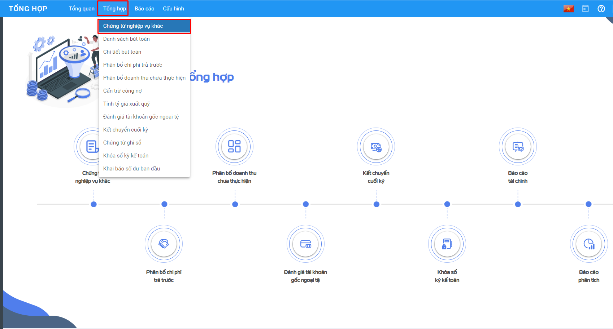

Hoặc thực hiện **Tìm kiếm** trực tiếp chức năng trên ô tìm kiếm chung của hệ thống

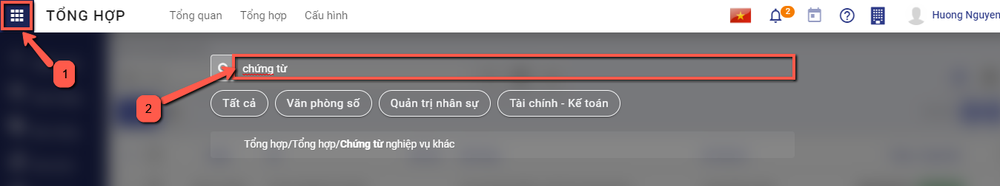

**Bước 2**: Nhấn nút **Tạo** trên chức năng để thực hiện thêm mới một chứng từ, thực hiện khai báo các thông tin cần thiết:

- Chọn Định khoản: Xác định ghi chép số tiền của một nghiệp vụ kinh tế phát sinh. Khoản ghi chép có thể là chi phí bả	o hiểm xã hội, chi phí tiền lương, ... Người dùng có thể bổ sung khoản ghi chép mới bằng cách vào **Danh mục/Định khoản tự động** 

  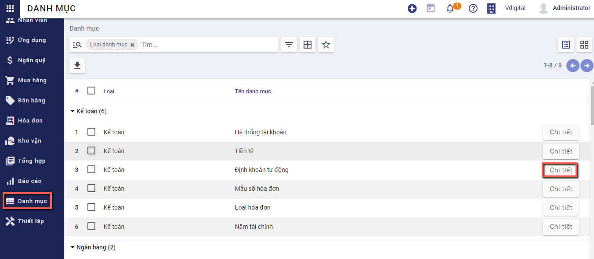

  Thực hiện nhập bổ sung định khoản bằng cách Nhấn **Tạo**, nhập các thông tin cần thiết gồm Tên, Loại chứng từ = **Khác**, tài khoản nợ, tài khoản có. Nhấn **Lưu** để lưu định khoản mới

  

- Nhập đơn vị, ngày hạch toán (Ngày thực hiện ghi sổ), số tiền cần thiết (Số tiền cho nghiệp vụ đang tạo), nội dung (Mô tả thông tin cho nghiệp vụ phát sinh)

- Sau mỗi lần chọn định khoản, hệ thống sẽ tự động sinh 2 dòng thông tin chi tiết tương ứng với số tiền và định khoản đã chọn. Người dùng có thể chọn nhiều định khoản trên cùng một chứng từ, hệ thống sẽ sinh tương ứng bấy nhiêu dòng chi tiết

  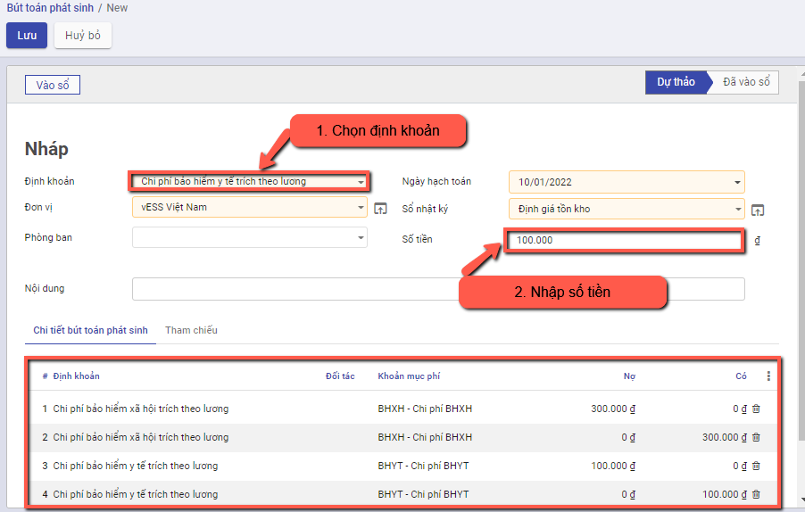

**Bước 3**: Nhấn **Lưu lại. ** 

Lưu ý:

- Người dùng có thể sửa lại số tiền theo từng định khoản bằng cách chọn lại từng định khoản trên thông tin chung và nhập lại số tiền
- Người dùng có thể xóa thông tin chi tiết bút toán phát sinh thừa bằng cách nhấn nút **Xóa**  tại góc phải trên mỗi dòng chi tiết 

**Bước 4**: Chọn **Vào sổ**  để ghi nhận đã hạch toán. 

Nếu không muốn ghi sổ một bút toán đã hạch toán thì chọn nút **đưa về dự thảo** 

**Bước 5** : Có thể in được chứng từ kế toán phản ánh nội dung nghiệp vụ kinh tế phát sinh bằng cách, chọn chứng từ cần in,  nhấn **In** và chọn mẫu chứng từ cần in.

**Bước 6**: Có thể tạo bút toán đảo ngược  bằng cách chọn chứng từ cần đảo ngược và đã ghi sổ, nhấn button **Bút toán đảo**

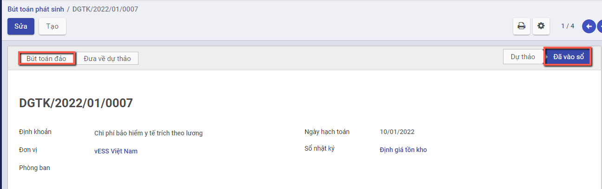

Một cửa sổ lựa chọn thông tin sẽ được hiện ra, chọn **Đảo ngược**

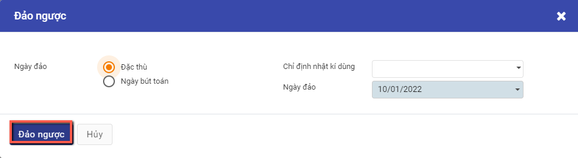

Hệ thống sẽ tự động sinh một chứng từ khác có thông tin giống với chứng từ gốc và thực hiện ghi sổ

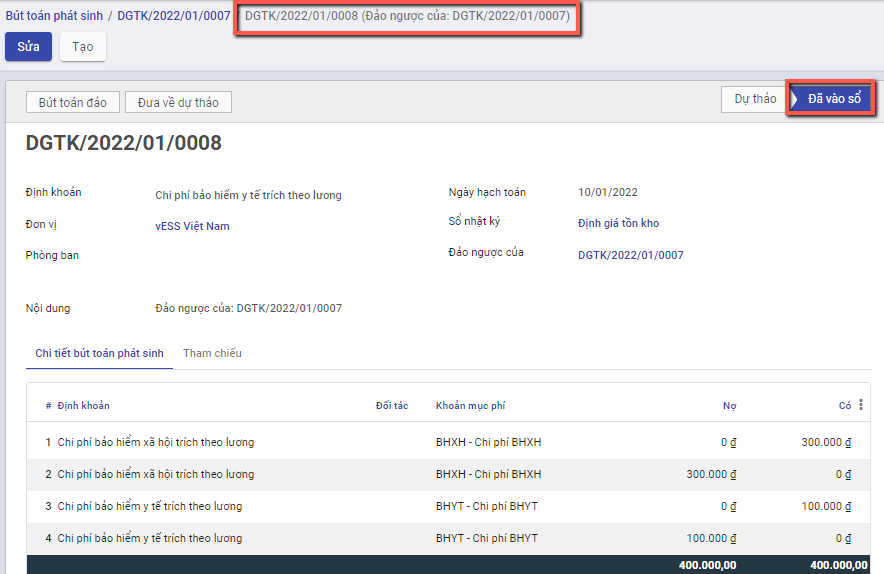

## *Danh sách bút toán*

### Mô tả nghiệp vụ

**Nghiệp vụ**

Chức năng cho phép người dùng xem toàn bộ các giao dịch phát sinh đã ghi sổ hiện có trên hệ thống

### **Hướng dẫn trên phần mềm**

Đối tượng thực hiện: Người dùng phần mềm

**Bước 1**: Vào phân hệ **Tổng hợp**, Chọn **Tổng hợp**, chọn **Danh sách bút toán** 

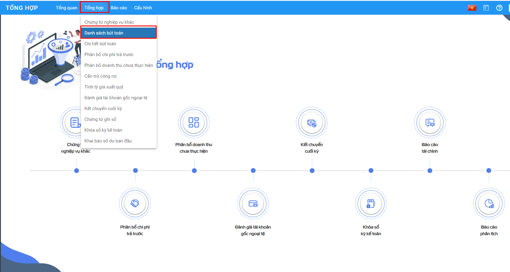

Hoặc thực hiện **Tìm kiếm** trực tiếp chức năng trên ô tìm kiếm chung của hệ thống

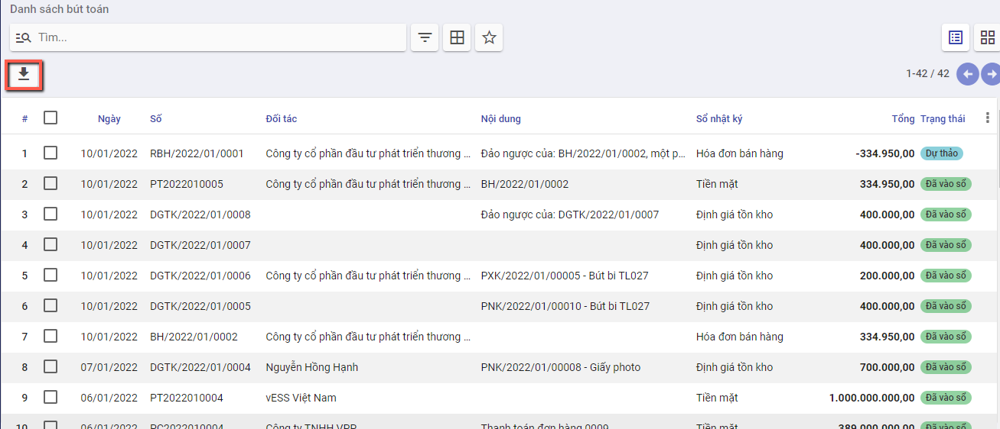

Thực hiện tải xuống toàn bộ bút toán bằng cách nhấn nút **Tải xuống**  trên danh sách

**Bước 2**: Thực hiện tìm kiếm một chứng từ bất kỳ bằng cách nhấn nút  **Tìm kiếm** 

Người dùng có thể lựa chọn tiêu chí để tìm kiếm có sẵn hoặc tự tạo cho mình một bộ tìm kiếm riêng biệt 

**Bước 3** : Có thể xem chi tiết bút toán của một chứng từ bằng cách kich chuột chọn vào chứng từ muốn xem.

## *Chi tiết bút toán*

### Mô tả nghiệp vụ

Chức năng cho phép người dùng xem toàn bộ các chi tiết bút toán ghi sổ hiện có trên hệ thống

### Hướng dẫn trên phần mềm

**Bước 1**: Vào phân hệ **Tổng hợp**, Chọn **Tổng hợp**, chọn **Chi tiết bút toán** 

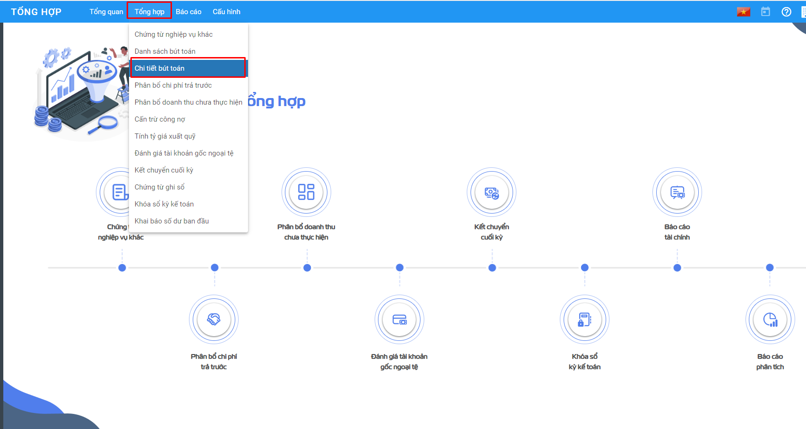

Hoặc thực hiện **Tìm kiếm** trực tiếp chức năng trên ô tìm kiếm chung của hệ thống

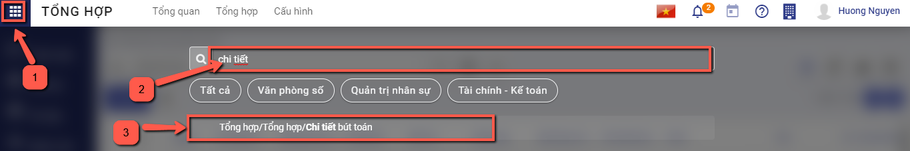

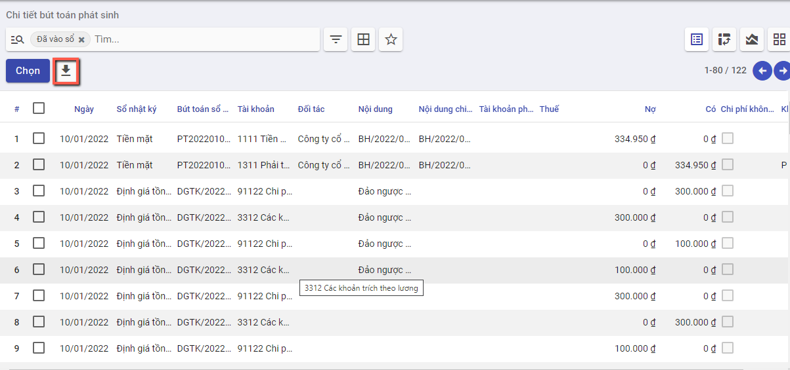

Thực hiện tải xuống toàn bộ bút toán bằng cách nhấn nút **Tải xuống**  trên danh sách

**Bước 2**: Thực hiện tìm kiếm một chứng từ bất kỳ bằng cách nhấn nút  **Tìm kiếm** 

Người dùng có thể lựa chọn tiêu chí để tìm kiếm có sẵn hoặc tự tạo cho mình một bộ tìm kiếm riêng biệt 

**Bước 3** : Có thể xem chi tiết bút toán của một chứng từ bằng cách kich chuột chọn vào chứng từ muốn xem.

## *Khai báo số dư ban đầu*

### Mô tả nghiệp vụ

**Nghiệp vụ**

Hướng dẫn việc khai báo thông tin Số dư đầu kỳ của Tài khoản và Số dư đầu kỳ theo từng Đối tượng.

Việc khai báo Số dư ban đầu thực hiện cho:

- Số dư tiền mặt
- Số dư tài khoản ngân hàng
- Công nợ khách hàng
- Công nợ nhà cung cấp
- Công nợ nhân viên
- Số dư tài khoản đầu kỳ khác

### **Hướng dẫn trên phần mềm**

#### Số dư đầu kỳ của Tài khoản Tiền mặt/Tiền ngân hàng

Hướng dẫn việc khai báo Số dư đầu kỳ của Tiền mặt Tài khoản ngân hàng

Đối tượng thực hiện: Người dùng phần mềm

### **Xem video hướng dẫn**

<iframe
    width="920"
    height="450"
    frameborder="0"
    allow="autoplay; encrypted-media; clipboard-write; gyroscope; picture-in-picture "
    allowfullscreen
    title="Module Tổng hợp - Khai báo số dư ban đầu - Số dư tiền mặt/Số dư tài khoản ngân hàng" 
    src="https://www.youtube.com/embed/L-yJgAFww_Q?list=PLcdARb5pnnj8jeyvyhaptnwL3sxxT_QaK"
></iframe>

**Bước 1**: Vào phân hệ **Tổng hợp**: Chọn tính năng tương ứng cần khai báo Số dư đầu kỳ cho Tài khoản

- **Số dư tiền mặt**: Khai báo Số dư đầu kỳ của Tài khoản Tiền mặt, theo Sổ kế toán

- **Số dư tài khoản ngân hàng**: Khai báo Số dư đầu kỳ của Tài khoản ngân hàng, theo Sổ kế toán

  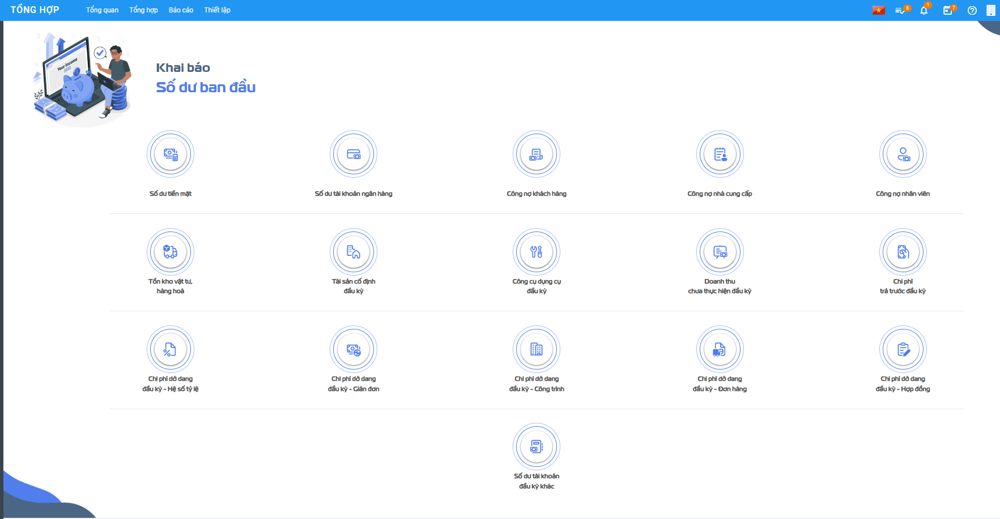

Thông tin màn hình của:

- **Số dư tiền mặt**

  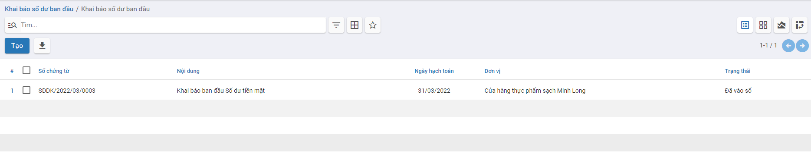

- **Số dư tài khoản ngân hàng**

  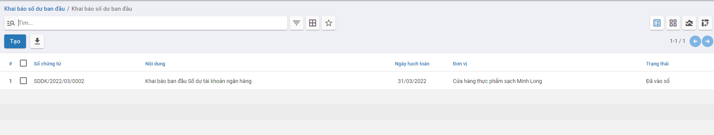

**Bước 2**: Nhấn nút  để khai báo thông tin

Các trường dữ liệu trên chức năng:

- Ngày hạch toán: Mặc định thông tin Ngày thực hiện tạo, có thể thay đổi được
- Nút **Lấy dữ liệu**: Khi nhấn nút **Lấy dữ liệu** hệ thống sẽ mặc định view các Sổ nhật ký tiền mặt/tiền ngân hàng (đã được khai báo tại Danh mục Sổ nhật ký) lên **tab Số dư đầu kỳ**
- Thông tin Sổ nhật ký: Để người dùng tự động chọn thông tin để Thêm dòng dữ liệu

**Bước 3**: Thực hiện chọn và Nhập thông tin dữ liệu

- Chọn Sổ nhật ký: Hệ thống tự động hiển thị thông tin Tài khoản gắn với Sổ nhật ký cùng thông tin Tiền tệ. 
- Nhập thông tin Số tiền: Thực hiện nhập Số dư đầu kỳ của Tài khoản. 

<u>***Lưu ý:***</u> 

- Thông tin Cột Nợ/Có được hiển thị để nhập giá trị căn cứ vào Thiết lập của từng Tài khoản được cấu hình tại chức năng **'Hệ thống tài khoản'**
  - Tài khoản có tính chất Dư Nợ: Cột Nợ sẽ cho phép nhập giá trị; Cột Có không nhập được giá trị
  - Tài khoản có tính chất Dư Có: Cột Có sẽ cho phép nhập giá trị; Cột Nợ không nhập được giá trị
  - Tài khoản Có tính chất Lưỡng tính: Cả cột Nợ và Có đều cho phép nhập giá trị

**Phần Khai báo tài khoản**

- **Với Số dư tiền mặt**

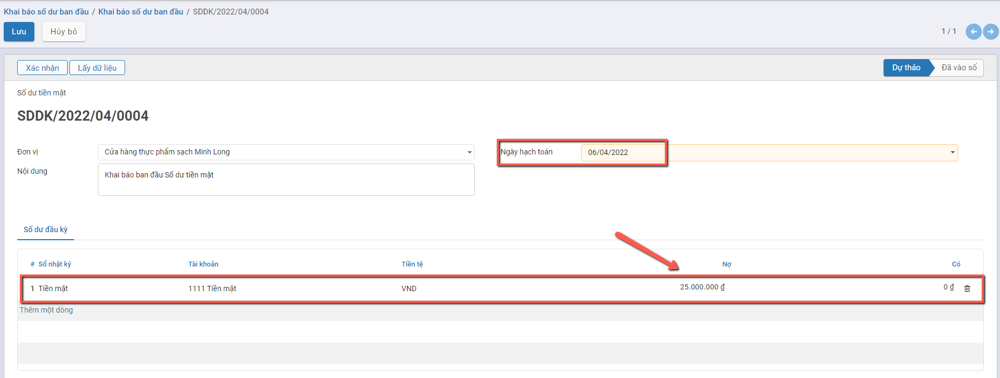

- **Với Số dư tài khoản ngân hàng**

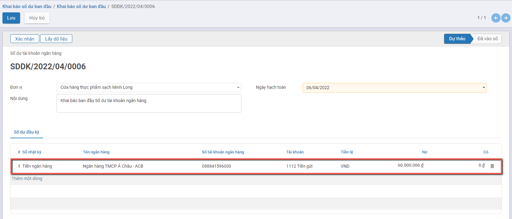

***Lưu ý:*** Nếu Người dùng không thấy hiển thị thông tin **Số tài khoản ngân hàng** cần kiểm tra lại việc khai báo của Sổ nhập ký Tiền ngân hàng tại **Danh mục Sổ nhật ký** và thực hiện bổ sung thông tin tại 'Tài khoản Ngân hàng'

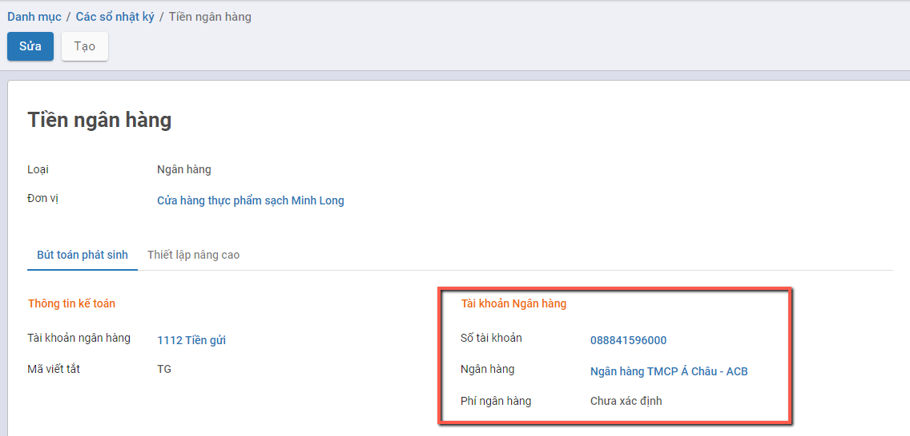

**Bước 4**: Người dùng Nhấn nút **Xác nhận** để ghi nhận thông tin Số dư đầu kỳ theo dữ liệu đã nhập.

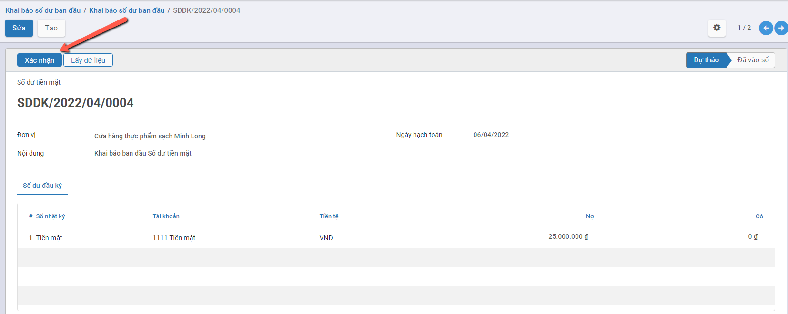

Thông tin Dữ liệu đã nhập được vào Sổ và dữ liệu lên bút toán

Muốn xem thông tin Bút toán: Người dùng nhấn nút **'Bút toán'**

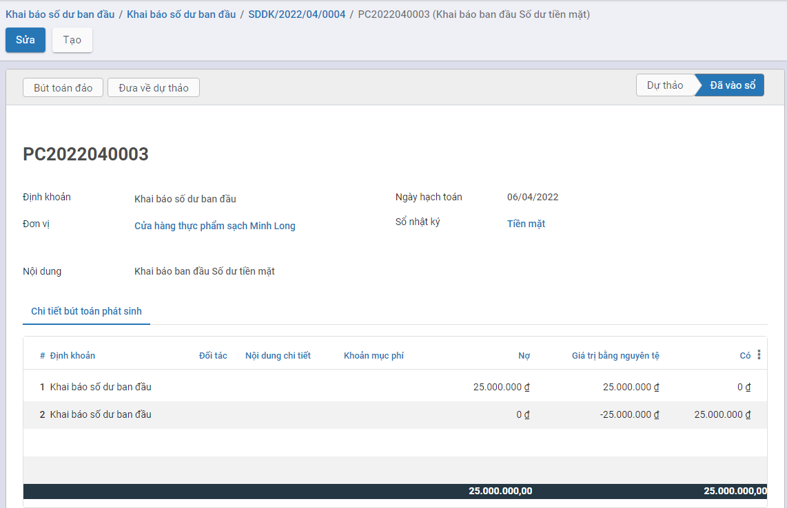

#### Số dư đầu kỳ của Tài khoản khác

Hướng dẫn việc khai báo Số dư đầu kỳ của Tài khoản khác

Đối tượng thực hiện: Người dùng phần mềm

**Xem video hướng dẫn**

<iframe
    width="920"
    height="450"
    frameborder="0"
    allow="autoplay; encrypted-media; clipboard-write; gyroscope; picture-in-picture "
    allowfullscreen
    title="Module Tổng hợp - Khai báo số dư ban đầu - Số dư tài khoản đầu kỳ khác" 
    src="https://www.youtube.com/embed/pzswpoQEoec?list=PLcdARb5pnnj8jeyvyhaptnwL3sxxT_QaK"
></iframe>

**Bước 1**: Vào phân hệ **Tổng hợp**: Chọn tính năng **Số dư tài khoản đầu kỳ khác**: Nhấn chọn thông tin **'Số dư tài khoản đầu kỳ khác'** trên Sơ đồ

Thông tin màn hình của: **Số dư tài khoản đầu kỳ khác**

**Bước 2**: Nhấn nút  để khai báo thông tin

Các trường dữ liệu trên chức năng:

- Ngày hạch toán: Mặc định thông tin Ngày thực hiện tạo, có thể thay đổi được
- Nút **Lấy dữ liệu**: Khi nhấn nút **Lấy dữ liệu** hệ thống sẽ mặc định hiển thị các Tài khoản con được khai báo trên hệ thống tại danh mục **Hệ thống tài khoản**

**Bước 3**: Thực hiện chọn và Nhập thông tin dữ liệu

- Chọn Sổ nhật ký: Hệ thống view các Sổ nhật ký được khai báo tại danh mục **Sổ nhật ký với Loại = Khác**. 
- Thực hiện Nhấn nút Thêm một dòng để bổ sung các tài khoản cần khai báo
- Nhập thông tin Số tiền: Căn cứ vào tính chất của Tài khoản để nhập Số dư bên Nợ **hoặc** Số dư bên Có. 

***Lưu ý:*** 

- Thông tin Cột Nợ/Có được hiển thị để nhập giá trị căn cứ vào Thiết lập của từng Tài khoản được cấu hình tại chức năng **'Hệ thống tài khoản'**
  - Tài khoản có tính chất Dư Nợ: Cột Nợ sẽ cho phép nhập giá trị; Cột Có không nhập được giá trị
  - Tài khoản có tính chất Dư Có: Cột Có sẽ cho phép nhập giá trị; Cột Nợ không nhập được giá trị
  - Tài khoản Có tính chất Lưỡng tính: Cả cột Nợ và Có đều cho phép nhập giá trị

Phần Khai báo tài khoản

**Bước 4**: Người dùng Nhấn nút **Xác nhận** để ghi nhận thông tin Số dư đầu kỳ theo dữ liệu đã nhập.

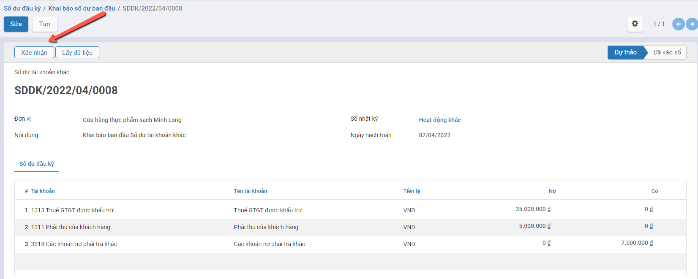

Thông tin Dữ liệu đã nhập được vào Sổ và dữ liệu lên bút toán

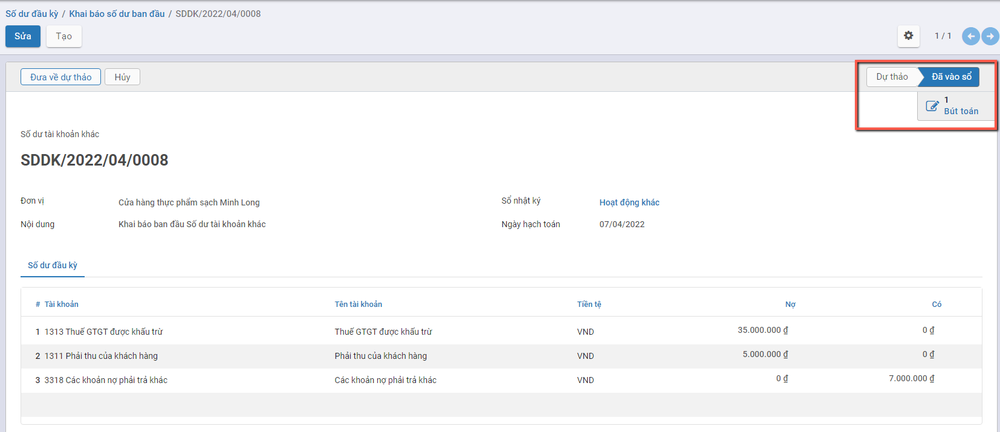

#### Công nợ khách hàng/Công nợ nhà cung cấp

Hướng dẫn việc khai báo Số dư đầu kỳ của Công nợ khách hàng và Công nợ nhà cung cấp

Đối tượng thực hiện: Người dùng phần mềm

**Xem video hướng dẫn**

<iframe
    width="920"
    height="450"
    frameborder="0"
    allow="autoplay; encrypted-media; clipboard-write; gyroscope; picture-in-picture "
    allowfullscreen
    title="Module Tổng hợp - Khai báo số dư ban đầu - Công nợ khách hàng/nhà cung cấp" 
    src="https://www.youtube.com/embed/nf-2ajEVHlA?list=PLcdARb5pnnj8jeyvyhaptnwL3sxxT_QaK"
></iframe>

**Bước 1**: Vào phân hệ **Tổng hợp**: Chọn tính năng tương ứng cần khai báo Số dư đầu kỳ cho đối tượng Khách hàng/Nhà cung cấp

- **Công nợ khách hàng**: Khai báo Số dư đầu kỳ của đối tượng Khách hàng, theo Sổ kế toán

- **Công nợ nhà cung cấp**: Khai báo Số dư đầu kỳ của đối tượng Nhà cung cấp, theo Sổ kế toán

  

Thông tin màn hình của:

- **Công nợ khách hàng**

  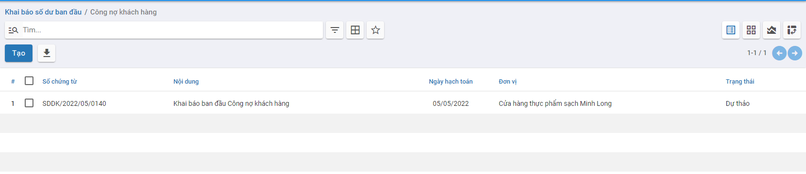

- **Công nợ nhà cung cấp**

  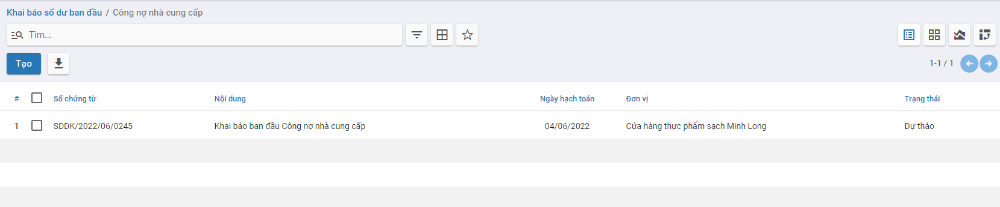

**Bước 2**: Nhấn nút  để khai báo thông tin

- **Màn hình khai báo Công nợ khách hàng**

  

- **Màn hình khai báo Công nợ nhà cung cấp**

  

Các trường dữ liệu trên chức năng:

- Ngày hạch toán: Mặc định thông tin Ngày thực hiện tạo, có thể thay đổi được
- Nút **Lấy dữ liệu**: Khi nhấn nút **Lấy dữ liệu** hệ thống sẽ mặc định view các Đối tượng là Khách hàng/Nhà cung cấp đang có theo Đơn vị (đã được khai báo tại Danh mục Khách hàng và Danh mục Nhà cung cấp) lên **tab Chi tiết**
- Thông tin tại Tab Chi tiết: Để người dùng tự động chọn thông tin từng Khách hàng/Nhà cung cấp để Thêm dòng dữ liệu

**Bước 3**: Thực hiện chọn và Nhập thông tin dữ liệu

- Thêm đối tác: Hệ thống tự động hiển thị thông tin Tài khoản phải thu/Phải trả đã được khai báo cho Khách hàng/Nhà cung cấp và thông tin Tiền tệ mặc định đang được sử dụng của Đơn vị. Thông tin **Tài khoản phải thu****/Phải trả** được khai báo tại **Danh mục Khách hàng và Danh mục Nhà cung cấp**: Tab **Lên hóa đơn**
- Nhập thông tin Số tiền: Thực hiện nhập Số dư công nợ của Khách hàng/Nhà cung cấp.
- Ngày đến hạn: Ghi nhận thông tin Ngày đến hạn của từng Công nợ. Nếu không nhập mặc định lấy theo Ngày hạch toán 

**Thông tin tài khoản phải thu/Phải trả**

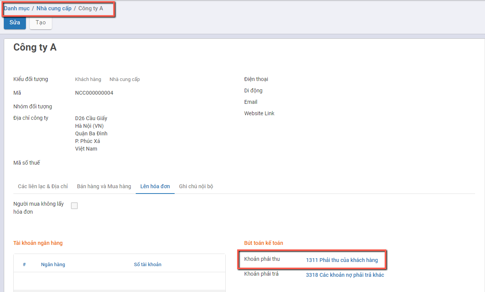

<u>***Lưu ý:***</u> 

- Thông tin Cột Nợ/Có được hiển thị để nhập giá trị căn cứ vào Thiết lập của từng Tài khoản được cấu hình tại chức năng **'Hệ thống tài khoản'**
  - Tài khoản có tính chất Dư Nợ: Cột Nợ sẽ cho phép nhập giá trị; Cột Có không nhập được giá trị
  - Tài khoản có tính chất Dư Có: Cột Có sẽ cho phép nhập giá trị; Cột Nợ không nhập được giá trị
  - Tài khoản Có tính chất Lưỡng tính: Cả cột Nợ và Có đều cho phép nhập giá trị

**Phần Khai báo tài khoản**

- **Dữ liệu được nhập cho Công nợ khách hàng**

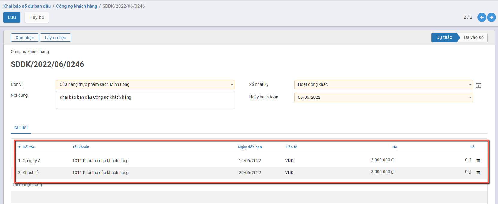

- **Dữ liệu được nhập cho Công nợ nhà cung cấp**

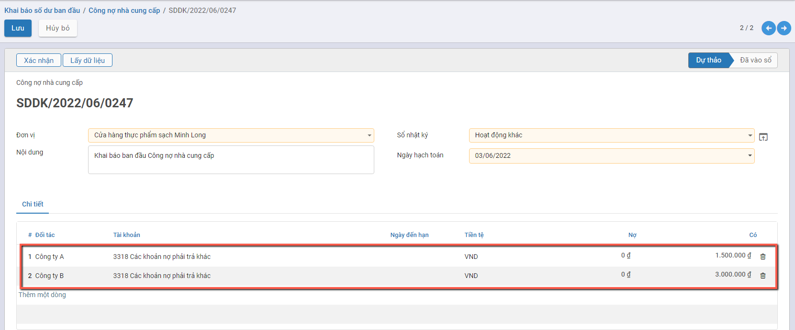

**Bước 4**: Người dùng Nhấn nút **Xác nhận** để ghi nhận thông tin Số dư đầu kỳ theo dữ liệu đã nhập.

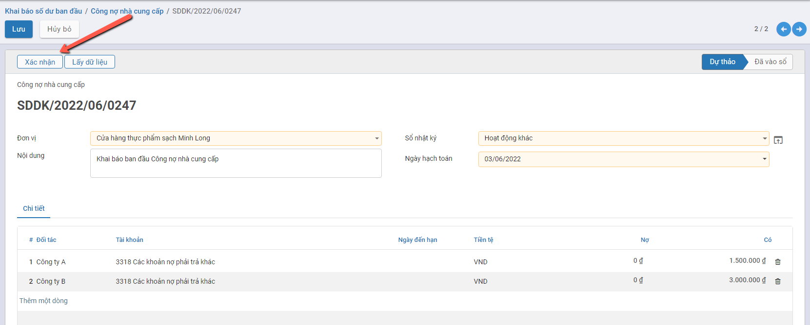

Thông tin Dữ liệu đã nhập được vào Sổ và dữ liệu lên bút toán

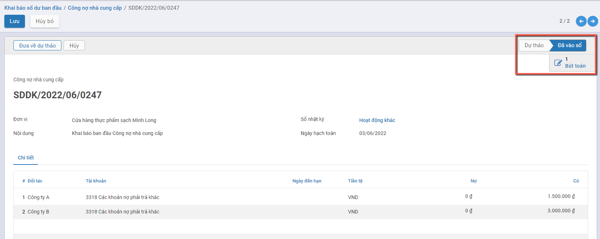

Muốn xem thông tin Bút toán: Người dùng nhấn nút **'Bút toán'**

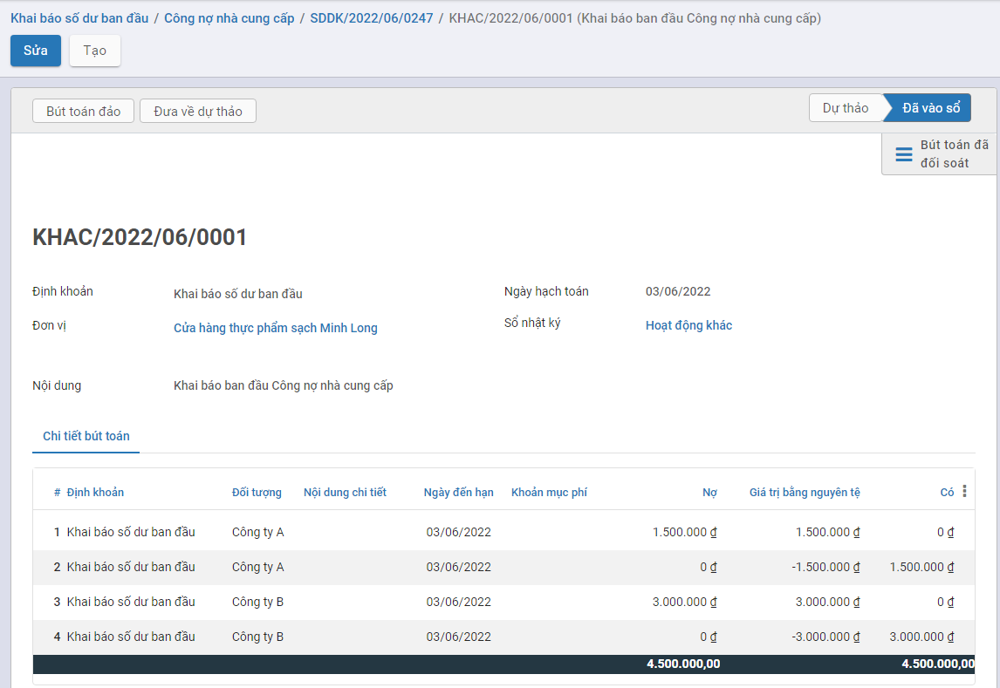

#### Công nợ Nhân viên

Hướng dẫn việc khai báo thông tin Công nợ nhân viên

Đối tượng thực hiện: Người dùng phần mềm

**Xem video hướng dẫn**

<iframe
    width="920"
    height="450"
    frameborder="0"
    allow="autoplay; encrypted-media; clipboard-write; gyroscope; picture-in-picture "
    allowfullscreen
    title="Module Tổng hợp - Khai báo số dư ban đầu - Công nợ nhân viên" 
    src="https://www.youtube.com/embed/vg5K_UOxfu4?list=PLcdARb5pnnj8jeyvyhaptnwL3sxxT_QaK"
></iframe>

**Bước 1**: Vào phân hệ **Tổng hợp**: Chọn tính năng tương ứng cần khai báo Số dư đầu kỳ: Chọn Công nợ nhân viên

Thông tin màn hình của: **Công nợ nhân viên**

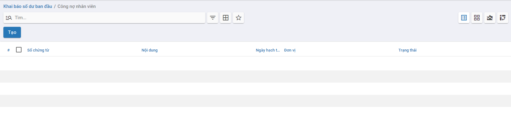

**Bước 2**: Nhấn nút  để khai báo thông tin

- **Màn hình khai báo Công nợ nhân viên**

Các trường dữ liệu trên chức năng:

- Ngày hạch toán: Mặc định thông tin Ngày thực hiện tạo, có thể thay đổi được
- Nút **Lấy dữ liệu**: Khi nhấn nút **Lấy dữ liệu** hệ thống sẽ mặc định view các Đối tượng là **Nhân viên** đang có theo Đơn vị (đã được khai báo tại Danh mục Nhân viên) lên **tab Chi tiết**
- Thông tin tại Tab Chi tiết: Để người dùng tự động chọn thông tin từng Nhân viên để Thêm dòng dữ liệu

**Bước 3**: Thực hiện chọn và Nhập thông tin dữ liệu

- Thêm đối tác: Hệ thống tự động hiển thị thông tin Tài khoản tương ứng là 1318 - Các khoản nợ phải thu khác. Người dùng có thể chọn lại thông tin Tài khoản khác.
- Nhập thông tin Số tiền: Thực hiện nhập Số dư công nợ của nhân viên.
- Ngày đến hạn: Ghi nhận thông tin Ngày đến hạn của từng Công nợ. Nếu không nhập mặc định lấy theo Ngày hạch toán 

<u>***Lưu ý:***</u> 

- Thông tin Cột Nợ/Có được hiển thị để nhập giá trị căn cứ vào Thiết lập của từng Tài khoản được cấu hình tại chức năng **'Hệ thống tài khoản'**
  - Tài khoản có tính chất Dư Nợ: Cột Nợ sẽ cho phép nhập giá trị; Cột Có không nhập được giá trị
  - Tài khoản có tính chất Dư Có: Cột Có sẽ cho phép nhập giá trị; Cột Nợ không nhập được giá trị
  - Tài khoản Có tính chất Lưỡng tính: Cả cột Nợ và Có đều cho phép nhập giá trị

**Phần Khai báo tài khoản**

- **Dữ liệu được nhập cho Công nợ Nhân viên**

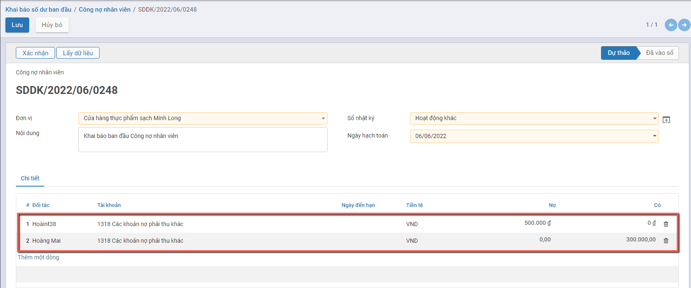

**Bước 4**: Người dùng Nhấn nút **Xác nhận** để ghi nhận thông tin Số dư đầu kỳ theo dữ liệu đã nhập.

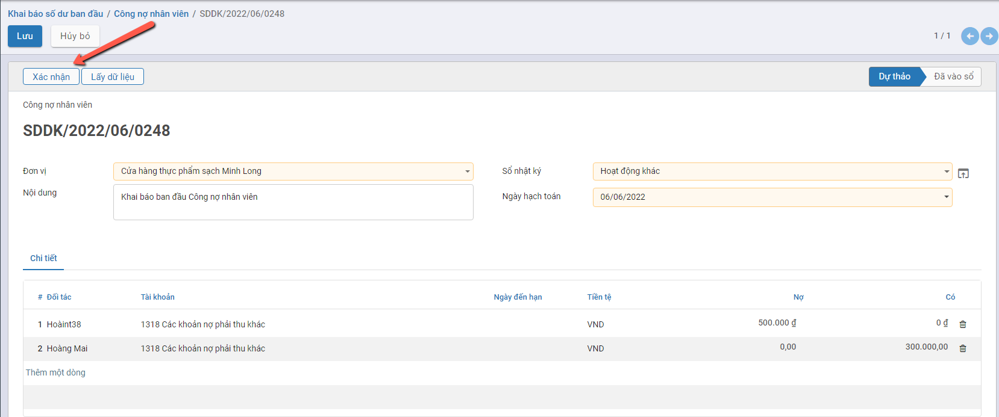

Thông tin Dữ liệu đã nhập được vào Sổ và dữ liệu lên bút toán

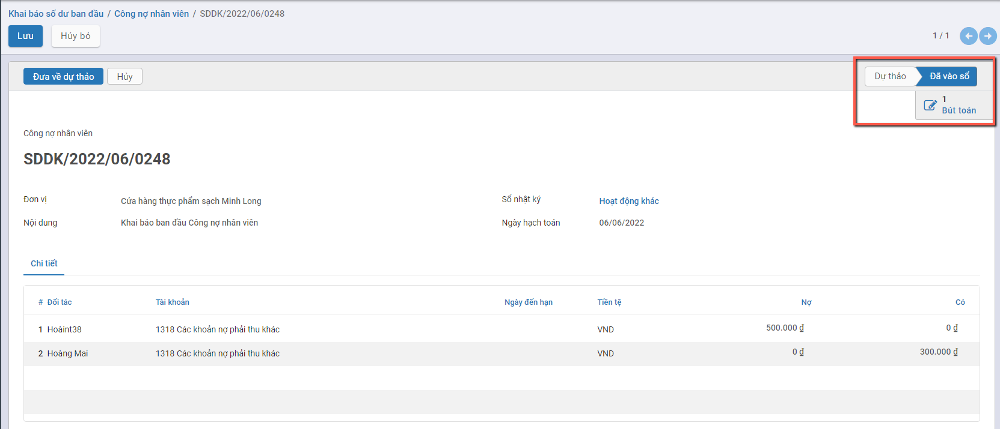

Muốn xem thông tin Bút toán: Người dùng nhấn nút **'Bút toán'**

#### **Tài sản cố định đầu kỳ**

Chức năng cho phép kế toán thực hiện Khai báo số dư ban đầu của Tài sản cố định đầu kỳ bao gồm : Giá trị tài sản và các thông tin liên quan đến khấu hao tài sản, Điều chỉnh tăng/giảm, Điều chuyển , Thanh lý, Tạm dừng hoặc Tiếp tục khấu hao

**Xem video hướng dẫn**

*[Xây dựng video hướng dẫn trên phần mềm, gồm đủ các luồng chức năng được mô tả bên dưới]*

Đối tượng thực hiện : Nhân viên kế toán 

**Hướng dẫn trên phần mềm**

**Các bước thực hiện** : 

**Bước 1** : Vào phân hệ **Tổng hợp** -> chọn **Khai báo số dư ban đầu** -> chọn **Tài sản cố định đầu kỳ** -> Nhất nút **Tạo**

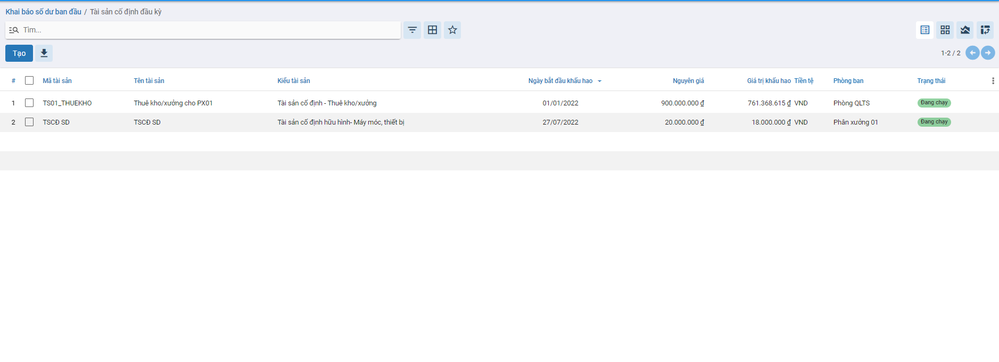**Bước 2** : Thực hiện khai báo thông tin tại tab thông tin chung và các tab khác

- Thông tin tài sản -> Sau khi chọn Kiểu tài sản -> Hệ thống tự động điền thông tin vào mục Phương pháp khấu hao và Thông tin kế toán
- Giá trị của tài sản ( Giá trị có thể được nhập tay hoặc chọn từ Chứng từ liên quan. Nếu được chọn từ Chứng từ liên quan, giá trị tài sản không được sửa )
- Giá trị không khấu hao -> Giá trị này sẽ được trừ đi khi thực hiện Khấu hao tài sản
- Nhập thông tin giá trị khấu hao, thời gian khấu hao đầu kỳ ( Nếu tài sản đã được sử dụng ngoài phần mềm )
- Nhập thông tin đối tượng được phân bổ tại tab Thiết lập phân bổ -> Hệ thống ghi nhận bút toán khấu hao cho từng đối tượng tương ứng với đầu tài khoản chi phí và tỷ lệ phân bổ đã khai báo

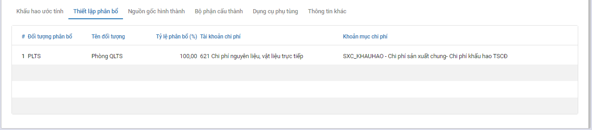

- Trường hợp người dùng chọn các chứng từ liên quan tới việc khấu hao Tài sản -> Chi tiết chứng từ được ghi nhận tại tab Nguồn gốc hình thành. Tài khoản của chứng từ sẽ ghi nhận thành Tài khoản khấu hao

**Bước 3** : Nhấn nút **Tính phân bổ** để tính khấu hao cho Tài sản -> Giá trị khấu hao của tài sản sẽ được ghi nhận tại tab Khấu hao ước tính

**Quản lý thông tin khấu hao**

**Thông tin khấu hao**

Kết quả khấu hao sẽ được trả về tại tab **Khấu hao ước tính**. Kết quả phụ thuộc vào các yếu tố dưới đây:

- [x] *Tài sản mới* hay *Tài sản đã được sử dụng*
- [x] Có tick *Theo ngày mua hay không*
- [x] Phương pháp khấu hao là Đường thẳng hay Giảm dần

+ Bản ghi khấu hao Tài sản có tick *Theo ngày mua* -> Giá trị khấu hao sẽ được tính từ ngày theo ngày mua
+ Bản ghi khấu hao Tài sản không tick *Theo ngày mua* -> Giá trị khấu hao sẽ được tính từ *Ngày hạch toán*
+ Trường hợp là *Tài sản đã được sử dụng* trước khi khai báo trên phần mềm-> Hệ thống thực hiện trừ Nguyên giá với Giá trị đã khấu hao (mục Thông tin khấu hao đầu kỳ) và Giá trị không khấu hao( nếu có ) để tính ra giá trị khấu hao, Số ngày tính khấu hao =Số ngày khấu hao - Số ngày đã được khấu hao bên ngoài

Sau khi thực hiện **Tính khấu hao** -> Hệ thống tính toán và hiển thị kết quả tại **Tab Khấu hao ước tính** gồm các thông tin: Mã phiếu, Ngày khấu hao, Giá trị khấu hao, Giá trị khấu hao lũy kế và Giá trị còn lại theo công thức của  PP Đường thẳng hoặc PP Giảm dần, Bút toán sổ nhật ký

*Khấu hao theo Phương pháp Đường thẳng*:

+ Căn cứ vào Tổng số ngày khấu hao, Giá trị khấu hao và Tính khấu hao theo ngày thực tế hay không -> Hệ thống thực hiện tính ra giá trị khấu hao cho 1 ngày
+ Từ giá trị khấu hao 1 ngày -> Tính ra giá trị khấu hao cho 1 tháng hoặc 1 năm

*Khấu hao theo Phương pháp Giảm dần:*

+ Căn cứ vào Tổng số ngày khấu hao, Giá trị khấu hao và Hệ số giảm dần -> Hệ thống thực hiện tính khấu hao năm
+ Từ giá trị khấu hao năm tính được sẽ tính ra giá trị khấu hao theo một tháng
+ Sau đó sẽ tính ra giá trị khấu hao theo một ngày ( giá trị khấu hao 1 ngày phụ thuộc vào người dùng chọn Tính khấu hao theo ngày thực tế hay không)
+ Đối với giá trị khấu hao từ năm thứ 2 sẽ tính dựa vào Giá trị đã khấu hao của năm thứ nhất và Hệ số giảm dần
+ Tại thời điểm **Tổng khấu hao giảm dần** của năm *nhỏ hơn* **Tổng khấu hao đường thẳng** của năm -> Hệ thống sẽ thực hiện tính khấu hao theo Phương pháp đường thẳng 

=> Khi người dùng nhấn nút **Xác nhận**, bút toán sẽ được ghi nhận tương ứng với các đầu tài khoản đã nhập tại tab thông tin chung. Bên cạnh đó dữ liệu được hạch toán sẽ tác động đến giá trị tiền tại Tab Thông tin chung như sau:

- Bút toán ghi nhận theo từng kỳ khấu hao
  - Ghi có Tài khoản chi phí tại Tab Thiết lập phân bổ
  - Ghi nợ Tài khoản Khấu hao

+ Giá trị tiền tại Tab Thông tin chung

  - Giá trị khấu hao= ( Giá trị gốc - Giá trị không khấu hao) của cả Tài sản gốc và các tài sản con điều chỉnh

  + Giá trị sổ sách = Giá trị gốc của tài sản gốc và các tài sản con điều chỉnh - Giá trị đã khấu hao (Được xác định ở những bản ghi khấu hao đã hạch toán + giá trị đã khấu hao đầu kỳ)

**Điều chỉnh Tăng giá trị/thời gian khấu hao của Tài sản**

Khi có nhu cầu Tăng giá trị/thời gian khấu hao của Tài sản cố định, Doanh nghiệp thực nhập các số liệu mong muốn để thay đổi về Giá trị của tài sản và Thời gian Khấu hao. Hệ thống sẽ tính toán và cập nhật lại vào các chứng từ liên quan

Đối tượng thực hiện : Nhân viên kế toán

*Các bước thực hiện:*

**Bước 1 :** Vào chức năng **Khai báo số dư đầu kỳ** -> Chọn **Tài sản cố định đầu kỳ** -> Chọn bản ghi Tài sản muốn *Tăng* 

**Bước 2 :** Nhấn vào **Tăng/giảm tài sản** 

**Bước 3 :** Người dùng nhập dữ liệu liên quan đến Lý do điều chỉnh , giá trị sau điều chỉnh và các tài khoản ghi nhận bút toán( nếu có sự thay đổi) trên màn hình Tăng/giảm Tài sản

+ Nếu muốn tăng giá trị khấu hao -> Người dùng thực hiện nhập *Giá trị sau điều chỉnh* tại mục *Giá trị điều chỉnh* > *Giá trị hiện tại* tại mục *Giá trị hiện tại*
+ Nếu muốn tăng thời gian khấu hao -> Người dùng thực hiện nhập *Thời gian khấu hao* tại mục *Giá trị điều chỉnh* > *Thời gian khấu hao* tại mục *Giá trị hiện tại*

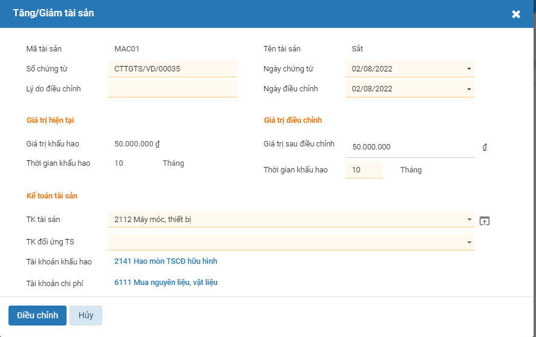

**Bước 4**: Nhấn nút *Điều chỉnh*

- Hệ thống kiểm tra nếu ngày điều chỉnh nằm trong kỳ khấu hao đã được hạch toán -> Hiển thị popup thông báo ' Không điều chỉnh vào kỳ đã hạch toán', và thoát khỏi màn hình Điều chỉnh tài sản
- Đối với bản ghi điều chỉnh thỏa mãn điều kiện sẽ làm thay đổi giá trị nguyên giá của Tài sản vào trường *Tổng giá trị tăng* và tác động đến sự thay đổi của *Tab* *Khấu hao ước tính* và *Sinh bút toán ghi nhận Tăng* *giá trị tài sản tương ứng* như sau:
  - Tab Khấu hao ước tính

    - Giá trị khấu hao được tính lại từ ngày điều chỉnh trên popup Tăng/giảm tài sản
    - Các bút toán khấu hao trước đó vẫn được giữ nguyên theo giá trị chưa ghi nhận Giảm
  - Bút toán ghi nhận Giảm giá trị tài sản
    - Ghi nợ Tài khoản Tăng tổng tài sản
    - Ghi có Tài khoản đối ứng

**Điều chỉnh Giảm giá trị/thời gian khấu hao của Tài sản**

Khi có nhu cầu Giảm giá trị/thời gian khấu hao của Tài sản cố định, Doanh nghiệp thực nhập các số liệu mong muốn để thay đổi về Giá trị của tài sản và Thời gian Khấu hao. Hệ thống sẽ tính toán và cập nhật lại vào các chứng từ liên quan

Đối tượng thực hiện : Nhân viên kế toán

Các thao tác thực hiện:

**Bước 1:** Vào chức năng **Khai báo số dư đầu kỳ** -> Chọn **Tài sản cố định đầu kỳ** -> Chọn bản ghi Tài sản muốn *Giảm* 

**Bước 2:** : Nhấn vào **Tăng/giảm tài sản** 

**Bước 3:** Người dùng nhập dữ liệu liên quan đến Lý do điều chỉnh , giá trị khấu hao và các tài khoản ghi nhận bút toán( nếu có sự thay đổi) trên màn hình Tăng/giảm Tài sản

+ Nếu muốn giảm giá trị khấu hao -> Người dùng thực hiện nhập *Giá trị khấu hao* tại mục *Thông tin điều chỉnh* < *Giá trị khấu hao* tại mục *Giá trị hiện tại*
+ Nếu muốn giảm thời gian khấu hao -> Người dùng thực hiện nhập *Thời gian khấu hao* tại mục *Thông tin điều chỉnh* < *Thời gian khấu hao* tại mục *Giá trị hiện tại

**Bước 4**: Nhấn nút **Điều chỉnh**

- Hệ thống kiểm tra nếu ngày điều chỉnh nằm trong kỳ khấu hao đã được hạch toán -> Hiển thị popup thông báo ' Không điều chỉnh vào kỳ đã hạch toán', và thoát khỏi màn hình Điều chỉnh tài sản
- Đối với bản ghi điều chỉnh thỏa mãn điều kiện sẽ làm thay đổi giá trị nguyên giá của Tài sản( = Nguyên giá của TS gốc- giá trị giảm ) và tác động đến sự thay đổi của *Tab* *Khấu hao ước tính* và *Sinh bút toán ghi nhận Tăng* *giá trị tài sản tương ứng* như sau:
  - Tab Khấu hao ước tính

    - Giá trị khấu hao được tính lại từ ngày điều chỉnh trên popup Tăng/giảm tài sản
    - Các bút toán khấu hao trước đó vẫn được giữ nguyên theo giá trị chưa ghi nhận Giảm
  - Bút toán ghi nhận Giảm giá trị tài sản
    - Ghi nợ Tài khoản Tăng tổng tài sản
    - Ghi có Tài khoản đối ứng

**Tạm dừng khấu hao Tài sản**

- Khi tài sản không còn nhu cầu theo dõi quản lý, Kế toán thực hiện Tạm dừng khấu hao tài sản đó trên phần mềm
- Hệ thống thực hiện ghi nhận và xử lý các dữ liệu liên quan trước và sau thời điểm Tạm dừng khấu hao

Đối tượng thực hiện : Nhân viên kế toán

*Các bước thực hiện:*

**Bước 1:** Vào chức năng **Khai báo số dư đầu kỳ** -> Chọn **Tài sản cố định đầu kỳ** -> Chọn bản ghi tài sản muốn *Tạm dừng khấu hao* ( Bản ghi ở trạng thái Đang chạy)

**Bước 2:** Nhấn vào *Tạm dừng khấu hao*

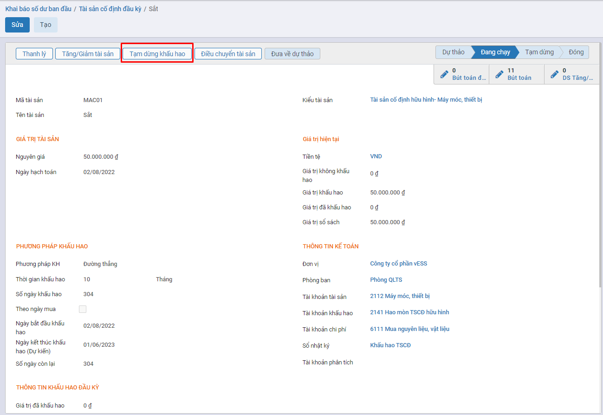

**Bước 3:** Nhập thông tin *Ngày tạm dừng*

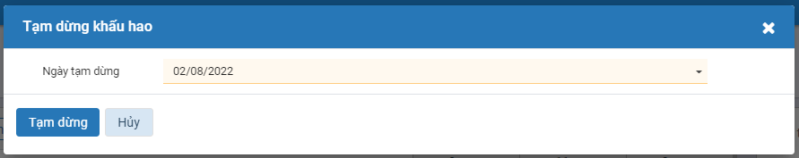

**Bước 4:** Nhấn nút *Tạm dừng*. Sau khi thực hiện Tạm dừng khấu hao, hệ thống giữ nguyên các bút toán đã được ghi nhận trước thời điểm tạm dừng. Các bút toán ghi nhận sau thời gian này sẽ bị xóa khỏi Tab Khấu hao ước tính

**Tiếp tục khấu hao Tài sản**

Trường hợp doanh nghiệp muốn tiếp tục Khấu hao tài sản đã được tạm ngừng. Hệ thống sẽ thực hiện ghi nhận các thay đổi và cập nhật thay đổi đó tới các Tab thông tin liên quan

Đối tượng thực hiện : Nhân viên kế toán

Các bước thực hiện:

**Bước 1:** Vào chức năng **Khai báo số dư đầu kỳ** -> Chọn **Tài sản cố định đầu kỳ** -> Chọn bản ghi tài sản muốn *Tiếp tục khấu hao* ( Bản ghi ở trạng thái Tạm dừng) 

**Bước 2:** Nhấn vào *Tiếp tục KH*

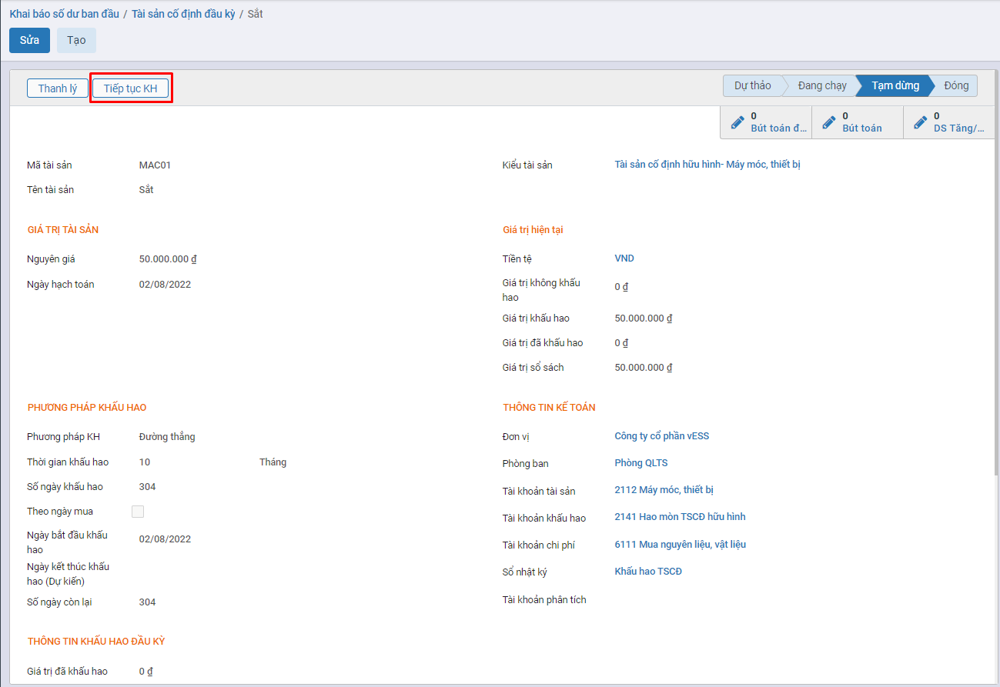

**Bước 3:** Nhập thông tin liên quan đến lý do điều chỉnh, giá trị, thời gian tại Giá trị điều chỉnh và các đầu tài khoản để ghi nhận sự thay đổi tại  *Tab* *Khấu hao ước tính* và Sinh bút toán ghi nhận điều chỉnh tài sản như điều chỉnh Tăng/giảm giá trị tài sản

**Bước 4:** Nhấn nút  *Điều chỉnh* . Sau đó, Tài sản sẽ được tiếp tục tính khấu hao kể từ Ngày điều chỉnh với giá trị khấu hao và thời gian khấu hao tại mục Thông tin điều chỉnh

**Điều chuyển Tài sản giữa các phòng ban**

**Mô tả:**

- Khi phát sinh nhu cầu điều chuyển TSCĐ giữa các phòng ban, bộ phận trong doanh nghiệp, Kế toán hoặc hoặc bộ phận có TSCĐ bị điều chuyển sẽ lập biên bản giao nhận TSCĐ.
- Căn cứ vào lệnh điều chuyển và biên bản giao nhận TSCĐ, kế toán ghi vào sổ TSCĐ

Đối tượng thực hiện : Nhân viên kế toán

Các bước thực hiện:

**Bước 1:** Vào chức năng **Khai báo số dư đầu kỳ** -> Chọn **Tài sản cố định đầu kỳ** -> Chọn bản ghi tài sản muốn *Điều chuyển tài sản* 

**Bước 2 :** Nhấn vào 'Điều chuyển tài sản'

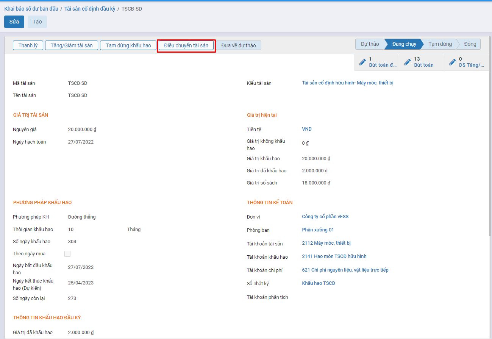

**Bước 3:** Người dùng nhập thông tin Người bàn giao, Người tiếp nhận và Ngày bàn giao

+ Tại tab Chi tiết điều chuyển, chọn Tài sản muốn điều chuyển và thông tin liên quan đến đơn vị điều chuyển và đơn vị tiếp nhận

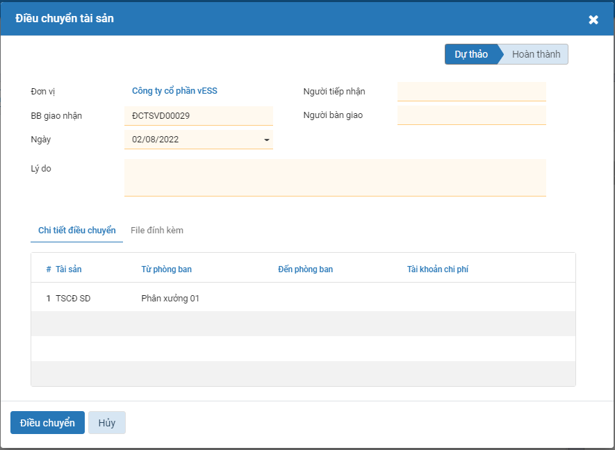

**Bước 4:** Chọn nút *Điều chuyển*

+ Sau khi thực hiện điều chuyển, Tài sản sẽ thuộc quyền sở hữu của đơn vị tiếp nhận điều chuyển
+ Đơn vị được điều chuyển tài sản và thông tin Tài khoản chi phí sẽ được tự động cập nhật vào trường Phòng ban và Tài khoản chi phí của bản ghi Khấu hao Tài sản. Các bút toán cũng sẽ ghi nhận lại tài khoản chi phí theo đơn vị được tiếp nhận TSCĐ

**Thanh lý tài sản**

- Khi doanh nghiệp có nhu cầu bán tài sản do hết khấu hao hoặc không có nhu cầu sử dụng, kế toán thực hiện thanh lý tài sản. 
- Căn cứ vào chứng từ liên quan kế toán ghi nhận vào sổ TSCĐ

Đối tượng thực hiện : Nhân viên kế toán

Các bước thực hiện:

**Bước 1:** Vào chức năng **Khai báo số dư đầu kỳ** -> Chọn **Tài sản cố định đầu kỳ** -> Chọn bản ghi tài sản muốn *Thanh lý* ->

**Bước 2 :** Nhấn vào *Thanh lý*

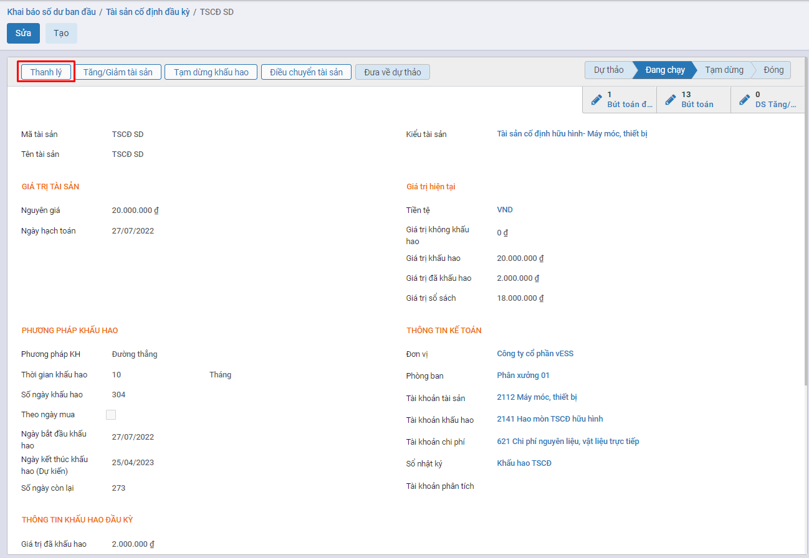

**Bước 3 :** Tại màn hình thanh lý, người dùng thực hiện các thao tác:

+ Chọn Tài sản muốn thanh lý
+ Chọn ngày chứng từ và hạch toán ghi nhận hành động thanh lý 
+ Chọn tài khoản xử lý giá trị còn lại 

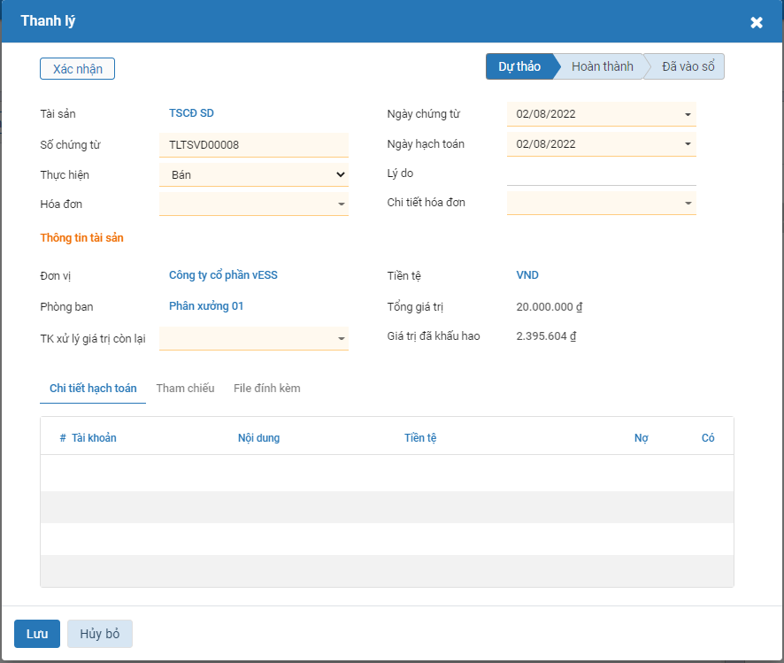

**Bước 4 :** Nhấn nút *Xác nhận*

+ Tài sản được quản lý tại danh mục Thanh lý
+ Bản ghi Tài sản sẽ ở trạng thái Đóng
+ Các bút toán ghi nhận khấu hao từ sau ngày hạch toán sẽ bị xóa khỏi Tab Khấu hao ước tính

#### **Công cụ dụng cụ đầu kỳ**

Chức năng cho phép kế toán thực hiện Khai báo số dư ban đầu của Tài sản cố định đầu kỳ bao gồm : Giá trị công cụ dụng cụ và các thông tin liên quan đến Phân bổ công cụ dụng cụ , Điều chỉnh tăng/giảm, Điều chuyển , Thanh lý, Tạm dừng hoặc Tiếp tục phân bổ

**Xem video hướng dẫn**

*[Xây dựng video hướng dẫn trên phần mềm, gồm đủ các luồng chức năng được mô tả bên dưới]*

Đối tượng thực hiện : Nhân viên kế toán 

**Hướng dẫn trên phần mềm**

**Mô tả:**

- Khi Doanh nghiệp ghi nhận phát sinh Công cụ dụng cụ do: mua sắm mới; do đầu tư xây dựng cơ bản hoàn thành; do thuê ..., kế toán thực hiện ghi nhận thông tin Công cụ dụng cụ lên hệ thống để quản lý.
- Công cụ dụng cụ được đánh mã và thực hiện khai báo, quản lý về ngguyên giá Công cụ dụng cụ, giá trị thanh lý có thể thu hồi, thời gian khấu hao, giá trị còn lại của Công cụ dụng cụ, hao mòn lũy kế

Đối tượng thực hiện : Nhân viên kế toán

Các bước thực hiện:

**Bước 1:** Vào phân hệ **Tổng hợp** -> chọn chức năng **Khai báo số dư đầu kỳ** -> Chọn **Công cụ dụng cụ đầu kỳ**

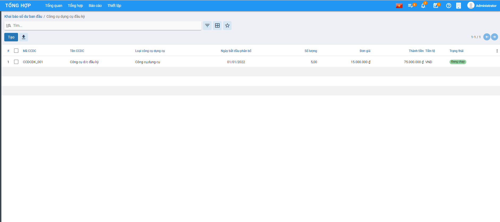

**Bước 2:** Nhấn nút *Tạo* để khai báo CCDC và các thông tin liên quan đến Phân bổ CCDC

**Bước 3:** Người dùng thực hiện nhập thông tin bao gồm:

+ Thông tin CCDC: Mã CCDC, Tên CCDC và Loại CCDC. Khi chọn Loại CCDC, hệ thống tự động điền các thông tin đã khai báo khi tạo mới Loại CCDC vào các mục *Thông tin phân bổ* và *Thông tin kế toán*

+ Thông tin về giá trị phân bổ: Ngày hạch toán, số lượng, giá/1 đơn vị 

+ Đối với CCDC đã sử dụng ngoài phần mềm, Người dùng cần khai báo thêm thông tin tại mục *Thông tin phân bổ đầu kỳ* ( bao gồm các thông tin về Số tiền đã phân bổ, thời gian đã phân bổ)

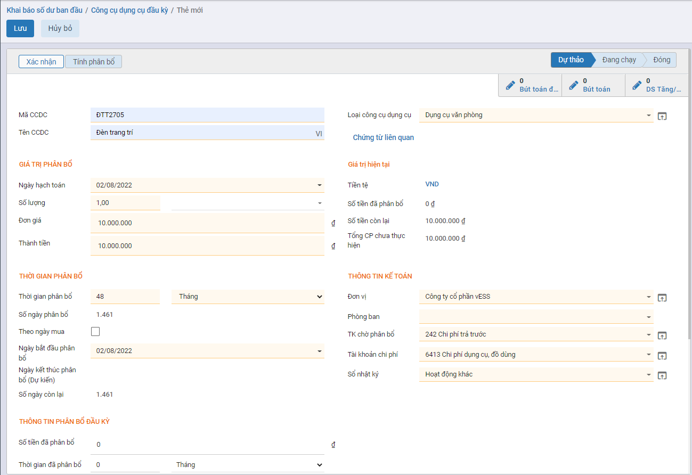

+ Nhập thông tin phòng ban sử dụng và số lượng CCDC tại tab *Phòng ban sử dụng* ( Số lượng không để trống và không vượt quá Tổng số lượng CCDC khai báo trên tab Thông tin chung )

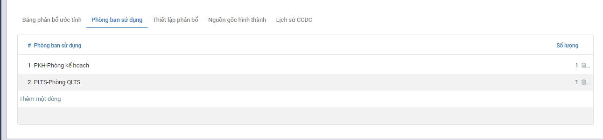

+ Sau khi nhập thông tin tab Phòng ban sử dụng -> hệ thống tự động fill Thông tin đối tượng và tỷ lệ % vào tab Thiết lập phân bổ. Người dùng chọn Tài khoản chi phí để ghi nhận bút toán phân bổ cho từng đối tượng khi thực hiện phân bổ CCDC

+ Trường hợp người dùng chọn các chứng từ liên quan đến CCDC sẽ được hiển thị chi tiết tại tab *Nguồn gốc hình thành* 

**Lưu ý:** Đối với CCDC đã sử dụng ngoài phần mềm, Người dùng cần khai báo thêm thông tin tại mục **Thông tin phân bổ đầu kỳ** ( bao gồm các thông tin về Số tiền đã phân bổ, thời gian đã phân bổ)

**Bước 4:** Nhấn nút Tính phân bổ để tính phân bổ cho CCDC -> Giá trị phân bổ của CCDC sẽ được ghi nhận tại tab *Bảng phân bổ ước tính*

**Quản lý thông tin Khấu hao**

*Thông tin khấu hao*

Kết quả khấu hao sẽ được trả về tại tab **Bảng phân bổ ước tính**. Kết quả phụ thuộc vào các yếu tố dưới đây:

- [x] Người dùng có chọn *Tính khấu hao theo ngày thực tế hay không*
- [x] *CCDC mới* hay *CCDC đã được sử dụng*
- [x] Có tick *Theo ngày mua hay không*

+ Nếu không tính theo ngày thực tế -> Hệ thống thực hiện tính phân bổ 1 tháng = 30 ngày, ngược lại sẽ tính theo ngày thực tế của tháng
+ Bản ghi phân bổ CCDC có tick *Theo ngày mua* -> Giá trị phân bổ sẽ được tính từ ngày theo ngày mua
+ Bản ghi phân bổ CCDC không tick *Theo ngày mua* -> Giá trị phân bổ  sẽ được tính từ *Ngày hạch toán*
+ Trường hợp là *CCDC đã được sử dụng* trước khi khai báo trên phần mềm-> Hệ thống thực hiện trừ Giá trị tiền đã phân bổ và Số ngày đã phân bổ ngoài phần mềm để tính ra giá trị phân bổ cho từng kỳ

*Khấu hao CCDC được tính toán dựa theo Phương pháp khấu hao Đường thẳng:*

+ Căn cứ vào Tổng số ngày khấu hao, Giá trị khấu hao và Tính khấu hao theo ngày thực tế hay không -> Hệ thống thực hiện tính ra giá trị khấu hao cho 1 ngày

+ Từ giá trị khấu hao 1 ngày -> Tính ra giá trị khấu hao cho 1 tháng hoặc 1 năm

+ Khi người dùng nhấn nút **Xác nhận**, hệ thống sẽ ghi nhận bút toán và cập nhật lại số liệu liên quan đến Giá trị tiền tại tab thông tin chung:

  - Bút toán ghi nhận theo từng kỳ khấu hao
    - Ghi có Tài khoản chi phí 
    - Ghi nợ Tài khoản chờ phân bổ

  + Giá trị tiền tại Tab Thông tin chung

    - Số tiền đã phân bổ tính dựa trên bút toán đã hạch toán và số tiền đã phân bổ ngoài phần mềm

    - Giá trị còn lại =Thành tiền - Số tiền đã phân bổ

**Điều chỉnh Tăng giá trị/thời gian khấu hao của Công cụ dụng cụ**

- Khi có nhu cầu đánh giá lại Công cụ dụng cụ, Doanh nghiệp thực hiện đánh giá theo trình tự của đơn vị và có Điều chỉnh khi có sự thay đổi về Giá trị của Công cụ dụng cụ và Thời gian Khấu hao
- Kế toán căn cứ vào Biên bản đánh giá sẽ thực hiện Cập nhật thông tin của Công cụ dụng cụ

Đối tượng thực hiện : Nhân viên kế toán

Các bước thực hiện:

**Bước 1:** Vào chức năng **Khai báo số dư đầu kỳ** -> Chọn **CCDC** -> Chọn bản ghi CCDC muốn điều chỉnh 

**Bước 2:** Chọn **Điều chỉnh CCDC**

**Bước 3:** Người dùng thực hiện nhập liệu liên quan đến

+ Số chứng từ
+ Ngày chứng từ
+ Lý do điều chỉnh
+ Giá trị điều chỉnh
  - Nếu muốn tăng giá trị phân bổ -> Người dùng thực hiện nhập *Số tiền còn lại* tại mục *Giá trị điều chỉnh* > *Số tiền còn lại* tại mục *Giá trị hiện tại*
  - Nếu muốn tăng thời gian phân bổ -> Người dùng thực hiện nhập *Thời gian phân bổ* tại mục *Giá trị điều chỉnh* > *Thời gian phân bổ* tại mục *Giá trị hiện tại*

+ Ngày điều chỉnh -> Hệ thống thực hiện ghi nhận thay đổi từ ngày này
+ Thông tin các đầu Tài khoản ghi nhận thay đổi tại mục *Giá trị điều chỉnh*

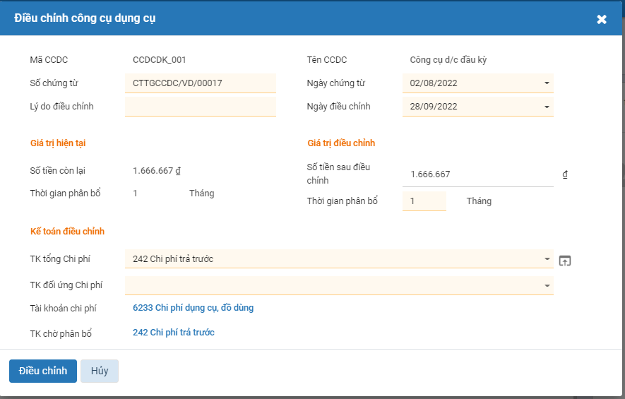

**Bước 4**: Nhấn nút *Điều chỉnh*

- Hệ thống kiểm tra nếu **ngày điều chỉnh** nằm trong kỳ khấu hao đã được hạch toán -> Hiển thị popup thông báo ' Không điều chỉnh vào kỳ đã hạch toán', và thoát khỏi màn hình Điều chỉnh CCDC

- Đối với bản ghi điều chỉnh thỏa mãn điều kiện sẽ ghi nhận giá trị Tăng CCDC vào trường **Tổng giá trị tăng** tại tab Thông tin chung và tác động đến *Bảng phân bổ ước tính* và *Sinh bút toán ghi nhận Tăng* *giá trị phân bổ tương ứng* như sau:

  - Tab Bảng phân bổ ước tính

    - Giá trị phân bổ được tính lại từ ngày điều chỉnh trên popup Điều chỉnh CCDC
    - Các bút toán phân bổ trước đó vẫn được giữ nguyên theo giá trị chưa ghi nhận Tăng

  - Bút toán ghi nhận Tăng giá trị CCDC

    - Ghi nợ Tài khoản đối ứng chi phí
    - Ghi có Tài khoản tăng tổng chi phí

**Điều chỉnh Giảm giá trị/thời gian khấu hao của Công cụ dụng cụ**

**Mô tả:**

- Khi có nhu cầu đánh giá lại Công cụ dụng cụ, Doanh nghiệp thực hiện đánh giá theo trình tự của đơn vị và có Điều chỉnh khi có sự thay đổi về Giá trị của Công cụ dụng cụ và Thời gian Khấu hao
- Kế toán căn cứ vào Biên bản đánh giá sẽ thực hiện Cập nhật thông tin của Công cụ dụng cụ

**Đối tượng thực hiện :** Nhân viên kế toán

**Các bước thực hiện:**

**Bước 1:** Vào chức năng **Kế toán CCDC** -> Chọn **CCDC** -> Chọn bản ghi CCDC muốn điều chỉnh -> Chọn **Điều chỉnh CCDC**

**Bước 2:** Chọn **Điều chỉnh CCDC**

**Bước 3:** Người dùng thực hiện nhập liệu các thông tin liên quan đến

+ Số chứng từ
+ Ngày chứng từ
+ Lý do điều chỉnh
+ Giá trị điều chỉnh
  - Nếu muốn giảm giá trị phân bổ -> Người dùng thực hiện nhập *Số tiền còn lại* tại mục *Giá trị điều chỉnh* < *Số tiền còn lại* tại mục *Giá trị hiện tại*
  - Nếu muốn giảm thời gian phân bổ -> Người dùng thực hiện nhập *Thời gian phân bổ* tại mục *Giá trị điều chỉnh* < *Thời gian phân bổ* tại mục *Giá trị hiện tại*

+ Ngày điều chỉnh -> Hệ thống thực hiện ghi nhận thay đổi từ ngày này
+ Thông tin các đầu Tài khoản ghi nhận thay đổi tại mục *Kế toán điều chỉnh*

**Bước 3**: Nhấn nút *Điều chỉnh*

- Hệ thống kiểm tra nếu **ngày điều chỉnh** nằm trong kỳ khấu hao đã được hạch toán -> Hiển thị popup thông báo ' Không điều chỉnh vào kỳ đã hạch toán', và thoát khỏi màn hình Điều chỉnh CCDC

- Đối với bản ghi điều chỉnh thỏa mãn điều kiện sẽ làm thay đổi giá trị Thành tiền ( Thành tiền của CCDC gốc - giá trị giảm) và tác động đến tab*Bảng phân bổ ước tính* và *Sinh bút toán ghi nhận *Giảm giá trị CCDC* như sau:

  - Tab Bảng phân bổ ước tính

    Giá trị khấu hao được **tính từ ngày điều chỉnh** trên popup Điều chỉnh CCDC. Bút toán đã ghi nhận giá trị tại các kỳ trước đó không bị ảnh hưởng

  - Bút toán ghi nhận Giảm giá trị tài sản

    - Ghi có Tài khoản đối ứng chi phí
    - Ghi nợ Tài khoản tăng tổng chi phí

**Tạm dừng khấu hao Công cụ dụng cụ**

**Mô tả:**s

- Khi CCDC không còn nhu cầu theo dõi quản lý, Kế toán thực hiện Tạm dừng khấu hao CCDC đó trên phần mềm
- Hệ thống sẽ thực hiện ghi nhận và xử lý các dữ liệu liên quan trước và sau thời điểm Tạm dừng khấu hao

**Đối tượng thực hiện :** Nhân viên kế toán

**Các bước thực hiện:**

**Bước 1:** Vào chức năng **Kế toán CCDC** -> Chọn **CCDC** -> Chọn bản ghi CCDC muốn *Tạm dừng phân bổ* 

**Bước 2:** Nhấn nút **Tạm dừng phân bổ**

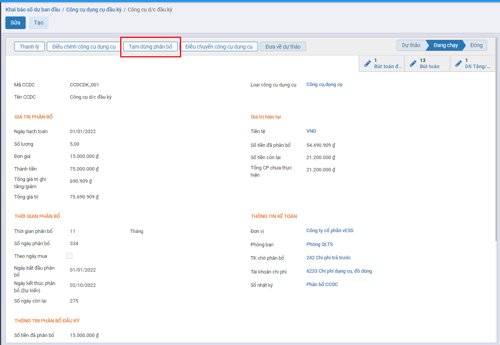

**Bước 3:** Nhập ngày tạm dừng phân bổ

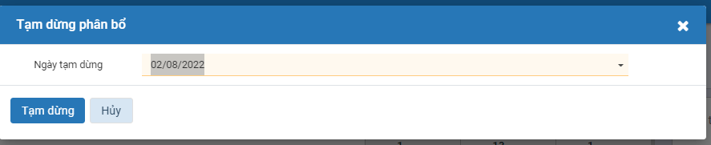

**Bước 4:** Nhấn nút *Tạm dừng*. Sau khi thực hiện Tạm dừng khấu hao, hệ thống giữ nguyên các bút toán đã được ghi nhận trước thời điểm tạm dừng. Các bút toán ghi nhận sau thời gian này sẽ bị xóa khỏi Tab Bảng phân bổ ước tính

**Tiếp tục phân bổ Công cụ dụng cụ**

- Trường hợp doanh nghiệp muốn tiếp tục Khấu hao tài sản đã được tạm ngừng. Hệ thống sẽ thực hiện ghi nhận các thay đổi và cập nhật thay đổi đó tới các Tab thông tin liên quan

Đối tượng thực hiện : Nhân viên kế toán

Các bước thực hiện:

**Bước 1:** Vào chức năng **Khai báo số dư ban đầu** -> Chọn **Công cụ dụng cụ đầu kỳ** -> Chọn bản ghi CCDC muốn *Tiếp tục phân bổ* 

**Bước 2:**Chọn **Tiếp tục phân bổ**

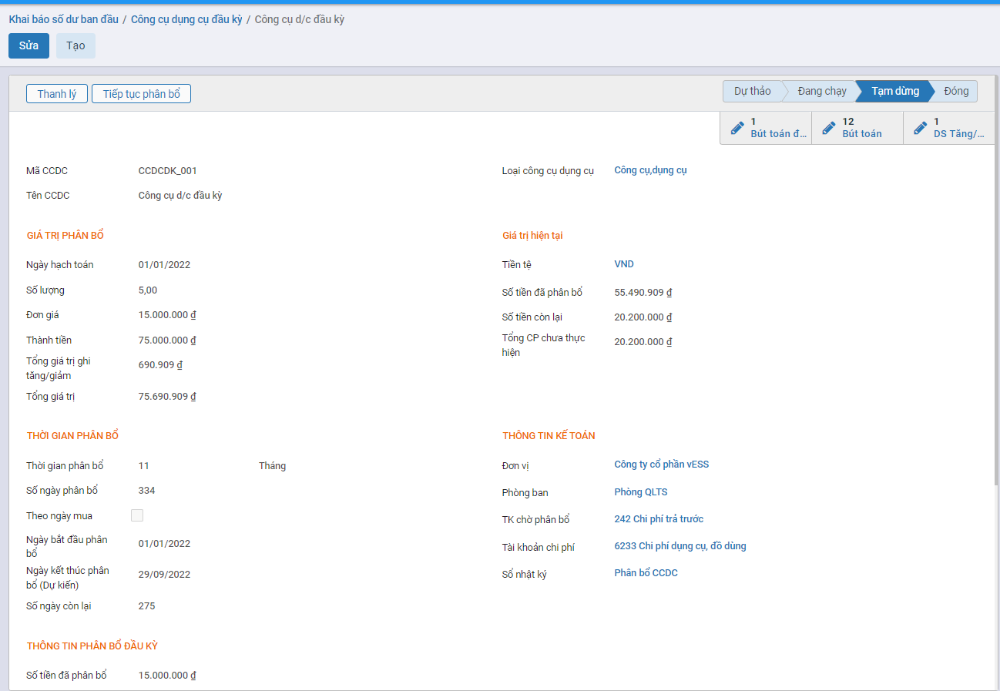

**Bước 3**: Nhập thông tin liên quan đến giá trị, thời gian tại mục Giá trị điều chỉnh và các đầu tài khoản để ghi nhận sự thay đổi tại Kế toán điều chỉnh

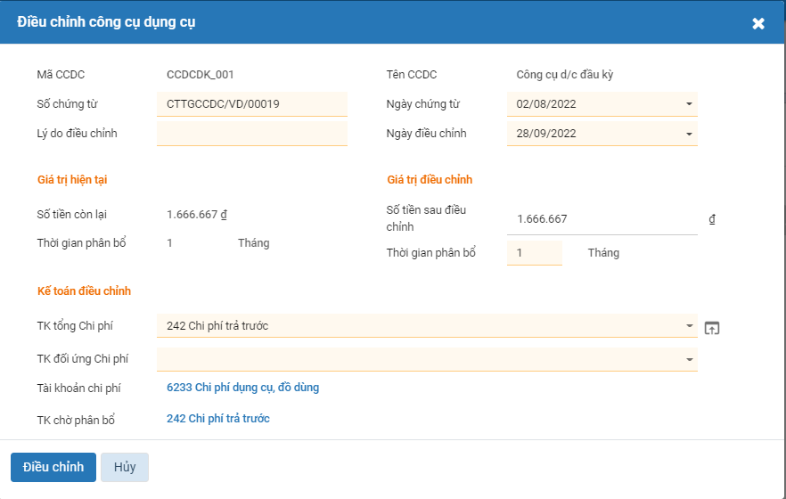

**Bước 4:** Nhấn nút  *Điều chỉnh* . Sau đó, CCDC sẽ được tiếp tục tính khấu hao kể từ Ngày điều chỉnh với giá trị khấu hao và thời gian khấu hao tại mục Giá trị điều chỉnh

**Điều chuyển Công cụ dụng cụ giữa các phòng ban**

- Khi phát sinh nhu cầu điều chuyển CCDC giữa các phòng ban, bộ phận trong doanh nghiệp, Kế toán hoặc hoặc bộ phận có CCDC bị điều chuyển sẽ lập biên bản giao nhận CCDC.
- Căn cứ vào lệnh điều chuyển và biên bản giao nhận CCDC, kế toán ghi vào sổ CCDC

Đối tượng thực hiện : Nhân viên kế toán

Các bước thực hiện:

**Bước 1:** Vào chức năng **Khai báo số dư ban đầu** -> Chọn **CCDC** -> Chọn bản ghi CCDC muốn *Điều chuyển*

**Bước 2:**  Nhấn vào *Điều chuyển công cụ dụng cụ*

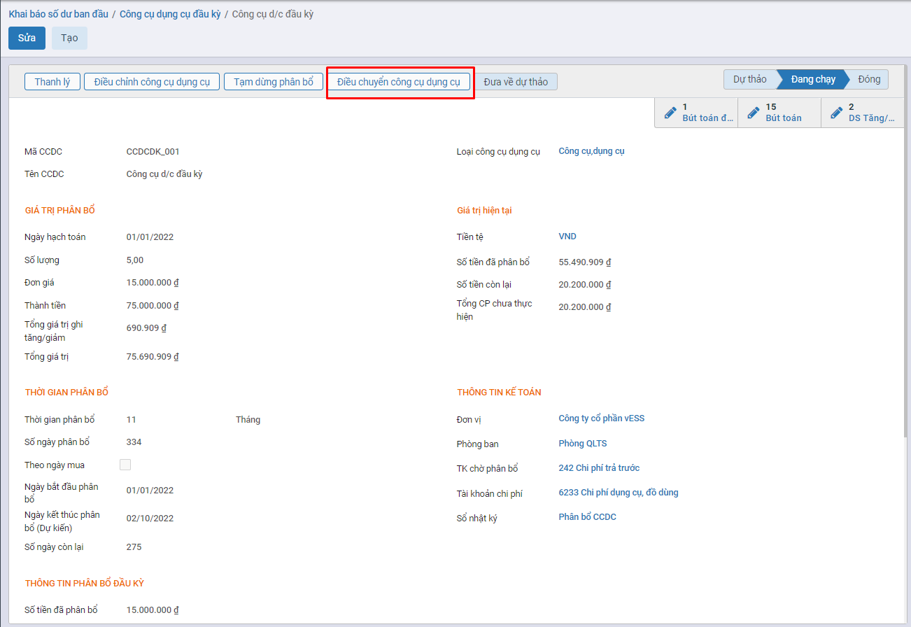

**Bước 3**: Người dùng nhập thông tin Người bàn giao, Người tiếp nhận và Ngày bàn giao,...

+ Tại tab CCDC điều chuyển, chọn CCDC muốn điều chuyển,thông tin liên quan đến đơn vị điều chuyển, đơn vị tiếp nhận, số lượng sử dụng và số lượng điều chuyển

  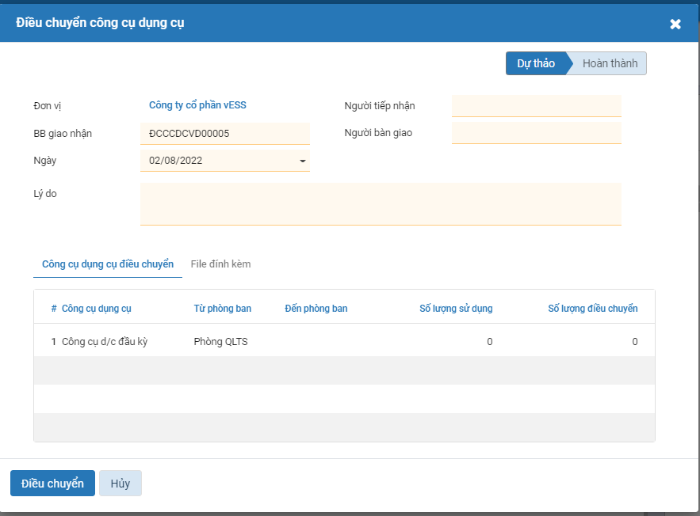

**Bước 3:** Chọn nút *Điều chuyển*

+ Sau khi thực hiện điều chuyển, CCDC sẽ thuộc quyền sở hữu của đơn vị tiếp nhận điều chuyển
+ Số lượng CCDC giữa Đơn vị điều chuyển và Đơn vị được điều chuyển tới sẽ có sự thay đổi
+ Thông tin ccdc điều chuyển được lưu trên danh sách điều chuyển ccdc

**Thanh lý Công cụ dụng cụ**

- Khi doanh nghiệp có nhu cầu bán Công cụ dụng cụ do hết khấu hao hoặc không có nhu cầu sử dụng, kế toán thực hiện thanh lý Công cụ dụng cụ. 
- Căn cứ vào chứng từ liên quan kế toán ghi nhận vào sổ CCDC

Đối tượng thực hiện : Nhân viên kế toán

Các bước thực hiện:

**Bước 1:**  Vào chức năng **Khai báo số dư ban đầu** -> Chọn **CCDC** -> Chọn **Công cụ dụng cụ** -> Chọn bản ghi CCDC muốn *Thanh lý* 

**Bước 2:** Nhấn vào **Thanh lý**

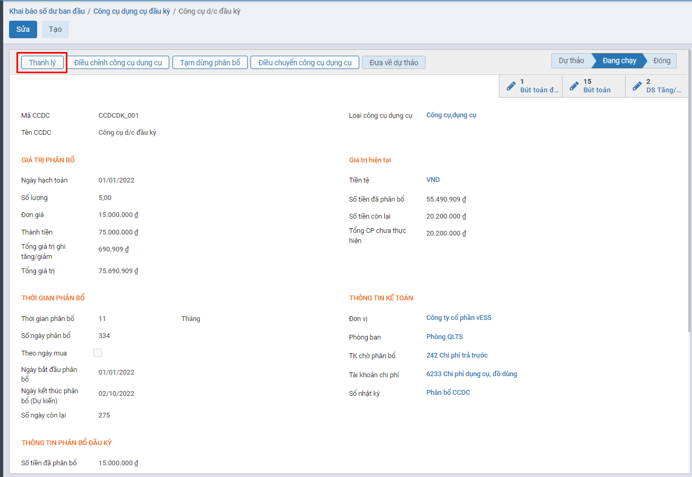

**Bước 3**: Tại màn hình thanh lý, người dùng thực hiện các thao tác:

+ Chọn CCDC muốn thanh lý

+ Chọn ngày chứng từ và hạch toán ghi nhận hành động thanh lý 

+ Chọn phòng ban và số lượng CCDC thanh lý 

+ Chọn tài khoản xử lý giá trị còn lại

  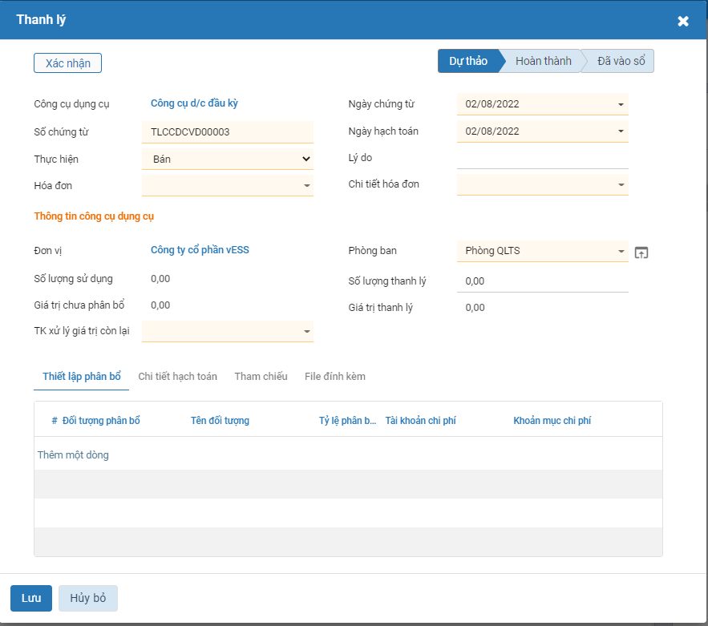

**Bước 4:** Nhấn nút *Xác nhận*

+ Hệ thống thực hiện hạch toán số tiền thanh lý ccdc theo số lượng và ngày chứng từ

+ Thực hiện cập nhật giá trị phân bổ vào tab Phân bổ ước tính ở CCDC gốc.

+ Thông tin ccdc thanh lý được lưu trên danh sách thanh lý ccdc

#### Doanh thu chưa được thực hiện đầu kỳ

**Mô tả nghiệp vụ**

Chức năng cho phép kế toán thực hiện Khai báo số dư ban đầu của Doanh thu chưa thực hiện đầu kỳ bao gồm : Giá trị phân bổ và các thông tin liên quan đến Phân bổ ước tính , Điều chỉnh phân bổ hoặc Lưu mẫu phân bổ

**Xem video hướng dẫn**

*[Xây dựng video hướng dẫn trên phần mềm, gồm đủ các luồng chức năng được mô tả bên dưới]*

Đối tượng thực hiện : Nhân viên kế toán 

**Hướng dẫn trên phần mềm**

Các bước thực hiện : 

**Bước 1** : Vào phân hệ **Tổng hợp** -> chọn **Khai báo số dư ban đầu** -> chọn **Doanh thu chưa thực hiện đầu kỳ** -> Nhất nút **Tạo**

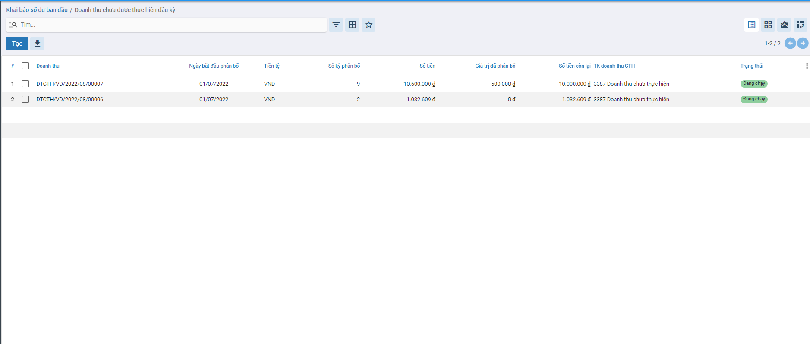

**Bước 2** : Thực hiện khai báo thông tin tại tab thông tin chung và các tab khác

- Mẫu phân bổ -> Sau khi chọn Mẫu phân bổ -> Hệ thống tự động điền thông tin vào mục Thời gian phân bổ và Thông tin kế toán

- Giá trị phân bổ ( Giá trị có thể được nhập tay hoặc chọn từ Chứng từ liên quan. Nếu được chọn từ Chứng từ liên quan, giá trị phân bổ không được sửa )

- Giá trị đã phân bổ -> Giá trị này sẽ được trừ đi khi thực hiện Tính phân bổ

- Nhập thông tin giá trị phân bổ, thời gian phân bổ đầu kỳ ( Nếu thông tin phân bổ đầu kỳ đã được sử dụng ngoài phần mềm )

  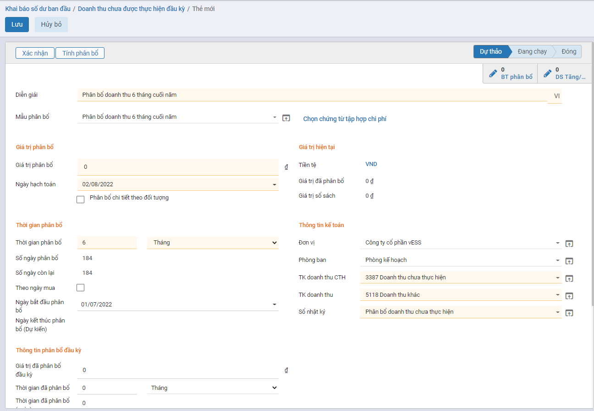

- Trường hợp người dùng chọn các chứng từ liên quan tới việc phân bổ -> Chi tiết chứng từ được ghi nhận tại tab *Nguồn gốc hình thành*. Tài khoản của chứng từ sẽ ghi nhận thành Tài khoản khấu hao

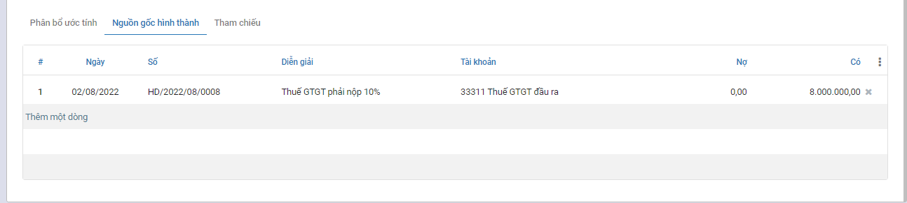

**Bước 3** : Nhấn nút **Tính phân bổ** để tính phân bổ -> Giá trị phân bổ sẽ được ghi nhận tại tab Phân bổ ước tính

**Quản lý thông tin phân bổ**

Thông tin phân bổ

Kết quả phân bổ sẽ được trả về tại tab **Phân bổ ước tính**. Kết quả phụ thuộc vào các yếu tố dưới đây:

- [x] Có tick *Theo ngày mua hay không*
- [x] Có tick *Phân bổ chi tiết theo đối tượng*

Sau khi thực hiện **Tính khấu hao** -> Hệ thống tính toán và hiển thị kết quả tại **Tab Khấu hao ước tính** gồm các thông tin: Mô tả,  Ngày phân bổ, Giá trị phân bổ trong kỳ , Giá trị phân bổ lũy kế và Giá trị còn lại và Bút toán sổ nhật ký

Sau khi tick *Phân bổ chi tiết theo đối tượng* -> Hệ thống hiển thị tab *Thiết lập phân bổ* gồm các thông tin : Đối tượng phân bổ , tên đối tượng phân bổ, tỷ lệ phân bổ và tài khoản doanh thu

=> Khi người dùng nhấn nút **Xác nhận**, bút toán sẽ được ghi nhận tương ứng với các đầu tài khoản đã nhập tại tab thông tin chung. Bên cạnh đó dữ liệu được hạch toán sẽ tác động đến giá trị tiền tại Tab Thông tin chung như sau:

- Bút toán ghi nhận theo từng kỳ khấu hao
  - Ghi nợ Tài khoản CTH tại Tab Thông tin kế toán
  - Ghi có Tài khoản doanh thu 

+ Giá trị tiền tại Tab Thông tin chung

  - Giá trị phân bổ= ( Giá trị gốc - Giá trị không phân bổ)của cả Tài sản gốc và các tài sản con điều chỉnh

  + Giá trị sổ sách = Giá trị gốc phân bổ - Giá trị đã phân bổ (Được xác định ở những bản ghi phân bổ đã hạch toán + giá trị đã phân bổ đầu kỳ)

**Điều chỉnh Tăng giá trị/thời gian phân bổ**

Khi có nhu cầu Tăng giá trị/thời gian phân bổ , Doanh nghiệp thực nhập các số liệu mong muốn để thay đổi về Giá trị số tiền còn lại và Thời gian Phân bổ. Hệ thống sẽ tính toán và cập nhật lại vào các chứng từ liên quan

Đối tượng thực hiện : Nhân viên kế toán

Các bước thực hiện:

**Bước 1 :** Vào chức năng **Khai báo số dư đầu kỳ** -> Chọn **Doanh thu chưa được thực hiện đầu kỳ** -> Chọn bản ghi Doanh thu phân bổ muốn *Tăng* 

**Bước 2 :** Nhấn vào *Điều chỉnh phân bổ*

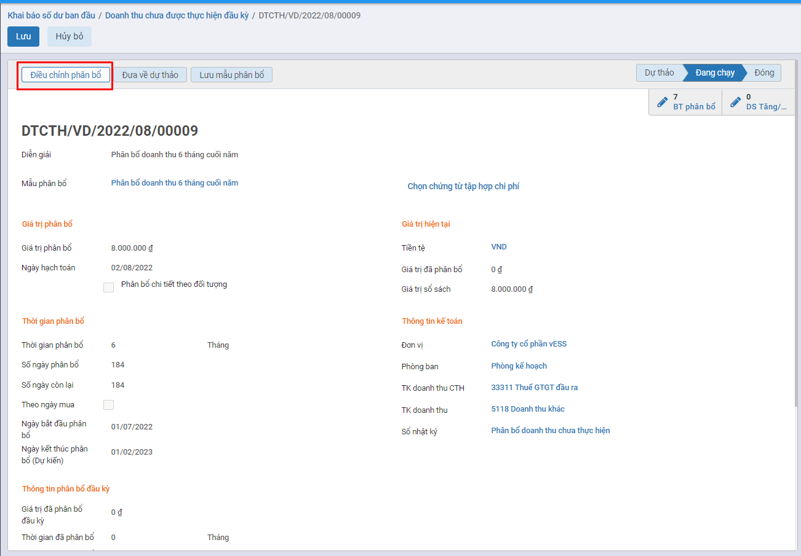

**Bước 3 :** Người dùng nhập dữ liệu liên quan đến Lý do điều chỉnh , số tiền còn lại và các tài khoản ghi nhận bút toán( nếu có sự thay đổi) trên màn hình Điều chỉnh phân bổ

+ Nếu muốn tăng giá trị phân bổ -> Người dùng thực hiện nhập *Số tiền còn lại* tại mục *Giá trị điều chỉnh* > *Giá trị hiện tại* 
+ Nếu muốn tăng thời gian khấu hao -> Người dùng thực hiện nhập *Thời gian phân bổ* tại mục *Giá trị điều chỉnh* > *Thời gian phân bổ* hiện tại

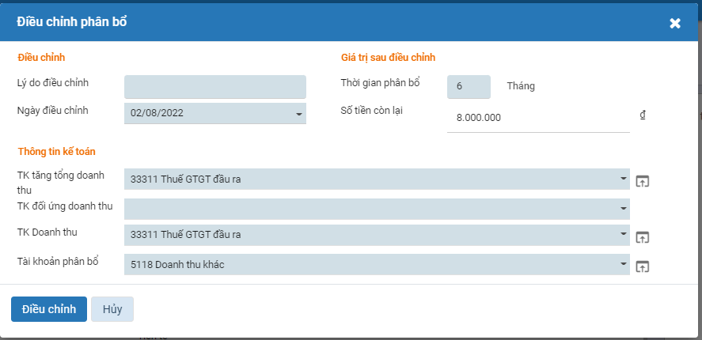

**Bước 4**: Nhấn nút *Điều chỉnh*

- Hệ thống kiểm tra nếu ngày điều chỉnh nằm trong kỳ khấu hao đã được hạch toán -> Hiển thị popup thông báo ' Không điều chỉnh vào kỳ đã hạch toán', và thoát khỏi màn hình Điều chỉnh phân bổ
- Đối với bản ghi điều chỉnh thỏa mãn điều kiện sẽ làm thay đổi giá trị  Phân bổ vào trường *Tổng giá trị* và tác động đến sự thay đổi của *Tab* *Phân bổ ước tính* và *Sinh bút toán ghi nhận Tăng* *giá trị phân bổ tương ứng* như sau:
  - Tab Phân bổ ước tính

    - Giá trị Phân bổ được tính lại từ ngày điều chỉnh trên popup Điều chỉnh phân bổ
    - Các bút toán khấu hao trước đó vẫn được giữ nguyên theo giá trị chưa ghi nhận Tăng
  - Bút toán ghi nhận Tăng giá trị phân bổ
    - Ghi có Tài khoản Tăng tổng phân bổ
    - Ghi nợ Tài khoản đối ứng

**Điều chỉnh Giảm giá trị/thời gian phân bổ**

Khi có nhu cầu Giảm giá trị/thời gian khấu hao của Tài sản cố định, Doanh nghiệp thực nhập các số liệu mong muốn để thay đổi về Giá trị của tài sản và Thời gian Khấu hao. Hệ thống sẽ tính toán và cập nhật lại vào các chứng từ liên quan

Đối tượng thực hiện : Nhân viên kế toán

Các thao tác thực hiện:

**Bước 1 :** Vào chức năng **Khai báo số dư đầu kỳ** -> Chọn **Doanh thu chưa được thực hiện đầu kỳ** -> Chọn bản ghi Doanh thu phân bổ muốn *Giảm* 

**Bước 2 :** Nhấn vào *Điều chỉnh phân bổ*

**Bước 3:** Người dùng nhập dữ liệu liên quan đến Lý do điều chỉnh , giá trị khấu hao và các tài khoản ghi nhận bút toán( nếu có sự thay đổi) trên màn hình Tăng/giảm Tài sản

+ Nếu muốn tăng giá trị phân bổ -> Người dùng thực hiện nhập *Số tiền còn lại* tại mục *Giá trị điều chỉnh* < *Giá trị hiện tại* 
+ Nếu muốn tăng thời gian khấu hao -> Người dùng thực hiện nhập *Thời gian phân bổ* tại mục *Giá trị điều chỉnh* < *Thời gian phân bổ* hiện tại

**Bước 4**: Nhấn nút **Điều chỉnh**

- Hệ thống kiểm tra nếu ngày điều chỉnh nằm trong kỳ khấu hao đã được hạch toán -> Hiển thị popup thông báo ' Không điều chỉnh vào kỳ đã hạch toán', và thoát khỏi màn hình Điều chỉnh tài sản
- Đối với bản ghi điều chỉnh thỏa mãn điều kiện sẽ làm thay đổi giá trị Phân bổ vào trường *Tổng giá trị* ( = Nguyên giá Phân bổ- giá trị giảm ) và tác động đến sự thay đổi của *Tab* *Khấu hao ước tính* và *Sinh bút toán ghi nhận Tăng* *giá trị tài sản tương ứng* như sau:
  - Tab Khấu hao ước tính

    - Giá trị khấu hao được tính lại từ ngày điều chỉnh trên popup Tăng/giảm tài sản
    - Các bút toán khấu hao trước đó vẫn được giữ nguyên theo giá trị chưa ghi nhận Giảm
  - Bút toán ghi nhận Giảm giá trị tài sản
    - Ghi có Tài khoản Tăng tổng tài sản
    - Ghi nợ Tài khoản đối ứng

**Lưu mẫu phân bổ**

Khi có nhu cầu lưu trữ các thông tin phân bổ đã thực hiện , Doanh nghiệp thực hiện lưu mẫu phân bổ cho lần khai báo sau

Đối tượng thực hiện : Nhân viên kế toán

Các thao tác thực hiện:

**Bước 1:** Vào chức năng **Khai báo số dư đầu kỳ** -> Chọn **Doanh thu chưa được thực hiện đầu kỳ** -> Chọn bản ghi Doanh thu phân bổ chưa thực hiện đầu kỳ muốn *Lưu* 

**Bước 2:** Nhấn vào *Lưu mẫu phân bổ*

**Bước 3 :** Nhấn vào Đồng ý 

- Hệ thống hiển thị thông tin Mẫu phân bổ vừa lưu bao gồm : Diễn giải , tab thông tin Thời gian phân bổ , tab thông tin Kế toán của bản ghi phân bổ vừa thực hiện

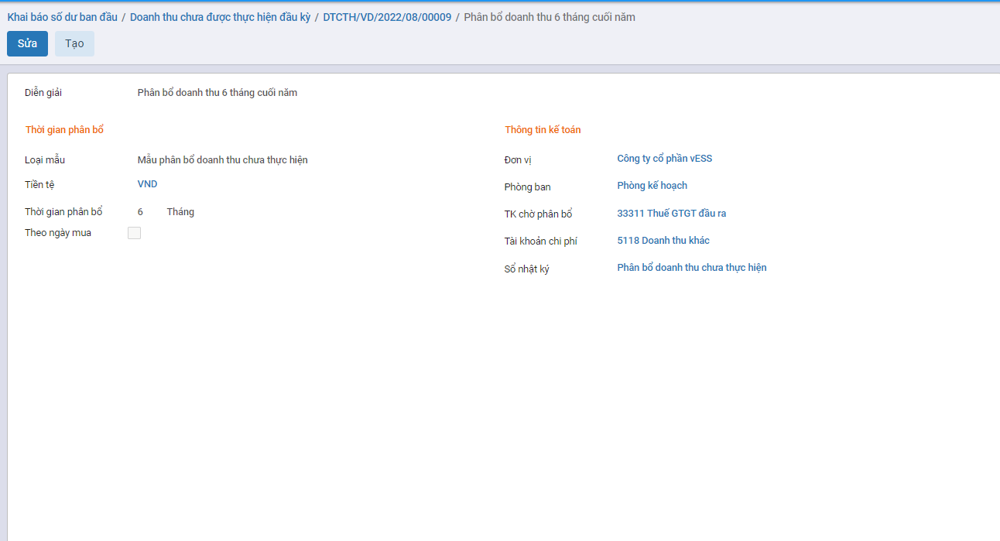

#### Chi phí trả trước đầu kỳ

**Mô tả nghiệp vụ**

Chức năng cho phép kế toán thực hiện Khai báo số dư ban đầu của Chi phí trả trước đầu kỳ bao gồm : Giá trị phân bổ và các thông tin liên quan đến Phân bổ ước tính , Điều chỉnh phân bổ hoặc Lưu mẫu phân bổ

**Xem video hướng dẫn**

*[Xây dựng video hướng dẫn trên phần mềm, gồm đủ các luồng chức năng được mô tả bên dưới]*

Đối tượng thực hiện : Nhân viên kế toán 

**Hướng dẫn trên phần mềm**

Các bước thực hiện : 

**Bước 1** : Vào phân hệ **Tổng hợp** -> chọn **Khai báo số dư ban đầu** -> chọn **Chi phí trả trước đầu kỳ** -> Nhất nút **Tạo**

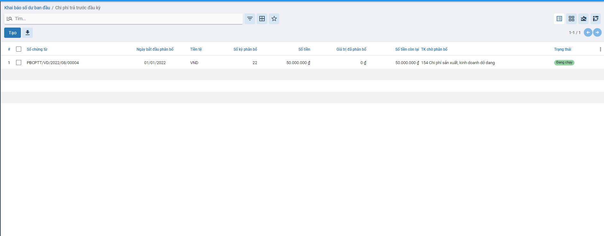

**Bước 2** : Thực hiện khai báo thông tin tại tab thông tin chung và các tab khác

- Mẫu phân bổ -> Sau khi chọn Mẫu phân bổ -> Hệ thống tự động điền thông tin vào mục Thời gian phân bổ và Thông tin kế toán
- Giá trị phân bổ ( Giá trị có thể được nhập tay hoặc chọn từ Chứng từ liên quan. Nếu được chọn từ Chứng từ liên quan, giá trị phân bổ không được sửa )
- Giá trị đã phân bổ -> Giá trị này sẽ được trừ đi khi thực hiện Tính phân bổ
- Nhập thông tin giá trị phân bổ, thời gian phân bổ đầu kỳ ( Nếu có thông tin phân bổ đầu kỳ đã được sử dụng ngoài phần mềm )

- Trường hợp người dùng chọn các chứng từ liên quan tới việc phân bổ -> Chi tiết chứng từ được ghi nhận tại tab Nguồn gốc hình thành. Tài khoản của chứng từ sẽ ghi nhận thành Tài khoản khấu hao

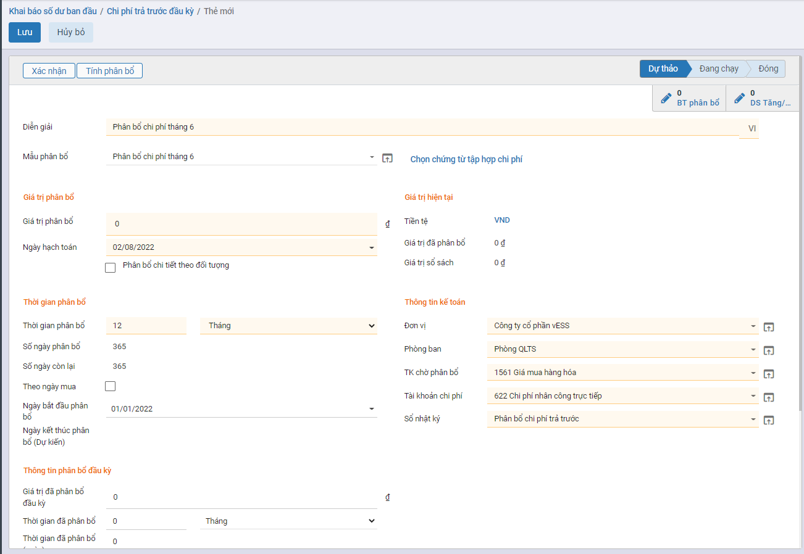

**Bước 3** : Nhấn nút **Tính phân bổ** để tính phân bổ -> Giá trị phân bổ sẽ được ghi nhận tại tab Phân bổ ước tính

**Quản lý thông tin phân bổ**

*Thông tin phân bổ*

Kết quả phân bổ sẽ được trả về tại tab **Phân bổ ước tính**. Kết quả phụ thuộc vào các yếu tố dưới đây:

- [x] Có tick *Theo ngày mua hay không*
- [x] Có tick *Phân bổ chi tiết theo đối tượng*

Sau khi thực hiện **Tính khấu hao** -> Hệ thống tính toán và hiển thị kết quả tại **Tab Khấu hao ước tính** gồm các thông tin: Mô tả,  Ngày phân bổ, Giá trị phân bổ trong kỳ , Giá trị phân bổ lũy kế và Giá trị còn lại và Bút toán sổ nhật ký

Sau khi tick *Phân bổ chi tiết theo đối tượng* -> Hệ thống hiển thị tab *Thiết lập phân bổ* gồm các thông tin : Đối tượng phân bổ , tên đối tượng phân bổ, tỷ lệ phân bổ và tài khoản doanh thu

=> Khi người dùng nhấn nút **Xác nhận**, bút toán sẽ được ghi nhận tương ứng với các đầu tài khoản đã nhập tại tab thông tin chung. Bên cạnh đó dữ liệu được hạch toán sẽ tác động đến giá trị tiền tại Tab Thông tin chung như sau:

- Bút toán ghi nhận theo từng kỳ khấu hao
  - Ghi nợ Tài khoản chi phí tại Tab Thông tin kế toán
  - Ghi có Tài khoản chờ phân bổ

+ Giá trị tiền tại Tab Thông tin chung

  - Giá trị phân bổ= ( Giá trị gốc - Giá trị không phân bổ)của cả Tài sản gốc và các tài sản con điều chỉnh

  + Giá trị sổ sách = Giá trị gốc phân bổ - Giá trị đã phân bổ (Được xác định ở những bản ghi phân bổ đã hạch toán + giá trị đã phân bổ đầu kỳ)

**Điều chỉnh Tăng giá trị/thời gian phân bổ**

Khi có nhu cầu Tăng giá trị/thời gian phân bổ , Doanh nghiệp thực nhập các số liệu mong muốn để thay đổi về Giá trị số tiền còn lại và Thời gian Phân bổ. Hệ thống sẽ tính toán và cập nhật lại vào các chứng từ liên quan

*Đối tượng thực hiện : Nhân viên kế toán

Các bước thực hiện:

**Bước 1 :** Vào chức năng **Khai báo số dư đầu kỳ** -> Chọn **Chi phí trả trước đầu kỳ** -> Chọn bản ghi Chi phí trả trước đầu kỳ muốn *Tăng* 

**Bước 2 :** Nhấn vào *Điều chỉnh phân bổ*

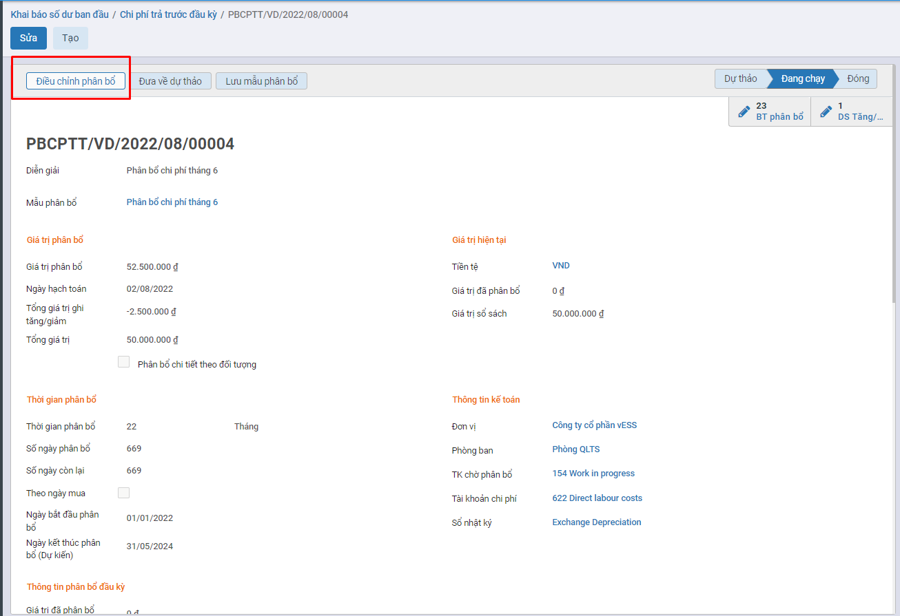

**Bước 3 :** Người dùng nhập dữ liệu liên quan đến Lý do điều chỉnh , số tiền còn lại và các tài khoản ghi nhận bút toán( nếu có sự thay đổi) trên màn hình Điều chỉnh phân bổ

+ Nếu muốn tăng giá trị phân bổ -> Người dùng thực hiện nhập *Số tiền còn lại* tại mục *Giá trị điều chỉnh* > *Giá trị hiện tại* 
+ Nếu muốn tăng thời gian khấu hao -> Người dùng thực hiện nhập *Thời gian phân bổ* tại mục *Giá trị điều chỉnh* > *Thời gian phân bổ* hiện tại

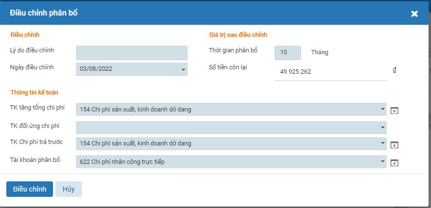

**Bước 4**: Nhấn nút *Điều chỉnh*

- Hệ thống kiểm tra nếu ngày điều chỉnh nằm trong kỳ khấu hao đã được hạch toán -> Hiển thị popup thông báo ' Không điều chỉnh vào kỳ đã hạch toán', và thoát khỏi màn hình Điều chỉnh phân bổ
- Đối với bản ghi điều chỉnh thỏa mãn điều kiện sẽ làm thay đổi giá trị  Phân bổ vào trường *Tổng giá trị* và tác động đến sự thay đổi của *Tab* *Phân bổ ước tính* và *Sinh bút toán ghi nhận Tăng* *giá trị phân bổ tương ứng* như sau:
  - Tab Phân bổ ước tính

    - Giá trị Phân bổ được tính lại từ ngày điều chỉnh trên popup Điều chỉnh phân bổ
    - Các bút toán khấu hao trước đó vẫn được giữ nguyên theo giá trị chưa ghi nhận Tăng
  - Bút toán ghi nhận Tăng giá trị phân bổ
    - Ghi có Tài khoản Tăng tổng phân bổ
    - Ghi nợ Tài khoản đối ứng

**Điều chỉnh Giảm giá trị/thời gian phân bổ**

Khi có nhu cầu Giảm giá trị/thời gian khấu hao của Tài sản cố định, Doanh nghiệp thực nhập các số liệu mong muốn để thay đổi về Giá trị của tài sản và Thời gian Khấu hao. Hệ thống sẽ tính toán và cập nhật lại vào các chứng từ liên quan

Đối tượng thực hiện : Nhân viên kế toán

Các thao tác thực hiện:

**Bước 1 :** Vào chức năng **Khai báo số dư đầu kỳ** -> Chọn **Chi phí trả trước** -> Chọn bản ghi Chi phí trả trước muốn *Giảm* 

**Bước 2 :** Nhấn vào *Điều chỉnh phân bổ*

**Bước 3:** Người dùng nhập dữ liệu liên quan đến Lý do điều chỉnh , giá trị khấu hao và các tài khoản ghi nhận bút toán( nếu có sự thay đổi) trên màn hình Tăng/giảm Tài sản

+ Nếu muốn tăng giá trị phân bổ -> Người dùng thực hiện nhập *Số tiền còn lại* tại mục *Giá trị điều chỉnh* < *Giá trị hiện tại* 
+ Nếu muốn tăng thời gian khấu hao -> Người dùng thực hiện nhập *Thời gian phân bổ* tại mục *Giá trị điều chỉnh* < *Thời gian phân bổ* hiện tại

**Bước 4**: Nhấn nút **Điều chỉnh**

- Hệ thống kiểm tra nếu ngày điều chỉnh nằm trong kỳ khấu hao đã được hạch toán -> Hiển thị popup thông báo ' Không điều chỉnh vào kỳ đã hạch toán', và thoát khỏi màn hình Điều chỉnh tài sản
- Đối với bản ghi điều chỉnh thỏa mãn điều kiện sẽ làm thay đổi giá trị Phân bổ vào trường *Tổng giá trị* ( = Nguyên giá Phân bổ- giá trị giảm ) và tác động đến sự thay đổi của *Tab* *Khấu hao ước tính* và *Sinh bút toán ghi nhận Tăng* *giá trị tài sản tương ứng* như sau:
  - Tab Khấu hao ước tính

    - Giá trị khấu hao được tính lại từ ngày điều chỉnh trên popup Tăng/giảm tài sản
    - Các bút toán khấu hao trước đó vẫn được giữ nguyên theo giá trị chưa ghi nhận Giảm
  - Bút toán ghi nhận Giảm giá trị tài sản
    - Ghi có Tài khoản Tăng tổng tài sản
    - Ghi nợ Tài khoản đối ứng

**Lưu mẫu phân bổ**

Khi có nhu cầu lưu trữ các thông tin phân bổ đã thực hiện , Doanh nghiệp thực hiện lưu mẫu phân bổ cho lần khai báo sau

Đối tượng thực hiện : Nhân viên kế toán

Các thao tác thực hiện:

**Bước 1:** Vào chức năng **Khai báo số dư đầu kỳ** -> Chọn **Chi phí trả trước** -> Chọn bản ghi Chi phí trả trước đầu kỳ muốn *Lưu* 

**Bước 2:** Nhấn vào *Lưu mẫu phân bổ*

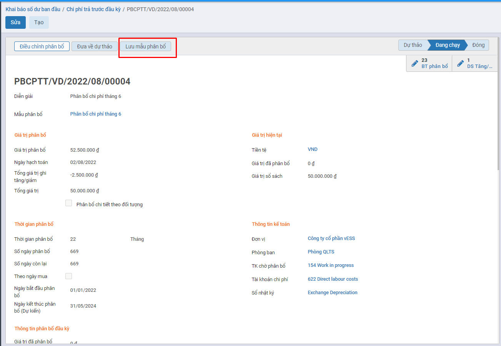

**Bước 3 :** Nhấn vào Đồng ý 

- Hệ thống hiển thị thông tin Mẫu phân bổ vừa lưu bao gồm : Diễn giải , tab thông tin Thời gian phân bổ , tab thông tin Kế toán của bản ghi phân bổ vừa thực hiện

#### Chi phí dở dang đầu kỳ - Giản đơn

**Mô tả nghiệp vụ**

·  Cho phép nhân viên kế toán Khai báo chi phí dở dang đầu kỳ theo phương pháp Giản đơn

**Các bước thực hiện**

**Bước 1:** Vào phân hệ **Tổng hợp** -> chọn **Khai báo số dư ban đầu** -> chọn **Chi phí dở dang đầu kỳ - Giản đơn** -> Nhất nút **Tạo**. Màn hình hiển thị thông tin sau:

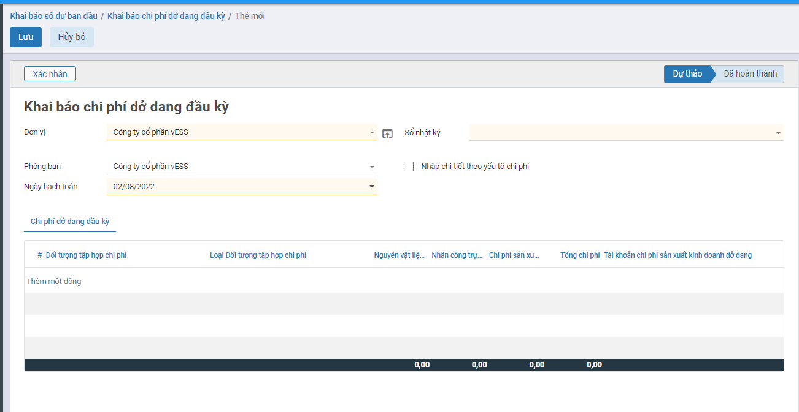

**Bước 2:** Người dùng điền các thông tin trên màn hình. Lưu ý: Tích vào **Thêm một dòng** để chọn các *Đối tượng THCP* cần khai báo. Có 2 trường hợp:

- Nếu người dùng không tích chọn **Nhập chi tiết theo yếu tố chi phí** thì màn hình sẽ ẩn đi các cột chi phí chi tiết của chi phí sản xuất chung (như hình trên).

- Nếu người dùng muốn nhập chi tiết các chi phí khác như Chi phí Nguyên vật liệu gián tiếp, Nhân công gián tiếp, Chi phí mua ngoài...(Chi phí chi tiết của của Chi phí sản xuất chung)--> Tích chọn vào **Nhập chi tiết theo yếu tố chi phí**. Màn hình hiển thị thông tin như sau:

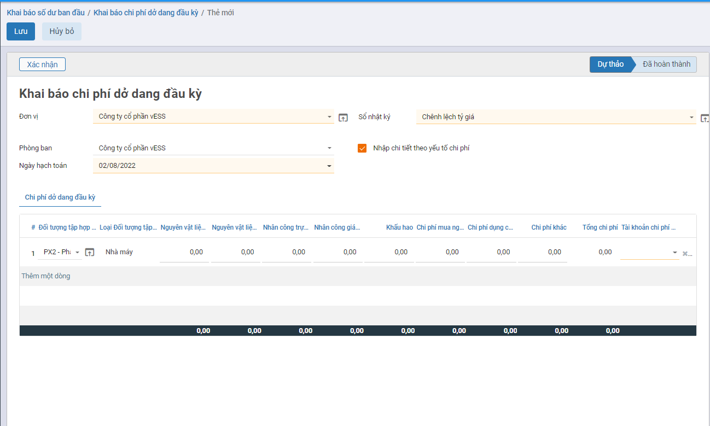

**Bước 3:** Bấm Lưu để lưu bản ghi trạng thái **Dự thảo**

**Bước 4:** Bấm Xác nhận để lưu bản ghi trạng thái **Đang thực hiện**

<u>*Lưu ý:*</u> Bản ghi chỉ cho phép **Xóa** ở trạng thái **Dự thảo**. Và bản ghi chỉ sử dụng ở các chức năng khác với trạng thái bản ghi **Đã hoàn thành**

#### Chi phí dở dang đầu kỳ - Hệ số tỷ lệ

**Mô tả nghiệp vụ**

·  Cho phép nhân viên kế toán Khai báo chi phí dở dang đầu kỳ theo phương pháp Hệ số tỷ lệ

**Các bước thực hiện**

**Bước 1:** Vào phân hệ **Tổng hợp** -> chọn **Khai báo số dư ban đầu** -> chọn **Chi phí dở dang đầu kỳ - Hệ số tỷ lệ** -> Nhất nút **Tạo**. Màn hình hiển thị thông tin sau: 

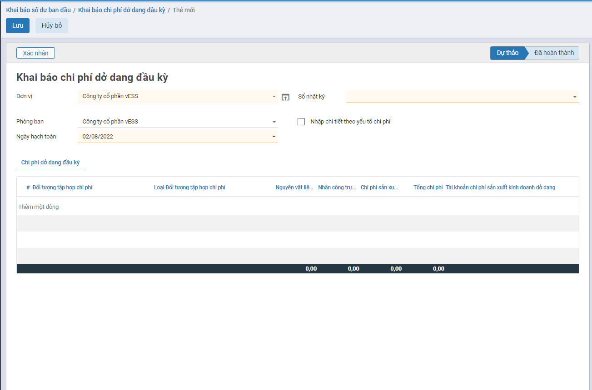

**Bước 2:** Người dùng nhập các thông tin trên màn hình. Ở Tab **Chi phí dở dang đầu kỳ **,  Tích vào **Thêm một dòng** để chọn các *Đối tượng THCP* cần khai báo. Có 2 trường hợp:

- Nếu người dùng không tích chọn **Nhập chi tiết theo yếu tố chi phí** thì màn hình sẽ ẩn đi các cột chi phí chi tiết của chi phí sản xuất chung (như hình trên).

- Nếu người dùng muốn nhập chi tiết các chi phí khác như Chi phí Nguyên vật liệu gián tiếp, Nhân công gián tiếp, Chi phí mua ngoài...(Chi phí chi tiết của của Chi phí sản xuất chung)--> Tích chọn vào **Nhập chi tiết theo yếu tố chi phí**. Màn hình hiển thị thông tin như sau:

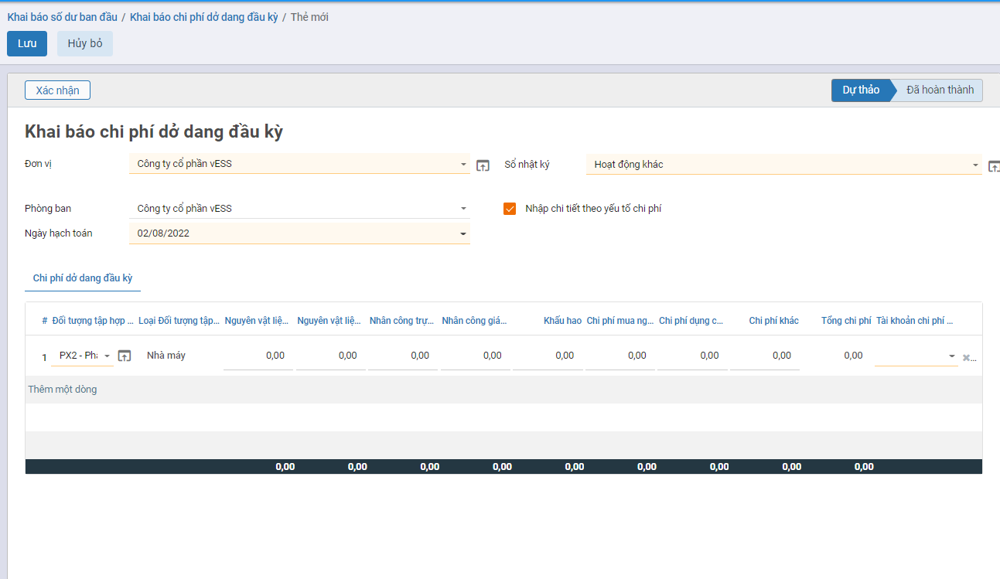

**Bước 3:** Bấm Lưu để lưu bản ghi trạng thái **Dự thảo**

**Bước 4:** Bấm Xác nhận để lưu bản ghi trạng thái **Đang thực hiện**

<u>*Lưu ý:*</u> Bản ghi chỉ cho phép **Xóa** ở trạng thái **Dự thảo**. Và bản ghi chỉ sử dụng ở các chức năng khác với trạng thái bản ghi **Đã hoàn thành**

#### Chi phí dở dang đầu kỳ - Công trình

**Mô tả nghiệp vụ**

Quản lý chi phí dở dang đầu kỳ cho các công trình/hạng mục công trình của doanh nghiệp (áp dụng với đơn vị tính giá thành theo TT133 và TT200).

**Các bước thực hiện**

Bước 1: Vào phân hệ **Tổng hợp** -> chọn **Khai báo số dư ban đầu** -> chọn **Chi phí dở dang đầu kỳ - Công trình** -> Nhất nút **Tạo**. Màn hình hiển thị thông tin sau: 

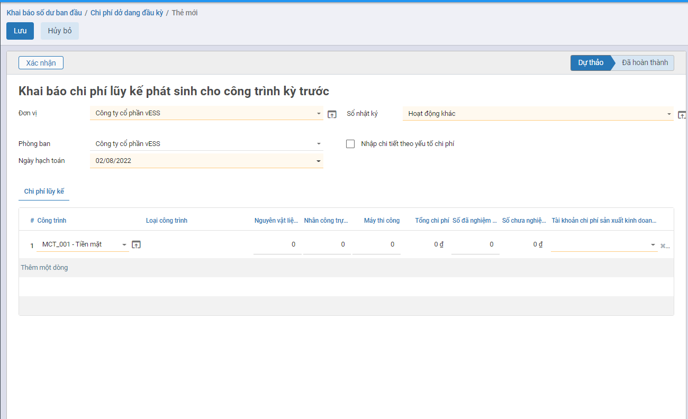

**Bước 2**: Người dùng nhập các thông tin trên màn hình. Ở Tab **Chi phí lũy kế**, tích vào **Thêm một dòng** để lựa chọn các *Công trình*, nhập các thông tin chi phí. Có 2 trường hợp:

- Nếu không tích vào **Nhập chi tiết theo yếu tố chi phí** , tab **Chi phí lũy kế** không hiển thị các chi phí chi tiết của **Chi phí chung** và **Máy thi công.** (Như hình trên).
- Nếu tích vào **Nhập chi tiết theo yếu tố chi phí** , tab **Chi phí lũy kế** không hiển thị các chi phí chi tiết của **Chi phí chung** (NVL gián tiếp, nhân công gián tiếp, chi phí khấu hao, chi phí mua ngoài, chi phí khác) và **Máy thi công**(NVL gián tiếp, nhân công gián tiếp, chi phí khấu hao, chi phí mua ngoài, chi phí khác) (Như hình dưới).

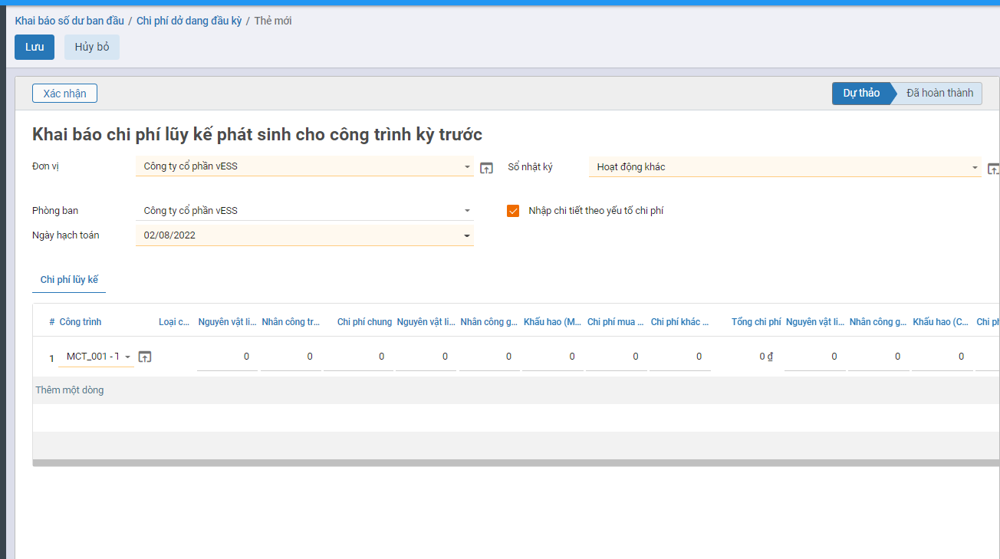

**Bước 3:** Bấm Lưu để lưu bản ghi trạng thái **Dự thảo**

**Bước 4:** Bấm Xác nhận để lưu bản ghi trạng thái **Đang thực hiện**

<u>*Lưu ý:*</u> Bản ghi chỉ cho phép **Xóa** ở trạng thái **Dự thảo**. Và bản ghi chỉ sử dụng ở các chức năng khác với trạng thái bản ghi **Đã hoàn thành**

#### Chi phí dở dang đầu kỳ - Đơn hàng 

**Mô tả nghiệp vụ**

Cho phép nhập chi phí dở dang đầu kỳ cho từng đơn hàng 

**Các bước thực hiện**

**Bước 1:** Vào phân hệ **Tổng hợp** -> chọn **Khai báo số dư ban đầu** -> chọn **Chi phí dở dang đầu kỳ - Đơn hàng** -> Nhất nút **Tạo**. Màn hình hiển thị thông tin sau: 

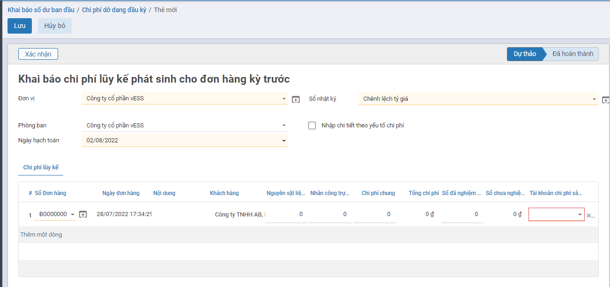

**Bước 2**: Người dùng nhập các thông tin trên màn hình. Ở Tab **Chi phí lũy kế**, tích vào **Thêm một dòng** để lựa chọn các *Số đơn hàng*, nhập các thông tin chi phí. Có 2 trường hợp:

- Nếu không tích vào **Nhập chi tiết theo yếu tố chi phí** , tab **Chi phí lũy kế** không hiển thị các chi phí chi tiết của **Chi phí chung** và **Máy thi công.** (Như hình trên).
- Nếu tích vào **Nhập chi tiết theo yếu tố chi phí** , tab **Chi phí lũy kế** hiển thị các chi phí chi tiết của **Chi phí chung** (NVL gián tiếp, nhân công gián tiếp, chi phí khấu hao, chi phí mua ngoài, chi phí khác) và **Máy thi công**(NVL gián tiếp, nhân công gián tiếp, chi phí khấu hao, chi phí mua ngoài, chi phí khác) (Như hình dưới).

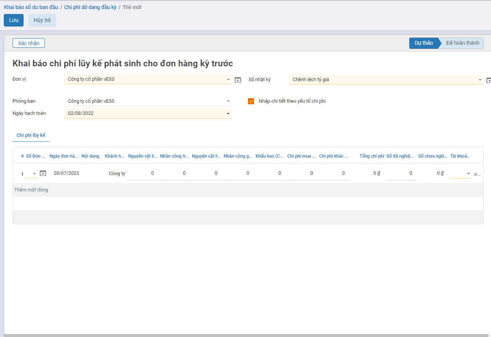

**Bước 3:** Bấm Lưu để lưu bản ghi trạng thái **Dự thảo**

**Bước 4:** Bấm Xác nhận để lưu bản ghi trạng thái **Đang thực hiện**

<u>*Lưu ý:*</u> Bản ghi chỉ cho phép **Xóa** ở trạng thái **Dự thảo**. Và bản ghi chỉ sử dụng ở các chức năng khác với trạng thái bản ghi **Đã hoàn thành**

#### Chi phí dở dang đầu kỳ - Hợp đồng 

**Mô tả nghiệp vụ**

·    Cho phép nhập chi phí dở dang đầu kỳ cho từng hợp đồng

**Các bước thực hiện**

**Bước 1:** Vào phân hệ **Tổng hợp** -> chọn **Khai báo số dư ban đầu** -> chọn **Chi phí dở dang đầu kỳ - Hợp đồng** -> Nhất nút **Tạo**. Màn hình hiển thị thông tin sau: 

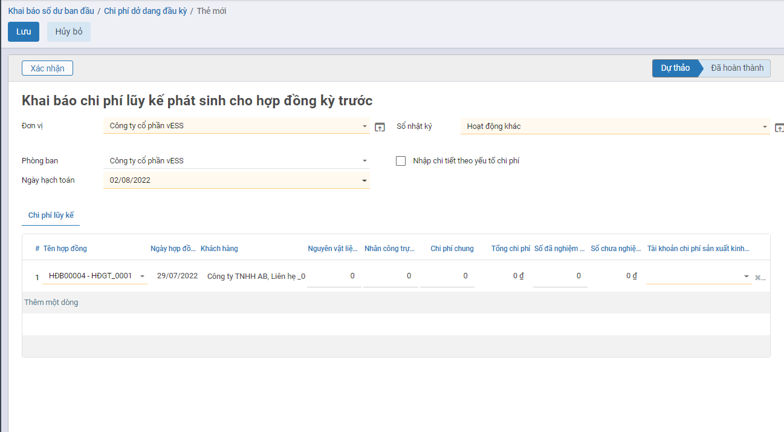

**Bước 2**: Người dùng nhập các thông tin trên màn hình. Ở Tab **Chi phí lũy kế**, tích vào **Thêm một dòng** để lựa chọn các *Tên hợp đồng*, nhập các thông tin chi phí. Có 2 trường hợp:

- Nếu không tích vào **Nhập chi tiết theo yếu tố chi phí** , tab **Chi phí lũy kế** không hiển thị các chi phí chi tiết của **Chi phí chung** và **Máy thi công.** (Như hình trên).
- Nếu tích vào **Nhập chi tiết theo yếu tố chi phí** , tab **Chi phí lũy kế** hiển thị các chi phí chi tiết của **Chi phí chung** (NVL gián tiếp, nhân công gián tiếp, chi phí khấu hao, chi phí mua ngoài, chi phí khác) và **Máy thi công**(NVL gián tiếp, nhân công gián tiếp, chi phí khấu hao, chi phí mua ngoài, chi phí khác) (Như hình dưới).

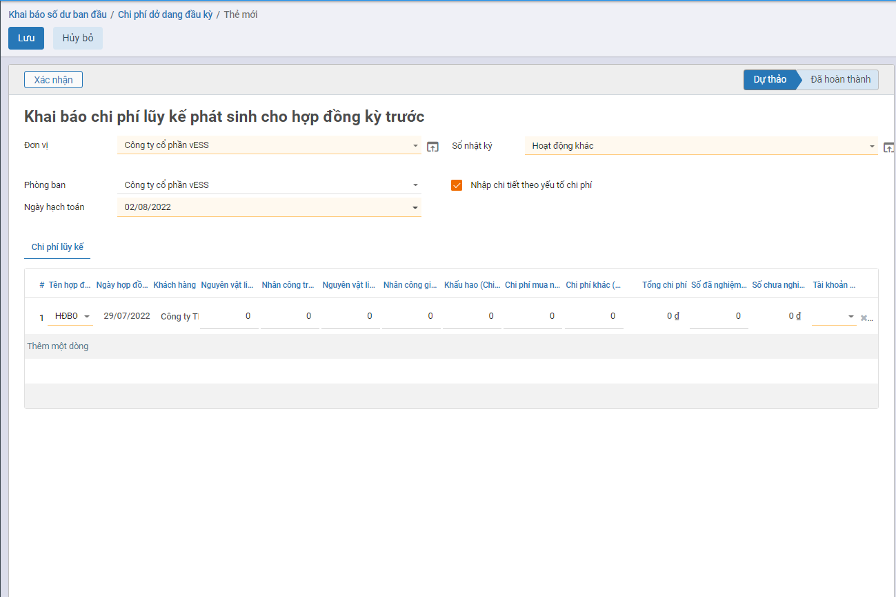

**Bước 3:** Bấm Lưu để lưu bản ghi trạng thái **Dự thảo**

**Bước 4:** Bấm Xác nhận để lưu bản ghi trạng thái **Đang thực hiện**

<u>*Lưu ý:*</u> Bản ghi chỉ cho phép **Xóa** ở trạng thái **Dự thảo**. Và bản ghi chỉ sử dụng ở các chức năng khác với trạng thái bản ghi **Đã hoàn thành**     

## *Nhập tồn kho vật tư, hàng hóa*

### Mô tả nghiệp vụ

Mục Tồn kho vật tư, hàng hóa cho phép người dùng quản lý tồn kho đầu kỳ của vật tư, hàng hóa của hộ kinh doanh theo từng kho

**Quy trình nghiệp vụ**

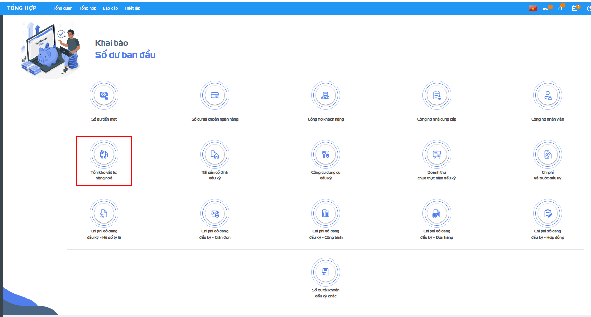

### **Xem video hướng dẫn**

<iframe
    width="920"
    height="450"
    frameborder="0"
    allow="autoplay; encrypted-media; clipboard-write; gyroscope; picture-in-picture "
    allowfullscreen
    title="Tồn kho vật tư, hàng hóa" 
    src="https://www.youtube.com/embed/GHKWU2ad0F4?list=PLcdARb5pnnj8jeyvyhaptnwL3sxxT_QaK"
></iframe>

### Hướng dẫn trên phần mềm

**Lưu ý:** Trước khi nhập tồn kho đầu kỳ cần khai báo: **Danh mục kho** và **Danh mục vật tư, hàng hóa** sử dụng tại đơn vị

**Bước 1**: Vào phân hệ **Tổng hợp**, Chọn **Tổng hợp**, Chọn **Khai báo số dư ban đầu**.

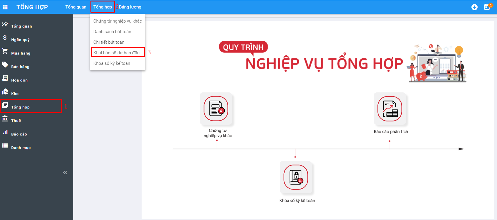

 Nhấn **Tồn kho vật tư, hàng hóa** trên quy trình

 Nhấn **Tạo**, Thực hiện khai báo thông tin Tab chung:

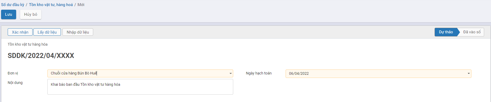

- **Đơn vị** : Chọn văn phòng, địa điểm kinh doanh của doanh nghiệp. Lưu ý: Một đơn vị chỉ được phép có một bản ghi tồn vật tư, hàng hóa
- **Ngày hạch toán**: Chọn ngày ghi nhận dư tồn vật tư hàng hóa đầu kỳ

**Bước 2**: Khai báo vật tư, hàng hóa tồn kho

#### **Cách 1:Nhập trực tiếp trên phần mềm**

Tại Tab **Số dư đầu kỳ**, Nhấn **Thêm một dòng**

- **Vật tư hàng hóa**: Chọn vật tư hàng hóa còn tồn
- **Đơn vị tính**: Chọn đơn vị tính vật tư hàng hóa
- **Kho**: Chọn Kho thuộc đơn vị đang sử dụng
- **Số lượng tồn**: Nhập số lượng còn tồn của vật tư, hàng hóa
- **Giá trị tồn**: Nhập giá trị tiền của vật tư,hàng hóa còn tồn
- **Số lô**: Nhập số lô nhập của vật tư hàng hóa, nếu để trống hệ thống tự sinh
- **Hạn sử dụng**: Nhập hạn sử dụng của vật tư, hàng hóa còn tồn. 
- **Đơn giá**: Sau khi nhập số lượng tồn, giá trị tồn và lưu lại, đơn giá tự động tính= **Giá trị tồn/số lượng** 
- **Đơn vị tính chính**: Đơn vị tính được lấy tại danh mục hàng hóa
- **Tỷ lệ chuyển đổi**: Tỷ lệ quy đổi từ đơn vị tính sang đơn vị tính chính
- **Số lượng theo đơn vị tính chính**: = số lượng tồn * tỷ lệ chuyển đổi

Nhấn **Lưu** để lưu lại thông tin vào phần mềm

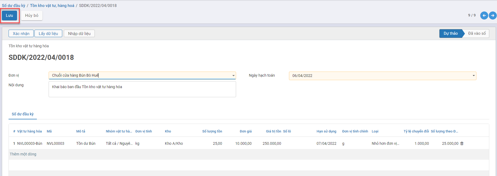

#### **Cách 2: Nhấn Chi tiết tồn kho**

Người dùng nhấn nút **Chi tiết tồn kho** để mở tab chi tiết

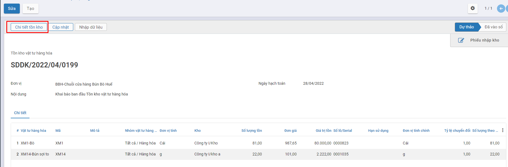

Sau khi mở thông tin chi tiết, người dùng nhấn **Tạo** để thực hiện nhập thêm mới từng dòng vật tư, hàng hóa còn tồn hoặc sửa lại trực tiếp thông tin đang sai xót và nhấn **Lưu**

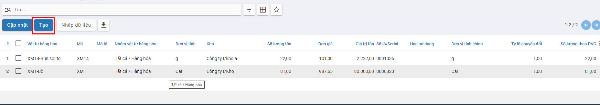

#### **Cách 3: Nhấn Lấy dữ liệu**

Trường hợp nếu toàn bộ hàng hóa đang có đều có tồn đầu kỳ, người dùng có thể nhấn nút **Lấy dữ liệu** ở tab **Thông tin chung** nằm tạo nhanh dữ liệu tab chi tiết. Sau khi nhấn nút này, tương ứng với mỗi hàng hóa, phần mềm  sẽ  tạo một dòng thông tin vật tư hàng hóa tại tab **Chi tiết** với số lượng tồn = 1, giá trị tồn = 0.

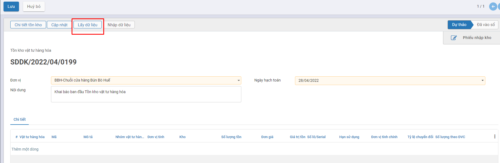

#### Cách 4: Nhập từ excel

Nhấn **Nhập dữ liệu**

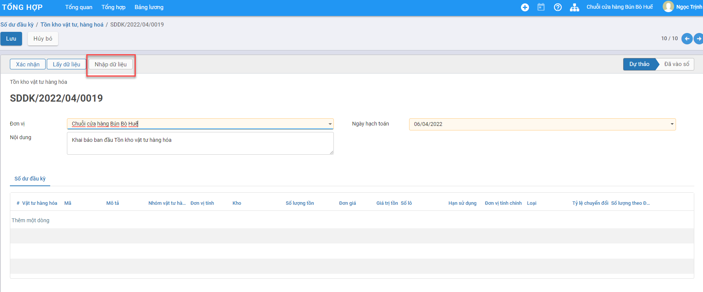

Nhấn **Tải về mẫu dữ liệu** để thực hiện tải file mẫu excel để nhập thông tin

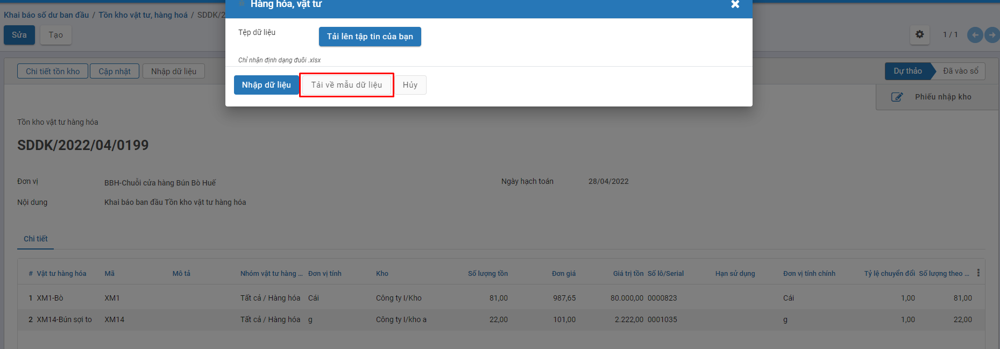

Thực hiện nhập thông tin tại file excel,nhấn Lưu file excel sau khi nhập thông tin vật tư hàng hóa tồn đầu kỳ tại file.

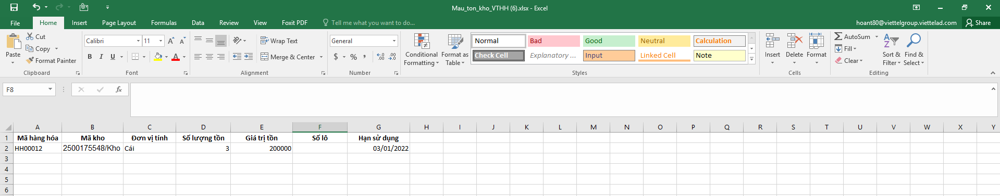

- **Mã hàng hóa**: Bắt buộc nhập, nhập mã nội bộ của vật tư,hàng hóa có tồn đầu kỳ
- **Mã kho**: Bắt buộc nhập, nhập địa điểm kho theo cú pháp Địa điểm cha/Tên địa điểm
- **Đơn vị tính**: Bắt buộc nhập,nhập Đơn vị tính của vật tư, hàng hóa
- **Số lượng tồn**: Bắt buộc nhập, nhập số lượng còn tồn của vật tư, hàng hóa, cần nhập số lượng > 0
- **Giá trị tồn**: Bắt buộc nhập, nhập giá trị tiền của vật tư,hàng hóa còn tồn, cần nhập giá trị > 0
- **Số lô**: Nhập số lô nhập của vật tư hàng hóa, nếu để trống hệ thống tự sinh
- **Hạn sử dụng**: Nhập hạn sử dụng của vật tư, hàng hóa còn tồn theo định dạng dd-mm-yyyy

Nhấn **Tải lên tập tin của bạn** ,chọn file excel vừa nhập vật tư, hàng hóa tồn đầu kỳ

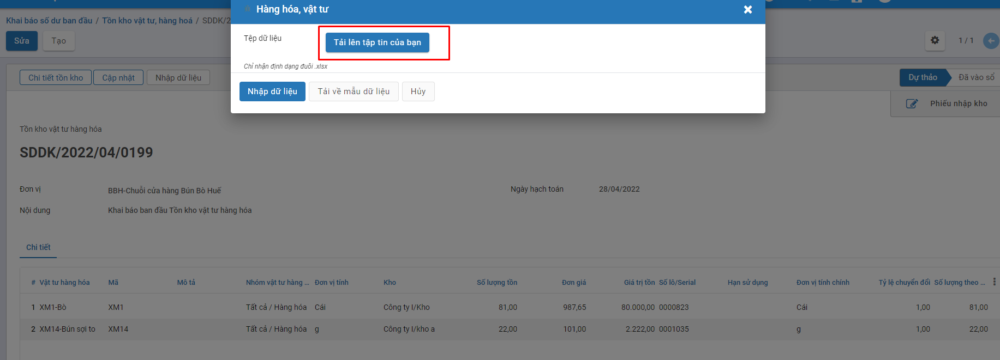

Nhấn **Nhập dữ liệu** để thực hiện nhập thông tin vật tư, hàng hóa tồn đầu kỳ từ file excel. Nếu dữ liệu lỗi, phần mềm sẽ trả lại kết quả lỗi cụ thể. Nếu dữ liệu hợp lệ, hệ thống sẽ thông báo thành công. Tương ứng với mỗi một dòng trên file excel sẽ sinh tương ứng một bản ghi tại tab chi tiết

**Bước 3**: Sau khi khai báo tồn kho vật tư, hàng hóa, nhấn **Xác nhận** để hoàn thành phiếu đầu kỳ 

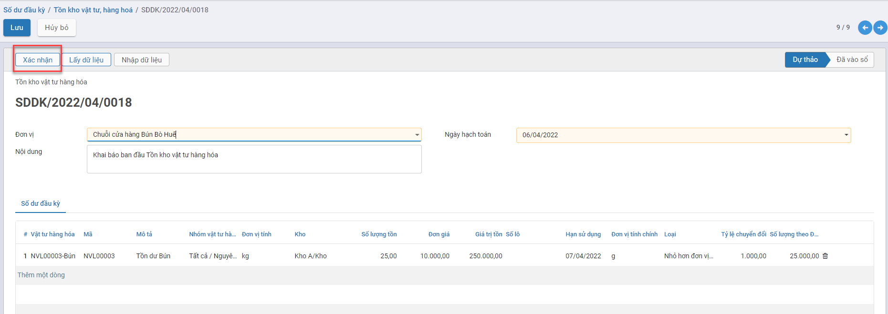

và sinh **Phiếu nhập kho** tương ứng ở trạng thái đã ghi sổ,  ghi nhận số lượng, giá trị tồn kho vào số dư đầu kỳ của kho.  Nhấn nút **Phiếu nhập kho** tại góc phải của chức năng số dư đầu kỳ để kiểm tra chứng từ nhập kho và bút toán ghi nhận tổng giá trị tồn kho theo từng vật tư,hàng hóa của từng kho

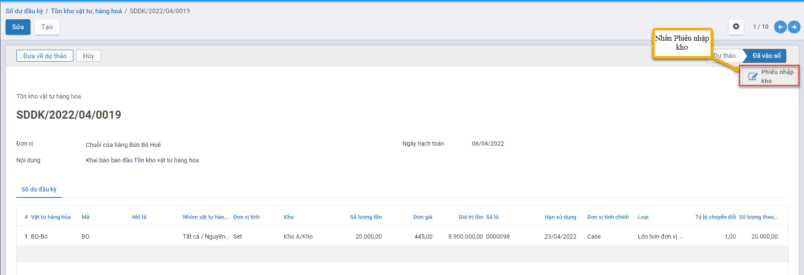

Chứng từ **Phiếu nhập kho** gắn với Phần khai báo Tồn kho vật tư, hàng hóa

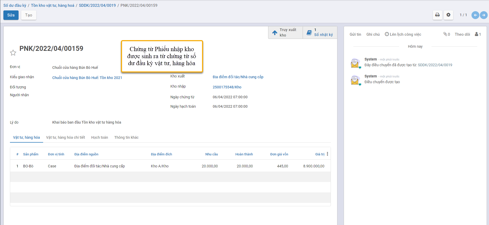

Sau khi hoàn thành bản ghi số dư đầu kỳ, nếu phát hiện có sai xót thì người dùng có thể nhấn **Đưa về dự thảo** để đưa bản ghi về trạng thái nháp

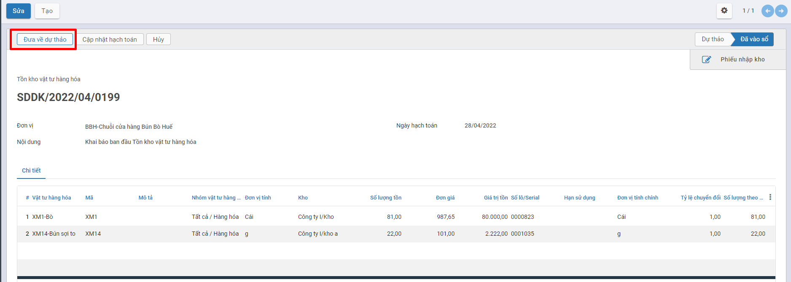

Để chỉnh sửa lại thông tin tồn đầu kỳ vật tư, hàng hóa,nhấn **Sửa** để thực hiện sửa thông tin tồn đầu kỳ vật tư, hàng hóa. Nhấn **Cập nhật** để lưu lại dữ liệu, đưa chứng từ về trạng thái ghi sổ và cập nhật lại thông tin  vào chứng từ **Phiếu nhập kho**.

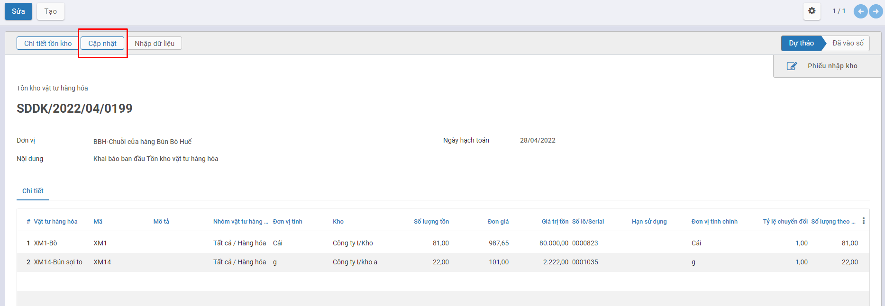

**Lưu ý:** 

- Không được sửa lại hàng hóa, kho sang một hàng hóa,kho khác khi đã tồn tại ít nhất một phiếu xuất kho có gắn với hàng hóa, kho đã sử dụng ở tồn đầu kỳ
- Không được sửa số lượng tồn nhỏ hơn số lượng đã xuất kho theo hàng hóa, kho đang sử dụng ở tồn đầu kỳ

## *Phân bổ chi phí trả trước*

### Mô tả nghiệp vụ

Chức năng **Phân bổ chi phí trả trước** được sử dụng trong các trường hợp sau:

- Doanh nghiệp có nhiều đơn vị muốn tập hợp được chi phí, xác định được lãi lỗ thực tế cho từng đơn vị.
- Doanh nghiệp muốn tập hợp được chi phí, xác định được lãi lỗ thực tế cho từng công trình/đơn hàng/hợp đồng.
- Doanh nghiệp hoạt động trong nhiều lĩnh vực sản xuất kinh doanh cần phân tách, hoặc các lĩnh vực chịu thuế TNDN khác nhau muốn tập hợp được chi phí, xác định được lãi lỗ thực tế cho từng lĩnh vực kinh doanh.

### **Xem video hướng dẫn**

<iframe
    width="920"
    height="450"
    frameborder="0"
    allow="autoplay; encrypted-media; clipboard-write; gyroscope; picture-in-picture "
    allowfullscreen
    title="Module Tổng hợp - Phân bổ chi phí trả trước" 
    src="https://www.youtube.com/embed/V6zei7PPJQE"
></iframe>

### Quy trình nghiệp vụ

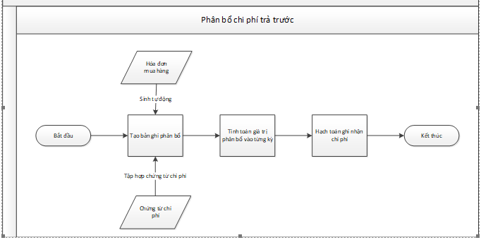

**Các luồng quy trình:**

+ Phân bổ Chi Phí trả trước. Chi tiết xem **[Tại đây](#them-moi-ban-ghi-phan-bo-chi-phi-tra-truoc)**
+ Điều chỉnh Tăng giá trị/thời gian. Chi tiết xem**[Tại đây](#ieu-chinh-tang-gia-tri-thoi-gian-phan-bo)**
+ Điều chỉnh Giảm giá trị/thời gian. Chi tiết xem **[Tại đây](#ieu-chinh-giam-gia-trithoi-gian-phan-bo)**

#### Thêm mới bản ghi Phân bổ chi phí trả trước

**Mô tả:**

Doanh nghiệp thực hiện phân bổ chi phí trả trước cho từng phòng ban, đối tượng theo từng kỳ

**Đối tượng thực hiện:** Nhân viên Kế toán

**Các thao tác thực hiện:** 

**Bước 1:** Chọn **Tài chính- Kế toán**  -> Chọn module **Tổng hợp** -> Chọn trên tab menu **Tổng hợp** -> Chọn **Phân bổ chi phí trả trước** -> Chọn **Tạo**

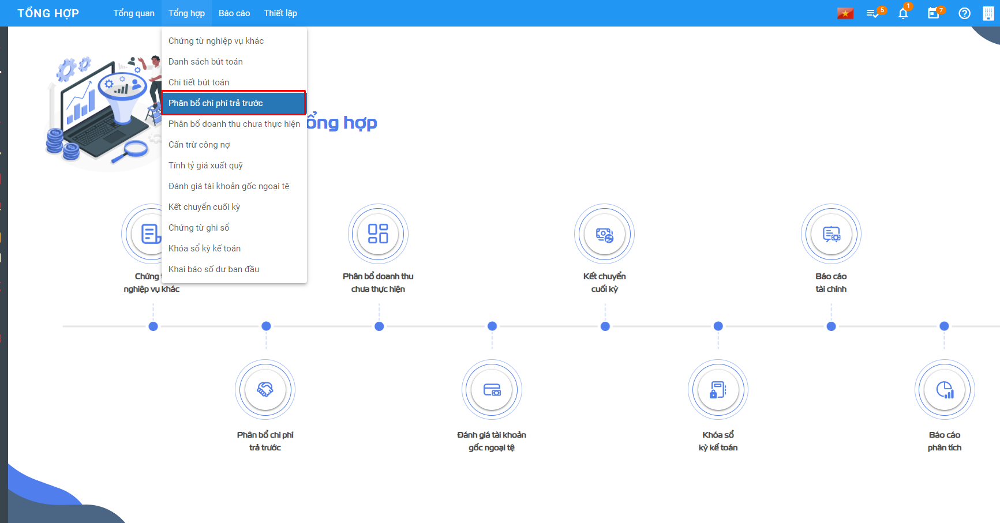

**Bước 2:** Người dùng thực hiện khai báo thông tin tại tab Thông tin chung và các tab khác

+ Nhập nội dung phân bổ 

  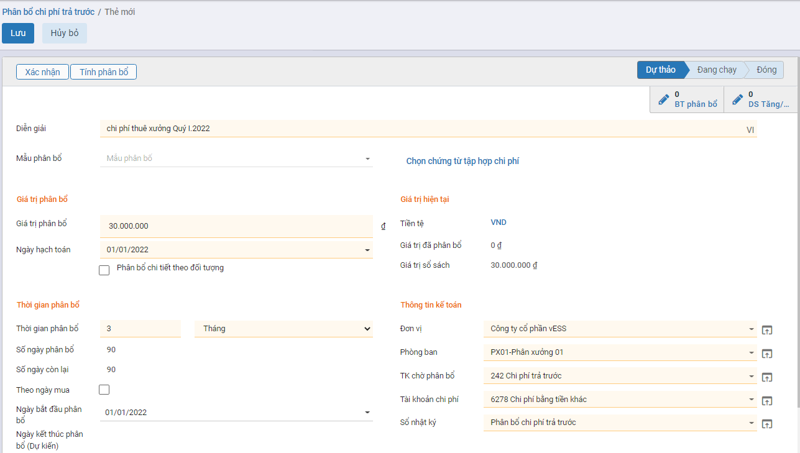

+ Giá trị phân bổ được xác định từ: 

  - Nhập tay 
  - Chọn từ *Chọn chứng từ tập hợp chi phí* -> giá trị phân bổ không được sửa

+ Thông tin về thời gian phân bổ, ngày ghi nhận phân bổ; các thông tin liên quan đến tài khoản chờ phân bổ, tài khoản chi phí, sổ nhật ký để ghi nhận các bút toán liên quan

+ Nếu đã phân bổ chi phí trước khi sử dụng phần mềm -> Người dùng thực hiện khai báo Giá trị đã phân bổ và thời gian đã phân bổ đầu kỳ tại mục *Thông tin phân bổ đầu kỳ*

+ Trường hợp người dùng chọn Tính phân bổ chi tiết theo đối tượng -> Thực hiện điền thông tin đối tượng phân bổ tại tab *Thiết lập phân bổ* -> Hệ thống ghi nhận bút toán phân bổ cho từng đối tượng tương ứng với đầu tài khoản chi phí và tỷ lệ phân bổ đã khai báo

  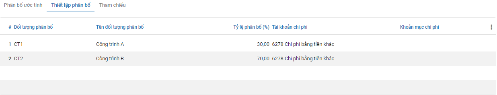

+ Trường hợp người dùng chọn các chứng từ liên quan tới việc Phân bổ chi phí trả trước -> Chi tiết chứng từ được ghi nhận tại tab *Nguồn gốc hình thành*. Tài khoản của chứng từ sẽ ghi nhận thành Tài khoản chờ phân bổ

  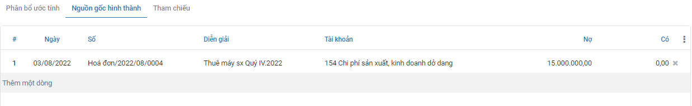

**Bước 3:** Nhấn nút Tính phân bổ để tính phân bổ chi phí trả trước -> Giá trị phân bổ theo từng kỳ sẽ được ghi nhận tại tab *Phân bổ ước tính*

#### **Quản lý thông tin phân bổ**

*Giá trị phân bổ chi phí trả trước sẽ được tính theo Phương pháp đường thẳng*.  Kết quả phụ thuộc vào các yếu tố dưới đây:

- [x] Phân bố chi phí đã được thực hiện ngoài phần mềm hay chưa
- [x] Có tick *Theo ngày mua* hay không

- Bản ghi phân bổ chi phí trả trước có tick *Theo ngày mua* -> Giá trị phân bổ sẽ được tính từ ngày theo ngày mua
- Bản ghi phân bổ không tick *Theo ngày mua* -> Giá trị phân bổ  sẽ được tính từ *Ngày hạch toán*
- Trường hợp Chi phí đã được phân bổ 1 phần trước khi khai báo trên phần mềm-> Hệ thống thực hiện trừ Giá trị tiền đã phân bổ và Số ngày đã phân bổ ngoài phần mềm để tính ra giá trị phân bổ cho từng kỳ

  - Căn cứ vào Tổng số ngày phân bổ, Giá trị phân bổ  -> Hệ thống thực hiện tính ra giá trị phân bổ cho 1 ngày
- Từ giá trị phân bổ 1 ngày -> Tính ra giá trị phân bổ cho 1 tháng hoặc 1 năm
  - Khi người dùng nhấn nút **Xác nhận**, hệ thống sẽ ghi nhận bút toán và cập nhật lại số liệu liên quan đến Giá trị tiền tại tab thông tin chung:

    - Bút toán ghi nhận theo từng kỳ phân bổ
    - Ghi nợ Tài khoản chi phí ( đối với bản ghi có thiết lập phân bổ cho đối tượng -> Ghi nợ tài khoản chi phí ứng với từng đối tượng )
      - Ghi có Tài khoản chờ phân bổ
    - Giá trị tiền tại Tab Thông tin chung
      - Số tiền đã phân bổ tính dựa trên bút toán đã hạch toán và số tiền đã phân bổ ngoài phần mềm
    - Giá trị sổ sách = Nguyên giá - Số tiền đã phân bổ

#### Điều chỉnh Tăng giá trị/ thời gian phân bổ

**Mô tả:**

Khi doanh nghiệp có nhu cầu Tăng giá trị/ thời gian phân bổ, hệ thống sẽ cập nhật thay đổi và tính toán lại giá trị phân bổ đối với từng kỳ

**Các bước thực hiện:**

**Bước 1:** Chọn module **Tổng hợp** -> Chọn trên tab menu **Tổng hợp** -> Chọn **Phân bổ chi phí trả trước** -> Chọn bản ghi phân bổ muốn điều chỉnh Tăng

**Bước 2:** Nhấn nút **Điều chỉnh phân bổ**

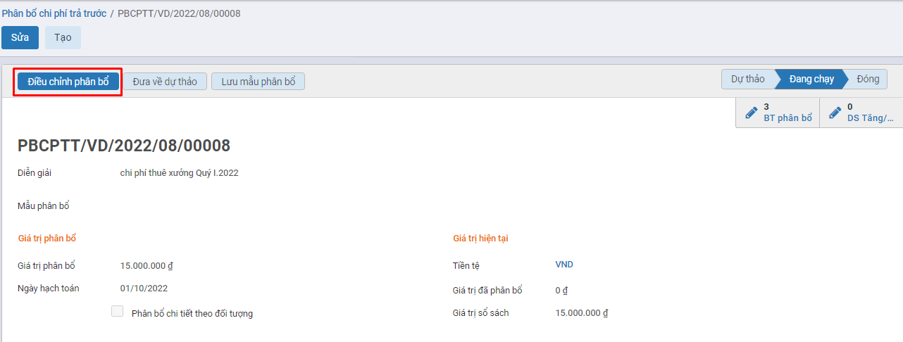

**Bước 3:** Người dùng thực hiện nhập liệu liên quan đến

- Lý do điều chỉnh
- Ngày điều chỉnh -> Hệ thống ghi nhận thay đổi từ ngày này
- Giá trị sau điều chỉnh
  - Nếu muốn tăng giá trị phân bổ -> Số tiền còn lại mới > giá trị còn lại cũ
  - Nếu muốn tăng thời gian phân bổ -> Nhập thời gian phân bổ mới > thời gian phân bổ cũ

- Thông tin các đầu Tài khoản ghi nhận thay đổi tại mục *Thông tin Kế toán*

!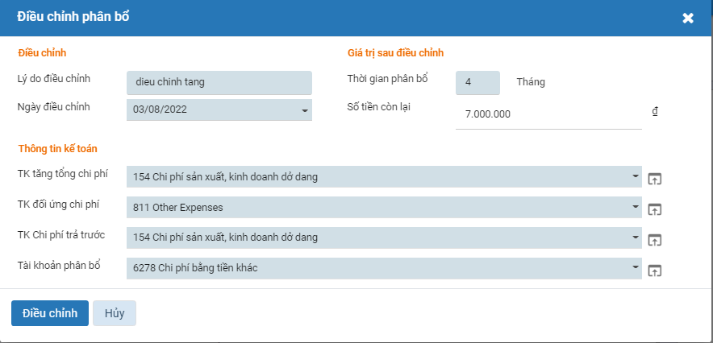

**Bước 4:** Nhấn nút *Điều chỉnh*

- Đối với bản ghi điều chỉnh thỏa mãn điều kiện sẽ ghi nhận giá trị Tăng  vào trường **Tổng giá trị tăng** tại tab Thông tin chung và tác động đến *Phân bổ ước tính* và *Sinh bút toán ghi nhận Tăng* *giá trị phân bổ tương ứng* như sau:

  - Tab phân bổ ước tính
    - Giá trị phân bổ được tính lại từ ngày điều chỉnh trên popup Điều chỉnh phân bổ
    - Các bút toán phân bổ trước ngày điều chỉnh vẫn được giữ nguyên theo giá trị chưa ghi nhận Tăng

  - Bút toán ghi nhận Tăng giá trị
    - Ghi nợ Tài khoản chi phí trả trước
    - Ghi có Tài khoản đối ứng

#### Điều chỉnh Giảm giá trị/thời gian phân bổ

**Mô tả:**

Khi doanh nghiệp có nhu cầu Giảm giá trị/ thời gian phân bổ chi phí trả trước, hệ thống cập nhật thay đổi và tính toán lại giá trị phân bổ theo từng kỳ

**Các bước thực hiện:**

**Bước 1:** Chọn module **Tổng hợp** -> Chọn trên tab menu **Tổng hợp** -> Chọn **Phân bổ chi phí trả trước** -> Chọn bản ghi phân bổ muốn điều chỉnh Giảm

**Bước 2:** Nhấn nút **Điều chỉnh phân bổ**

**Bước 3:** Người dùng thực hiện nhập liệu liên quan đến

- Lý do điều chỉnh
- Ngày điều chỉnh -> Hệ thống ghi nhận thay đổi từ ngày này
- Giá trị sau điều chỉnh
  - Nếu muốn giảm giá trị phân bổ -> Nhập giá trị còn lại mới < giá trị còn lại cũ
  - Nếu muốn tăng thời gian phân bổ -> Nhập thời gian phân bổ mới < thời gian phân bổ cũ

- Thông tin các đầu Tài khoản ghi nhận thay đổi tại mục *Thông tin Kế toán*

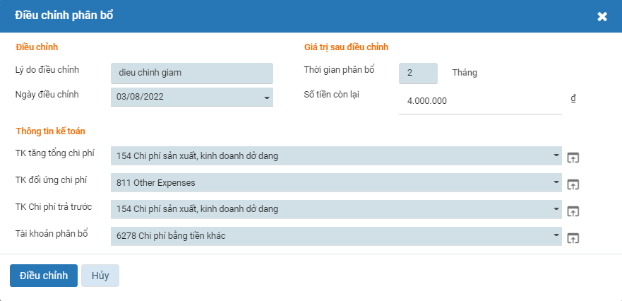

**Bước 4:** Nhấn nút *Điều chỉnh*

- Đối với bản ghi điều chỉnh thỏa mãn điều kiện -> Hệ thống sẽ ghi nhận giảm giá trị phân bổ tại tab Thông tin chung và tác động đến *Phân bổ ước tính* và *Sinh bút toán ghi nhận Giảm* *giá trị phân bổ tương ứng* như sau:

  - Tab phân bổ ước tính
    - Giá trị phân bổ được tính lại từ ngày điều chỉnh trên popup Điều chỉnh phân bổ
    - Các bút toán phân bổ trước ngày điều chỉnh vẫn được giữ nguyên theo giá trị chưa ghi nhận Giảm

  - Bút toán ghi nhận Giảm giá trị
    - Ghi nợ Tài khoản đối ứng chi phí
    - Ghi có Tài khoản chi phí trả trước

## *Phân bổ doanh thu chưa thực hiện*

**Mục đích:**

Cho phép kế toán phân bổ doanh thu nhận trước nhưng chưa tính vào doanh thu bán hàng trong kỳ như các khoản thu tiền trước cho thuê tài sản trong kỳ, thu trước tiền dịch vụ…

### Quy trình nghiệp vụ

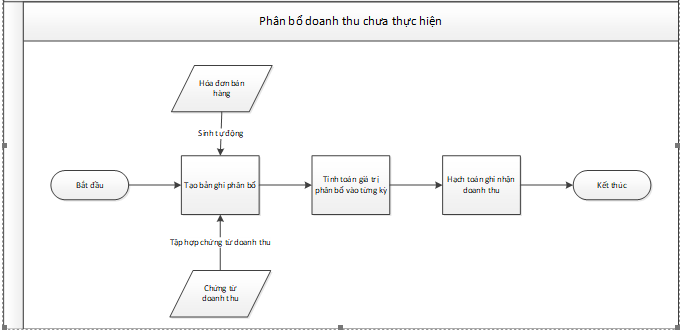

**Các luồng quy trình:**

+ Phân bổ Doanh thu chưa thực hiện. Chi tiết xem **[Tại đây](#them-moi-ban-ghi-phan-bo-doanh-thu-chua-thuc-hien)**
+ Điều chỉnh Tăng giá trị/thời gian. Chi tiết xem **[Tại đây](#ieu-chinh-tang-gia-tri-thoi-gian-phan-bo_1)**
+ Điều chỉnh Giảm giá trị/thời gian. Chi tiết xem **[Tại đây](#ieu-chinh-giam-gia-trithoi-gian-phan-bo_1)**

### Xem video hướng dẫn

<iframe
    width="920"
    height="450"
    frameborder="0"
    allow="autoplay; encrypted-media; clipboard-write; gyroscope; picture-in-picture "
    allowfullscreen
    title="Module Tổng hợp - Phân bổ doanh thu chưa thực hiện" 
    src="https://www.youtube.com/embed/hfmnJstZ7GI"
  ></iframe>

#### Thêm mới bản ghi Phân bổ Doanh thu chưa thực hiện

**Mô tả:** Doanh nghiệp thực hiện phân bổ doanh thu được trả trước cho từng phòng ban, đối tượng theo từng kỳ

**Đối tượng thực hiện:** Nhân viên Kế toán

**Các thao tác thực hiện:** 

**Bước 1:** Chọn **Tài chính- Kế toán**  -> Chọn module **Tổng hợp** -> Chọn trên tab menu **Tổng hợp** -> Chọn **Phân bổ doanh thu chưa thực hiện** -> Chọn **Tạo**

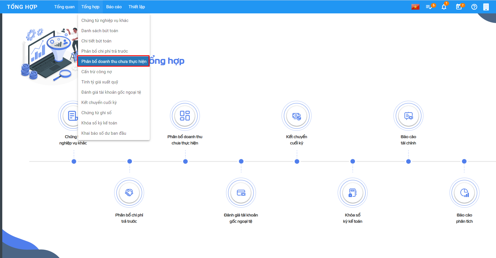

**Bước 2:** Người dùng thực hiện khai báo thông tin tại tab Thông tin chung và các tab khác

+ Nhập nội dung phân bổ 

+ Giá trị phân bổ được xác định từ: 

  - Nhập tay 
  - Chọn từ *Chọn chứng từ tập hợp chi phí* -> giá trị phân bổ không được sửa

+ Thông tin về thời gian phân bổ, ngày ghi nhận phân bổ; các thông tin liên quan đến tài khoản Doanh thu chưa thực hiện, tài khoản doanh thu, sổ nhật ký để ghi nhận các bút toán liên quan

  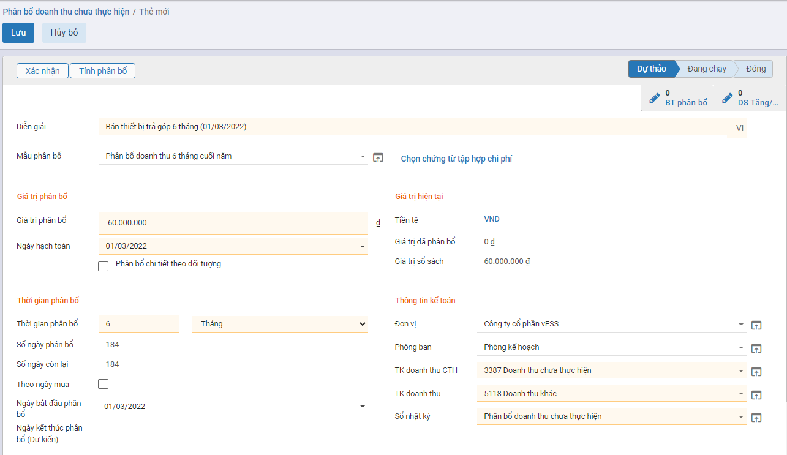

+ Nếu đã phân bổ doanh thu trước khi sử dụng phần mềm -> Người dùng thực hiện khai báo Giá trị đã phân bổ và thời gian đã phân bổ đầu kỳ tại mục *Thông tin phân bổ đầu kỳ*

  

+ Trường hợp người dùng chọn Tính phân bổ chi tiết theo đối tượng -> Thực hiện điền thông tin đối tượng phân bổ tại tab *Thiết lập phân bổ* -> Hệ thống ghi nhận bút toán phân bổ cho từng đối tượng tương ứng với đầu tài khoản chi phí và tỷ lệ phân bổ đã khai báo

  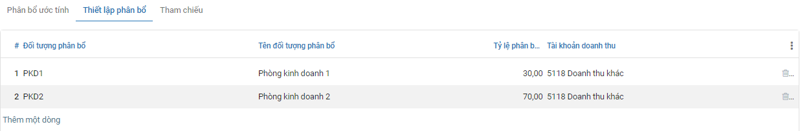

- Trường hợp người dùng chọn các chứng từ liên quan tới việc Phân bổ Doanh thu chưa thực hiện -> Chi tiết chứng từ được ghi nhận tại tab Nguồn gốc hình thành. Tài khoản của chứng từ sẽ ghi nhận thành Tài khoản Doanh thu chưa thực hiện

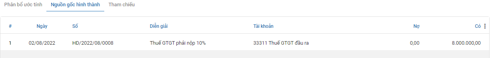

**Bước 3:** Nhấn nút Tính phân bổ để tính phân bổ doanh thu chưa thực hiện -> Giá trị phân bổ theo từng kỳ sẽ được ghi nhận tại tab *Phân bổ ước tính*

#### Quản lý thông tin phân bổ

*Giá trị phân bổ doanh thu chưa thực hiện sẽ được tính theo Phương pháp đường thẳng*.  Kết quả phụ thuộc vào các yếu tố dưới đây:

- [x] Phân bố doanh thu đã được thực hiện ngoài phần mềm hay chưa
- [x] Có tick *Theo ngày mua* hay không

- Bản ghi phân bổ doanh thu chưa thực hiện có tick *Theo ngày mua* -> Giá trị phân bổ sẽ được tính từ ngày theo ngày mua
- Bản ghi phân bổ không tick *Theo ngày mua* -> Giá trị phân bổ  sẽ được tính từ *Ngày hạch toán*
- Trường hợp Doanh thu đã được phân bổ 1 phần trước khi khai báo trên phần mềm-> Hệ thống thực hiện trừ Giá trị tiền đã phân bổ và Số ngày đã phân bổ ngoài phần mềm để tính ra giá trị phân bổ cho từng kỳ

  - Căn cứ vào Tổng số ngày phân bổ, Giá trị phân bổ và Tính phân bổ theo ngày thực tế hay không -> Hệ thống thực hiện tính ra giá trị phân bổ cho 1 ngày
- Từ giá trị phân bổ 1 ngày -> Tính ra giá trị phân bổ cho 1 tháng hoặc 1 năm
  - Khi người dùng nhấn nút **Xác nhận**, hệ thống sẽ ghi nhận bút toán và cập nhật lại số liệu liên quan đến Giá trị tiền tại tab thông tin chung:

    - Bút toán ghi nhận theo từng kỳ phân bổ
    - Ghi có Tài khoản doanh thu ( đối với bản ghi có thiết lập phân bổ cho đối tượng -> Ghi có tài khoản chi phí ứng với từng đối tượng)
      - Ghi nợ Tài khoản doanh thu chưa thực hiện
    - Giá trị tiền tại Tab Thông tin chung
      - Số tiền đã phân bổ tính dựa trên bút toán đã hạch toán và số tiền đã phân bổ ngoài phần mềm
    - Giá trị sổ sách = Nguyên giá - Số tiền đã phân bổ

#### Điều chỉnh Tăng giá trị/ thời gian phân bổ

**Mô tả:**

Khi doanh nghiệp có nhu cầu Tăng giá trị/ thời gian phân bổ doanh thu chưa thực hiện, hệ thống cập nhật thay đổi và tính toán lại giá trị phân bổ theo từng kỳ

**Các bước thực hiện:**

**Bước 1:** Chọn module **Tổng hợp** -> Chọn trên tab menu **Tổng hợp** -> Chọn **Phân bổ doanh thu chưa thực hiện**  -> Chọn bản ghi phân bổ muốn điều chỉnh Tăng

**Bước 2:** Nhấn nút **Điều chỉnh phân bổ**

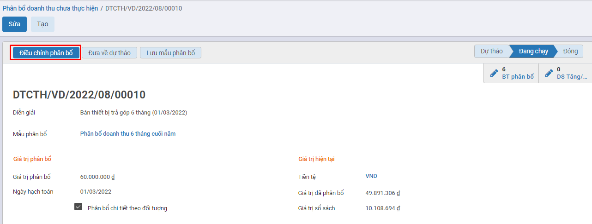

**Bước 3:** Người dùng thực hiện nhập liệu liên quan đến

- Lý do điều chỉnh
- Ngày điều chỉnh -> Hệ thống ghi nhận thay đổi từ ngày này
- Giá trị sau điều chỉnh
  - Nếu muốn tăng giá trị phân bổ -> Nhập giá trị còn lại mới > giá trị còn lại cũ
  - Nếu muốn tăng thời gian phân bổ -> Nhập thời gian phân bổ mới > thời gian phân bổ cũ

- Thông tin các đầu Tài khoản ghi nhận thay đổi tại mục *Thông tin Kế toán*

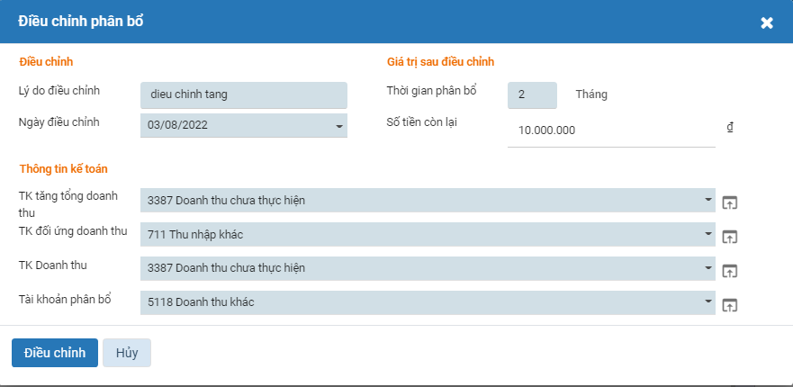

**Bước 4:** Nhấn nút *Điều chỉnh*

- Đối với bản ghi điều chỉnh thỏa mãn điều kiện sẽ ghi nhận giá trị Tăng  vào trường **Tổng giá trị tăng** tại tab Thông tin chung và tác động đến *Phân bổ ước tính* và *Sinh bút toán ghi nhận Tăng* *giá trị phân bổ tương ứng* như sau:

  - Tab phân bổ ước tính
    - Giá trị phân bổ được tính lại từ ngày điều chỉnh trên popup Điều chỉnh phân bổ
    - Các bút toán phân bổ trước ngày điều chỉnh vẫn được giữ nguyên theo giá trị chưa ghi nhận tăng

  - Bút toán ghi nhận Tăng giá trị
    - Ghi nợ Tài khoản đối ứng
    - Ghi có Tài khoản tăng tổng doanh thu

#### Điều chỉnh Giảm giá trị/thời gian phân bổ

**Mô tả:**

Khi doanh nghiệp có nhu cầu Giảm giá trị/ thời gian phân bổ doanh thu chưa thực hiện, hệ thống cập nhật thay đổi và tính toán lại giá trị phân bổ theo từng kỳ

**Các bước thực hiện:**

**Bước 1:** Chọn module **Tổng hợp** -> Chọn trên tab menu **Tổng hợp** -> Chọn **Phân bổ doanh thu chưa thực hiện**  -> Chọn bản ghi phân bổ muốn điều chỉnh Giảm

**Bước 2:** Nhấn nút **Điều chỉnh phân bổ**

**Bước 3:** Người dùng thực hiện nhập liệu liên quan đến

- Lý do điều chỉnh

- Ngày điều chỉnh -> Hệ thống ghi nhận thay đổi từ ngày này

- Giá trị sau điều chỉnh

  - Nếu muốn giảm giá trị phân bổ -> Nhập giá trị còn lại mới < giá trị còn lại cũ
  - Nếu muốn giảm thời gian phân bổ -> Nhập thời gian phân bổ mới < thời gian phân bổ cũ

- Thông tin các đầu Tài khoản ghi nhận thay đổi tại mục *Thông tin Kế toán*

  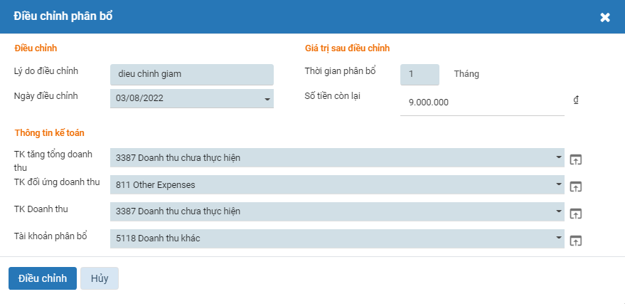

**Bước 4:** Nhấn nút *Điều chỉnh*

- Đối với bản ghi điều chỉnh thỏa mãn điều kiện -> hệ thống sẽ ghi nhận giá trị giảm giá trị phân bổ tại tab Thông tin chung và tác động đến *Phân bổ ước tính* và *Sinh bút toán ghi nhận Giảm* *giá trị phân bổ tương ứng* như sau:

  - Tab phân bổ ước tính
    - Giá trị phân bổ được tính lại từ ngày điều chỉnh trên popup Điều chỉnh phân bổ
    - Các bút toán phân bổ trước ngày điều chỉnh vẫn được giữ nguyên theo giá trị chưa ghi nhận Giảm

  - Bút toán ghi nhận Giảm giá trị
    - Ghi nợ Tài khoản doanh thu chưa thực hiện
    - Ghi có Tài khoản Doanh thu

## *Mẫu phân bổ chi phí trả trước*

Đối với phân bổ chi phí trả trước và doanh thu chưa thực hiện, Hệ thống hỗ trợ tính năng Quản lý mẫu để giúp người dùng chọn nhanh mẫu phân bổ cho từng bản ghi, rút ngắn các thao tác nhập thông tin tại mục Thời gian phân bổ, Thông tin kế toán

**Các bước thực hiện:**

**Bước 1:** Chọn module **Tổng hợp** -> Chọn trên tab menu **Thiết lập** -> Chọn Mẫu phân bổ chi phí trả trước> Chọn **Tạo**

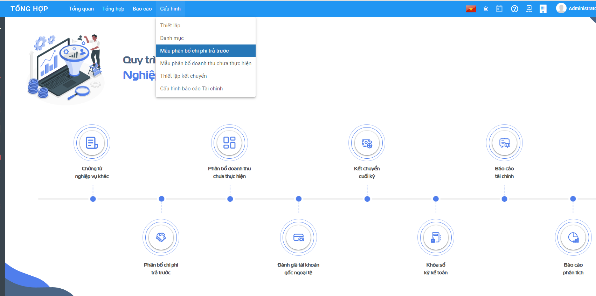

**Bước 2:** Nhập Diễn giải, thông tin về thời gian phân bổ, các đầu tài khoản ghi nhận bút toán

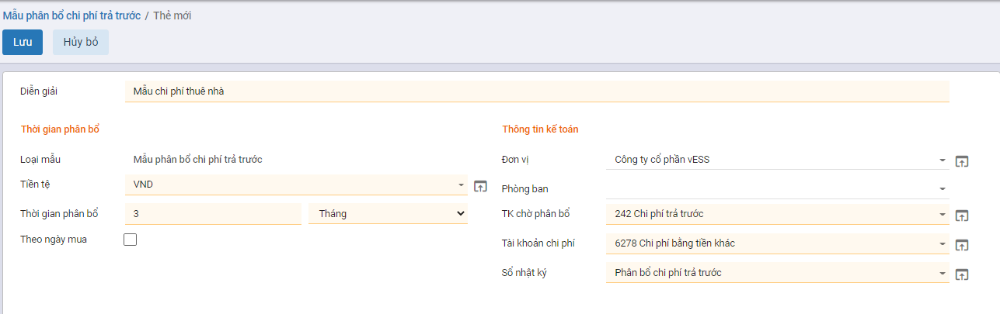

**Bước 3:** Nhấn nút **Lưu** để ghi nhận thông tin vừa nhập.

## *Mẫu phân bổ doanh thu chưa thực hiện*

Mẫu phân bổ doanh thu chưa thực hiện giúp người dùng chọn nhanh mẫu phân bổ cho từng bản ghi, rút ngắn các thao tác nhập thông tin tại mục Thời gian phân bổ, Thông tin kế toán

**Các bước thực hiện:**

**Bước 1:** Chọn module **Tổng hợp** ->**Cấu hình**-> Chọn **Mẫu phân bổ doanh thu chưa thực hiện** -> Chọn **Tạo**

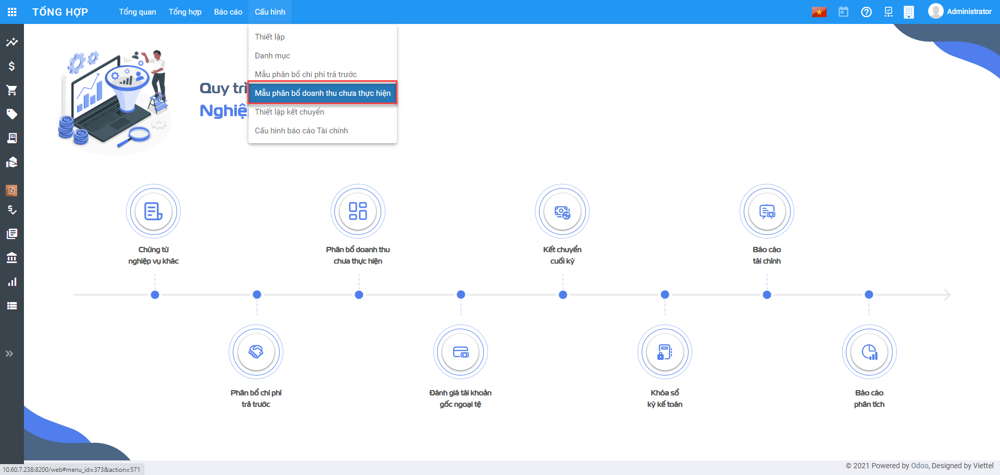

**Bước 2:** Nhập Diễn giải, thông tin về thời gian phân bổ, các đầu tài khoản ghi nhận bút toán

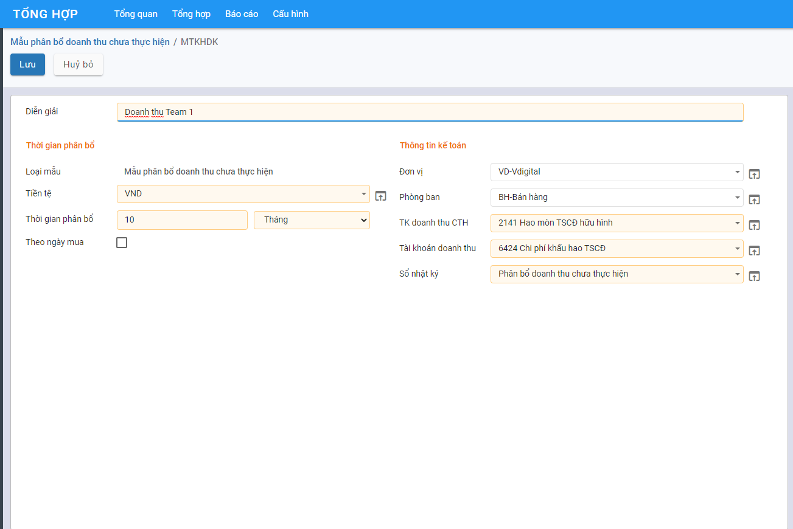

**Bước 3:** Nhấn nút **Lưu** để ghi nhận thông tin vừa nhập.

## *Tính tỷ giá xuất quỹ*

### Mô tả nghiệp vụ

**Nghiệp vụ**

Tính tỷ giá xuất quỹ cho phép tính tỷ giá xuất quỹ cho các chứng từ chi bằng ngoại tệ, giúp xác định tỷ giá xuất quỹ và xử lý chênh lệch giữa tỷ giá xuất quỹ và tỷ giá trên chứng từ gốc.

Việc tính tỷ giá xuất quỹ được thực hiện theo một trong hai trường hợp dưới đây:

- Tính tỷ giá xuất quỹ theo phương pháp bình quân tức thời: Mỗi lần thực hiện chi ngoại tệ bằng tiền mặt, tiền gửi, chương trình sẽ tự động xác định tỷ giá xuất quỹ trên chứng từ chi tiền khi áp dụng phương pháp này. Nếu như có phát sinh sửa chữa, thêm, bớt hoặc xóa các khoản thu, chi ngoại tệ,làm ảnh hưởng đến tỷ giá xuất quỹ, trên các chứng từ chi ngoại tệ đã lập,  kế toán sẽ thực hiện chức năng **Tính tỷ giá xuất quỹ**, để chương trình tự động tính lại tỷ giá xuất quỹ cho các chứng từ gốc.
- Tính tỷ giá xuất quỹ theo phương pháp bình quân cuối kỳ: Mỗi lần thực hiện chi ngoại tệ, chương trình sẽ không tự động xác định tỷ giá xuất quỹ trên chứng từ chi tiền khi áp dụng phương pháp này. Vào cuối kỳ, kế toán cần thực hiện chức năng **Tính tỷ giá xuất quỹ**, để xử lý chênh lệch giữa tỷ giá xuất quỹ và tỷ giá dùng để hạch toán.

### **Xem video hướng dẫn**

<iframe
    width="920"
    height="450"
    frameborder="0"
    allow="autoplay; encrypted-media; clipboard-write; gyroscope; picture-in-picture "
    allowfullscreen
    title="Module Tổng hợp - Tính tỷ giá xuất quỹ" 
    src="https://www.youtube.com/embed/YUDP-HXhpVw"
></iframe>

### Hướng dẫn trên phần mềm

#### Cấu hình phương pháp tính tỷ giá xuất quỹ

Tình tỷ giá xuất quỹ có 2 phương pháp thực hiện. Người dùng vào lựa chọn phương pháp sử dụng bằng cách vào phân hệ **Kế toán** , chọn **Cấu hình**, chọn **Thiết lập**. Tìm đến nhóm **Tiền tệ**, lựa chọn cho phép hệ thống **tính tỷ giá xuất quỹ** và chọn **Phương pháp tính tỷ giá**

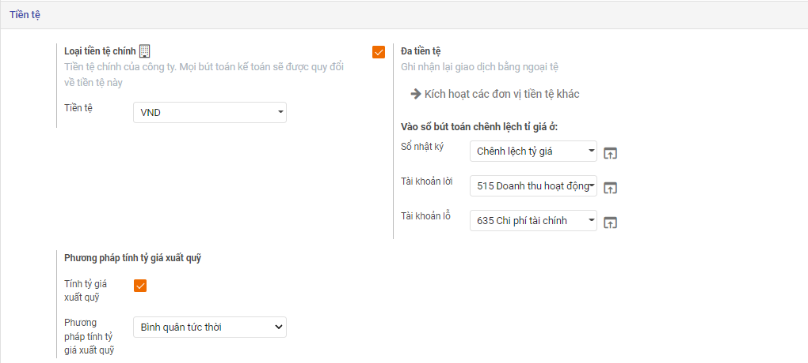

Việc tính tỷ giá xuất quỹ được thực hiện theo một trong hai trường hợp dưới đây:

#### Tính tỷ giá xuất quỹ 

Đối tượng thực hiện: Kế toán tổng hợp

**Bước 1**: Vào phân hệ **Tổng hợp**, Chọn **Tổng hợp**, chọn **Tỷ giá xuất quỹ** 

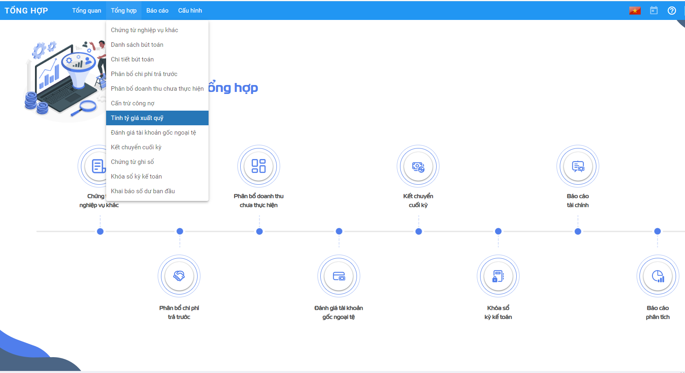

(Hoặc thực hiện **Tìm kiếm** trực tiếp chức năng trên ô tìm kiếm chung của hệ thống)

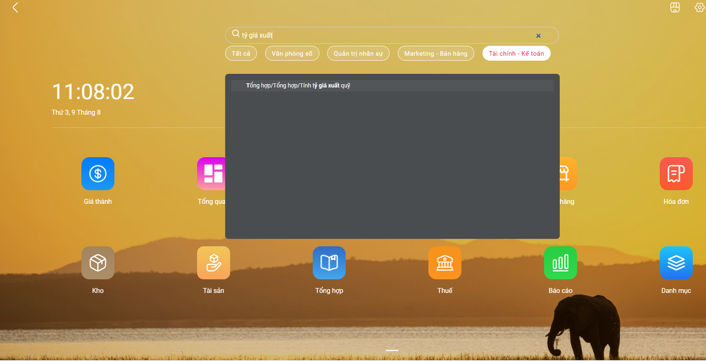

Hệ thống mở danh sách tỷ giá xuất quỹ

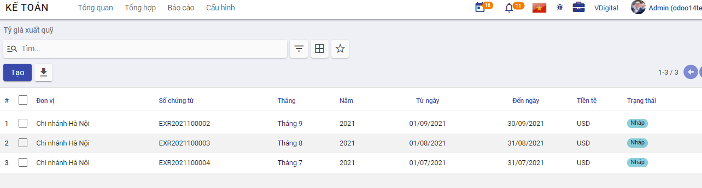

**Bước 2**: Thêm mới, nhập tháng,năm, tiền tệ cần thực hiện tính tỷ giá, nhấn lưu

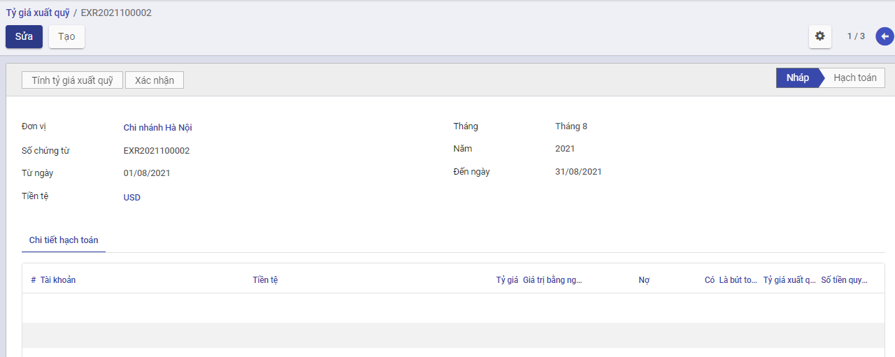

**Bước 3**: Nhấn **Tính tỷ giá xuất quỹ** . Chương trình sẽ tự động cập nhật tỷ giá xuất quỹ mới và số tiền chênh lệch vào các chứng từ chi ngoại tệ đã lập. 

Nếu áp dụng PP Bình quân cuối kỳ: Người dùng sẽ vào chức năng Tính tỷ giá xuất quỹ để tính toán lại tỷ giá xuất quỹ vào thời điểm cuối kỳ. Sau đó, hệ thống sẽ sinh chứng từ chênh lệch tỷ giá cuối kỳ  để tính toán lại chênh lệch lãi/lỗ cho tất cả những lần **Chi tiền** phát sinh trong kỳ được chọn.

Nếu áp dụng PP Bình quân tức thời: Hệ thống sẽ tự động tính lại tỷ giá xuất quỹ với **mỗi lần Thu tiền** và **cập nhật thông tin vào từng dòng phiếu chi** mới 

## *Cấn trừ công nợ*

### Mô tả nghiệp vụ

Chức năng thực hiện đối trừ chứng từ công nợ với chứng từ thanh toán và bù trừ công nợ phải thu/phải trả để quản lý những khoản thừa/thiếu phải thu/phải trả theo đối tượng hoặc thực hiện  bù trừ công nợ phải thu và công nợ phải trả của một đối tượng (khách hàng, nhà cung cấp, nhân viên) vừa là khách hàng, vừa là nhà cung cấp

### **Xem video hướng dẫn**

<iframe
    width="920"
    height="450"
    frameborder="0"
    allow="autoplay; encrypted-media; clipboard-write; gyroscope; picture-in-picture "
    allowfullscreen
    title="Module Tổng hợp - Cấn trừ công nợ" 
    src="https://www.youtube.com/embed/G4ABBd-gPjY"
></iframe>

### Hướng dẫn trên phần mềm

Đối tượng thực hiện: Kế toán tổng hợp

#### Đối trừ chứng từ

Có hai cách thực hiện đối trừ chứng từ:

##### **Cách 1: Thực hiện làm cấn trừ tại chức năng cấn trừ công nợ**

Bước 1: Vào phân hệ **Tổng hợp**, Chọn nhóm **Tổng hợp** , chọn chức năng **Cấn trừ công nợ** (Hoặc thực hiện **Tìm kiếm** trực tiếp chức năng trên ô tìm kiếm chung của hệ thống)

Bước 2: Lựa chọn loại chứng từ = **Đối trừ chứng từ**, đối tác, tài khoản, tiền tệ => Chương trình sẽ tự động liệt kê các chứng từ thanh toán và chứng từ công nợ thoả mãn điều kiện đã chọn

Bước 3: Chọn các chứng từ thanh toán được đối trừ cho các chứng từ công nợ bằng cách click button **Cấn trừ**.Hệ thống sẽ đẩy thông tin số tiền cấn trừ còn lại sang tab khác. Người dùng sẽ thực hiện tạo bút toán thủ công để xóa số chênh lệch trên tab **Khác** hoặc thực hiện cấn trừ theo số nhỏ hơn và phần chênh lệch sẽ được mở để cấn trừ lần sau

Bước 4: Nhấn **Cấn trừ**.

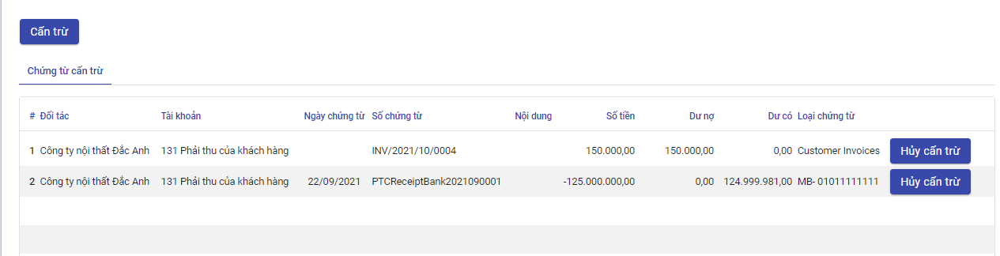

***Lưu ý:** Khi thực hiện đối trừ công nợ cho loại tiền ngoại tệ, nếu có phát sinh chênh lệch tỷ giá giữa chứng từ thanh toán và chứng từ công nợ, sau khi nhấn chọn **Cấn trừ**, chương trình sẽ tự động sinh ra chứng từ xử lý chênh lệch tỷ giá.*

Vào **Tổng hợp/Chi tiết bút toán**, tìm tới bút toán đã được cấn trừ, hệ thống sẽ hiển thị thông tin các bản ghi khớp cấn trừ với nhau

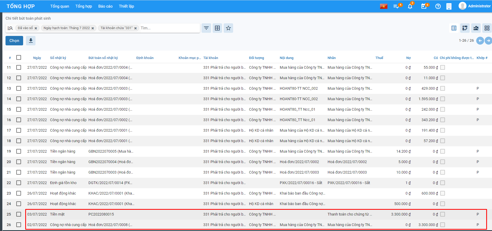

Để hủy cấn trừ, thực hiện tích chọn các bản ghi cần hủy, Nhấn **Hành động/ chưa đối soát**

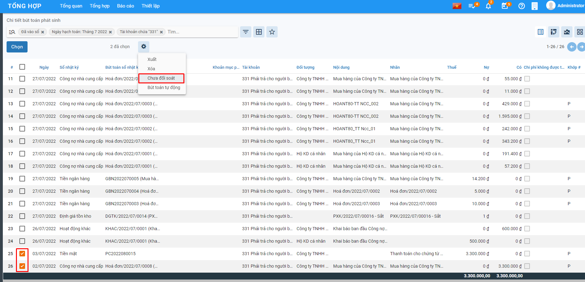

Xác nhận chọn chưa đối soát. Sau khi xác nhận thành công, hệ thống tự động hủy khớp tiền

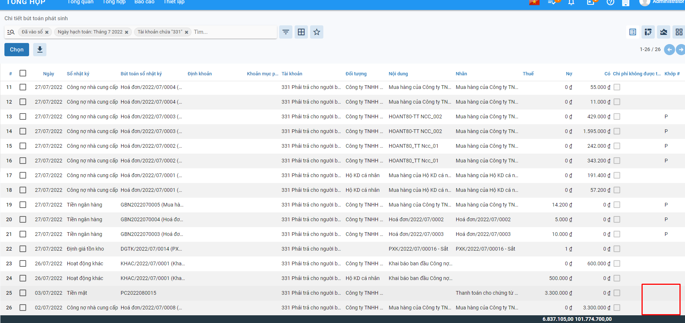

##### **Cách 2: Thực hiện đối trừ ngay tại chức năng cụ thể**

Vào một chức năng cụ thể, ví dụ như chứng từ mua hàng, tìm đến một chức từ mua hàng đã ghi sổ và chưa thanh toán hoặc thanh toán một phần

Xem chi tiết chứng từ. Vào tab chi tiết hóa đơn, kéo chuột xuống cuối. Tại đây, hệ thống sẽ hiển thị thông tin các chứng từ có thể thực hiện đối trừ

Nhấn nút **Thêm** trước chứng từ đươc lựa chọn , hệ thống sẽ thực hiện cấn trừ theo dữ liệu đã được lựa chọn

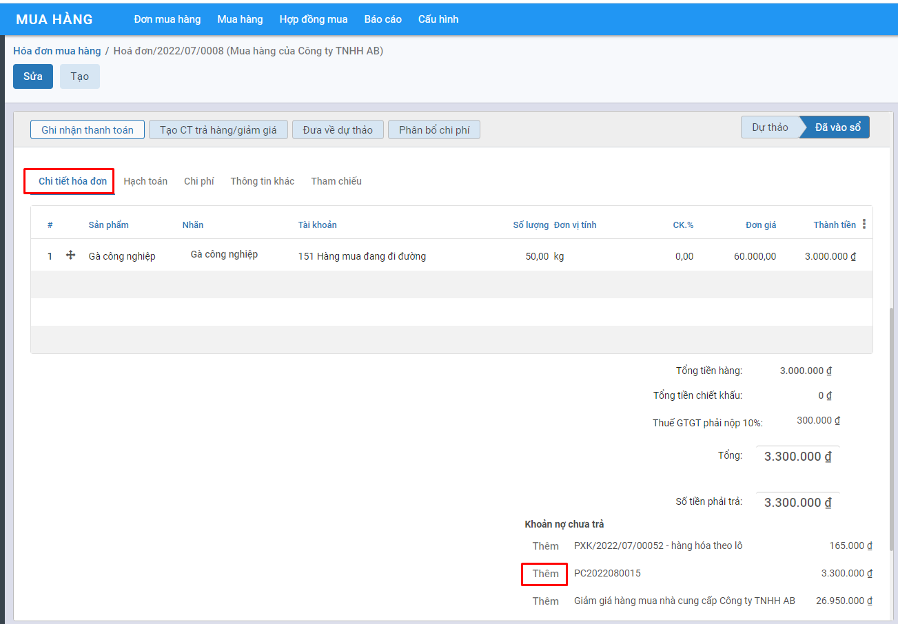

Sau khi thêm thành công, chứng từ mua hàng sẽ hiển thị thông tin **Đã trả** hoặc **Trả một phần** nếu số tiền cấn trừ chưa khớp với số tiền trên chứng từ mua hàng

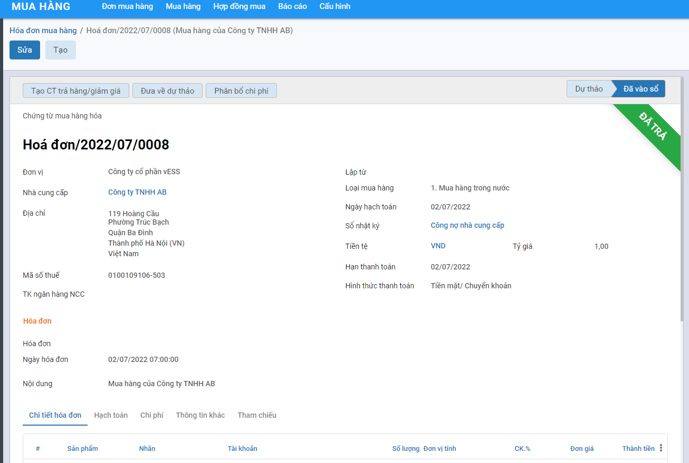

Vào **Tổng hợp/Chi tiết bút toán**, tìm tới bút toán đã được cấn trừ, hệ thống sẽ hiển thị thông tin các bản ghi khớp cấn trừ với nhau

Vào **Tổng hợp/Chi tiết bút toán**, tìm tới bút toán đã được cấn trừ, hệ thống sẽ hiển thị thông tin các bản ghi khớp cấn trừ với nhau

Để hủy cấn trừ, thực hiện tích chọn các bản ghi cần hủy, Nhấn **Hành động/ chưa đối soát**

Xác nhận chọn chưa đối soát. Sau khi xác nhận thành công, hệ thống tự động hủy khớp tiền

#### Bù trừ công nợ

Bước 1: Vào phân hệ **Kế toán**, Chọn nhóm **Tổng hợp** , chọn chức năng **Cấn trừ công nợ** (Hoặc thực hiện **Tìm kiếm** trực tiếp chức năng trên ô tìm kiếm chung của hệ thống)

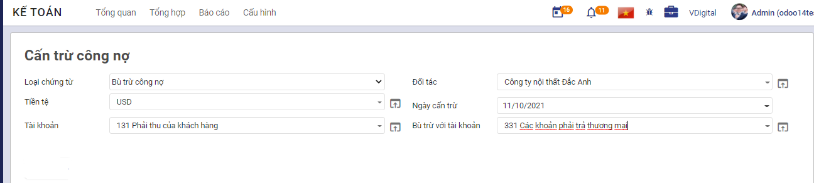

Bước 2: Lựa chọn loại chứng từ = **Bù trừ công nợ**, đối tác,tiền tệ, tài khoản, bù trừ với tài khoản => Chương trình sẽ tự động liệt kê các chứng từ thanh toán và chứng từ công nợ thoả mãn điều kiện đã chọn

Bước 3: Chọn các chứng từ thanh toán được bùtrừ cho các chứng từ công nợ bằng cách click button **Cấn trừ**.Hệ thống sẽ đẩy thông tin số tiền bù trừ còn lại sang tab khác. Người dùng sẽ thực hiện tạo bút toán thủ công để xóa số chênh lệch trên tab **Khác** hoặc thực hiện bù trừ theo số nhỏ hơn và phần chênh lệch sẽ được mở để cấn trừ lần sau

Bước 4: Nhấn **Cấn trừ**.Chương trình sẽ tự động sinh ra chứng từ bù trừ công nợ

***Lưu ý:** Khi thực hiện bù trừ công nợ cho loại tiền ngoại tệ, nếu có phát sinh chênh lệch tỷ giá giữa chứng từ thanh toán và chứng từ công nợ, sau khi nhấn chọn **Cấn trừ**, chương trình sẽ tự động sinh ra chứng từ xử lý chênh lệch tỷ giá.*

Vào **Tổng hợp/Chi tiết bút toán**, tìm tới bút toán đã được cấn trừ, hệ thống sẽ hiển thị thông tin các bản ghi khớp cấn trừ với nhau

Vào **Tổng hợp/Chi tiết bút toán**, tìm tới bút toán đã được cấn trừ, hệ thống sẽ hiển thị thông tin các bản ghi khớp cấn trừ với nhau

Để hủy cấn trừ, thực hiện tích chọn các bản ghi cần hủy, Nhấn **Hành động/ chưa đối soát**

Xác nhận chọn chưa đối soát. Sau khi xác nhận thành công, hệ thống tự động hủy khớp tiền

#### Bỏ chứng từ Cấn trừ công nợ

Áp dụng trong trường hợp thực hiện đối trừ sai giữa chứng từ thanh toán với chứng từ công nợ của khách hàng.

Bước 1: Vào phân hệ **Kế toán**, Chọn nhóm **Tổng hợp** , chọn chức năng **Chi tiết bút toán** (Hoặc thực hiện **Tìm kiếm** trực tiếp chức năng trên ô tìm kiếm chung của hệ thống)

Bước 2: Thực hiện tìm kiếm bút toán cần bỏ cấn trừ (Các bút toán có cấn trừ là bút toán có thông tin cột **Khớp**)

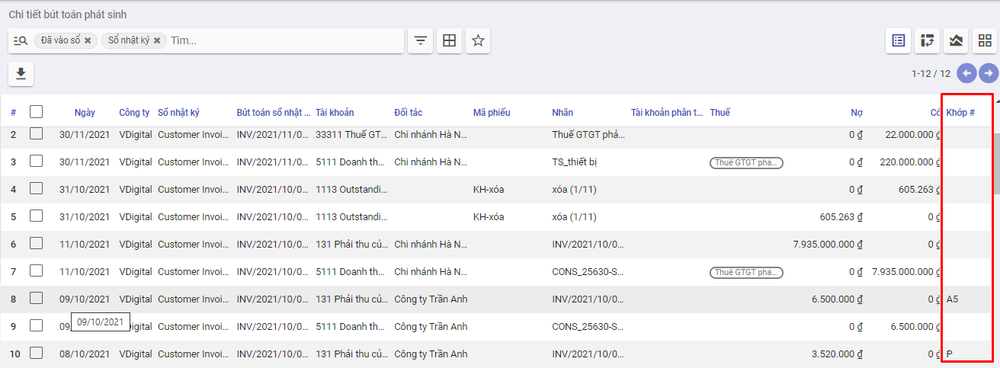

Bước 3: Chọn bút toán cần bỏ cấn trừ, nhấn tiện ích, chọn **Chưa đối soát**

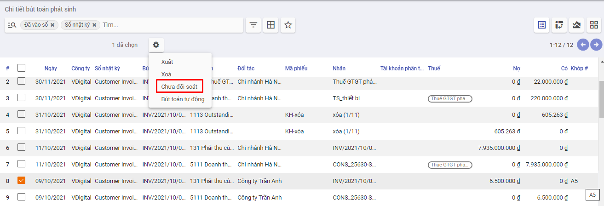

## *Đánh giá tài khoản gốc ngoại tệ*

### Quy trình nghiệp vụ

 Thực hiện đánh giá lại các khoản tiền ngoại tệ theo tỷ giá hối đoái do Ngân hàng Nhà nước Việt Nam công bố ở thời điểm cuối kỳ kế toán.

**Quy trình nghiệp vụ**

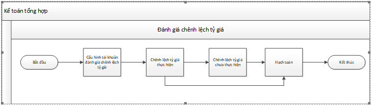

### **Xem video hướng dẫn**

<iframe
    width="920"
    height="450"
    frameborder="0"
    allow="autoplay; encrypted-media; clipboard-write; gyroscope; picture-in-picture "
    allowfullscreen
    title="Module Tổng hợp - Đánh giá tài khoản gốc ngoại tệ" 
    src="https://www.youtube.com/embed/UUg658k0sqc"
></iframe>

### Hướng dẫn trên phần mềm

**Bước 1**: Vào phân hệ **Tổng hợp** ==> Nhóm **Tổng hợp** ==> **Đánh giá Tài khoản gốc ngoại tệ** hoặc chọn chức năng **Đánh giá tài khoản gốc ngoại tệ** trên quy trình

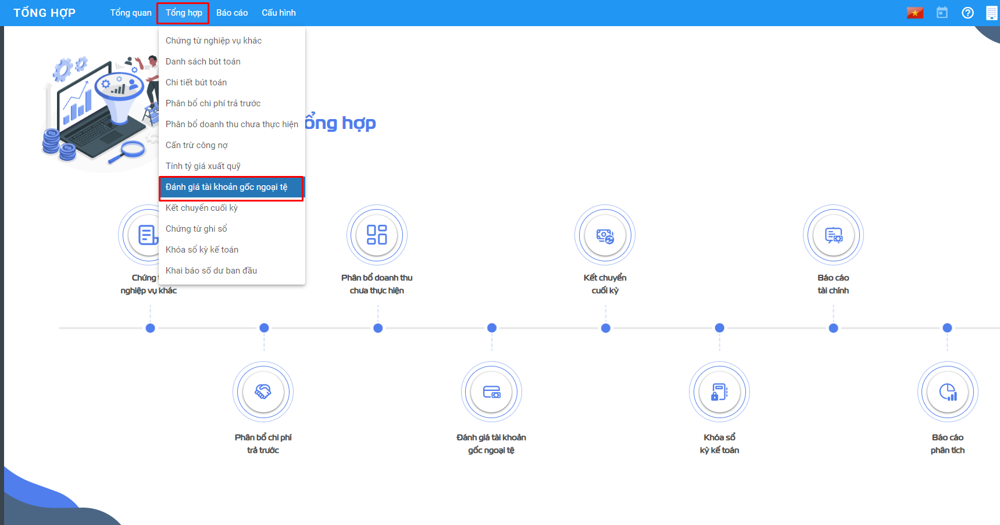

Danh sách bản ghi đánh giá chênh lệch được hiển thị. Nhấn nút "**Tạo**" để thêm mới thông tin

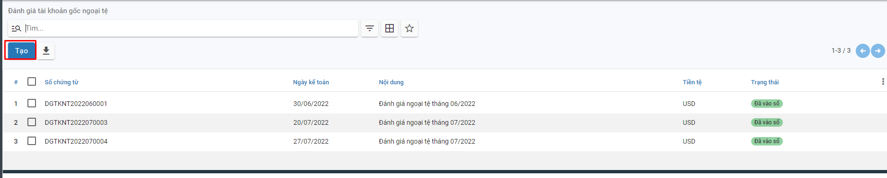

**Bước 2**: Thực hiện khai báo các thông tin bắt buộc. Chọn loại ngoại tệ và mốc thời gian đánh giá lại.

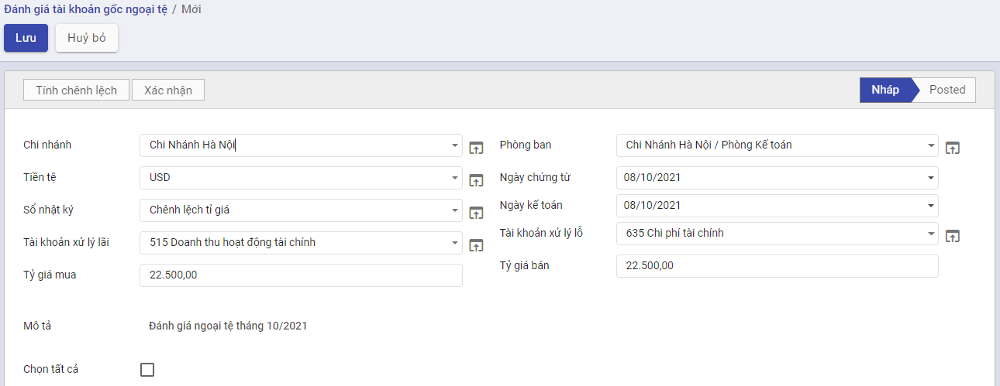

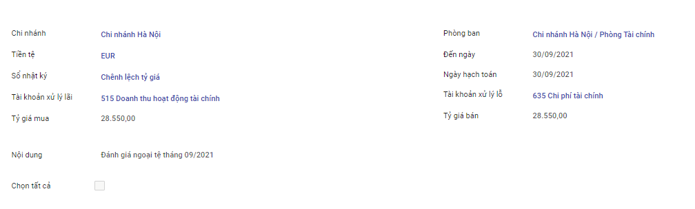

**Bước 3**: Khai báo tỷ giá sử dụng để đánh giá lại tài khoản ngoại tệ, cụ thể:

- Với đơn vị áp dụng chế độ kế toán theo TT200:
  - Khai báo **Tỷ giá mua**: để đánh giá lại các khoản mục tiền tệ có gốc ngoại tệ được phân loại là **Tài sản**.
  - Khai báo **Tỷ giá bán**: để đánh giá lại các khoản mục tiền tệ có gốc ngoại tệ được phân loại là **Nợ phải trả**.

- Với đơn vị áp dụng chế độ kế toán theo TT133:
  - Tại mục **Theo tỷ giá**: khai báo tỷ giá chuyển khoản trung bình cuối kỳ của ngân hàng thương mại nơi đơn vị thường xuyên có giao dịch.

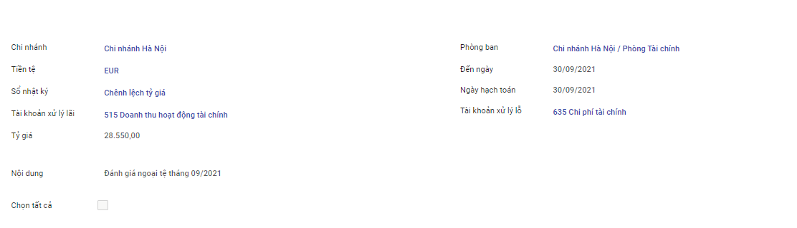

**Bước 4**: Chọn tài khoản xử lý lãi/lỗ chênh lệch tỷ giá.
**Bước 5**: Tại tab **Số dư ngoại tệ**: Hiển thị danh sách các tài khoản có số dư ngoại tệ theo loại ngoại tệ và mốc thời gian đánh giá lại đã thiết lập.

- Tích chọn các tài khoản muốn đánh giá lại: Chương trình sẽ tự động tính ra chênh lệch đánh giá lại tài khoản ngoại tệ.

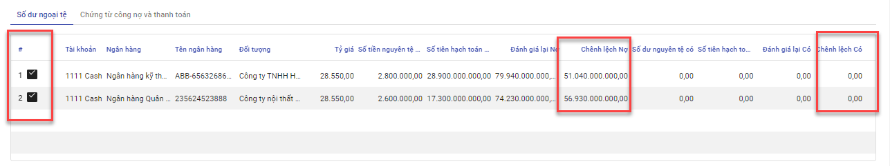

**Bước 6**: Tại tab **Chứng từ công nợ và thanh toán**: Hiển thị danh sách các chứng từ công nợ bằng ngoại tệ còn nợ và chứng từ thanh toán bằng ngoại tệ chưa được đối trừ hết.

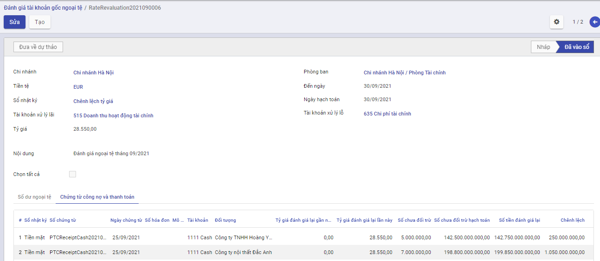

**Bước 7:** Nhấn **Tính chênh lệch**, chương trình tự động sinh ra chứng từ **Xử lý chênh lệch tỷ giá từ đánh giá lại tài khoản ngoại tệ**.

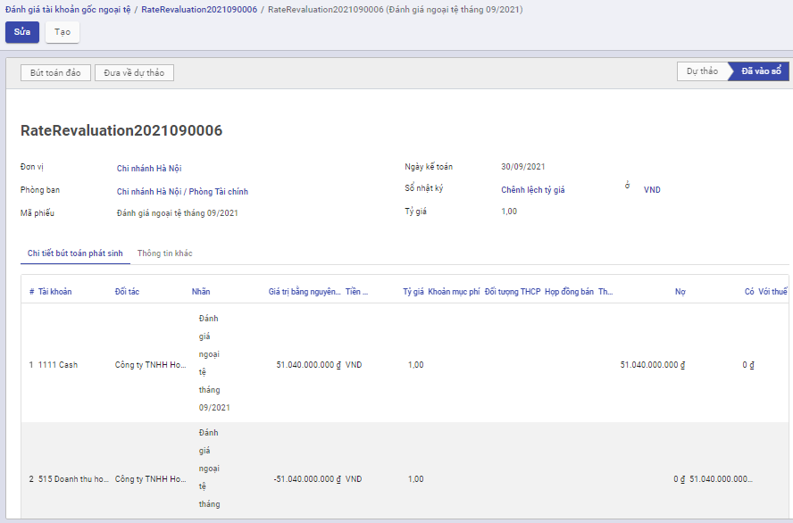

**Bước 8**: Nhấn **xác nhận** để thực hiện hạch toán vào sổ

**Lưu ý**: Phần mềm đã ngầm định TK xử lý lãi chênh lệch tỷ giá là TK 515 và TK xử lý lỗ chênh lệch tỷ giá là TK 635, kế toán có thể chọn lại TK xử lý lãi, lỗ chênh lệch tỷ giá là TK 413 nếu đánh giá lại ngoại tệ cuối năm.

## *Kết chuyển cuối kỳ*

### Mô tả nghiệp vụ

Chức năng kết chuyển cuối kỳ cho phép lập chứng từ kết chuyển cuối kỳ để xác định kết quả hoạt động sản xuất kinh doanh như: kết chuyển doanh thu, kết chuyển chi phí và kết chuyển lãi lỗ.

Nghiệp vụ **Kết chuyển cuối kỳ** được thực hiện trên phần mềm thông qua các bước:

- Khai báo các cặp tài khoản kết chuyển cuối kỳ
- Thực hiện kết chuyển lãi/lỗ kinh doanh cuối kỳ

### Hướng dẫn trên phần mềm

#### Cấu hình kết chuyển cuối kỳ

Đối tượng thực hiện: Kế toán tổng hợp

**Xem video hướng dẫn**:

<iframe
    width="920"
    height="450"
    frameborder="0"
    allow="autoplay; encrypted-media; clipboard-write; gyroscope; picture-in-picture "
    allowfullscreen
    title="Module Tổng hợp - Thiếp lập kết chuyển cuối kỳ" 
    src="https://www.youtube.com/embed/3hKeB_gEOqA?list=PLcdARb5pnnj9pfGcrvZ16mj-aXdfnNQJe"
></iframe>

**Bước 1**: Vào phân hệ **Tổng hợp**, Chọn nhóm **Cấu hình** , chọn chức năng **Thiết lập kết chuyển** (Hoặc thực hiện **Tìm kiếm** trực tiếp chức năng trên ô tìm kiếm chung của hệ thống)

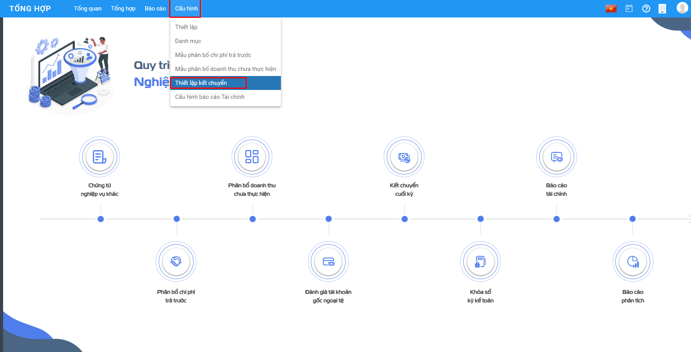

Danh sách cấu hình kết chuyển được hiển thị

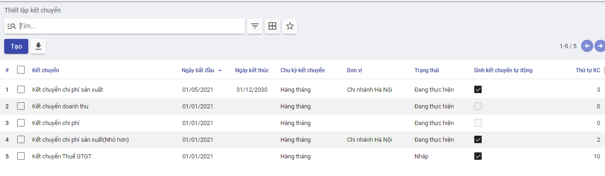

**Bước 2**: Nhấn **Tạo mới**, nhập đủ các thông tin:

- Cột **Thứ tự kết chuyển**: thể hiện thứ tự thực hiện của bút toán kết chuyển.
- Cột **Kết chuyển từ** và **Kết chuyển đến**: thể hiện kết chuyển số dư từ tài khoản nào đến tài khoản nào.
- Cột Bên kết chuyển: thể hiện bên lấy số dư khi kết chuyển. Cụ thể:
  - **Nợ**: Chỉ lấy số dư Nợ cuối kỳ để kết chuyển.
  - **Có**: Chỉ lấy số dư Có cuối kỳ để kết chuyển.
  - **Hai bên**: Bên nào có số dư sẽ kết chuyển bên đó.

**Bước 3**: Nhấn **Lưu** để lưu lại thông tin thiết lập

#### Kết chuyển cuối kỳ

**Đối tượng thực hiện**: Kế toán tổng hợp

**Xem video hướng dẫn**:

<iframe
    width="920"
    height="450"
    frameborder="0"
    allow="autoplay; encrypted-media; clipboard-write; gyroscope; picture-in-picture "
    allowfullscreen
    title="Module Tổng hợp - Kết chuyển cuối kỳ" 
    src="https://www.youtube.com/embed/G1Is6zW8WfY"
></iframe>

**Kết chuyển theo từng bút toán kết chuyển**

Bước 1: Vào phân hệ **Tổng hợp**, Chọn nhóm **Tổng hợp** , chọn chức năng **Kết chuyển cuối kỳ** (Hoặc thực hiện **Tìm kiếm** trực tiếp chức năng trên ô tìm kiếm chung của hệ thống)

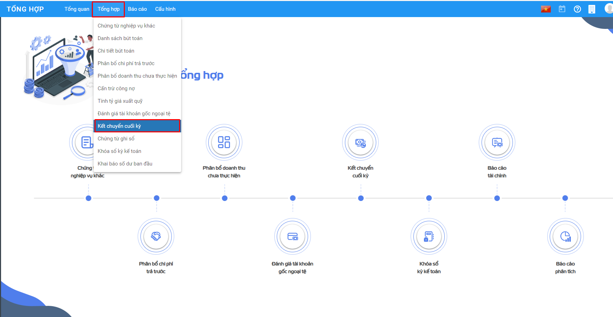

Danh sách kết chuyển cuối kỳ được hiển thị

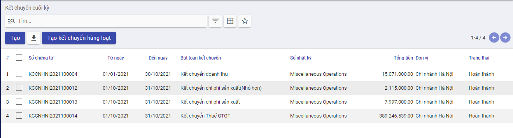

**Bước 2**: Nhấn **Tạo mới**, nhập các thông tin cần thiết: Đơn vị, sổ nhật ký, chọn bút toán kết chuyển, ngày hạch toán, từ ngày, đến ngày. Nhấn **Tính kết chuyển** => Hệ thống sinh và hạch toán bản ghi kết chuyển (đến ngày thực hiện) theo bút toán kết chuyển đã chọn

**Kết chuyển hàng loạt**

**Bước 1**: Vào phân hệ **Tổng hợp**, Chọn nhóm **Tổng hợp** , chọn chức năng **Kết chuyển cuối kỳ** (Hoặc thực hiện **Tìm kiếm** trực tiếp chức năng trên ô tìm kiếm chung của hệ thống)

Danh sách kết chuyển cuối kỳ được hiển thị

**Bước 2**: Chọn **Tạo kết chuyển hàng loạt**, hệ thống tự động hiển thị diễn giải và các bút toán kết chuyển theo thiết lập tài khoản kết chuyển

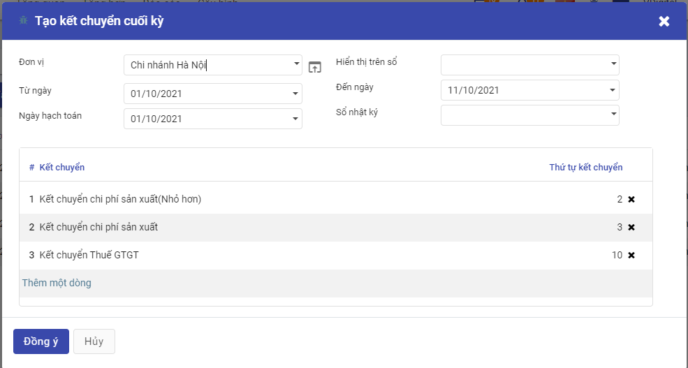

**Bước 3**: Nhấn **Đồng ý**,  Hệ thống sinh và hạch toán bản ghi kết chuyển (đến ngày thực hiện) theo bút toán kết chuyển đã chọn

## *Chứng từ ghi sổ*

### Mô tả nghiệp vụ

Chức năng Chứng từ ghi sổ cho phép thực hiện tạo và cập nhật số CTGS các bút toán của kế toán có đăng ký nhận số CTGS

Nghiệp vụ **Chứng từ ghi sổ** được thực hiện trên phần mềm gồm 2 luồng chức năng chính:

- Lập chứng từ ghi sổ đơn lẻ
- Lập chứng từ ghi sổ đồng loạt

### **Xem video hướng dẫn**

<iframe
    width="920"
    height="450"
    frameborder="0"
    allow="autoplay; encrypted-media; clipboard-write; gyroscope; picture-in-picture "
    allowfullscreen
    title="Module Tổng hợp - Chứng từ ghi sổ" 
    src="https://www.youtube.com/embed/ydQg7xd10j0"
></iframe>

### Hướng dẫn trên phần mềm

#### Lập chứng từ ghi sổ đơn lẻ

Đối tượng thực hiện: Kế toán tổng hợp

Bước 1: Vào phân hệ **Tổng hợp**, Chọn nhóm **Tổng hợp** , chọn chức năng **Chứng từ ghi sổ** (Hoặc thực hiện **Tìm kiếm** trực tiếp chức năng trên ô tìm kiếm chung của hệ thống)

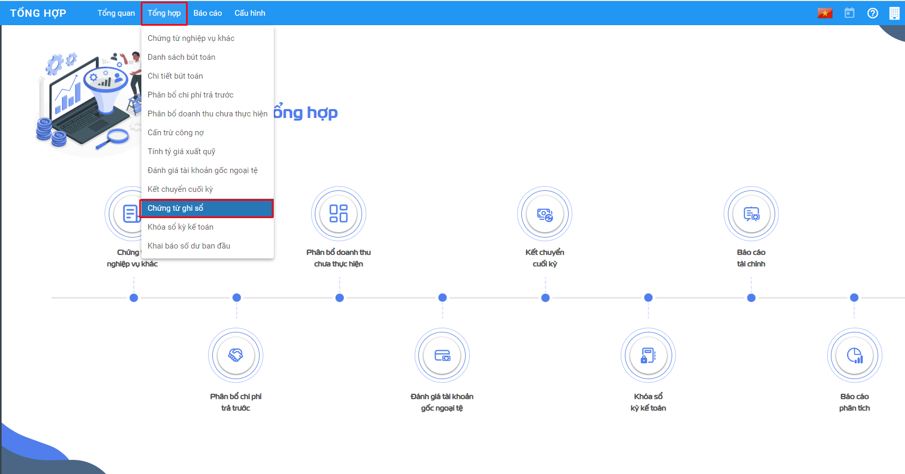

Danh sách chứng từ ghi sổ được hiển thị

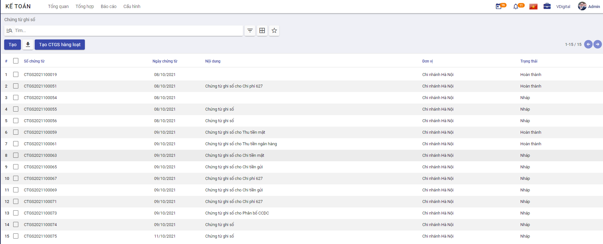

Bước 2: Nhấn **Tạo mới**, nhập đủ các thông tin:

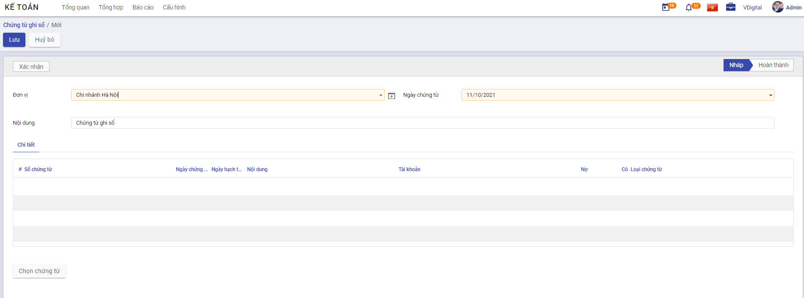

- Khai báo Nội dung, Ngày chứng từ, sau đó **Chọn chứng từ**.

- Thực hiện chọn **Loại chứng từ** cần đánh Chứng từ ghi sổ (Thông tin Loại chứng từ được khai báo tại **Danh mục Loại chứng từ**, với Khai báo về Thông tin điều kiện lọc của Tài khoản theo từng Loại chứng từ)
- Trên Danh sách bút toán đã được Lọc theo Loại chứng từ: Người dùng có thể tích chọn Toàn bộ chứng từ, hoặc Tích chọn các Chứng từ riêng lẻ

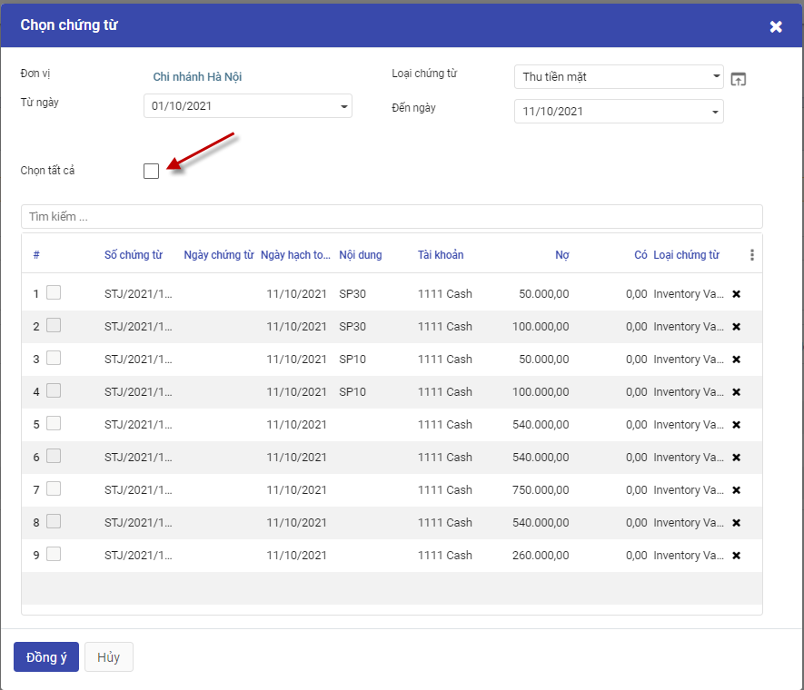

- Nhấn nút Đồng ý: Thông tin Chứng từ được chọn sẽ được đẩy xuống thông tin Chi tiết

Bước 3: Nhấn **Lưu**: Khi đó hệ thống thực hiện Lưu các thông tin đã nhậ của Chứng từ, với Trạng thái của chứng từ là **Nháp**

Bước 4: Nhấn **Xác nhận**: Khi đó toàn bộ các Chứng từ đã được chọn(Thông tin bút toán) sẽ được cập nhật thông tin Số Chứng từ ghi sổ chính là 'Số chứng từ' của bản ghi đã tạo

#### Lập chứng từ ghi sổ hàng loạt

Mục đích: Thực hiện Lập đồng thời cho các Loại chứng từ có phát sinh bút toán chưa được Đánh CTGS và phát sinh trong Kỳ thực hiện đánh CTGS.

Đối tượng thực hiện: Kế toán tổng hợp

Bước 1: Vào phân hệ **Kế toán**, Chọn nhóm **Tổng hợp** , chọn chức năng **Chứng từ ghi sổ** (Hoặc thực hiện **Tìm kiếm** trực tiếp chức năng trên ô tìm kiếm chung của hệ thống)

Danh sách chứng từ ghi sổ được hiển thị

Bước 2: Nhấn nút **'Tạo CTGS hàng loạt'**

- Trên Danh sách Loại chứng từ cần đánh số CTGS: Chọn Khoảng thời gian để tìm kiếm các Bút toán phát sinh và tích chọn Loại chứng từ cần đánh số CTGS

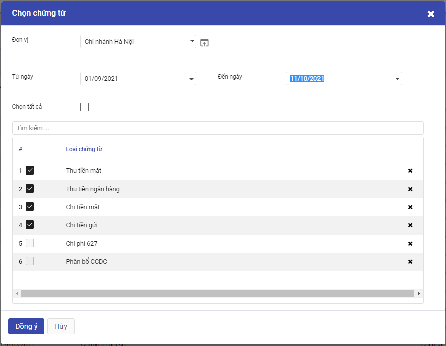

- Nhấn nút **Đồng ý**: hệ thống tự động tạo ra các Chứng từ ghi sổ: Ứng với mỗi chứng từ được tạo ra sẽ chứa Danh sách các Chứng từ tương ứng với từng Loại chứng từ đã chọn

  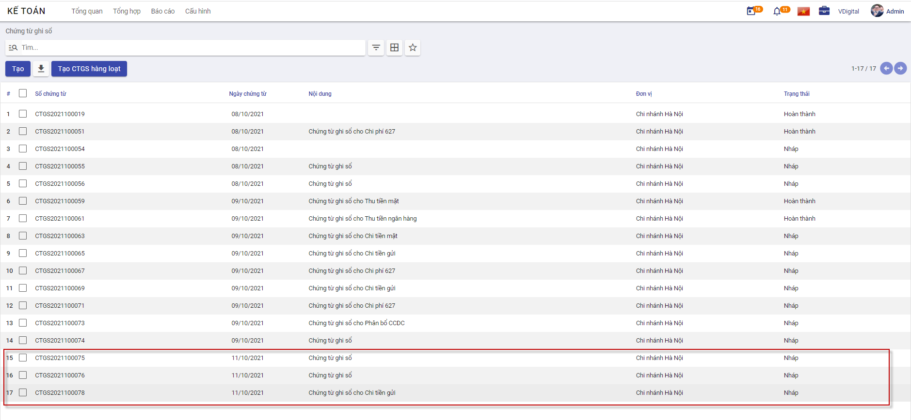

  

## *Khóa sổ kỳ kế toán*

### Mô tả nghiệp vụ

**Nghiệp vụ**

Cuối tháng hoặc sang những Ngày đầu tháng của tháng tiếp theo, kế toán đơn vị sẽ khai báo thông tin Khóa sổ kỳ kế toán để chốt sổ kế toán theo tháng.

Sau khi Ngày khóa sổ được Khai báo: Trên toàn bộ hệ thống sẽ **không Vào sổ/Hoặc Đưa về Nháp** với các chứng từ có **Ngày hạch toán Nhỏ hơn hoặc Bằng Ngày khóa sổ**

(Đóng băng kỳ Kế toán)

### **Xem video hướng dẫn**

<iframe
    width="920"
    height="450"
    frameborder="0"
    allow="autoplay; encrypted-media; clipboard-write; gyroscope; picture-in-picture "
    allowfullscreen
    title="Module Tổng hợp - Khóa sổ kỳ kế toán" 
    src="https://www.youtube.com/embed/stQXpxY7kMg?list=PLcdARb5pnnj8jeyvyhaptnwL3sxxT_QaK"
></iframe>

### **Hướng dẫn trên phần mềm**

Đối tượng thực hiện: Người dùng phần mềm

**Bước 1**: Vào phân hệ **Tổng hợp**: Chọn **Tổng hợp**: Chọn chức năng **Khóa sổ kỳ kế toán**

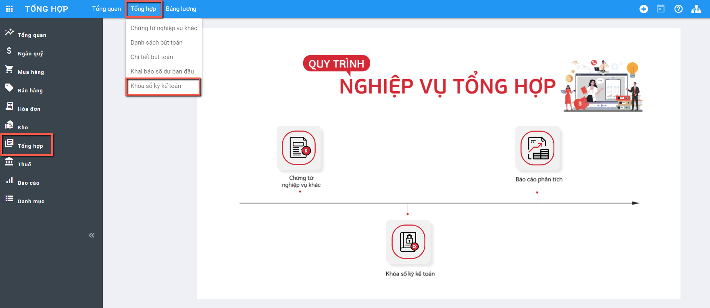

**Bước 2**: Hệ thống hiển thị thông tin màn hình chức năng:

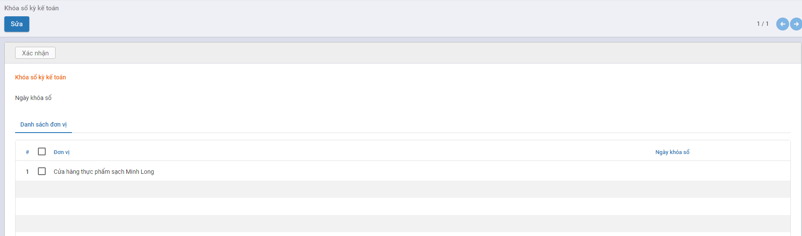

Các trường dữ liệu trên chức năng:

- Ngày khóa sổ: là thông tin Ngày thực hiện Nhập vào để chốt ngày khóa sổ
- Danh sách Đơn vị: Hiển thị mặc định thông tin Đơn vị mà User Người thực hiện đang được phân quyền. Trường hợp trước đó đã khai báo thông tin Khóa sổ cho 1 kỳ kế toán nào đó, thông tin Ngày khóa sổ sẽ hiển thị Kỳ khóa sổ gần nhất với thời điểm khai báo

**Bước 3**: Nhấn nút **Sửa** để thông tin Ngày khóa sổ được view và nhập dữ liệu

**Bước 4:** Thực hiện Nhập thông tin Ngày khóa sổ cho Kỳ kế toán và Đơn vị áp dụng

- Nhập Ngày khóa sổ
- Tích chọn Đơn vị áp dụng Ngày khóa sổ theo giá trị đã nhập

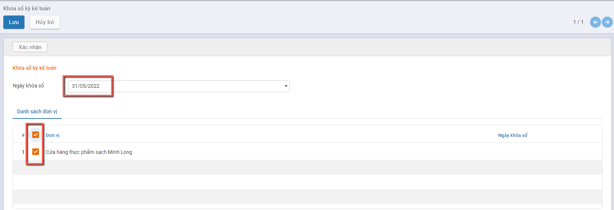

**Bước 5:** Nhấn nút **Xác nhận** để hoàn thành việc khai báo

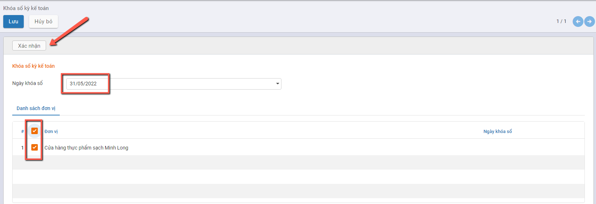

- **Trường hợp vẫn tồn tại các chứng từ có Ngày hạch toán Nhỏ hơn hoặc Bằng Ngày khóa sổ đang có Trạng thái Dự thảo/Nháp**: hệ thống sẽ báo  thông tin Số lượng Chứng từ cần hoàn thành vào Sổ trước khi áp dụng Ngày khóa sổ

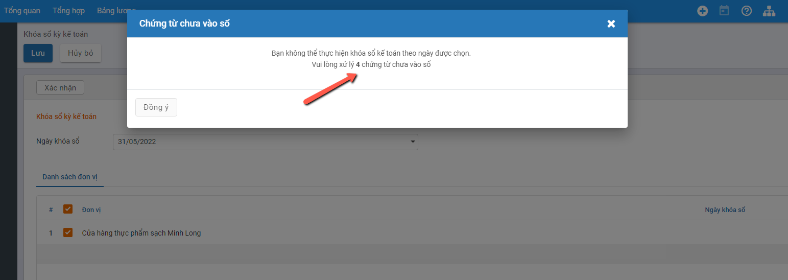

==> Nhấn nút **'Đồng ý'**: Hệ thống tự động view đủ các Chứng từ chưa vào sổ để Người dùng xử lý dữ liệu: Vào sổ hoặc Xóa bỏ dữ liệu (nếu kiểm tra là dữ liệu thừa)

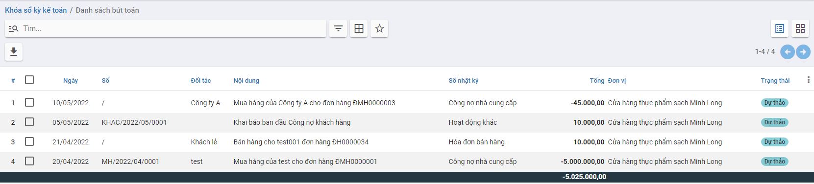

- Trường hợp **KHÔNG** tồn tại các chứng từ có Ngày hạch toán Nhỏ hơn hoặc Bằng Ngày khóa sổ đang có Trạng thái Dự thảo/Nháp: Hệ thống sẽ thực hiện Ghi nhận thông tin Ngày khóa Sổ đã nhập

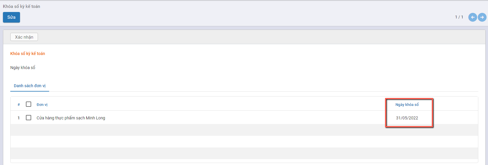
