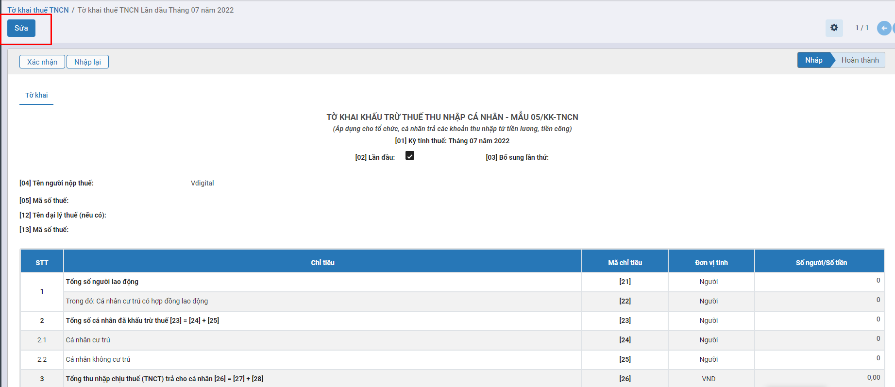
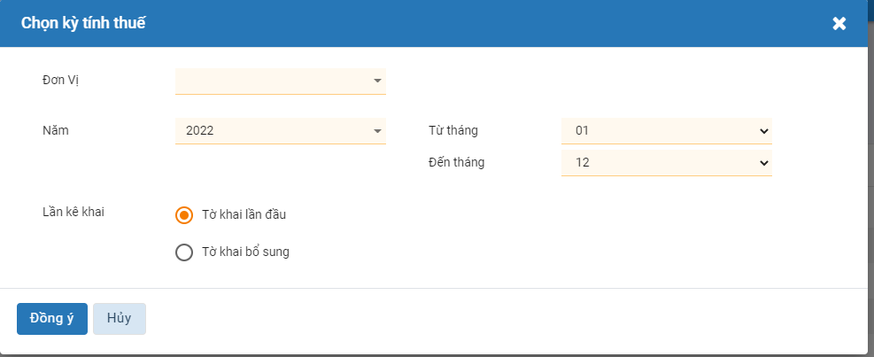

# *Quy trình nghiệp vụ*

Giúp thiết lập các thông tin như thông tin đại lý thuế để in lên báo cáo thuế trong trường hợp đơn vị thuê đại lý thuế kê khai thuế; thông tin đơn vị cung cấp dịch vụ kế toán để in lên báo cáo tài chính trong trường hợp đơn vị thuê đơn vị cung cấp dịch vụ kế toán lập báo cáo tài chính; thông tin cơ quan thuế phục vụ cho việc in báo cáo thuế từ phần mềm và nộp cho cơ quan thuế qua phần mềm HTKK.

### **Các luồng quy trình**

·     Thuế thu nhập doanh nghiệp. Chi tiết nghiệp vụ **[tại đây](#thue-thu-nhap-doanh-nghiep)**

·     Thuế thu nhập cá nhân. Chi tiết nghiệp vụ **[tại đây](#thue-thu-nhap-ca-nhan)**

·     Thuế tài nguyên. Chi tiết nghiệp vụ **[tại đây](#thue-tai-nguyen)**

·     Thuế tiêu thụ đặc biệt. Chi tiết nghiệp vụ **[tại đây](#thue-tieu-thu-ac-biet)**

·     Thuế giá trị gia tăng. Chi tiết nghiệp vụ **[tại đây](#thue-gia-tri-gia-tang)**

## *Thuế thu nhập doanh nghiệp*

### Mô tả nghiệp vụ

**Nghiệp vụ**

Nhân viên kinh doanh tìm kiếm khách hàng thông qua khách hàng tiềm năng, khách hàng cũ, đối tác, nhà phân phối

Nhân viên kinh doanh sẽ tiếp thị, giới thiệu sản phẩm dịch vụ để chào hàng

Đối với những khách hàng có nhu cầu mua sản phẩm/dịch vụ, nhân viên kinh doanh sẽ tiến hành:

- Căn cứ kết quả sản xuất, kinh doanh, kế toán thực hiện tạm nộp số thuế thu nhập doanh nghiệp của quý chậm nhất vào ngày thứ ba mươi của quý tiếp theo quý phát sinh nghĩa vụ thuế; doanh nghiệp không phải nộp tờ khai thuế thu nhập doanh nghiệp tạm tính hàng quý.
-  Kết thúc năm tài chính, kế toán căn cứ kết quả hoạt động sản xuất kinh doanh của doanh nghiệp tính toán thuế TNDN phải nộp trong năm.
-  Kế toán nộp tờ khai quyết toán thuế TNDN năm cho cơ quan thuế.
-  Kế toán nhận lại tờ khai quyết toán thuế TNDN năm đã xác nhận của cơ quan thuế (nếu nộp trực tiếp) hoặc nhận được mail xác nhận đã nhận được tờ khai của cơ quan thuế (nếu nộp qua mạng).
- Nếu phải nộp thêm thì nộp bổ sung cho Kho bạc, nếu đã nộp quá thì được giảm trừ vào số thuế nộp lần sau.Quyết toán thuế TNDN (03/TNDN)

### **Xem video hướng dẫn**

<iframe
    width="920"
    height="450"
    frameborder="0"
    allow="autoplay; encrypted-media; clipboard-write; gyroscope; picture-in-picture "
    allowfullscreen
    title="Module thuế - Thuế thu nhập doanh nghiệp" 
    src="https://www.youtube.com/embed/mfykUBaroiU"
></iframe>

### Hướng dẫn trên phần mềm

**Các bước thực hiện**

**Bước 1 :** Vào phân hệ **Thuế**, Chọn **Thuế thu nhập Doanh nghiệp**, **Chọn Quyết toán thuế TNDN (03/TNDN)** (Hoặc thực hiện **Tìm kiếm** trực tiếp chức năng trên ô tìm kiếm chung của hệ thống), Nhấn **Tạo**

**Bước 2 :** Tại **Chọn kỳ tính thuế** thực hiện nhập dữ liệu đầu vào của tờ khai thuế

* Tại Đơn vị: Chọn Đơn vị cần quyết toán thuế

- Tại Năm: Chọn Năm cần quyết toán

- Tại Từ ngày….Đến ngày: Nhập thời gian quyết toán

- Tại Loại tờ khai: Nhập Loại tờ khai thuế

-     Tại Phụ lục: Chọn Phục lục nộp thuế

**Bước 3 :** Nhấn **Đồng ý** để tạo tờ khai tạo tờ khai quyết toán thuế TNDN (03/TNDN)

**Chú ý**: Nếu đã tồn tại tờ khai quyết toán thuế doanh nghiệp có cùng đơn vị, cùng năm kê khai thì thực hiện chọn Loại tờ khai là Tờ khai bổ sung.

Hệ thống không cho phép tạo tờ khai bổ sung khi đã tồn tại tờ khai liền kề trước đó có cùng đơn vị, năm ở trạng thái Nháp.

**Bước 4 :** Tại tab Tờ khai nhấn **Sửa** để thực hiện nhập thông tin tờ khai

- Tại Phụ lục: Chọn Phục lục nộp thuế  Tích chọn **Doanh nghiệp có quy mô vừa và nhỏ** hoặc **Doanh nghiệp có cơ sở hạch toán phụ thuộc** hoặc **Doanh nghiệp thuộc đối tượng kê khai thông tin giao dịch liên kết**

-  **[04] Ngành nghề có tỷ lệ doanh thu cao nhất**: Chọn ngành nghề có doanh thu cao nhất của doanh nghiệp

- **[05] Tỷ lệ (%)**: Tỷ lệ phần trăm doanh thu của ngành nghề được chọn

-      **Tab Chỉ tiêu tờ khai**: Các chỉ tiêu được thực hiện lấy dữ liệu tương ứng theo cấu hình chỉ tiêu
-     Tại **L. Gia hạn nộp thuế (nếu có)** : Thực hiện nhập các thông tin nếu doanh nghiệp được gia hạn nộp thuế

-      Tại **M. Tiền chậm nộp của khoản chênh lệch từ 20% trở nên đến ngày hết hạn nộp hồ sơ quyết toán thuế TNDN (trường hợp kê khai quyết toán và nộp thuế theo quyết toán trước thời hạn thì tính đến ngày nộp thuế)** : Thực hiện khai báo số ngày nộp chậm, thời gian, và số tiền nộp chậm

-     Tại mục **I. Ngoài các Phụ lục của tờ khai này, chúng tôi gửi kèm các tài liệu sau,** thực hiện nhấn **Tệp đính kèm** để thực hiện đính kèm các tài liệu liên quan

**Bước 4:** Khai báo thông tin tại *Phụ lục*

**Phụ lục 03-01A/TNDN**

Phụ lục kết quả hoạt động sản xuất kinh doanh dành cho người nộp thuế thuộc các ngành sản xuất, thương mại, dịch vu.

Để thêm mới phụ lục thì người dùng có thể chọn lúc tạo tờ khai quyết toán thuế doanh nghiệp hoặc nhấn **Thêm phụ lục** và chọn Phụ lục 03-01A/TNDN

Nhấn Lấy dữ liệu để hệ thống tự động tính dữ liệu theo các chỉ tiêu được cấu hình ở Cấu hình *Phụ lục 03-1A_TNDN* tại Cấu hình thuế thu nhập doanh nghiệp.

**Phụ lục 03-02A/TNDN**

Khi làm tờ khai quyết toán thuế TNDN 03/TNDN, nếu doanh nghiệp của bạn năm nay (tức năm đang làm tờ khai quyết toán) có phát sinh thu nhập chịu thuế và có số lỗ của các năm trước còn trong thời hạn chuyển lỗ vào năm quyết toán thuế thì làm **phụ lục 03-2A/TNDN** để giảm thu nhập chịu thuế.

Để thêm mới phụ lục thì người dùng có thể chọn lúc tạo tờ khai quyết toán thuế doanh nghiệp hoặc nhấn **Thêm phụ lục** và chọn Phụ lục 03-02A/TNDN

Nhấn *Lấy dữ liệu* để hệ thống tự động tính dữ liệu theo các chỉ tiêu được cấu hình ở Cấu hình **Phụ lục 03-2A_TNDN** tại Cấu hình thuế thu nhập doanh nghiệp.

-  Năm phát sinh lỗ: Hiển thị năm năm gần nhất với năm quyết toán
-  Số lỗ phát sinh: Tự động tính tổng tiền thuế của chỉ tiêu C4 tại tab Chỉ tiêu tờ khai nếu C4 < 0 với Tờ khai theo từng năm 

- Số lỗ đã chuyển trong các kỳ tính thuế trước: Tự động tính Tổng số lỗ được chuyển trong kỳ tình thuế này của những tờ khai theo từng năm 
-  Số lỗ được chuyển trong kỳ tính thuế này: Tự động tính Số lỗ còn được chuyển của năm , số tiền của chỉ tiêu C4 mà >0 tại tab Chỉ tiêu tờ khai đang thực hiện

-     Số lỗ được chuyển sang các kỳ thuế sau : Mặc định bằng Số lỗ phát sinh – Số lỗ đã chuyển trong các kỳ tính thuế trước – Số lỗ được chuyển trong kỳ tính thuế này

**Bước 5:** Nhấn **Lưu** sau khi đã kê khai xong

**Bước 6:** Người dùng nhấn **Xác nhận** để hoàn thành kê khai thuế

**Bước 7:** Nhấn **Xuất XML** để thực hiện xuất file xml theo yêu cầu

## *Thuế thu nhập cá nhân*

### Mô tả nghiệp vụ

* Hàng tháng/quý, doanh nghiệp khấu trừ thuế Thu nhập cá nhân của công nhân viên
  * ​		Nợ TK 3341       Phải trả công nhân viên
  * ​		Có TK 3335       Thuế thu nhập cá nhân
*  Nộp thuế TNCN vào NSNN
  * Nợ TK 3335      Thuế thu nhập cá nhân
  * Có TK 111/112    Tiền mặt/Tiền gửi ngân hàng
* Cuối năm, thực hiện quyết toán thuế TNCN. Nếu phát sinh số thuế TNCN được hoàn thì hạch toán như sau:
  * Nhận tiền hoàn thuế TNCN:
    * Nợ TK111/112    Tiền mặt/Tiền gửi ngân hàng\
    * Có TK 3388       Phải trả khác
  * Trả tiền hoàn thuế cho công nhân viên
    * Nợ TK 3388           Phải trả khác
    * Có TK 111/112        Tiền mặt/Tiền gửi ngân hàng

### Xem video hướng dẫn

<iframe
    width="920"
    height="450"
    frameborder="0"
    allow="autoplay; encrypted-media; clipboard-write; gyroscope; picture-in-picture "
    allowfullscreen
    title="Module thuế - Thuế thu nhập cá nhân" 
    src="https://www.youtube.com/embed/4ugrAQ5Awr4"
></iframe>

### Hướng dẫn trên phần mềm

#### Tờ khai thuế thu nhập cá nhân

**Các bước thực hiện**

**Bước 1**: Vào phân hệ **Thuế**, Chọn **Thuế thu nhập cá nhân**, **Chọn Tờ khai thuế** (Hoặc thực hiện **Tìm kiếm** trực tiếp chức năng trên ô tìm kiếm chung của hệ thống), Nhấn **Tạo**

**Bước 2:** Tại *Chọn kỳ tính thuế* thực hiện khai báo các thông tin để tạo tờ khai thuế

- Tại Đơn vị: Chọn Đơn vị kê khai thuế
- Tích chọn Tờ khai tháng hoặc Tờ khai quý
  -  Nếu tờ khai tháng: Chọn Tháng và Năm kê khai thuế
  -  Nếu tờ khai quý: Chọn Qúy và Năm kê khai thuế
- Tích chọn Tờ khai 

+ Nếu tờ khai bổ sung: Nhập lần khai bổ sung. Hệ thống mặc định số lần tính theo kỳ khai báo thuế

Nhấn **Đồng ý** để thực hiện tạo tờ khai thuế TNCN

NOTE: Nếu đã tồn tại tờ khai quyết toán thuế thu nhập cá nhân có cùng đơn vị, cùng kỳ kê khai thì thực hiện chọn Loại tờ khai là Tờ khai bổ sung.

Hệ thống không cho phép tạo tờ khai bổ sung khi đã tồn tại tờ khai liền kề trước đó có cùng đơn vị, năm ở trạng thái Nháp.

**Bước 3:** Tại tab Tờ khai nhấn **Sửa** để thực hiện nhập thông tin tờ khai

Thực hiện khai báo thông tin theo từng chỉ tiêu trong bảng tờ khai.

**Bước 4:** Nhấn **Lưu** sau khi đã kê khai xong

**Bước 5:** Người dùng nhấn **Xác nhận** để hoàn thành kê khai thuế

**Bước 6:** Nhấn **Xuất XML** để thực hiện xuất file xml theo yêu cầu

#### Tờ khai quyết toán thuế TNCN

**Các bước thực hiện**

**Bước 1:** Vào phân hệ **Thuế**, Chọn **Thuế thu nhập cá nhân**, **Chọn Tờ khai quyết toán thuế TNCN** (Hoặc thực hiện **Tìm kiếm** trực tiếp chức năng trên ô tìm kiếm chung của hệ thống), Nhấn **Tạo**

**Bước 2:** Tại tab *Chọn kỳ tính thuế* thực hiện khai báo các thông tin để tạo tờ khai thuế

 

* Tại Đơn vị: Chọn Đơn vị cần quyết toán thuế

- Tại Năm: Chọn 

- Tích chọn Lần kê khai:
  -  Tờ khai lần đầu: Tích chọn để áp dụng  
  -  Nếu tờ khai bổ sung: Nhập lần khai bổ sung. Hệ thống mặc định số lần tính theo kỳ khai báo thuế

Nhấn **Đồng ý** để thực hiện tạo tờ khai quyết toán thuế TNCN

NOTE: Nếu đã tồn tại tờ khai quyết toán thuế thu nhập cá nhân có cùng đơn vị, cùng kỳ kê khai thì thực hiện chọn Loại tờ khai là Tờ khai bổ sung.

Hệ thống không cho phép tạo tờ khai bổ sung khi đã tồn tại tờ khai liền kề trước đó có cùng đơn vị, kỳ quyết toán ở trạng thái Nháp.

**Bước 3:** Nhấn **Sửa** để thực hiện nhập thông tin tab **05-QTT-TNCN**

Tab **05-1BK-QTT-TNCN** nhấn **Thêm một dòng** để thực hiện khai báo dữ liệu Phụ lục bảng kê khai chi tiết cá nhân thuộc diện t ính thuế theo bảng lũy tiến từng phần

 

Tab **05-2BK-QTT-TNCN** nhấn **Thêm một dòng** để thực hiện khai báo dữ liệu Phụ lục bảng kê khai chi tiết cá nhân thuộc diện tính thuế theo bảng lũy tiến toàn phần

Tab **05-3BK-QTT-TNCN** nhấn **Thêm một dòng** để thực hiện khai báo dữ liệu Phụ lục bảng kê thông tin người phụ thuộc giảm trừ gia cảnh

Note:  Tại các Tab bảng kê 05-1BK-QTT-TNCN, 05-2BK-QTT-TNCN, 05-3BK-QTT-TNCN, nhấn **Mẫu tải bảng kê** để thực hiện tải file excel mẫu về để điền thông tin. Và nhấn **Tải bảng kê** để thực hiện tải thông tin từ file excel đã nhập vào bảng kê tương ứng

**Bước 4:** Nhấn **Lưu** sau khi đã kê khai xong

**Bước 5:** Người dùng nhấn **Xác nhận** để hoàn thành kê khai thuế

**Bước 6:** Nhấn **Xuất XML** để thực hiện xuất file xml theo yêu cầu

## *Thuế tài nguyên*

### Mô tả nghiệp vụ

* Hàng tháng có phát sinh thuế tài nguyên, kế toán lập tờ khai thuế tài nguyên theo mẫu số 01-TAIN.

-  Nhận được tờ khai có xác nhận của cơ quan thuế (nếu nộp trực tiếp), hoặc nhận được mail xác nhận đã nhận báo cáo của cơ quan thuế (nếu nộp qua mạng).

-  Hạch toán thuế tài nguyên vào chi phí sản xuất.
- Khi thực nộp thuế tài nguyên vào Kho bạc nhà nước, hạch toán giảm thuế đã nộp.

### Xem video hướng dẫn

<iframe
    width="920"
    height="450"
    frameborder="0"
    allow="autoplay; encrypted-media; clipboard-write; gyroscope; picture-in-picture "
    allowfullscreen
    title="Module thuế - Thuế tài nguyên" 
    src="https://www.youtube.com/embed/ku2zKqpkPBM"
></iframe>

### Hướng dẫn trên phần mềm

#### Tờ khai thuế tài nguyên (01/TANI)

**Các bước thực hiện**

**Bước 1:** Vào phân hệ **Thuế**, Chọn **Thuế thu tài nguyên**, **Chọn Tờ khai thuế tài nguyên (01/TANI)** (Hoặc thực hiện **Tìm kiếm** trực tiếp chức năng trên ô tìm kiếm chung của hệ thống), Nhấn **Tạo**

**Bước 2:** Tại tab *Tờ khai thuế tài nguyên (01/TAIN)* thực hiện khai báo các thông tin để tạo tờ khai thuế

* Tại Đơn vị: Chọn Đơn vị kê khai thuế

- Tích chọn Tờ khai tháng hoặc Tờ khai lần phát sinh

+ Nếu tờ khai tháng: Chọn Tháng kê khai thuế

* Nếu Tờ khai lần phát sinh: Chọn ngày kê khai thuế 

- Tích chọn Loại tờ khai 
  -  Nếu tờ khai bổ sung: Nhập lần khai bổ sung. Hệ thống mặc định số lần tính theo kỳ khai báo thuế

Nhấn **Đồng ý** để thực hiện tạo tờ khai thuế tài nguyên

**Chú ý**: Nếu đã tồn tại tờ khai quyết toán thuế doanh nghiệp có cùng đơn vị, cùng kỳ kê khai thì thực hiện chọn Loại tờ khai là Tờ khai bổ sung.

Hệ thống không cho phép tạo tờ khai bổ sung khi đã tồn tại tờ khai liền kề trước đó có cùng đơn vị, năm ở trạng thái Nháp.

**Bước 3: **Tại tab Tờ khai nhấn **Sửa** để thực hiện nhập thông tin tờ khai

Nhấn **Thêm một dòng** để thực hiện khai báo thuế thông tin các tài nguyên tính thuế phát sinh trong kỳ bao gồm các thông tin: Tên loại tài nguyên, Sản lượng, Giá tính thuế đơn vị tài nguyên hoặc Mức thuế tài nguyên ấn định trên một đơn vị tài nguyên, Thuế tài nguyên dự kiến được miễn giảm trong kỳ (nếu có).

**Lưu ý:** *Với tài nguyên áp dụng* **Giá tính thuế** *theo quy định của UBND tỉnh, Kế toán thực hiện sửa* **Biểu thuế tài nguyên** *để khai báo* **Giá tính thuế** *theo quy định, khi lập tờ khai thuế tài nguyên chương trình sẽ ngầm định* **Giá tính thuế đơn vị tài nguyên** *theo giá đã khai báo.*

**Bước 4:** Nhấn **Lưu** sau khi đã kê khai xong

**Bước 5:** Người dùng nhấn **Xác nhận** để hoàn thành kê khai thuế

**Bước 6:** Nhấn **Xuất XML** để thực hiện xuất file xml theo yêu cầu

#### Tờ khai quyết toán thuế tài nguyên (02/TAIN)

**Các bước thực hiện**

**Bước 1:** Vào phân hệ **Thuế**, Chọn **Thuế thu nhập cá nhân**, Chọn **Tờ khai quyết toán thuế** **tài nguyên (02/TAIN)** (Hoặc thực hiện **Tìm kiếm** trực tiếp chức năng trên ô tìm kiếm chung của hệ thống), Nhấn **Tạo**

**Bước 2:** Tại tab *Tờ khai quyết toán thuế tài nguyên (02/TAIN)* thực hiện khai báo các thông tin để tạo tờ khai thuế

 

* Tại Đơn vị: Chọn Đơn vị cần quyết toán thuế

- Tại Năm: Chọn năm quyết toán thuế

- Tích chọn Loại tờ khai:
  -  Tờ khai lần đầu: Tích chọn để áp dụng 
  - Nếu tờ khai bổ sung: Nhập lần khai bổ sung. Hệ thống mặc định số lần tính theo kỳ khai báo thuế

Nhấn **Đồng ý**  để thực hiện tạo tờ khai quyết toán thuế tài nguyên

**Chú ý**: Nếu đã tồn tại tờ khai quyết toán thuế tài nguyên có cùng đơn vị, cùng kỳ kê khai thì thực hiện chọn Loại tờ khai là Tờ khai bổ sung.

Hệ thống không cho phép tạo tờ khai bổ sung khi đã tồn tại tờ khai liền kề trước đó có cùng đơn vị, kỳ quyết toán ở trạng thái Nháp.

**Bước 3:** Nhấn **Sửa** để thực hiện nhập thông tin tab Tờ khai

Nhấn **Thêm một dòng** để kê khai các tài nguyên tính thuế phát sinh trong kỳ.

**Bước 4:** Nhấn **Lưu** sau khi đã kê khai xong

**Bước 5:** Người dùng nhấn **Xác nhận** để hoàn thành kê khai thuế

Bước 6: Nhấn **Xuất XML** để thực hiện xuất file xml theo yêu cầu

## *Thuế tiêu thụ đặc biệt*

### Mô tả nghiệp vụ

* Căn cứ doanh thu tiêu thụ hàng chịu thuế TTĐB, kế toán tính ra số thuế tiêu thụ đặc biệt phải nộp trong tháng.

-  Kế toán thuế lập hồ sơ khai thuế TTĐB tháng.

-  Kế toán nộp hồ sơ kê khai thuế cho cơ quan thuế, nếu như phải nộp thuế TTĐB thì nộp tiền thuế cho cơ quan thuế, có thể nộp trực tiếp hoặc nộp qua mạng.
- Cơ quan thuế xác nhận vào hồ sơ khai thuế của đơn vị.
- Kế toán thuế nhận hồ sơ khai thuế đã được cơ quan thuế xác nhận, lưu trữ.

### Xem video hướng dẫn

<iframe
    width="920"
    height="450"
    frameborder="0"
    allow="autoplay; encrypted-media; clipboard-write; gyroscope; picture-in-picture "
    allowfullscreen
    title="Module thuế - Thuế tiêu thụ đặc biệt" 
    src="https://www.youtube.com/embed/DkbFwLOvbpU"
></iframe>

### Hướng dẫn trên phần mềm

**Các bước thực hiện**

**Bước 1:** Vào phân hệ **Thuế**, Chọn **Thuế tiêu thụ đặc biệt**, **Chọn Thuế tiêu thụ đặc biệt** (Hoặc thực hiện **Tìm kiếm** trực tiếp chức năng trên ô tìm kiếm chung của hệ thống), Nhấn **Tạo**

**Bước 2:** Tại tab *Chọn kỳ tính thuế* Khai báo các thông tin để tạo tờ khai thuế

* Tại Đơn vị: Chọn Đơn vị kê khai thuế

- Tại Năm: Chọn năm kê khai thuế

- Tại Tháng: Chọn tháng kê khai thuế

- Tại Phụ lục: Chọn phụ lục kê khai thuế
-    Tích chọn Loại tờ khai
  - Nếu tờ khai bổ sung: Nhập lần khai bổ sung. Hệ thống mặc định số lần tính theo kỳ khai báo thuế**

Nhấn **Đồng ý** để thực hiện tạo tờ khai thuế tài nguyên

**Chú ý**: Nếu đã tồn tại tờ khai quyết toán thuế tài nguyên có cùng đơn vị, cùng kỳ kê khai thì thực hiện chọn Loại tờ khai là Tờ khai bổ sung.

Hệ thống không cho phép tạo tờ khai bổ sung khi đã tồn tại tờ khai liền kề trước đó có cùng đơn vị, năm ở trạng thái Nháp.

**Bước 3: **Tại tab Tờ khai sẽ tự động tổng hợp thông tin tại tab Bảng kê hóa đơn hàng hóa để xác định số thuế TTĐB phải nộp trong kỳ.

Lưu ý: Riêng số liệu tại tab **PL01-1/TTĐB** chương trình sẽ không tự động chuyển sang tab Tờ khai mà Kế toán phải tự xác định và nhập tay vào cột Thuế TTĐB được khấu trừ.

Tại tab Bảng kê hóa đơn bán hàng, chương trình tự động lấy lên các hóa đơn hàng hóa, dịch vụ bán ra chịu thuế TTĐB và thuộc kỳ tính thuế.

Lưu ý: Nhấn vào hóa đơn ở cột **Số** để xem chi tiết hóa đơn hàng hóa dịch vụ bán ra chịu thuế.

Nhấn **Thêm phụ lục** hoặc thực hiện chọn Phụ lục **PL01-1/TTĐB/TT195** lúc tạo tờ khai để thực hiện nhập tay các thông tin liên quan đến số thuế TTĐB được khấu trừ (nếu có) vào nội dung tương ứng.

**Bước 4:** Nhấn **Lưu** sau khi đã kê khai xong

**Bước 5:** Người dùng nhấn **Xác nhận** để hoàn thành kê khai thuế

**Bước 6:** Nhấn **Xuất XML** để thực hiện xuất file xml theo yêu cầu

## *Thuế giá trị gia tăng*

### Mô tả nghiệp vụ

Khi phát sinh nghiệp vụ thuế GTGT, thông thường sẽ có các hoạt động sau:

* Kế toán tập hợp các hóa đơn, chứng từ mua hàng, dịch vụ để ghi nhận thuế GTGT đầu vào

- Kế toán tập hợp các hóa đơn, chứng từ bán ra để ghi nhận thuế GTGT bán ra

- Kế toán thuế Lập Hồ sơ khai thuế GTGT tháng/quí
- Kế toán nộp Hồ sơ kê khai thuế GTGT tháng/quí cho cơ quan thuế, nếu như phải nộp thuế GTGT thì nộp tiền thuế GTGT vào kho bạc, đồng thời kế toán thuế hạch toán khấu trừ thuế GTGT
- Cơ quan thuế xác nhận vào hồ sơ khai thuế của đơn vị
-  Kế toán thuế nhận hồ sơ khai thuế đã được cơ quan thuế xác nhận, lưu trữ. 

### Xem video hướng dẫn

<iframe
    width="920"
    height="450"
    frameborder="0"
    allow="autoplay; encrypted-media; clipboard-write; gyroscope; picture-in-picture "
    allowfullscreen
    title="Module thuế - Thuế giá trị gia tăng" 
    src="https://www.youtube.com/embed/mo4S4af6Rxg"
></iframe>

### Hướng dẫn trên phần mềm

**Các bước thực hiện**

#### Thuế GTGT khấu trừ (01/GTGT)

**Bước 1:** Vào phân hệ **Thuế**, Chọn **Thuế giá trị gia tăng**, **Chọn** Thuế GTGT khấu trừ (01/GTGT) (Hoặc thực hiện **Tìm kiếm** trực tiếp chức năng trên ô tìm kiếm chung của hệ thống), Nhấn **Tạo**

**Bước 2:** Tại tab *Chọn kỳ tính thuế* thực hiện khai báo các thông tin để tạo tờ khai thuế

- Tại Đơn vị: Chọn đơn vị kê khai thuế

- Nếu kê khai theo tháng thì tích chọn Tờ khai tháng và khai báo:
  -  Tháng: Chọn tháng kê khai
  - Năm: Chọn Năm kê khai

- Nếu kê khai lần đầu thì chọn Tò khai lần đầu / Kê khai lần n+1 cho cùng kỳ, cùng đơn vị thì chọn Tờ khai bổ sung

- Tại Phụ lục thực hiện chọn phụ lục kê khai

Nhấn **Đồng ý** để tạo tờ khai thuế GTGT

**Chú ý**: Nếu đã tồn tại tờ khai quyết toán thuế giá trị gia tăng có cùng đơn vị, cùng kỳ kê khai thì thực hiện chọn Loại tờ khai là Tờ khai bổ sung.

Hệ thống không cho phép tạo tờ khai bổ sung khi đã tồn tại tờ khai liền kề trước đó có cùng đơn vị, năm ở trạng thái Nháp.

**Bước 3:** Tại tab Tờ khai tự động tổng hợp số liệu lên tờ khai, riêng các chỉ tiêu sau cần tự xác định và nhập tay vào tờ khai:

- Chỉ tiêu [32a]: Hàng hóa, dịch vụ bán ra không tính thuế.
- Chỉ tiêu 40b: Thuế GTGT mua vào của dự án đầu tư (cùng tỉnh, thành phố trực thuộc trung ương) được bù trừ với thuế GTGT còn phải nộp của hoạt động sản xuất kinh doanh cùng kỳ tính thuế.
-   Chỉ tiêu 4.1.1: Thuế GTGT đề nghị hoàn (tài khoản 1331).
-  Chỉ tiêu 4.1.2: Thuế GTGT đề nghị hoàn (tài khoản 1332).

Tại tab **PL01-1/GTGT** tự động lấy lên các hóa đơn, chứng từ bán ra thuộc kỳ tính thuế.

- Hóa đơn, chứng từ bán ra được lấy lên tờ khai phải thỏa mãn điều kiện: Có chọn thuế suất thuế GTGT, có đủ số và ngày hóa đơn (riêng chứng từ chi tiền mặt, chi tiền gửi, chứng từ nghiệp vụ khác, hóa đơn trả lại hàng bán, hóa đơn trả lại hàng mua thì phải thỏa mãn thêm điều kiện: không chọn Nhóm HHDV mua vào)

Tại tab **PL01-2/GTGT** tự động lấy lên các hóa đơn, chứng từ mua vào chưa được kê lên bảng kê của các kỳ trước và có ngày < hoặc = ngày cuối cùng của kỳ tính thuế.

- Hóa đơn, chứng từ mua vào được lấy lên bảng kê phải thỏa mãn điều kiện: Có chọn **Nhóm HHDV** là nhóm 1,2; có đủ số và ngày hóa đơn
- Có thể bỏ bớt các chứng từ không muốn lấy lên bảng kê bằng cách chọn chức năng* **Chọn chứng từ** *và bỏ tích chọn các chứng từ không muốn lấy lên bảng kê.*

Tại tab **PL01-5/GTGT** nhấn **Thêm một dòng** *để thực hiện kê khai số thuế giá trị gia tăng đã nộp của doanh thu kinh doanh xây dựng, lắp đặt bán hàng bất động sản ngoại tỉnh*

Tại tab **PL01-6/GTGT** nhấn** **Thêm một dòng** *để khai báo phân bổ thuế giá trị gia tăng cho địa phương nơi đóng trụ sở chính và cho các địa phương nơi có sản xuất trực thuộc không thực hiện hạch toán kế toán*

Tại tab **PL01-7/GTGT** nhấn ***Thêm một dòng*** *để kê khai bảng phân bổ giá trị gia tăng phải nộp cho các địa phương nơi có công trình xây dựng, lắp đặt liên tỉnh*

**Bước 4:** Nhấn **Lưu** sau khi đã kê khai xong

**Bước 5:** Người dùng nhấn **Xác nhận** để hoàn thành kê khai thuế

**Bước 6:** Nhấn **Xuất XML** để thực hiện xuất file xml theo yêu cầu

​												 

#### Thuế GTGT đầu tư (02/GTGT)

**Mô tả nghiệp vụ**

Các trường hợp phải lập tờ khai thuế GTGT cho dự án đầu tư:

- Người nộp thuế thuộc đối tượng nộp thuế GTGT theo phương pháp khấu trừ có dự án đầu tư tại địa bàn tỉnh, thành phố trực thuộc trung ương cùng nơi đóng trụ sở chính, đang trong giai đoạn đầu tư  thì lập hồ sơ khai thuế riêng cho dự án đầu tư và phải bù trừ số thuế giá trị gia tăng của hàng hóa, dịch vụ mua vào sử dụng cho dự án đầu tư với thuế giá trị gia tăng của hoạt động sản xuất kinh doanh đang thực hiện.

- Trường hợp người nộp thuế có dự án đầu tư tại địa bàn     tỉnh, thành phố trực thuộc trung ương khác với tỉnh, thành phố nơi đóng     trụ sở chính, đang trong giai đoạn đầu tư chưa đi vào hoạt động, chưa đăng     ký kinh doanh, chưa đăng ký thuế thì người nộp thuế lập hồ sơ khai     thuế riêng cho dự án đầu tư.
- Trường hợp người nộp thuế có quyết định thành lập các Ban     Quản lý dự án hoặc chi nhánh đóng tại các tỉnh, thành phố trực thuộc trung     ương khác với tỉnh, thành phố nơi đóng trụ sở chính để thay mặt người nộp     thuế trực tiếp quản lý một hoặc nhiều dự án đầu tư tại nhiều địa phương;     Ban Quản lý dự án, chi nhánh có con dấu theo quy định của pháp luật, lưu     giữ sổ sách chứng từ theo quy định của pháp luật về kế toán, có tài khoản     gửi tại ngân hàng, đã đăng ký thuế và được cấp mã số thuế thì Ban Quản lý     dự án, chi nhánh phải lập hồ sơ khai thuế riêng với cơ quan thuế địa     phương nơi đăng ký thuế.

**Các bước thực hiện**

**Bước 1:** Vào phân hệ **Thuế**, Chọn **Thuế giá trị gia tăng đầu tư (02/gtgt)**, **Chọn** Thuế GTGT khấu trừ (01/GTGT) (Hoặc thực hiện **Tìm kiếm** trực tiếp chức năng trên ô tìm kiếm chung của hệ thống), Nhấn **Tạo**

**Bước 2:** Khai báo các thông tin để tạo tờ khai thuế

- Tại Đơn vị: Chọn đơn vị kê khai thuế

- Nếu kê khai theo tháng thì tích chọn Tờ khai tháng và khai báo: 
  - Tháng: Chọn tháng kê khai
  - Năm: Chọn Năm kê khai

- Nêu kê khai theo quý thì tích chọn Tờ khai quý
  - Qúy: Chọn qúy kê khai 
  - Năm: Chọn năm kê khai

- Lần kê khai: 
  - Nếu kê khai lần đầu thì chọn Tò khai lần đầu / Kê khai lần n+1 cho cùng kỳ, cùng đơn vị thì chọn Tờ khai bổ sung

- Mã hồ sơ khai DAĐT : Nhập mã hồ sơ dự án đầutư

Nhấn **Đồng ý** để tạo tờ khai thuế GTGT

**Chú ý**: Nếu đã tồn tại tờ khai quyết toán thuế GTGT có cùng đơn vị, cùng kỳ kê khai thì thực hiện chọn Loại tờ khai là Tờ khai bổ sung.

Hệ thống không cho phép tạo tờ khai bổ sung khi đã tồn tại tờ khai liền kề trước đó có cùng đơn vị, năm ở trạng thái Nháp.

**Bước 3:** Tại tab *Tờ khai* tự động tổng hợp số liệu lên tờ khai, riêng các chỉ tiêu sau cần tự xác định và nhập tay vào tờ khai:

-  Chỉ tiêu [21a]: Thuế GTGT đầu vào của dự án đầu tư nhận bàn giao từ chủ dự án đầu tư.
-    Chỉ tiêu 24, 25: Điều chỉnh tăng.
- Chỉ tiêu 26, 27: Điều chỉnh giảm.
- Chỉ tiêu 28a: Thuế GTGT mua vào của dự án đầu tư (cùng tỉnh, thành phố trực thuộc trung ương) bù trừ với thuế GTGT phải nộp của hoạt động sản xuất kinh doanh cùng kỳ tính thuế.
- Chỉ tiêu 30a: Thuế GTGT đầu vào của hàng hóa nhập khẩu thuộc loại trong nước chưa sản xuất được để tạo tài sản cố định đã đề nghị hoàn.
-  Chỉ tiêu 30: Thuế GTGT đầu vào còn lại của dự án đầu tư đề nghị hoàn.
- Chỉ tiêu 31: Thuế GTGT đầu vào của dự án đầu tư chưa được hoàn bàn giao cho doanh nghiệp mới thành lập trong kỳ.

Nhấn **Sửa** để thực hiện khai báo thông tin cho tờ khai thuế:

- Tại Cơ quan thuế nơi có dự án đầu tư: Nhập cơ quan thuế
-  Tại Tên dự án đầu tư: Nhập tên dự án
- Tại Địa chỉ thực hiện dự án: Nhập địa chỉ của dự án
- Tại Tên chủ dự án đầu tư: Nhập tên đơn vị đầu tư dự án
-  Tại MST chủ dự án đầu tư: Nhập Mã số thuế của đơn vị đầu tư dự án
- Tại Văn bản phê duyệt DAĐT: Thực hiện khai báo Số văn bản, Ngày ban hành văn bản và Cơ quan ban hành văn bản

**Bước 4:** Nhấn **Lưu** sau khi đã kê khai xong

**Bước 5:** Người dùng nhấn **Xác nhận** để hoàn thành kê khai thuế

**Bước 6:** Nhấn **Xuất XML** để thực hiện xuất file xml theo yêu cầu

#### Thuế GTGT trực tiếp trên GTGT (03/GTGT)

**Mô tả nghiệp vụ**

Phương pháp tính thuế GTGT trực tiếp trên GTGT áp dụng cho đơn vị có hoạt động mua, bán, chế tác vàng, bạc, đá quý và được thực hiện như sau:

- Tập hợp hóa đơn, chứng từ xác định giá vốn của vàng, bạc, đá quý mua vào dùng cho mua bán, chế tác vàng, bạc, đá quý bán ra tương ứng như:
  - Chứng từ mua vàng, bạc, đá quý không qua kho.
  - Phiếu xuất kho bán vàng, bạc, đá quý.
-  Tập hợp hóa đơn, chứng từ xác định doanh thu bán vàng, bạc, đá quý như:
  - Hóa đơn bán vàng, bạc, đá quý, bao gồm cả tiền công chế tác, các khoản phụ thu, phí thu thêm (nếu có).
  - Hóa đơn giảm giá hàng bán, trả lại hàng bán (của hóa đơn bán vàng, bạc, đá quý).
- Lập tờ khai thuế GTGT trực tiếp trên GTGT.Hướng dẫn trên phần mềm

**Các bước thực hiện**

**Bước 1:** Vào phân hệ **Thuế**, Chọn Thuế giá trị gia tăng **Chọn \**Thuế GTGT trực tiếp trên GTGT (03/GTGT)\****, (Hoặc thực hiện **Tìm kiếm** trực tiếp chức năng trên ô tìm kiếm chung của hệ thống), Nhấn **Tạo**

**Bước 2:**  Khai báo các thông tin để tạo tờ khai thuế

- Tại Đơn vị: Chọn đơn vị kê khai thuế

- Nếu kê khai theo tháng thì tích chọn Tờ khai tháng và khai báo:
  -  Tháng: Chọn tháng kê khai
  -  Năm: Chọn Năm kê khai

- Nêu kê khai theo quý thì tích chọn Tờ khai quý
  - Qúy: Chọn qúy kê khai 
  -  Năm: Chọn năm kê khai

- Lần kê khai: 
  -  Nếu kê khai lần đầu thì chọn Tò khai lần đầu / Kê khai lần n+1 cho cùng kỳ, cùng đơn vị thì chọn Tờ khai bổ sung

Nhấn **Đồng ý** để tạo tờ khai thuế GTGT

**Chú ý**: Nếu đã tồn tại tờ khai quyết toán thuế GTGT có cùng đơn vị, cùng kỳ kê khai thì thực hiện chọn Loại tờ khai là Tờ khai bổ sung.

Hệ thống không cho phép tạo tờ khai bổ sung khi đã tồn tại tờ khai liền kề trước đó có cùng đơn vị, năm ở trạng thái Nháp.

**Bước 3: ** Tại tab *Tờ khai* nhấn **Sửa** để kê khai thuế theo từng chỉ tiêu

**Bước 4:** Nhấn **Lưu** sau khi đã kê khai xong

**Bước 5:** Người dùng nhấn **Xác nhận** để hoàn thành kê khai thuế

**Bước 6:** Nhấn **Xuất XML** để thực hiện xuất file xml theo yêu cầu

 
